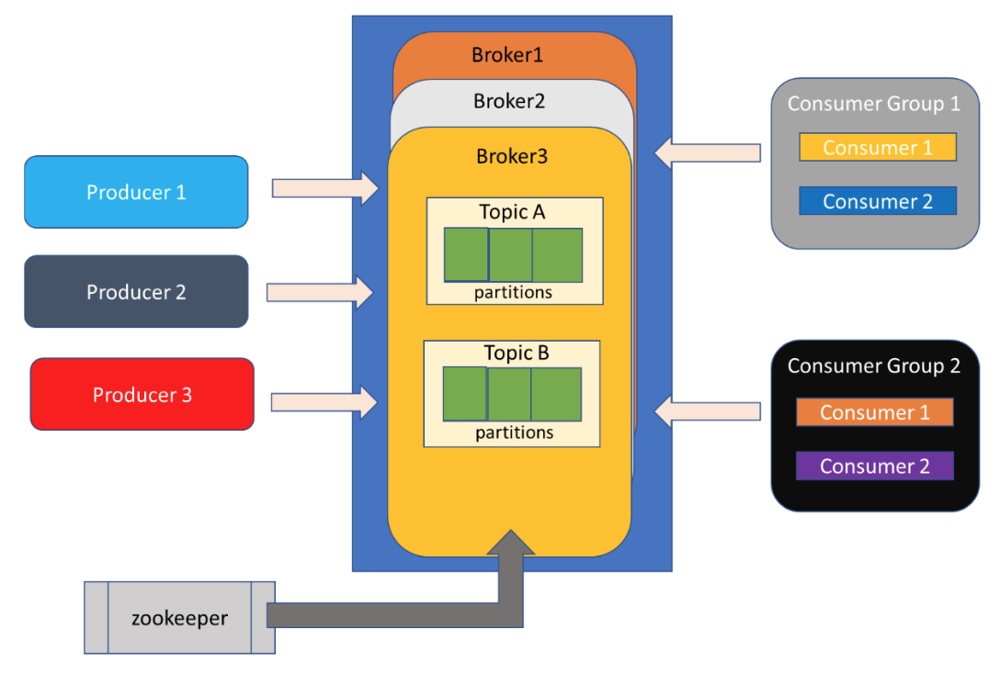
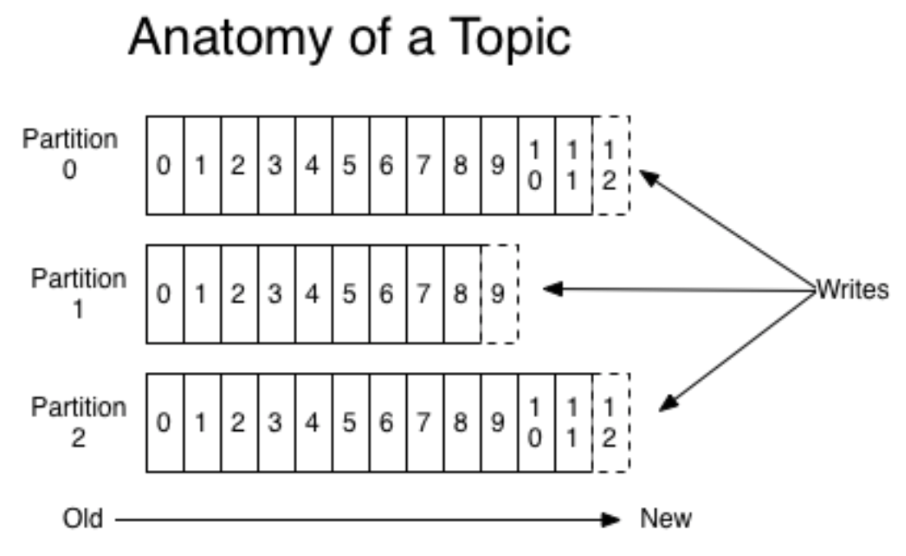
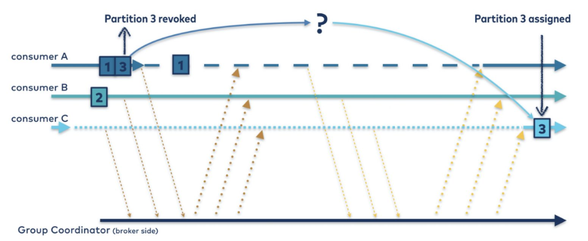
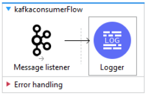
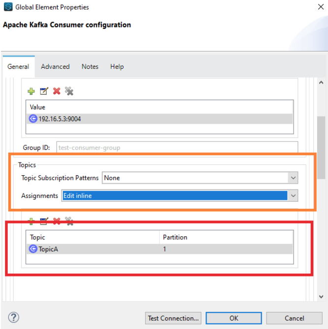
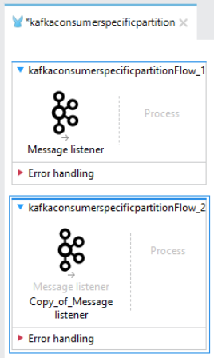
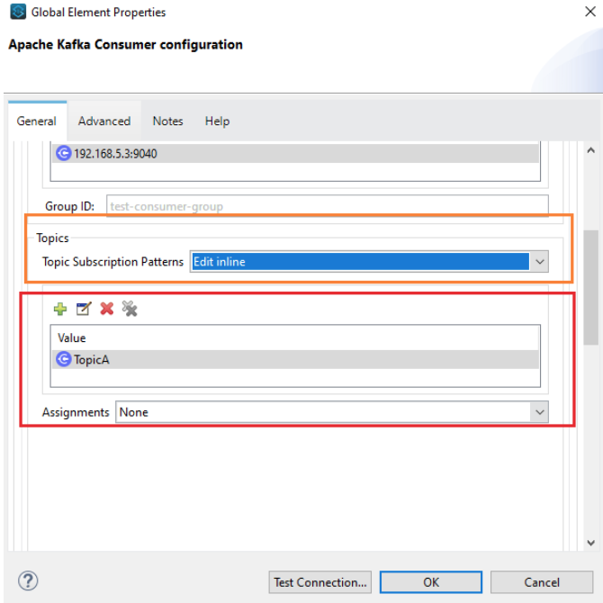
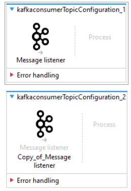
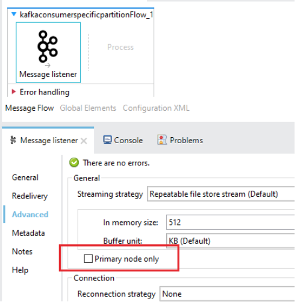

Apache Kafka is one of the best options in the market for data streaming. Developed by LinkedIn engineers and then opened up for the open-source community, it has been very well received (and used) by many organizations.

If you need to move/produce streams of data from one point to another, Apache Kafka is the right option for you.

Apache Kafka has simple architecture in terms of how the information is streamed:

- Topics
- Partitions
- Replicas
- Brokers

Those four concepts are the basis for understanding where and how a producer and/or a consumer can produce/read information from Kafka.

The architecture itself, as we’ve mentioned, is not complex, but the zookeeper dependency may be one of the challenges when deploying this on your own. That is why [Confluent](https://www.confluent.io/) is a good option for customers who want to avoid the configuration and maintenance challenges that Apache Kafka may bring to the table.

Producers are any type of application and/or platform that needs to produce information into Kafka. For example:

- Log files of an application that you would like to send to Kafka for further analysis and/or consolidation
- Geolocation of your fleet of buses that needs to be processed and analyzed in real-time
- Information from your Point-of-sale (PoS) that you would like to process in your central office. Imagine a retailer that needs to send information from every branch to the central.
- Tweets analysis. Imagine you need to get information from different Twitter channels
- Database tables
- Etc.

As we’ve depicted in the diagram, the minimum unit of configuration is a partition that belongs to a Topic, and Topics belong to Brokers. Topics can be replicated along with the Brokers. And Brokers can act in a cluster fashion.

## Architecture description

Messages are published to Topics’ partitions and marked with an offset, which will be very useful for consumers at the time they start to read from the stream.

Kafka is a very powerful platform, and part of that is that it works pretty smart when dealing with the idea of multiple partitions for a Topic.

One of the main Kafka capabilities is the resiliency of the platform as well as the flexibility to read the messages even when one of the brokers may be experiencing an issue, or a consumer is having a problem.

As you can see -in the previous image- a message is published into a Topic Partition (as a producer you can decide where to point to) and an offset is generated to mark the messages, which will help us when we want to read the messages.

You can have single or multiple producers, producing messages on the same topic and the same or different partitions. It will depend on your design. But let’s not just leave it as a generic idea of “depends on your design,” which is true but this type of article has the objective to help you decide on how to use things, and that’s what we are going to do.

This idea of having multiple producers producing messages on the same Topic but under different partitions can be to divide how the consumers will read the information. Let’s get back to the retail scenario where different branches need to send information to the central. Every branch has a group of PoS (Point-of-Sales). The Topic may represent the branch and partitions can represent every PoS. Then, from the central, we can have multiple consumers reading from the same Topic (branch) but pointing to different partitions (PoS), and processing the information individually. Maybe we need to differentiate every single PoS, and therefore we can assign consumers to read from that particular partition.

Another idea is that a Topic represents a group of branches (regions for example), and every partition represents a single branch; you may have a specific consumer reading the information of a specific branch.

As we’ve mentioned, it will depend on how you design it and that is fully related to your use case.

## Getting deep into the consumers' mechanics

Let’s think about it from the consumer perspective and let’s continue elaborating on the retail scenario. If we think of a large chain of supermarkets with thousands of branches around the country, and the need is to process every single ticket that is generated by every single branch, and ultimately send it to the central, then the volume of messages will be something relevant in this system, and also the rhythm of consuming them. With a single consumer reading the messages from a single Topic and partition, may not be the most scalable system. But if we can have multiple consumers reading from different partitions, then we can have parallel multiple consumers.

Kafka also offers a way for the consumers to be rebalanced automatically. That is very useful functionality, where we have a Topic with different partitions that are being fed by multiple producers, but from the consumer standpoint, we can have a group that could be pointing just to the Topic name, and Kafka will assign which partitions the different consumer are going to read from. And even better, in case a consumer goes down, Kafka will automatically rebalance the partitions across the available consumers. Ain’t that cool?

That is one of the main differences between Kafka and other messaging systems. For example, the good old JMS does offer different options for consumers and producers to consume and generate -respectively- messages. It can be a queue or a topic. For a queue, just one single consumer can be subscribed to it. For a topic, many consumers can read from the same Topic but will read the same messages.

> [!NOTE]
> We are not saying nor comparing Kafka with JMS right here, but what we are doing is highlighting the functionalities that Kafka brings to the table.

But you may be asking yourself: ain’t this a MuleSoft article? Where is MuleSoft within all this contextual Kafka explanation? Well, it happens that MuleSoft offers a connector that can produce and consume messages from Topics.

This article is not to explain Kafka but to talk about the usage of MuleSoft Apache Connector ([https://docs.mulesoft.com/kafka-connector/4.6/](https://docs.mulesoft.com/kafka-connector/4.6/)) and how you can have different options to read information from Kafka Topics.

Apache Kafka offers different SDKs for your application to reduce the complexity to produce/reading information into a Topic/Partition. For example Scala, JAVA, .NET, Go, Python, etc. The connector is implementing those very same SDKs, so you can do most of the things that you can achieve through the SDKs, with the MuleSoft connector.

## Scenarios of MuleSoft and Kafka getting together

If you are looking to use MuleSoft to read from Kafka, my suggestions are to first understand Kafka's mechanics before trying to configure the connector. The connector is very straightforward to use; but if you do not have a good design and understanding of Kafka, and you just configure a MuleSoft flow to consume messages and for example, just point it to a specific partition, you have a scenario where thousands of messages need to be consumed and the result of that is that you are consuming message on a good rhythm but not in the one you expect, then it is because you may not have all the context of Kafka.

Or imagine that you have a cluster of MuleSoft Runtimes running on-premise and you have the need to connect to Kafka and you did a similar configuration as explained in the previous paragraph. You deploy your MuleSoft application into the cluster, and you realize that the message is being duplicated (you have a two-node MuleSoft cluster). Why is that happening? Is that what I wanted? Why is MuleSoft duplicating messages? Then you start doubting that your MuleSoft application is not working as you were expecting. You even go further and raise a ticket with Support. But you know why? The problem is not MuleSoft, it is a lack of understanding of how a MuleSoft cluster works and also how Kafka works.

This article is going to explain the mechanisms that you can use within a MuleSoft application to read messages from a Topic and partitions, and which are the expected behaviors and consequences.

We will go through these scenarios:

- Using a configuration where you can point to different topics and/or partitions. Here you explicitly configure the adapter to do so.
- Using a configuration where you just point to the Topic name without specifying a partition number.
- Using the configuration within a MuleSoft cluster (runtime on-premise, hybrid mode).

In all those cases, MuleSoft is behaving like a consumer. And maybe it is obvious, but we need to understand that the connector is going to behave like a normal Kafka consumer. Is nothing extra, as we’ve mentioned, it is built on top of the official Kafka SDKs, it is nothing more than that. That is why we need to understand Kafka to configure it properly and understand how to read the messages.

Let’s go scenario by scenario.

## Scenario [#1](https://www.prostdev.com/blog/hashtags/1) - Connect to a specific Topic and Partition

In this scenario, we will connect Kafka directly to a partition number and Topic.

Why would we do that?

Your use case may be one where you need to have specific MuleSoft applications pointing to specific combinations of Topics and Partitions. Let’s say it in another way: deliberately you have a MuleSoft application reading from a specific partition, period. You understand that in this scenario you will have a single application and a single flow reading from the partition, you may not want to have more than one application and/or flow connected to the same partition unless you want to duplicate your messages and that is not a problem for you.

A very simple MuleSoft flow will be something like this:

In this case, the configuration from the Kafka connector perspective is as follows:

In this scenario, our MuleSoft connector configuration in the Topics section needs to be Assignments (orange box), if you select that one the next section (red box) will let you decide which Topic and Partition you want to read from. You need to specify those two values, there is no way to continue with the rest of the configuration unless you input the Topic name and partition number.

What happens if I add another flow or even more, another MuleSoft application with the same configuration? Like this:

Here we are telling Kafka that we have two consumers wanting to read whatever messages are in the Partition 1 of Topic TopicA. The result: **both flows are going to get triggered and will process (duplicating) all messages**. As we’ve mentioned it can be another flow or another application, but that configuration will produce that effect in terms of duplicating the messages.

If your use case is just to read the message once and process it once, then you need just one single application and/or flow consuming from Kafka.

If your use case is to read the same message multiple times and process them distinctively, then this configuration is also going to work for you. Maybe you want to perform different transformations to the same message and process it differently, then you can have a separate flow doing that.

Another possible question you may have is: what happens with this type of configuration but deploying the application on a MuleSoft cluster or in Cloudhub with multiple replicas? That question will be answered in the Scenario [#3](https://www.prostdev.com/blog/hashtags/3) section.

## Scenario [#2](https://www.prostdev.com/blog/hashtags/2) - Connect to a Topic but without specifying the Partition

Contrary to the previous scenario, in this case, we want to point just to the Topic and let Kafka balance the consumers to read from the multiple partitions. This is what we explained at the beginning of the article.

Let’s think that we have a Topic with 8 partitions, and hundreds of thousands of messages are getting produced and ready to be consumed by a group of consumers (MuleSoft applications). Those messages are distributed across all the 8 partitions.

If we used the strategy of the previous scenario -all consumers pointing to the same partition- we will not read all the messages in the first place, and also the consumption rhythm to get all those hundreds of thousand messages with a single consumer will not be the best idea.

Let’s also think that in the future those messages may increase; if we think in the Retail scenario that we’ve been describing in previous sections of this article, a new branch can be introduced to the system and this will increase the number of messages as well as partitions. That can cause us to increase the number of consumers; but this needs to be as smooth as possible and as simple as incrementing them, without the need to modify our code of change configurations. For example, in CloudHub, we can simply increase the number of replicas of our application and that will increase the number of consumers. Kafka will see that a new consumer is registered and will assign it a partition on the fly.

To use this type of configuration, we need to use the following:

The orange box has the Topic subscription configuration, in this case: **Topic Subscription Patterns**. And the red box will appear after selecting this option and will ask you for a Topic Name, in our case: TopicA.

You do not need to specify the partition; in this case, Kafka will balance the partition across the different MuleSoft applications that are acting as consumers. In this case, if we have something like the following:

We have two different MuleSoft flows with the same Message Listener configuration (the one we described in previous paragraphs), in this case, both flows will consume different messages from different partitions. Or it can also be the case of having different multiple MuleSoft applications with the same Message Listener configuration, and every application will consume different messages. If one of our applications goes down for any reason, Kafka will rebalance the partitions through the rest of the consumers. Ain’t that cool?

This scenario is very powerful, you can mix Kafka’s capabilities with MuleSoft’s. Kafka with the consumer balancing, and MuleSoft with its scalability.

Now let’s move to the 3rd scenario where we will see how this configuration and the previous one (Scenario [#1](https://www.prostdev.com/blog/hashtags/1)) are affected within a MuleSoft cluster.

## Scenario [#3](https://www.prostdev.com/blog/hashtags/3) - MuleSoft acting as a cluster and reading from Kafka

Both of the previous scenarios will respond to questions regarding your use cases. Is not that one scenario is better than the other. There will be some consequences if we have a use case that does not fit with the way you configure the connector, and we do not want that to happen. We want this type of article, to give you suggestions and ideas on how to determine the best way to use MuleSoft and avoid surprises.

Let’s imagine we have a four-node MuleSoft cluster. In this case; hybrid mode.

Within a MuleSoft cluster, certain dynamics happen behind the scenes for us, but that we need to understand to avoid misunderstandings. For example:

- If you have a MuleSoft application that contains a scheduler, the scheduler will only run on the master node, to avoid that it will trigger in all the nodes.
- If you have a MuleSoft application that is using the Object Store, this object store is replicated along with the cluster nodes. This is pretty good since all members have access to the same information
- VM Queues. They are also distributed through the different nodes, and in case of a failure, if you have it configured with persistency, the information in the VM Queue will resist node failures and will continue working on the rest of the nodes
- If you are subscribed to a JMS queue, for example, and you are consuming from Queue, you will need that only the master node can consume messages, and in case of a failure, the next eligible master node will continue consuming them

But in our case with Kafka?

As we’ve described in the previous two scenarios, sometimes we need to connect to a specific partition or sometimes we just want to connect to a Topic and have Kafka distribute the partitions for us.

In the first scenario, again, if the main purpose is to point to a specific partition. If you deploy that on a cluster without checking the following box:

The expected behavior is that every single node that is part of the cluster and that has our application deployed is going to consume the same message. If we don’t want duplicated messages, then check the Primary node only box, and that’s it. Consequences of this: only the master node will read from the partition, and the rhythm of consumption will be determined by the power of that node and application. Also, in case of a failure of the master node, and once a new master node is elected, it will be the one responsible for consuming the messages.

Scenario [#2](https://www.prostdev.com/blog/hashtags/2) is a different story. Here we **do not need** to use this checkbox, since the main point of using this configuration model is to have multiple consumers reading messages. If you keep the Primary node only checkbox selected, then you will have just the master node reading messages. The consequences of this are:

- You will not read messages for all partitions, since the worker node will be pointing to the partition that Kafka determined when it was subscribed.
- You lost horsepower since you will have the rest of the nodes without reading messages.

The conclusion: for use cases that are more aligned to Scenario [#2](https://www.prostdev.com/blog/hashtags/2), do not use the Primary node only option, keep it disabled

## Conclusions

MuleSoft and Kafka working together is a very powerful solution.

Implementing them together, as in any other technology, imply that you need to know how both work and which are the different alternatives to mix them.

In this article, we just talked about consumption, which in our opinion is the scenario with the most alternatives.

Before going directly to Anypoint Studio to create your applications, we suggest you first analyze and study the solution as a whole, to get the most out of MuleSoft and the applications/platforms that it will integrate.
