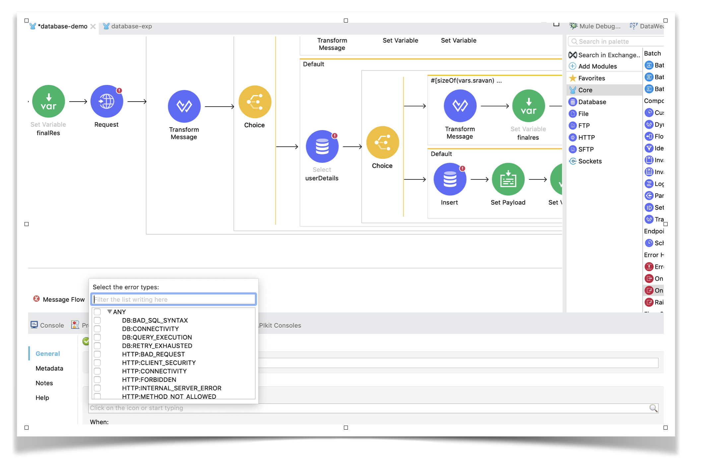
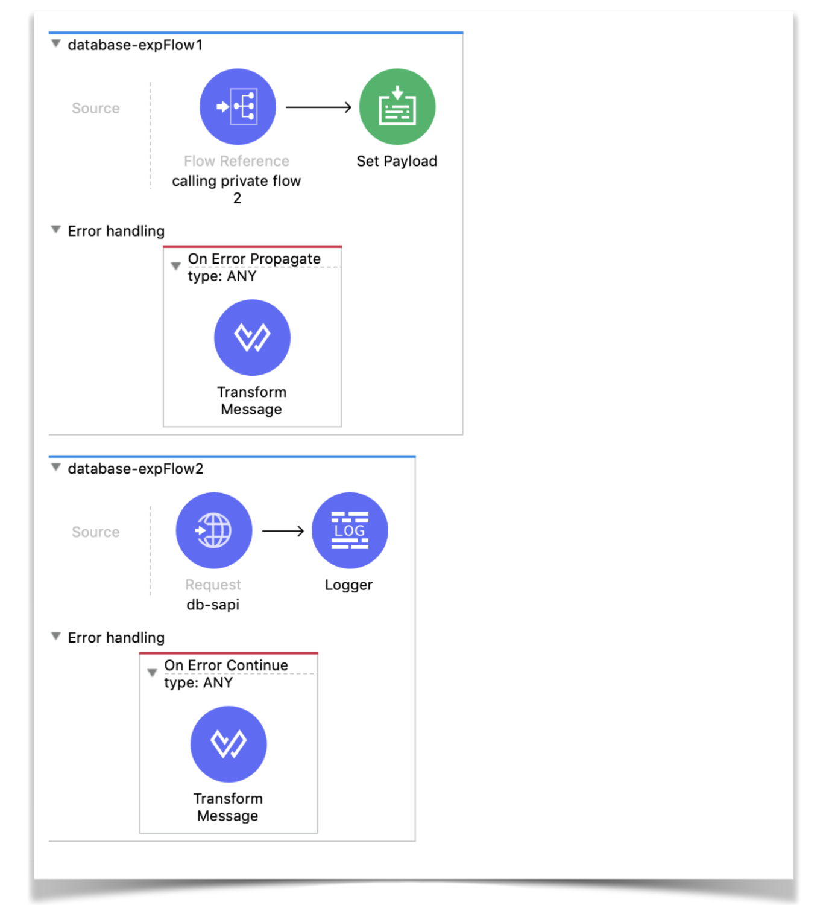
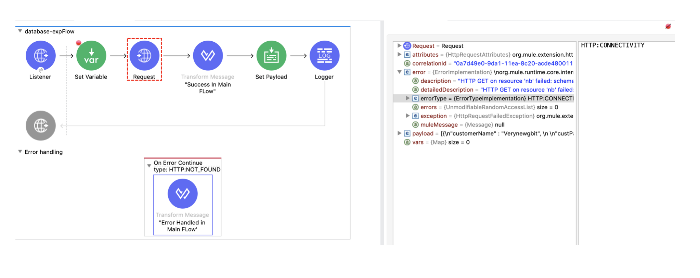
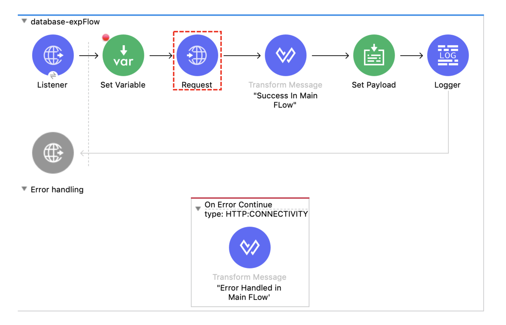
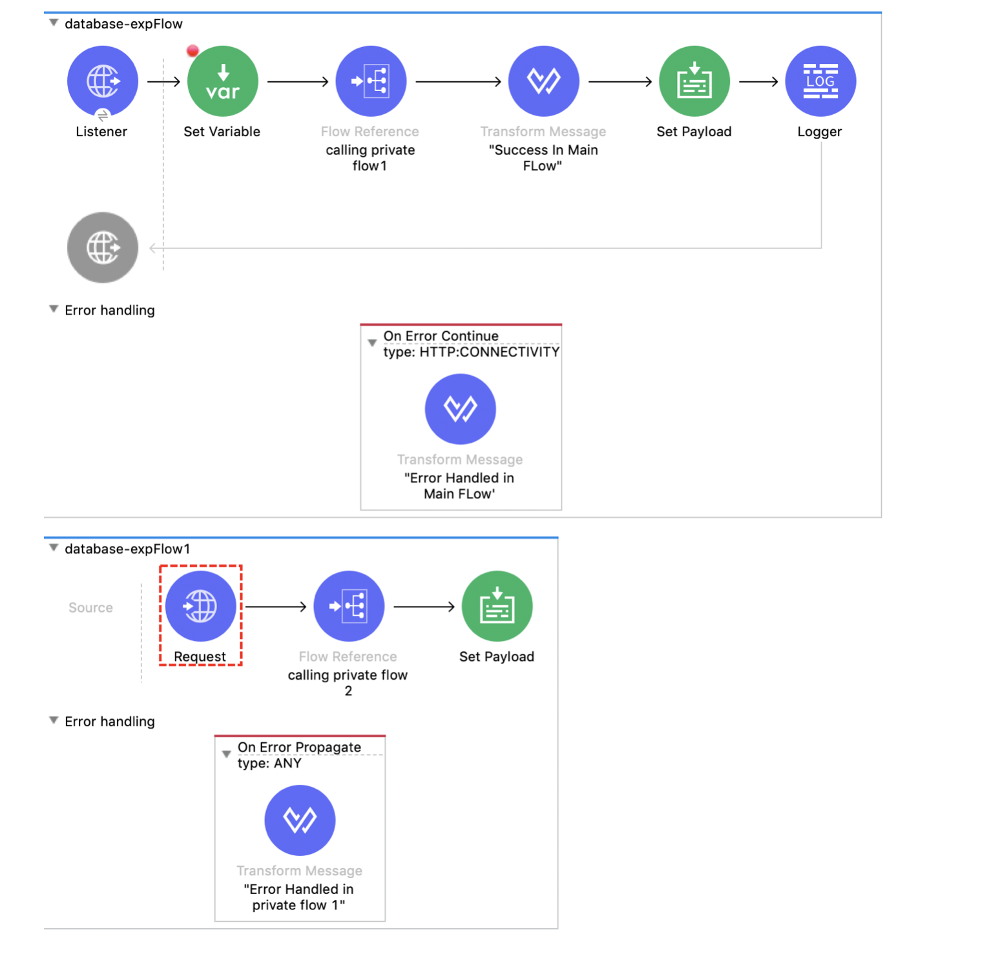
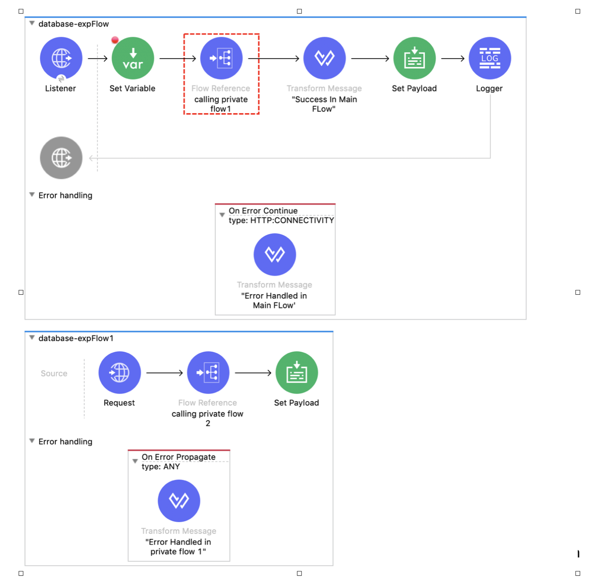
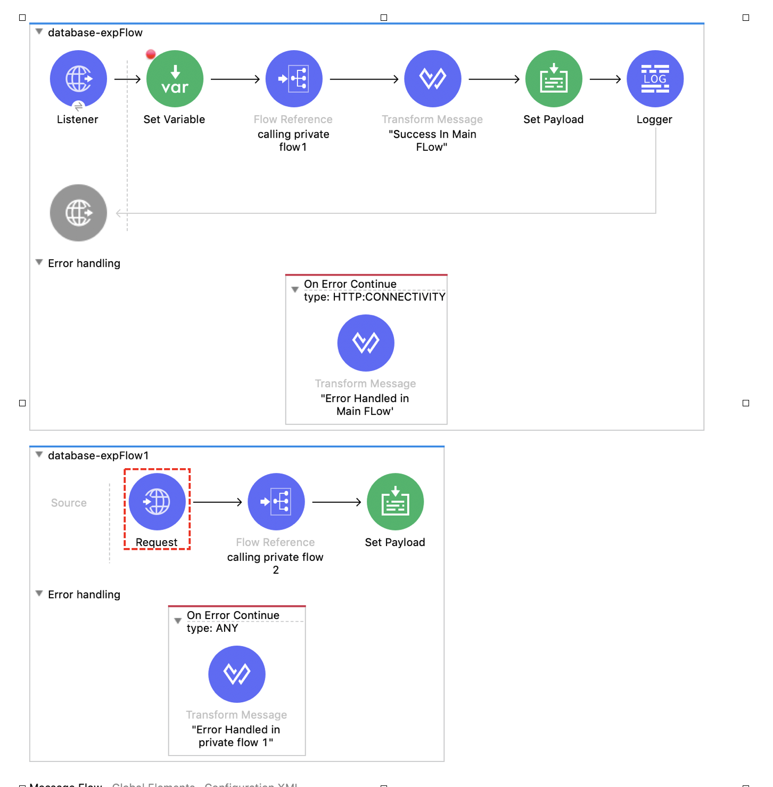

Hey Muleys,

I believe that this article on Error Handling in Mule 4 will definitely help you to understand the core concept of On-Error Propagate and On-Error Continue.

## What is Error Handling?

An exception occurs when an unexpected event happens while processing. Exception (or error) handling is the process of responding to exceptions when a computer program runs.

In Mule, we can handle the message exception at different levels.

- At project level using the **Default error handler**
- At project level using the **Custom Global error handler**
- At flow level in exception handling using the **Raise Error** component, **On-Error Continue** and **On-Error Propagate**.
- At flow or at processor level using the **Try scope**.

Whenever an error occurs in a flow, an error object is created. It contains many properties, like error.description or error.errorType.

The errorType property is a combination of Namespace and Identifier. For example, HTTP:UNAUTHORIZED, where the Namespace is HTTP and the Identifier is UNAUTHORIZED.

Mule identifies the error based on the errorType and then routes it to its respective block that is placed inside the Error Handler.

## What is On-Error Propagate and On-Error Continue?

The difference between a flow, a sub-flow and a private flow, is that sub-flow doesn’t have an Error Handling scope. So, it's just flow and private flow the ones that have an Error Handling block and can contain the On-Error Propagate and On-Error Continue.

> Whether it is Propagate or Continue, Mule Executes all the components within those blocks.

**Remember:** The error will route to the Error Handling only if it identifies that the errorType from the error matches with what you have set in your Error Handling block.

Mule 4 has one excellent feature that can identify the types of errors that can occur within that flow by looking at what kind of connectors are placed in that particular flow.



You can see above that, since we have an HTTP Request and Database components, the drop-down shows all the types of errors that can happen in different scenarios from these two components. It even shows the EXPRESSION error type (not in the picture) because there are some DataWeave syntaxes in the flow.

It will be very easy to learn Error Handling by knowing how On-Error Propagate and On-Error Continue work. We shall follow some set of rules to identify the flow of process. That way we can determine what is the result payload statusCode.

## Rules

Before learning about rules. We must not forget that a RAML-based generated HTTP Listener will have the Error Response Body set as “payload” by default, but a manually drag-and-drop HTTP Listener will have output text/plain - - - error.description set by default. So, remember to change this according to your business requirements.

Here are the rules to remember when an error has occurred in any flow:

**Rule 1:**

- If anything is present in the Error Handling section. Even if there are On-Error Propagate and On-Error Continue blocks, make sure that your particular errorType is handled by those.
- If not, then Mule will use the default Error Handling. If your flow is not called by any other flow, then it will display the default value that is set in the Error Response Body and will return a status code of 500 by default, if nothing is manually set. If your flow is called by any other flow, then the error will be raised to the calling flow.

**Rule 2:** If Error Handling is present in that particular flow and errorType is handled (Rule 1.1), then check whether it is On-Error Continue or On-Error Propagate. In both the cases, Mule will execute all components within that block.

**Rule 3:** After the execution of all the components, now:

- If the error is handled using On-Error Propagate, it will raise an error back to the calling flow.
- If the error is handled using On-Error Continue, it will not raise an error back to the calling flow and continue to the next processor after “flow-ref” and continues further process as it is. But it will not continue to other processors in the flow where the error is handled.
- Suppose you have only a single flow. Then On-Error Propagate and On-Error Continue behave the same way, except that On-Error Continue gives 200 status and On-Error Propagate gives 500 status. Because, as explained, even if it’s On-Error Continue, it will not go to the next processor within the same flow.
- Always remember, this point is very important. **On-Error Continue will continue only to the next processor of the calling flow but it will not continue within the same flow.**

If you observe the flows below, suppose your error is handled in the second private flow and if there is On-Error Continue, it will not execute the logger in private flow 2, instead, it will go to the Set Payload component of private flow 1, which is the one calling private flow 2.



If it is On-Error Propagate, the error is raised back to the calling flow. Now follow Rule 1 to Rule 3 again for that particular calling flow until the final process is completed.

Whenever an error is raised back to the calling flow, just go by the three rules again.

## Examples

Let’s see some examples and check what is the output and status code of each one.

Consider that in all cases the default value for the Error Response in HTTP Listener is set to #[payload] and all cases below raise the same error for errorType: HTTP:CONNECTIVITY.

All cases have the same input payload, which is:

```
{name : “sravan lingam”}
```

### **Case 1**

Let us assume we have only one flow. Let's follow the previous rules.



**Rule1:** There’s something in the Error Handler, but the errorType from the error does not match the errorType from the Error Handling. So it doesn’t matter whether it’s On-Error Continue or On-Error Propagate. When the errorType is not matched, it will use the default error handler by Mule.

```
Actual errorType = HTTP:CONNECTIVITY
Handled errorType = HTTP:NOT_FOUND
```

Since none of them match and this is the main flow and it’s not called by any other flow, it uses Mule’s default error-handling.

It will print the payload from before the HTTP Request component with a status code 500.

Final Response:

```
Response Body:
{name : “sravan lingam” } 

Response status code: 500
```

### **Case 2**

Let us assume we have only one flow. Let's follow the previous rules.



**Rule1:** There’s something in the Error Handler and errorType matches with the handled errorType.

```
Actual errorType = HTTP:CONNECTIVITY
Handled errorType = HTTP:CONNECTIVITY
```

Since both match and this is the main flow and it’s not called by any other flow, we can continue with the other two rules.

**Rule 2:** The flow is using On-Error Continue. It executes all the components in this block, in this case, we are setting the payload to “Error Handled in Main flow” with a Transform Message component.

**Rule 3:** According to points 2 and 3 in Rule 3, since it is On-Error Continue, and the current flow is not called by any other flow, it will execute the processors inside the On-Error Continue and end the process with a 200 status.

It will not execute the components after the HTTP Request since this is the main flow.

It will print the payload that is set in the Transform Message component from the On-Error Continue.

Final Response:

```
Response Body:
“Error Handled in Main flow”

Response status code: 200
```

### **Case 3**

If we were to use On-Error Propagate in Case 2 instead of On-Error Continue, every rule is the same but since it’s On-Error Propagate, the error will be raised and sent back to the caller with a status code of 500.

Final Response:

```
Response Body:
“Error Handled in Main flow”

Response status code: 500
```

### **Case 4**

Let us assume we have 2 flows. Let's follow the previous rules.



**Rule1:** There’s something in the Error Handler and the errorType matches with the handled errorType.

```
Actual errorType = HTTP:CONNECTIVITY
Handled errorType = ANY
```

> [!NOTE]
> ANY can handle any type of error.

**Rule 2:** The flow that has the error (private flow 1 in this case) is using On-Error Propagate. It executes all the components in this block, in this case, we are setting the payload to “Error Handled in Private Flow 1” with a Transform message component.

**Rule 3:** According to Rule 3, since it is On-Error Propagate, and the current flow is called by the main flow, it will execute the processors inside the On-Error Propagate and then raise the error back to the calling flow, which is the main flow.

Now the ball is in the Main flow court.



This is how the error is raised back to the Main flow.

Repeat the rules:

**Rule 1:** The error matches the errorType from the Error Handler.

**Rule 2:** On-Error Continue executes the Transform Message component with payload “Error Handled in Main flow”. It will not go further to the other components after the flow-ref. Since it is On-Error Continue, and no other flow is calling the current flow, it will display the latest payload with a 200 status.

Final Response:

```
Response Body:
“Error Handled in Main flow”

Response status code: 200
```

### **Case 5**

Same as Case 4 except that On-Error Continue is used in private flow 1 (the second flow).



**Rule 1:** There’s something in the Error Handler and the errorType matches with the handled errorType.

```
Actual errorType = HTTP:CONNECTIVITY
Handled errorType = ANY
```

> [!NOTE]
> ANY can handle any type of error.

**Rule 2:** The flow that has the error (private flow 1 in this case) is using On-Error Continue. It executes all the components in this block, in this case, we are setting the payload to “Error Handled in Private Flow 1” with a Transform message component.

**Rule 3:** According to Rule 3, since it is On-Error Continue, and the current flow is called by the main flow, it will execute the processors inside the On-Error Continue, doesn’t raise the error and goes back to the calling flow, which is the main flow. It executes all the components after flow-ref and the final payload will be displayed with a 200 status code.

Final Response:

```
Response Body:
“Success in Main flow”

Response status code: 200
```

Simple! If you follow this set of rules, then you can easily understand the way that On-Error Continue and On-Error Propagate work!

Happy Learning!

Sravan Lingam
