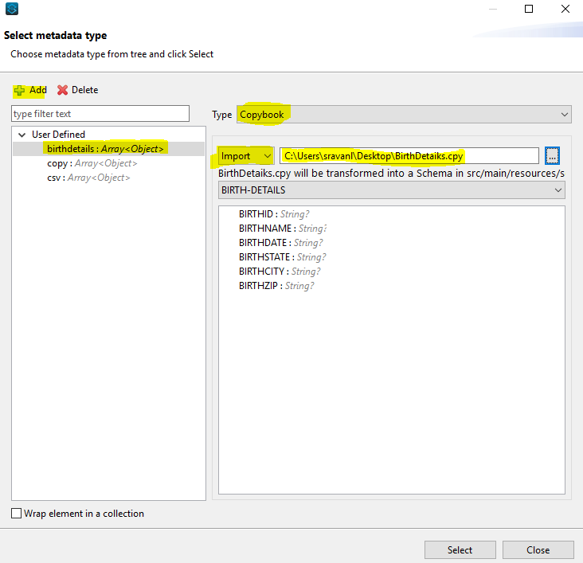
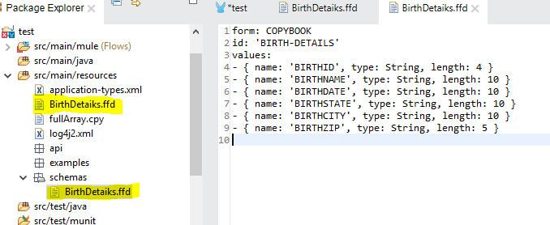
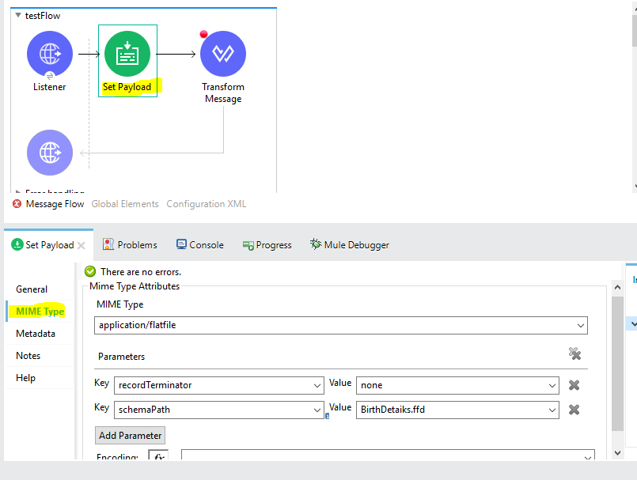
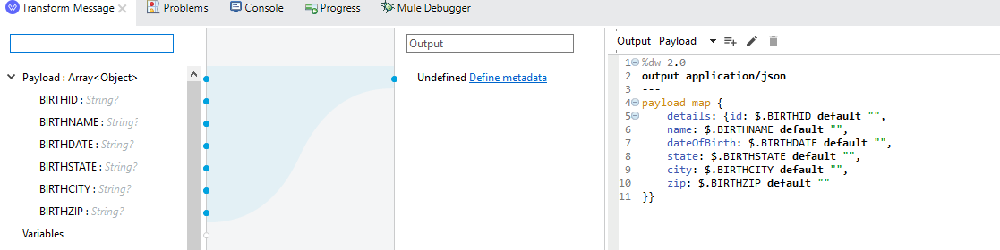
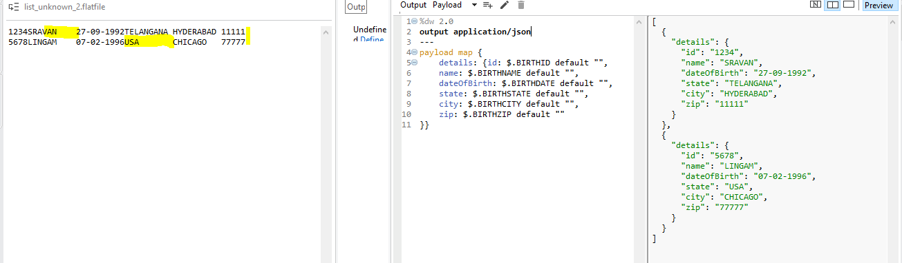
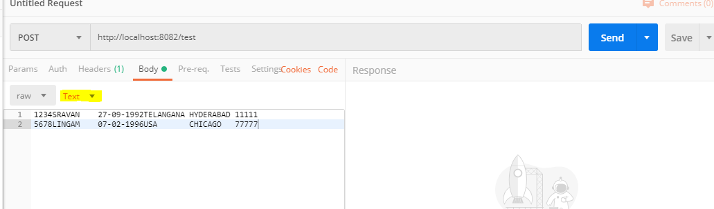
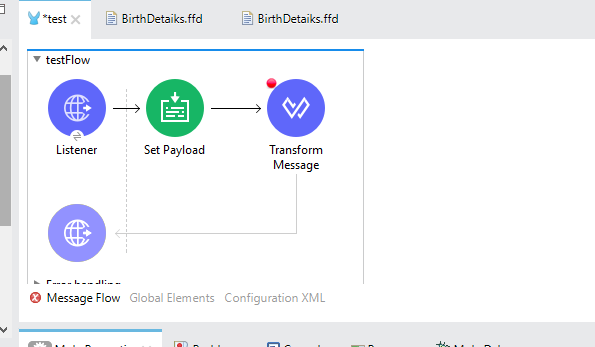

Hello Muleys,

This article is all about how simple it is to convert a Flat File into JSON, CSV, or XML using the all-time powerful weapon: DataWeave 2.0.

Please do not forget to read the “Things to Remember” at the end of the article so that you don’t commit any mistake while coding.

For this post, I used Anypoint Studio 7.4 and Mule Runtime version 4.2.2.

Before starting, let's get familiar with a few terms.

Flat File: (Also known as “FlatFile,” “FFD File,” or Flat-File”) A Flat File is data in a plain text format. Usually we get this kind of data from either mainframe systems, SFTP, or Files.

Copybook: A copybook is a selection of code that defines data structures. If a particular data structure is used in many programs, then instead of writing the same data structure again, we can use copybooks. In general terms, to define the fields Data Types/Length and their structure, we define them in a copybook which in turn helps us in generating FFD files using a Transform Message.

## Step 1: Creating the copybook

As previously said, a Flat File is a plain text string and the rows are separated by a new line, e.g.

```
1234SRAVAN    27-09-1992TELANGANA HYDERABAD 11111
5678LINGAM    07-02-1996USA       CHICAGO   77777
```

This Flat File contains 98 characters with spaces (will discuss why spaces are also considered). Each row has 49 characters defined and they are divided by a new line.

In my example, the data I am getting from SFTP or Mainframe basically contains the following information:

```
'BIRTHID' 'BIRTHNAME' 'BIRTHDATE', 'BIRTHSTATE','BIRTHCITY', 'BIRTHZIP'
```

> [!IMPORTANT]
> Remember the Flat File always has FIXED length!

If you have BIRTHNAME defined for the length of 10 characters and if your name has only 6 characters, then the remaining 4 characters MUST be 4 empty spaces.

Below is the copybook that I have created to define my incoming fields:

```
000000 01 BIRTH-DETAILS.
000100 05 BIRTHID PIC X(4).
000200 05 BIRTHNAME PIC X(10).
000300 05 BIRTHDATE PIC X(10).
000400 05 BIRTHSTATE PIC X(10).
000500 05 BIRTHCITY PIC X(10).
000600 05 BIRTHZIP PIC X(5).
```

Please follow the indentation in this copybook. The type is nothing but your datatype of that particular field, length is the fixed length allocated to that field.

Save this file with extension .cpy, e.g., BirthDetails.cpy.

## Step 2: Auto-generating the FFD file using DataWeave

This is a pretty simple step with no coding involved! We basically need an FFD file to convert the Flat File to JSON or CSV.

- Drag-and-Drop the Transform Message component in an empty flow.
- Go to the Input section and click on Define Metadata.
- Click on Add and give some Type Id.
- Select Copybook from the Type drop-down.
- Click Import and select the copybook that you have created in Step 1.
- Finally, click Select.



After clicking on Select, an FFD file will be created automatically and placed under `src/main/resources` > schemas > BirthDetails.ffd

Please copy the FFD from the schemas folder and paste it inside `src/main/resources` as shown in below screenshot:



FFD file generated:

```yaml
form: COPYBOOK
id: 'BIRTH-DETAILS'
values: 
- { name: 'BIRTHID', type: String, length: 4 }
- { name: 'BIRTHNAME', type: String, length: 10 }
- { name: 'BIRTHDATE', type: String, length: 10 }
- { name: 'BIRTHSTATE', type: String, length: 10 }
- { name: 'BIRTHCITY', type: String, length: 10 }
- { name: 'BIRTHZIP', type: String, length: 5 }
```

## Step 3: Final Transformation

No matter what your data source is; whether it’s a File Read connector or an HTTP Listener, the first thing that you need to place after the source is a Set Payload component.

Drag-and-Drop a Set Payload component and configure as below. It needs to have a value of #[payload]

Now go to the MIME Type tab and configure recordTerminator and schemaPath as below:



Place a Transform Message just after the Set Payload and code it as below:



If you want your output in a CSV format, just replace application/json with application/csv

If you want your output in XML format, we need another Transform Message after application/json output because this doesn't have a root tag. If you try to map directly to application/xml, it will throw an error!

That's it finished :)

## Things to Remember

From the following image you can see that the name is defined as 10 characters in your FFD file. But "sravan' has only 6 characters. So the input name must have 10 characters, i.e.,

```
"sravan    "
```

We have to have 4 spaces appended at the end. This is because for each row, we defined the FFD file with the following rules:

- First 4 characters belong to Birth ID
- Next 10 characters belong to Birth Name
- Next 10 characters belong to Birth Date
- And so on...

Each special character is treated as 1 character. The rows must be divided using a new line break (highlighted in yellow). If you can see the input, the State name for the second row is USA (3 characters). So we have appended 7 spaces to it to make it a perfect and valid Flat File.

One of the validations mentioned above failed in input, we will get Transformation errors!



Try it out! Pass the Flat File data through Postman using a POST Method and select the type as Text. Send it as input for your Application.



Here’s your final Mule application:



Get back to me if you have any doubts!

Happy Learning!

Yours, Sravan Lingam
