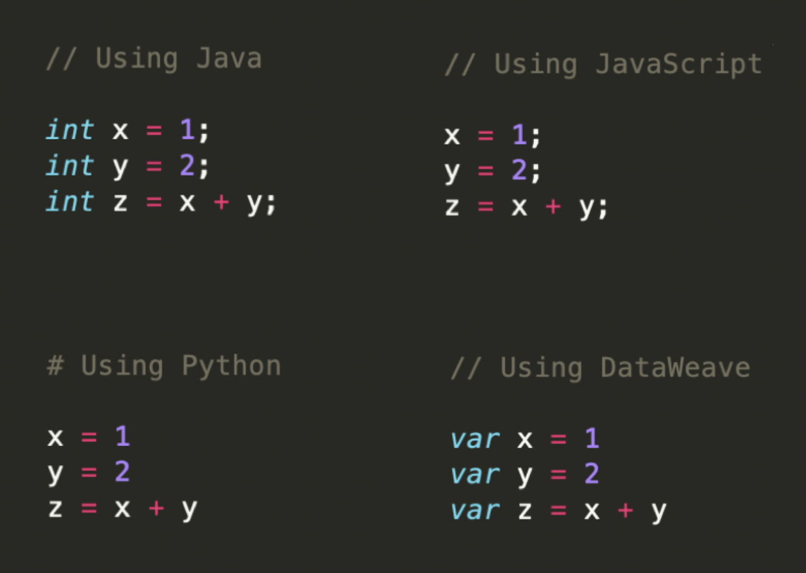
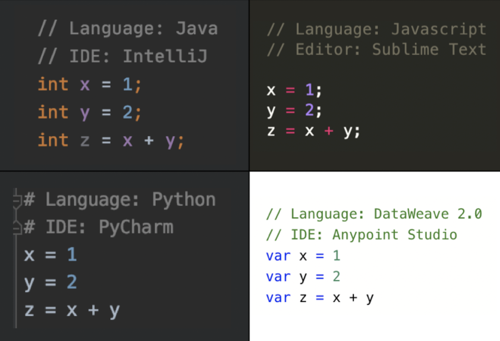
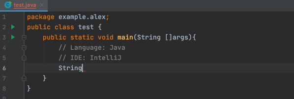
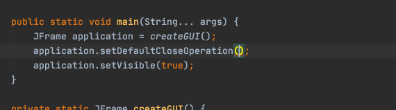
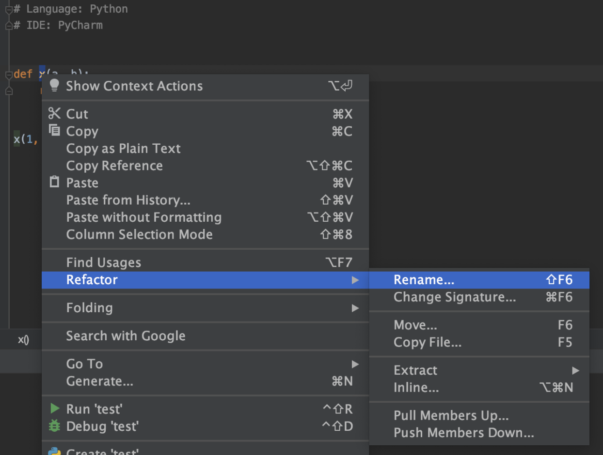
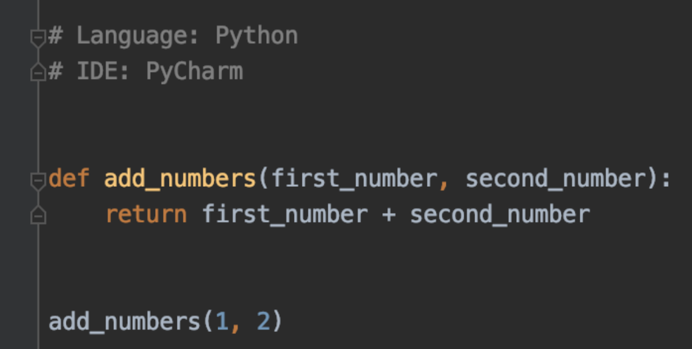
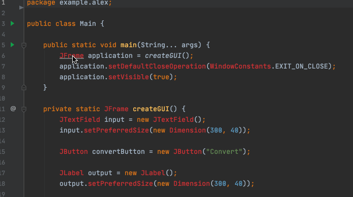
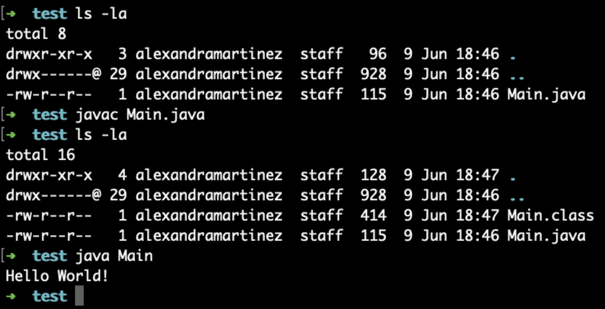
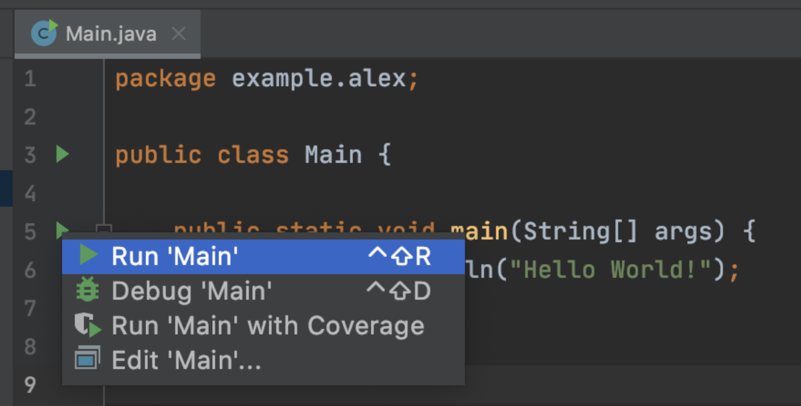
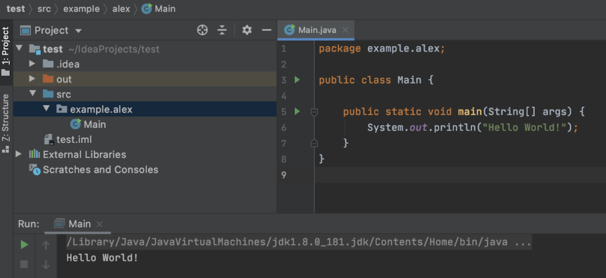

If you’re an experienced developer, you probably already know why using an IDE is a great idea, but if you’re completely new to the Software Development world, you may not even know what an IDE is. Well, not to worry! For this post, I will explain what is an IDE and five reasons why you need to start using one. I will also give you examples of my favorite IDEs for different programming languages and technologies.

## What is an IDE?

IDE is an acronym for “Integrated Development Environment”, and it is nothing more than an application that can be used to develop any kind of software programs. You can usually download an IDE from the IDE’s creators’ website and install it like any other application; for example: for Windows, using a .exe file, or for MacOS, using a .dmg file.

IDEs are designed to aid the programmers in their development process, and help them to be the most productive as possible by providing a Graphical User Interface (GUI) that can be easily used to perform basic day-to-day functions. A metaphor that comes to my mind is a calculator - if you’re a mathematician, you probably have bigger problems to solve than a basic average or division calculation; you can be more productive and solve more complex problems, if you don’t have to worry about the smallest operations that a tool can solve for you. This is basically what an IDE does for a Developer.

If your idea of an IDE is not completely clear yet, with the next five reasons you’ll get a better understanding on what an IDE can do for you as a Software Developer.

### 1. Syntax highlighting

If you speak english, you may say “cheers” after a toast at a wedding; but if you speak spanish, you’ll say “salud”; or you’ll say “prost” in german. Just like a regular language, every programming language has their own syntax, or their own way of “writing” or “communicating” the same thing.

Here are some examples of how you would create two variables (x and y) and add them to create a new variable (z), in different programming languages:



As you can see, they have some things in common, like the equal (=) or plus (+) symbols, but they also have some differences, like the end of a line (;) or the variable declarations (*int, var*).

When you’re using an IDE that knows the programming language’s syntax that you’re using, the IDE is able to recognize what a symbol or a keyword means, and then it shows your code with certain colors or formats (like **bold** or *italic*) in order to make it a bit more readable.

Here are the same previous examples, but using a different IDE for each of them:



Note that the one for JavaScript (top-right corner) does not specify an IDE, but an Editor. Some text editors also offer syntax highlighting, just like an IDE would. However, an editor won’t give you the rest of the benefits (listed below) and if they do, it’s not going to be as efficient as an IDE.

## 2. Text autocompletion

You know that thing Google does when you start writing some text for a new search and it wants to *complete* or give suggestions as to what you might be searching for?


The same thing happens with an IDE. Since it already knows the syntax of the language you're programming in, it can give you suggestions of what you want to write next. This helps you to be faster because you don’t have to write everything yourself, you can just start writing something and the autocompletion will give you a list of possible choices!



For example, say you forget a specific keyword that you need to use, but you do remember part of the instruction that is needed; instead of going to Google or to check on a programming book, you can just start writing what you remember, and the IDE will try to guess the command, then you just need to choose between your options and press Enter to select it.



Pretty cool, right?!

## 3. Refactoring options

“Woah, wait! What does *refactoring* mean?” It means that you can restructure your existing code or project’s resources without affecting any behavior. For example: renaming a file, changing files to different folders, or even renaming a variable.

“Ok, why would I want to do that if it already works as it is?” Sometimes the code can get too complex to understand, even by the developer who wrote it, and there are some changes that can be done to improve the code’s readability.

For example, you create a function that will add two numbers and return the result, but you don’t want to think in descriptive names for the function or for the two variables, so you just named them “x”, “a” and “b”. This code will look like this:

```python
def x(a, b):
    return a + b

x(1, 2)
```

Not too readable, right? I have to go into the definition of the function “x” to know that the function is adding “a” plus “b”. Maybe if this function was named something like “add_numbers”, I wouldn’t have to waste my time going into the code to figure out that it’s adding two numbers.

Instead of manually renaming the “x” in the definition of the function, and then once more in the function call (the last line), I can just select the “x”, right-click on it, and select “Rename”.



After writing the new name for my function, I will see that all the references were correctly updated. This can also be done for the “a” and “b” variables, that can have a more descriptive name, like “first_number” and “second_number”.



Way better! Now I can clearly know what the “add_numbers” function will be doing. Without even going to the function’s definition, I can know in advance that the result of add_numbers(1, 2) will be 3.

Now, this was a small example, but imagine that you have more than 20 files that are referencing the same function that you want to rename. Instead of manually going to each of the files, you can just use the IDE’s refactoring options to change the name. The same applies when moving files from one folder to another, or when renaming files.

## 4. Importing libraries

When you’re working on a Software Development project, there will be some tough requirements that you need to figure out how to code. Luckily for us, you don’t have to create code from scratch, another developer on the internet already has and you can use their code as a new library.

Again with my metaphors: imagine that you want to paint a house, but you don’t have any paint. Will you go to a forest to get some berries and insects to make your own paint? Or will you go to Home Depot and buy whatever paint you need? (I hope you chose the second one!). The same applies with code. There are some functions that someone created that are available for you to re-use in your project; there’s absolutely no need for you to reinvent the wheel in your code if you can just import a library and take advantage of it!

There are times when you remember a library’s function, but you don’t remember the name of the library. So, same as before, instead of taking time off your day to google the library, you can just write the function that you wanted to use and let the IDE handle the import for you!



Are you convinced now? Yes? No? Maybe?

Ok, let me give you the last reason why you need and want an IDE.

## 5. Build, compile, or run

Once you finish coding your project or feature, you’ll want to do a quick test to verify that it’s working as you expected. How are you going to run your code in order to check that?

Well, if you generated a bunch of Java code, you have to first *compile* your .java files into .class files (these are binary files that are interpreted by the computer), only after you do that, you can run your code. To do this, you have to do something in the Console (or Terminal) that looks like this (you don’t have to understand what I’m doing here, just notice there are some statements to run):



What if I told you that you can just click a button if you use an IDE?



Yes! Instead of doing all those commands manually, you can just use the “Run” button. You get exactly the same result!



If you need to build, compile, or run your code; you can do all these things just by clicking on a button from the IDE. No need to compile into a different format! (this can be time consuming).

### Recap

To recap what we learned today, an IDE saves you so much time (and headaches) and we went through 5 ways that do this.

- **Syntax highlighting** that helps you be able to read the code and not get lost in between hundreds of lines of code. The IDE uses different colors or formatting for the code, to make it more readable.
- **Text autocompletion**, just like the Google search bar does, but for your code. If you forget a keyword, the IDE will give you the best suggestion of what you were looking for.
- **Refactoring options**, like renaming a file, a function, or a variable; or moving files from one folder to another. This way you don’t have to manually update every single reference in the whole project.
- **Importing libraries** in case you remember the code, but not the name of the library. Most likely the IDE already knows what function you’re referring to, it just has to import that library to your project and you’re all set.
- **Build, compile, or run** your project just by clicking one button. There’s no need to memorize all those commands and run them one by one from the Console or Terminal.

There are not only 5 benefits that an IDE can give you; there are a lot more that I love! Debugging, testing, generating pre-defined code, managing your dependencies, managing environments, using version control systems are all options that are more advanced. If you’re a new developer, or just new to the technology world, these 5 ways to save time are the most important ones that you need to know.

What is your favorite IDE? Do you prefer editors over IDEs? Log-in now to leave me a comment about it! I’d love to hear your opinion :)

*Prost!*

-Alex

## More Links

- [Download IntelliJ (Community Edition)](https://www.jetbrains.com/idea/download/)
- [Download PyCharm (Community Edition)](https://www.jetbrains.com/pycharm/download/)
- [Download Sublime Text](https://www.sublimetext.com/)
- [Download Anypoint Studio](https://www.mulesoft.com/lp/dl/studio)
