I've been doing a lot of live streaming lately. Either alone or with guests. And I noticed some things that could be improved (from a streamer perspective) to create a better experience for the people watching our screen.

I'll give you some MacOS-specific tools, but I'm sure you can find a replacement for these for other operating systems.

Let's take a look!

## 1. Adjust your screen's resolution

This applies to any kind of screen, regardless of the operating system. Before starting the stream, whether you're using your own laptop/computer or an external monitor for screen-sharing, make sure you adjust the screen to a **1080 or 720 pixels resolution** (if you want Full HD or HD resolution).

The reason behind this is that everything on the screen will look bigger and clearer in the live stream. A lot of people watch live streams on smaller screens. Don't assume that everyone will be able to just keep your stream on a full screen. Try to show your tools and other things as big as possible without pixelating the image and also keeping a high resolution.

Here are some examples of why this setting is important. Look at the next two screens. Which one looks better for you? Can you read everything on the screen?

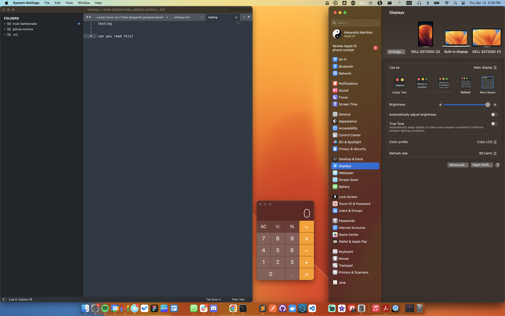

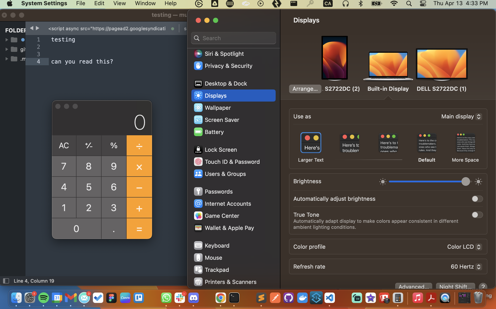

Both are exactly the same screen, just with different resolution settings. The same effect will be on your live stream. It may be more comfortable for you to stream in your regular setting - which might be something similar to the first screenshot - but it will be harder for the viewers to follow/understand exactly what you're doing.

You don't have to use the lowest resolution possible if it's uncomfortable for you or makes it harder to present the live coding on the screen. But try to adjust this setting where it feels better for you and also keeps a bigger image. Like the following picture.

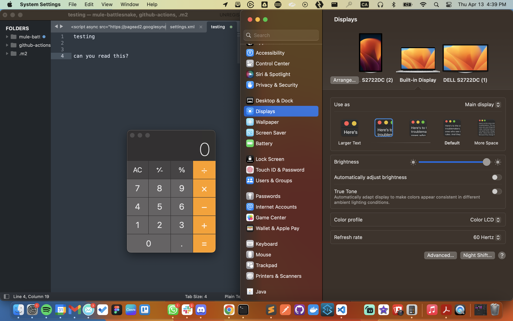

To do this from a MacOS computer, go to your **System Settings** > **Displays**. Now, depending on whether you're using the actual MacOS computer or an external monitor for screen sharing, you will have different options.

### Option 1 - MacOS computer/laptop

Change your screen resolution by selecting a larger text resolution from the thumbnails. You may have to play around with these a bit to make sure the image is good and you can still do your demo comfortably.

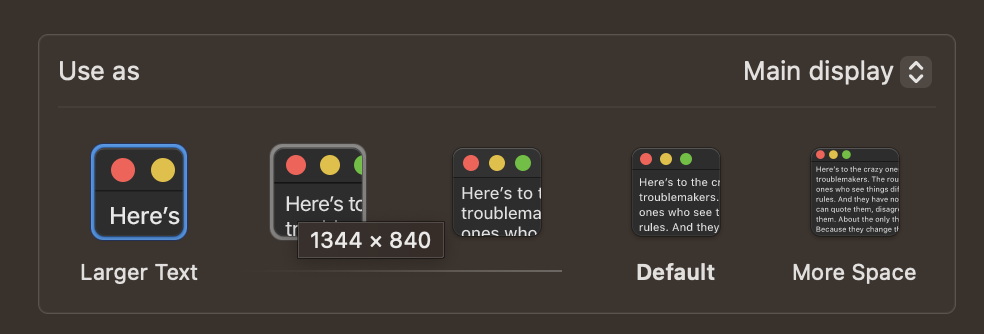

### Option 2 - External monitor

Change your screen resolution by selecting either **1080p** or **720p**.

- **1080** will give you a higher resolution (Full HD or FHD) but will result in larger data (more GB for the video size). If your internet connection is not very good when live streaming, you can try changing to 720. If the data size and internet are not a problem, you can use 1080.
- **720** will still be high-definition (HD) but won't be as clear as FHD. Normally these differences are not as easily caught if watched from a phone or a computer. They present more when watching from a larger device like a TV.

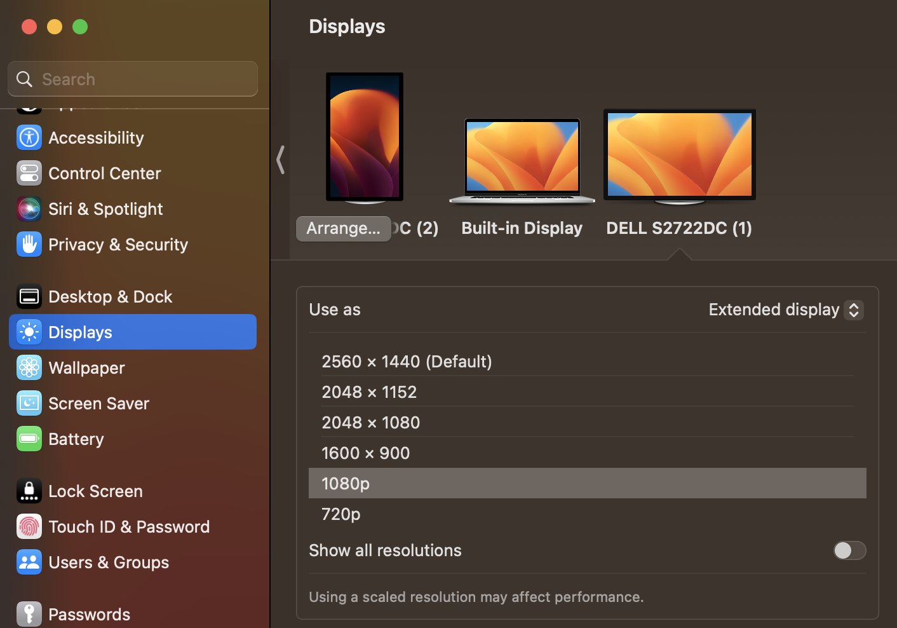

If you want to see these differences yourself, you can try watching [this video](https://youtu.be/bsM4D-ek-T4) (or any video) in different resolutions. To do this, inside the video, go to the **settings** button > **quality**, and select either **1080** or **720**.

> [!NOTE]
> [That video](https://youtu.be/bsM4D-ek-T4) was recorded on an external monitor using the 1080p setting.

## 2. Zoom in on available applications

There are some applications that can natively zoom in on the UI. For example, Visual Studio Code or Sublime Text. You can press **cmd +** to zoom in and **cmd -** to zoom out. In some applications, you might have to press **cmd =** to zoom in, depending on your settings and your keyword.

For example, the following screenshot is how I normally use Visual Studio Code when I'm not sharing my screen. For you as the viewer, it might not be as clear to be able to follow what I'm doing. Even though I can see it as perfectly normal from my perspective.

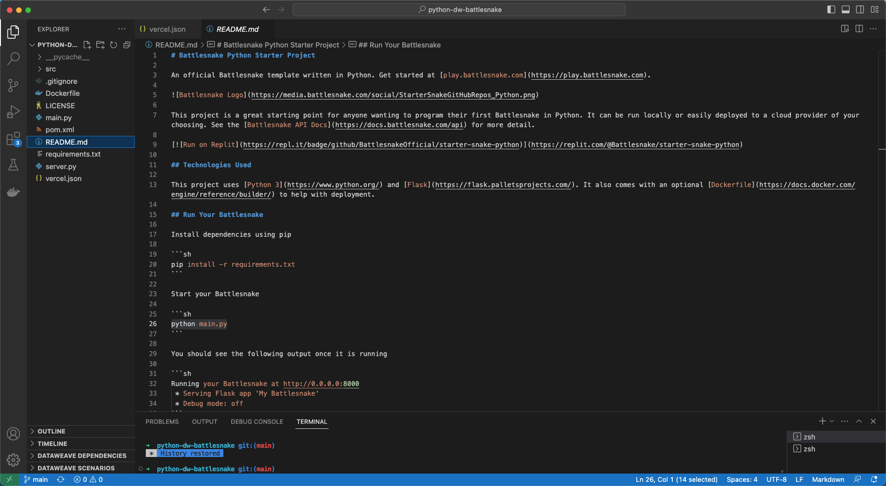

But if I press **cmd +**, I'll be able to zoom the UI in. It might look unnecessarily big from my perspective, but it's the best view for you who are just watching my shared screen.

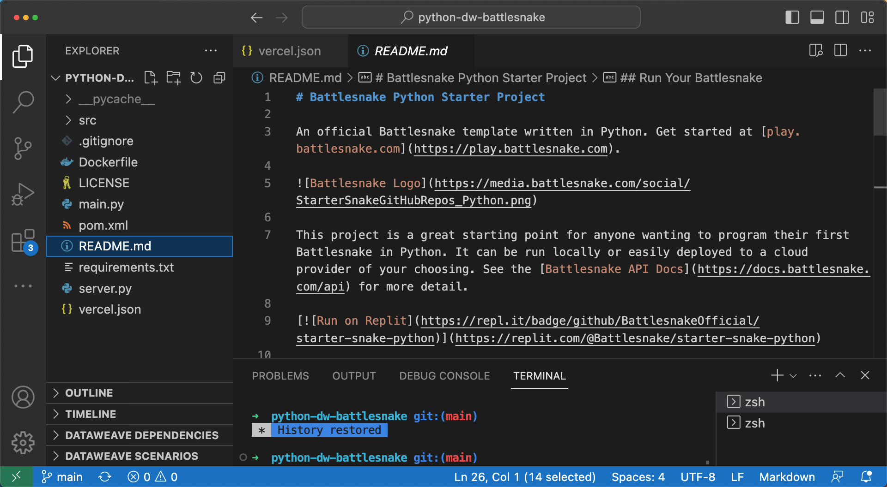

This looks way better for you now, right?

And same as before, you don't have to make the screen incredibly big. Just find a balance where it's comfortable for you to work on it, but it's as big as possible for the people who are watching.

## 3. Use the accessibility settings

Inside your **System Settings** > **Accessibility** > **Zoom**, there are several options to be able to use the Zoom tool on your screen. This is especially useful when you have some applications that don't support the 'standard' zooming options (**cmd +** or **cmd -**).

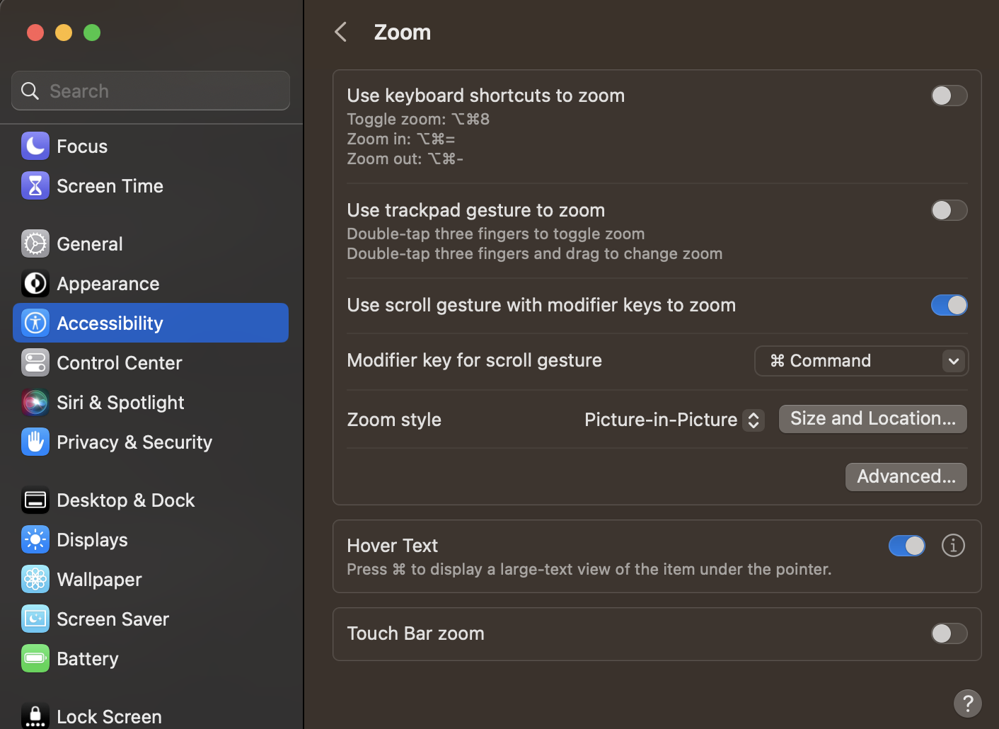

The option that I always use for my streams is the **Picture-in-Picture** zoom. I have it set up to use the **command** key to be able to use the scroll from my mouse to zoom in/out.

You can also click on the **Size and Location** button to set up how big/small you want the zoom to be, or click on the **Advanced** button for even more customization on the functionality. These are my Advanced settings, in case you want to set it up as I have it:

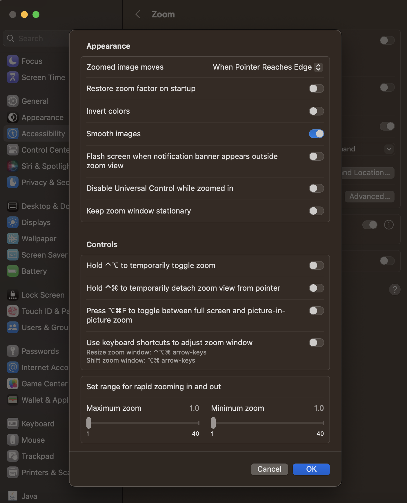

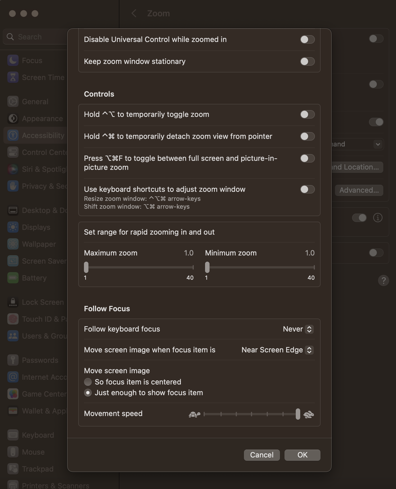

## 4. Display your clicks

Your audience might not know if you're double-clicking or drag-and-dropping with your mouse. They might be able to hear through the microphone when you're clicking your mouse, but it's not good enough to let them guess what you're doing.

You can use some software to show your clicks visually on-screen. The one I use is [keycastr](https://github.com/keycastr/keycastr). It shows a black line around the cursor to show if I just clicked once, twice, or if I'm pressing down on it.

After you install it, make sure you select the **Display mouse clicks** checkbox to show them. Otherwise, they won't be showing.

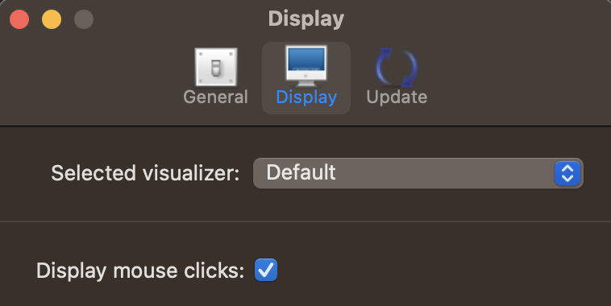

I also use this application to display my keystrokes, which is my next and final point.

## 5. Display your keystrokes

Sometimes you use keystroke combinations that the audience might not be aware of. For example, in Visual Studio Code, you have to press **cmd + shift + P** to show the palette. Your audience may not be aware of this combination and they just see you're magically opening the palette on the screen.

Instead of letting your audience guess what you're doing, you can visually display what keystrokes you're pressing. There are many paid tools that are fancier and have more customization options, but I feel [keycastr](https://github.com/keycastr/keycastr) gets the job done - and it's free.

After you install it, make sure you select the **Command keys only** checkbox. Otherwise, it will show ALL of your keystrokes. Including every single letter you press when writing - which can be annoying. But with this setting, it'll only show the combinations like **cmd + shift + P** or **cmd +**.

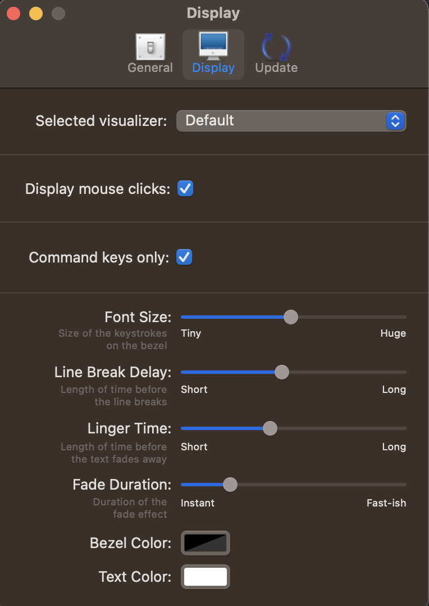

That's all for this post! I hope this is useful :D
