This blog post provides quick examples of how to use the Amazon DynamoDB Connector in Mule 4 using Anypoint Studio. There is a lot of documentation available on this connector’s usage, but none could be found that specifically shows how to structure the JSON requests, which are required for all DynamoDB connector operations.

This article explains all the connector operations along with their JSON requests, with simple use case scenarios.

We have considered all available DynamoDB data types for this use case, so you will have a very good understanding and usage of different DynamoDB data types.

## Operations

Below is the list of connector operations considered for the first part of this series.

- Create Table
- Describe Table
- List Tables
- Put Item
- Batch Put Item - Single Table
- Batch Put Item - Multiple Tables
- Get Item
- Batch Get Item - Single Table
- Batch Get Item - Multiple Tables
- Update Item
- Query
- Scan
- Delete Item
- Batch Delete Item - Single Table
- Batch Delete Item - Multiple Tables

## Use Case

To better understand the DynamoDB operations, we have considered a use case of the *continents* & their *countries*. All this data is segregated based on types of information & stored into two DynamoDB tables.

Each *continent* consists of multiple *countries*, & each *country* will have its own specific information like unique id, available city name, specialties, available zip codes, year-wise populations, etc. All this information is stored in the table `CONTINENT-COUNTRY-INFO-TABLE`.

Along with the above information, countries also have some classified information, like available agents in-country and intelligence agency information. All this classified information is stored in the table `COUNTRY-CLASIFIED-INFO-TABLE`.

This use case has taken into consideration *(almost)* all available DynamoDB connector operations and their data types for clear understanding.

**CONTINENT-COUNTRY-INFO-TABLE**

| **Column Name** | **Data Type** | **Attributes** |
|---|---|---|
| continent_name | String | primary-partition-key |
| country_unique_id | Number | primary-sort-key |
| country_name | String |  |
| isActive | Boolean |  |
| country_specialities | StringSet |  |
| country_available_pincodes | NumberSet |  |
| country_yearwise_population | Map |  |
| country_city_name | List |  |
| country_geo_value | null |  |

**COUNTRY-CLASIFIED-INFO-TABLE**

| **Column Name** | **Data Type** | **Attributes** |
|---|---|---|
| country_unique_id | Number | primary-partition-key |
| country_agents | Number |  |
| country_intelligence_agency | String |  |

## 1. Create Table

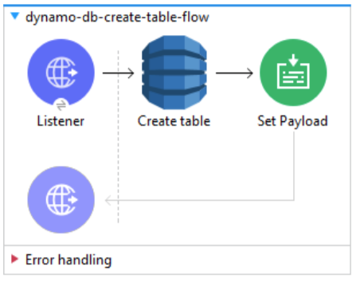

Let's start with our first operation. This operation will create a new table with the provided configurations.

> [!NOTE]
> Execute this connector operation separately for both tables, with their own configurations.

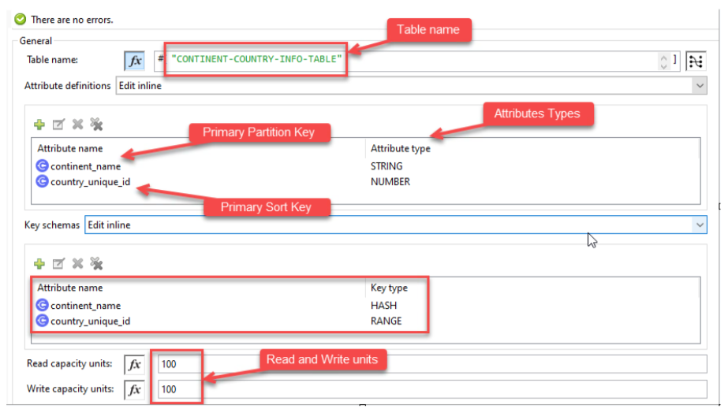

Below are the provided parameters:

- **Table name:** The name for the table.
- **AttributeDefinitions:** This value is an array of attributes that describe the key schema for the table and indexes.

We have configured a composite primary key, which is a combination of primary key and sort key.

- `continent_name`: Primary Partition Key
- `country_unique_id`: Primary Sort key

A composite primary key gives you additional flexibility when querying data. For example, if you provide only the value for `continent_name`, DynamoDB retrieves all of the `country_unique_id` associated with it.

- **KeySchema**: This value specifies the attributes that make up the primary key for a table or an index.
- **Read Capacity Units**: 100 – The maximum number of strongly consistent reads per second.
- **Write Capacity Units**: 100 – The maximum number of writes consumed per second.

**Response**

Once you execute this connector, the DynamoDB tables will be created and you will receive a SUCCESS Response.

## 2. Describe Table

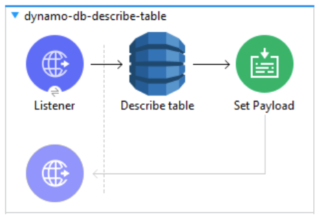

This operation is used to get information about the table, including the current status of the table, when it was created, the primary key schema, and any indexes on the table.

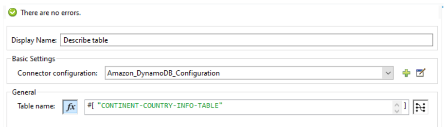

The only parameter we configure for this operation is the *Table name*.

**Response**

Once executed, the connector will return a response in the below format.

```json
{
        "globalSecondaryIndexes": null,
        "latestStreamLabel": null,
        "latestStreamArn": null,
        "keySchema": [
            {
                "attributeName": "continent_name",
                "keyType": "HASH"
            },
            {
                "attributeName": "country_unique_id",
                "keyType": "RANGE"
            }
        ],
        "provisionedThroughput": {
            "writeCapacityUnits": 100,
            "readCapacityUnits": 100,
            "numberOfDecreasesToday": 0,
            "lastIncreaseDateTime": null,
            "lastDecreaseDateTime": null
        },
        "tableStatus": "ACTIVE",
        "itemCount": 0,
        "tableArn": "arn:aws:dynamodb:xx-xxxx-x:xxxxxxxxxxxxxxxxx:table/CONTINENT-COUNTRY-INFO-TABLE",
        "tableSizeBytes": 0,
        "tableName": "CONTINENT-COUNTRY-INFO-TABLE",
        "streamSpecification": null,
        "attributeDefinitions": [
            {
                "attributeType": "STRING",
                "attributeName": "continent_name"
            },
            {
                "attributeType": "NUMBER",
                "attributeName": "country_unique_id"
            }
        ],
        "localSecondaryIndexes": null,
        "creationDateTime": "2022-03-07T11:13:56.413"
    }
```

## 3. List Tables

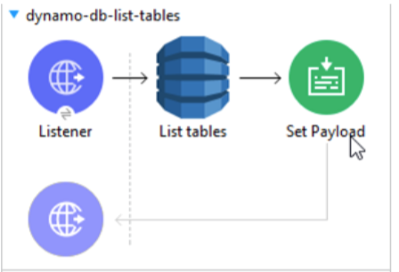

This operation will return all the table names associated with your current AWS account and endpoint.

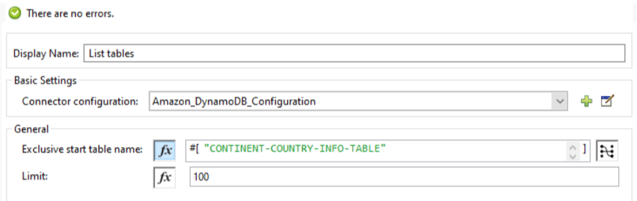

Below parameters are configured for this operation:

- **Exclusive start table name**: The first table name that this operation will evaluate. If no table names are provided, it will list all tables.
- **Limit**: A maximum number of table names to return. If this parameter is not specified, the limit is 100.

**Response**

Once executed, the connector will return a response in the below format.

```json
{
“tableNames” : [
	“table-1”,
	“table-2”,
	“table-3”
],
“lastEvaluatedTableName” : “table-4”
}
```

## 4. Put Item

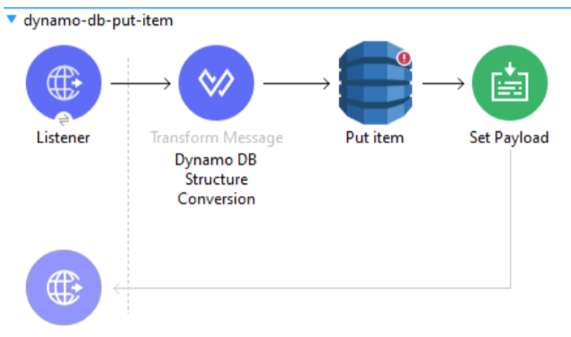

Use this operation when the need is to create a new item or replace an existing item in the DB. If an item that has the same primary key as a new item already exists in a specified table, the new item replaces an existing item.

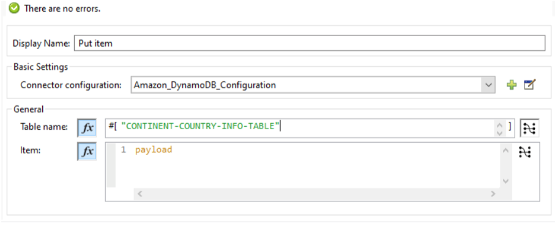

**Request**

Let's now create our first country “India” with other required information.

```dataweave
%dw 2.0
output application/json
---
{
	"continent_name": {
		"S": "ASIA"
	},
	"country_unique_id": {
		"N": 1
	},
	"country_name": {
		"S": "India"
	},
	"isActive": {
		"Bool": true
	},
	"country_specialities": {
		"ss": ["India is democratic country",
      	"India has 121 languages and 270 mother tongues",
      	"Jana-gana-mana is a national song of india"]
	},
	"country_available_pincodes": {
		"ns": [110001,
      110002,
      110003]
	},
	"country_yearwise_population": {
    "M": {
      "2020": {
        "N": "1380004385"
      },
      "2021": {
        "N": "1393409038"
      },
	  "2022": {
        "N": "1406631776"
      }
    }
  },
	"country_city_name": {
		"L": [
		{
			"S": "Mumbai"
		},
		{
			"S": "Delhi"
		},
		{
			"S": "Pune"
		},
		{
			"S": "Kolkata"
		}
	]
	}
}
```

**Response**

Once you execute the above flow, you will see 1 record is created in the table `CONTINENT-COUNTRY-INFO-TABLE`.

## 5. Batch Put Item - Single Table

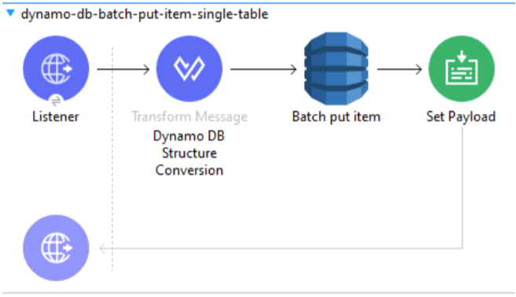

This operation inserts/puts multiple records or items in one table.

**Request**

Let's now create 2 country records “Singapore” and “Japan” in the same table `CONTINENT-COUNTRY-INFO-TABLE`.

```dataweave
{
   	"CONTINENT-COUNTRY-INFO-TABLE": [{	//Table1
          	"PutRequest": {                             	// Item 1
                 	"continent_name": {
                        	"S": "ASIA"
                 	} as Object {
                        	class:"org.mule.extension.dynamodb.api.model.AttributeValue"
                 	},
                 	"country_unique_id": {
                        	"N": 2
                 	} as Object {
                        	class:"org.mule.extension.dynamodb.api.model.AttributeValue"
                 	},
                 	"country_name": {
                        	"S": "Singapore"
                 	} as Object {
                        	class:"org.mule.extension.dynamodb.api.model.AttributeValue"
                 	},
                 	"isActive": {
                        	"Bool": true
                 	} as Object {
                        	class:"org.mule.extension.dynamodb.api.model.AttributeValue"
                 	},
                 	"country_specialities": {
					"ss": [
							"Singapore is Renowned for having some of the cleanest streets in the world",
							"Singapore has a Reputation as the Garden City",
							"Singapore has Good Street Food"]
			} as Object {
                        	class:"org.mule.extension.dynamodb.api.model.AttributeValue"
                 	},
                 	"country_available_pincodes": {
                        	"ns": [1,2,3]
                 	} as Object {
                        	class:"org.mule.extension.dynamodb.api.model.AttributeValue"
                 	},
                 	"country_yearwise_population": {
							"M": {
					"2020": {
						"N": 5850342
					},
					"2021": {
						"N": 5896686
					},
					"2022": {
						"N": 5943546
					}
				}}
			 as Object {
                        	class:"org.mule.extension.dynamodb.api.model.AttributeValue"
                 	},
                 	"country_city_name": {
				"L": [{
					"S": "Central Region"
				},
		{
					"S": "East Region"
				},
		{
					"S": "North Region"
				},
		{
					"S": "North-East Region"
				},
		{
					"S": "West Region"
				}]
			} as Object {
                        	class:"org.mule.extension.dynamodb.api.model.AttributeValue"
                 	}
          	}
   	}  as Object {
          	class:"org.mule.extension.dynamodb.api.model.WriteRequest"
   	},
     		{
      	"PutRequest": {                         	// Item 2
                 	"continent_name": {
                        	"S": "ASIA"
                 	} as Object {
                        	class:"org.mule.extension.dynamodb.api.model.AttributeValue"
                 	},
                 	"country_unique_id": {
                        	"N": 3
                 	} as Object {
                        	class:"org.mule.extension.dynamodb.api.model.AttributeValue"
                 	},
                 	"country_name": {
                        	"S": "Japan"
                 	} as Object {
                        	class:"org.mule.extension.dynamodb.api.model.AttributeValue"
                 	},
                 	"isActive": {
                        	"Bool": true
                 	} as Object {
                        	class:"org.mule.extension.dynamodb.api.model.AttributeValue"
                 	},
                 	"country_specialities": {
				"ss": [	"Mount Fuji is the highest volcano in Japan",
						"Tokyo Skytree is the Tallest tower not just in Japan, but in the entire world",
						"Japan has the Fastest bullet train",
						"Geisha are a big part of Japanese tradition and culture"]
			} as Object {
                        	class:"org.mule.extension.dynamodb.api.model.AttributeValue"
                 	},
                 	"country_available_pincodes": {
                        	"ns": [1200000,1900100,1120000]
                 	} as Object {
                        	class:"org.mule.extension.dynamodb.api.model.AttributeValue"
                 	},
                 	"country_yearwise_population": {
				"M": {
					"2020": {
						"N": 126476461
					},
					"2021": {
						"N": 126050804
					},
					"2022": {
						"N": 125584838
					}
				}
			} as Object {
                        	class:"org.mule.extension.dynamodb.api.model.AttributeValue"
                 	},
                 	"country_city_name": {
						"L": [{
							"S": "Tokyo"
						},
				{
							"S": "Osaka"
						},
				{
							"S": "Kawasaki"
						},
				{
							"S": "Chiba"
						}]
					} as Object {
                        	class:"org.mule.extension.dynamodb.api.model.AttributeValue"
                 	}
          	}
   	}  as Object {
          	class:"org.mule.extension.dynamodb.api.model.WriteRequest"
   	}]
}
```

**Response**

Once you execute the above flow, you will see both these records are created in table `CONTINENT-COUNTRY-INFO-TABLE`.

## 6. Batch Put Item - Multiple Tables

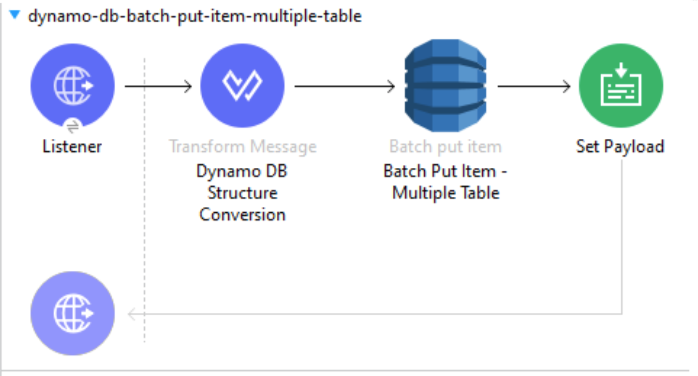

This operation Inserts/Puts multiple records or items in one or more tables.

![Batch put item config with Request put items set to the Expression #[payload].](../../assets/blog/amazon-dynamodb-connector-operations-in-mule-4-part-1-11.png)

**Request**

Let's now create one more country “Switzerland” in table `CONTINENT-COUNTRY-INFO-TABLE` and all 4 countries classified information (India, Singapore, Japan, Switzerland) in table `COUNTRY-CLASIFIED-INFO-TABLE`.

```dataweave
{
   	"CONTINENT-COUNTRY-INFO-TABLE": [{	//Table1
          	"PutRequest": {                             	// Item 1
                 	"continent_name": {
                        	"S": "Europe"
                 	} as Object {
                        	class:"org.mule.extension.dynamodb.api.model.AttributeValue"
                 	},
                 	"country_unique_id": {
                        	"N": 4
                 	} as Object {
                        	class:"org.mule.extension.dynamodb.api.model.AttributeValue"
                 	},
                 	"country_name": {
                        	"S": "Switzerland"
                 	} as Object {
                        	class:"org.mule.extension.dynamodb.api.model.AttributeValue"
                 	},
                 	"isActive": {
                        	"Bool": true
                 	} as Object {
                        	class:"org.mule.extension.dynamodb.api.model.AttributeValue"
                 	},
                 	"country_specialities": {
					"ss": [
							"Switzerland is famous for their watches",
							"Switzerland is a beautiful, tourist-attracting country",
							"Switzerland is famous for its mesmerizing alpine scenery, luxury branded watches, and deliciously milky chocolate"]
			} as Object {
                        	class:"org.mule.extension.dynamodb.api.model.AttributeValue"
                 	},
                 	"country_available_pincodes": {
                        	"ns": [1715,1732,1673]
                 	} as Object {
                        	class:"org.mule.extension.dynamodb.api.model.AttributeValue"
                 	},
                 	"country_yearwise_population": {
							"M": {
					"2020": {
						"N": 8654622
					},
					"2021": {
						"N": 8715494
					},
					"2022": {
						"N": 8773637
					}
				}}
			 as Object {
                        	class:"org.mule.extension.dynamodb.api.model.AttributeValue"
                 	},
                 	"country_city_name": {
				"L": [{
					"S": "Zurich"
				},
		{
					"S": "Lucerne"
				},
		{
					"S": "Basel"
				},
		{
					"S": "Bern"
				},
		{
					"S": "Geneva"
				}]
			} as Object {
                        	class:"org.mule.extension.dynamodb.api.model.AttributeValue"
                 	}
          	}
   	}  as Object {
          	class:"org.mule.extension.dynamodb.api.model.WriteRequest"
   	}],
	"COUNTRY-CLASIFIED-INFO-TABLE": [{
		"PutRequest": {
			"country_unique_id": {
				"N": 1
			} as Object {
				class:"org.mule.extension.dynamodb.api.model.AttributeValue"
			},
			"country_agents": {
				"N": 500000
			} as Object {
				class:"org.mule.extension.dynamodb.api.model.AttributeValue"
			},
			"country_intelligence_agency": {
				"S": "Research and Analysis Wing (RAW)"
			} as Object {
				class:"org.mule.extension.dynamodb.api.model.AttributeValue"
			}
		}
	} as Object {
		class:"org.mule.extension.dynamodb.api.model.WriteRequest"
	},{
		"PutRequest": {
			"country_unique_id": {
				"N": 2
			} as Object {
				class:"org.mule.extension.dynamodb.api.model.AttributeValue"
			},
			"country_agents": {
				"N": 120000
			} as Object {
				class:"org.mule.extension.dynamodb.api.model.AttributeValue"
			},
			"country_intelligence_agency": {
				"S": "The Security and Intelligence Division (SID)"
			} as Object {
				class:"org.mule.extension.dynamodb.api.model.AttributeValue"
			}
		}
	} as Object {
		class:"org.mule.extension.dynamodb.api.model.WriteRequest"
	},{
		"PutRequest": {
			"country_unique_id": {
				"N": 3
			} as Object {
				class:"org.mule.extension.dynamodb.api.model.AttributeValue"
			},
			"country_agents": {
				"N": 90000
			} as Object {
				class:"org.mule.extension.dynamodb.api.model.AttributeValue"
			},
			"country_intelligence_agency": {
				"S": "The Public Security Intelligence Agency"
			} as Object {
				class:"org.mule.extension.dynamodb.api.model.AttributeValue"
			}
		}
	} as Object {
		class:"org.mule.extension.dynamodb.api.model.WriteRequest"
	},
	{
		"PutRequest": {
			"country_unique_id": {
				"N": 4
			} as Object {
				class:"org.mule.extension.dynamodb.api.model.AttributeValue"
			},
			"country_agents": {
				"N": 50000
			} as Object {
				class:"org.mule.extension.dynamodb.api.model.AttributeValue"
			},
			"country_intelligence_agency": {
				"S": "The Swiss Intelligence Agency"
			} as Object {
				class:"org.mule.extension.dynamodb.api.model.AttributeValue"
			}
		}
	} as Object {
		class:"org.mule.extension.dynamodb.api.model.WriteRequest"
	}
	]
}
```

**Response**

Once you execute the above flow, you will see all these records are created in the respective table.

## 7. Get Item

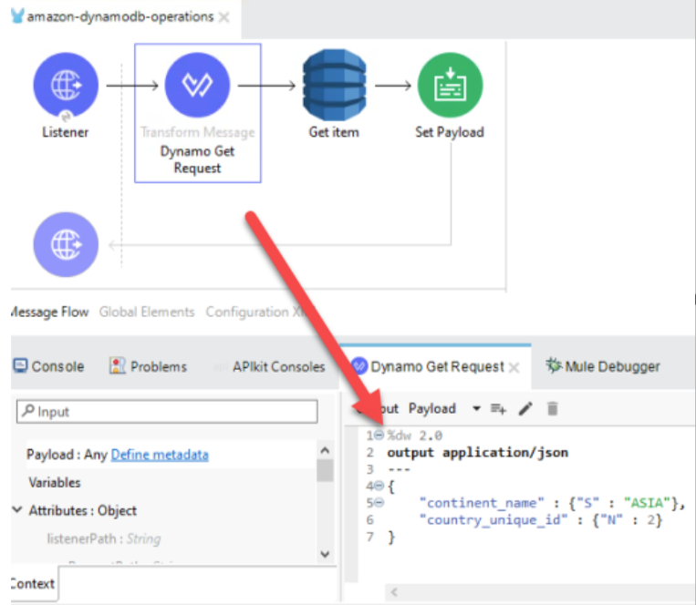

The GetItem operation returns a set of attributes for the item with the given primary key. If there is no matching item GetItem does not return any data.

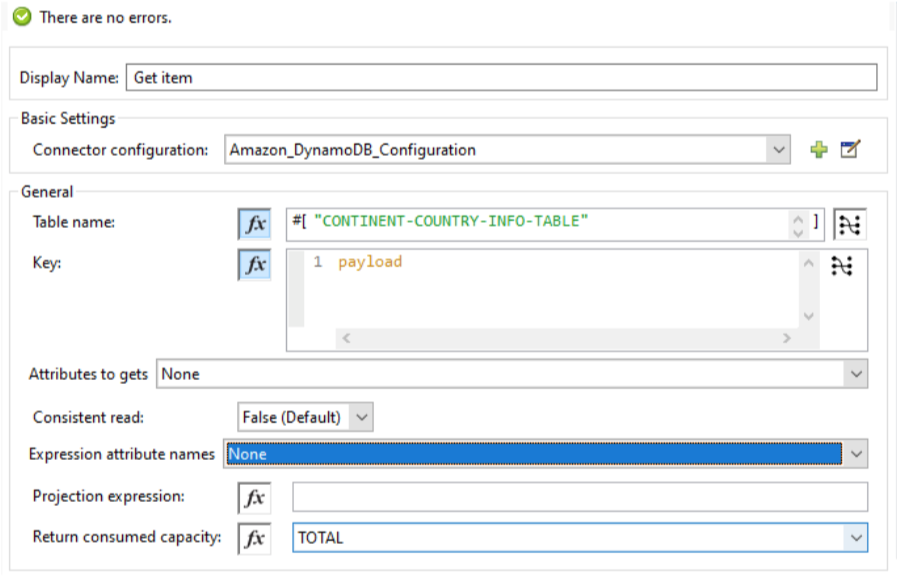

**Request**

Let's now fetch the record from table `CONTINENT-COUNTRY-INFO-TABLE`, having continent = ‘ASIA’ & country unique id = ‘2’.

```dataweave
%dw 2.0
output application/json
---
{
	"continent_name" : {"S" : "ASIA"},
	"country_unique_id" : {"N" : 2}
}
```

**Response**

Once you execute the above flow, you will see the respective records in response.

## 8. Batch Get Item - Single Table

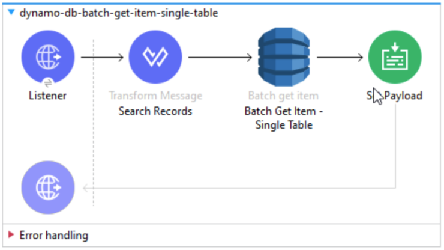

The Batch Get Item operation returns the attributes of one or more items from one table. You identify the requested item by primary key and sort key combination.

![Batch get item config with Request items set to the Expression #[payload] and Return consumed capacity TOTAL.](../../assets/blog/amazon-dynamodb-connector-operations-in-mule-4-part-1-15.png)

**Request**

Let’s now fetch two records from table `CONTINENT-COUNTRY-INFO-TABLE` , having continent = ‘ASIA’ & ‘Europe’ & country unique id = ‘1’ & ‘4’.

```dataweave
{
	"CONTINENT-COUNTRY-INFO-TABLE" : {
        		"Keys": [
            		{ 
               			"continent_name" : {"S":"ASIA"} as Object {class:"org.mule.extension.dynamodb.api.model.AttributeValue"},
               			"country_unique_id":{"N": 1} as Object {class:"org.mule.extension.dynamodb.api.model.AttributeValue"}
               		},
               		{
               			"continent_name" : {"S":"Europe"} as Object {class:"org.mule.extension.dynamodb.api.model.AttributeValue"},
               			"country_unique_id":{"N": 4} as Object {class:"org.mule.extension.dynamodb.api.model.AttributeValue"}
               		}
         	]
      } as Object {class:"org.mule.extension.dynamodb.api.model.KeysAndAttributes"}
}
```

**Response**

Once you execute the above flow, you will see both these respective records in response.

## 9. Batch Get Item - Multiple Tables

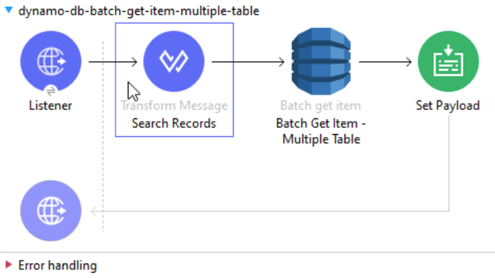

The Batch Get Item operation returns the attributes of one or more items from one or more tables. You identify the requested item by primary key.

![Batch get item config for multiple tables with Request items #[payload] and Return consumed capacity TOTAL.](../../assets/blog/amazon-dynamodb-connector-operations-in-mule-4-part-1-17.png)

**Request**

Let's now fetch two records each from table `CONTINENT-COUNTRY-INFO-TABLE` & `COUNTRY-CLASIFIED-INFO-TABLE`.

```dataweave
{
	"CONTINENT-COUNTRY-INFO-TABLE": {
		"Keys": [{
			"continent_name": {
				"S": "ASIA"
			} as Object {
				class:"org.mule.extension.dynamodb.api.model.AttributeValue"
			},
			"country_unique_id": {
				"N": 1
			} as Object {
				class:"org.mule.extension.dynamodb.api.model.AttributeValue"
			}
		},
               		{
			"continent_name": {
				"S": "ASIA"
			} as Object {
				class:"org.mule.extension.dynamodb.api.model.AttributeValue"
			},
			"country_unique_id": {
				"N": 2
			} as Object {
				class:"org.mule.extension.dynamodb.api.model.AttributeValue"
			}
		}]
	} as Object {
		class:"org.mule.extension.dynamodb.api.model.KeysAndAttributes"
	},
	"COUNTRY-CLASIFIED-INFO-TABLE": {
		"Keys": [{
			"country_unique_id": {
				"N": 1
			} as Object {
				class:"org.mule.extension.dynamodb.api.model.AttributeValue"
			}
		},
               		{
			"country_unique_id": {
				"N": 2
			} as Object {
				class:"org.mule.extension.dynamodb.api.model.AttributeValue"
			}
		}]
	} as Object {
		class:"org.mule.extension.dynamodb.api.model.KeysAndAttributes"
	}
}
```

**Response**

Once you execute the above flow, you will see both these respective records from each table, in the response.

## 10. Update Item

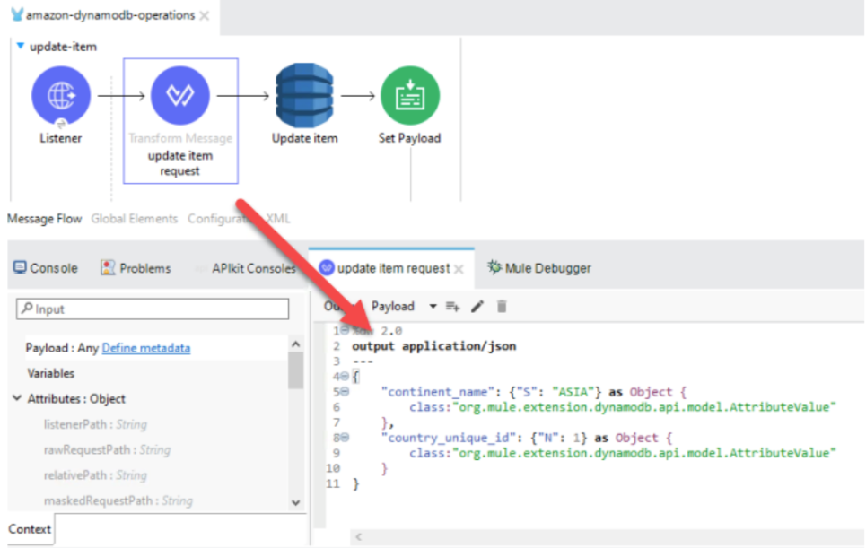

This operation edits an existing item's attributes or adds a new item to the table if it does not already exist.

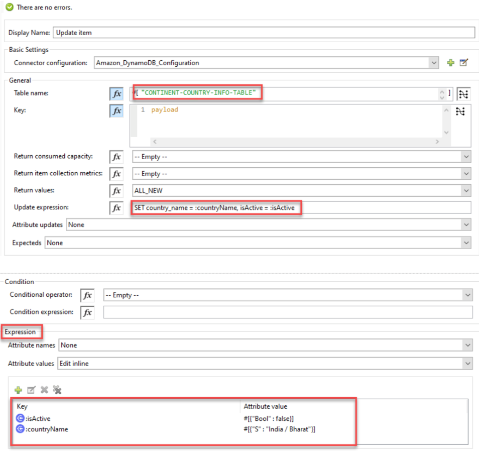

**Request**

Let's now update the record with country name "India" with:

- `isActive = 'false'`
- `country_name = 'India/Bharat'`

```dataweave
%dw 2.0
output application/json
---
{
	"continent_name": {"S": "ASIA"} as Object {
		class:"org.mule.extension.dynamodb.api.model.AttributeValue"
	},
	"country_unique_id": {"N": 1} as Object {
		class:"org.mule.extension.dynamodb.api.model.AttributeValue"
	}
}
```

**Response**

Once the above request is served, both these columns (`isActive` & `country_name`) will be updated respectively with the new values.

## 11. Query

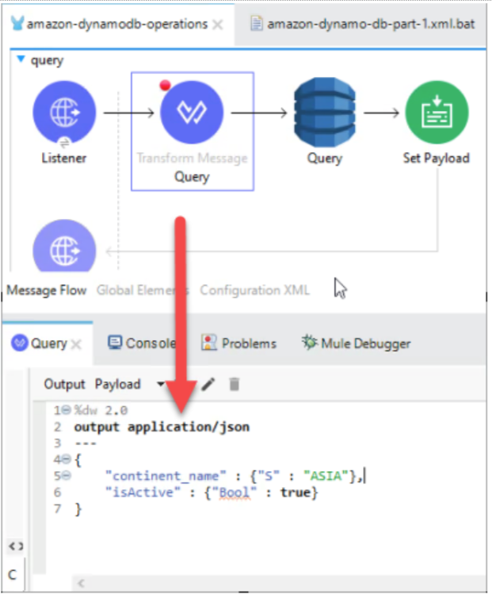

The Query operation finds items based on primary key values. You can query any table that has or secondary index that has a composite primary key (a partition key and a sort key).

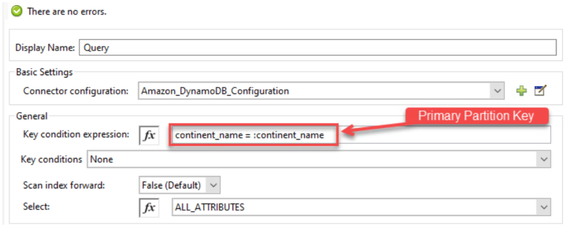

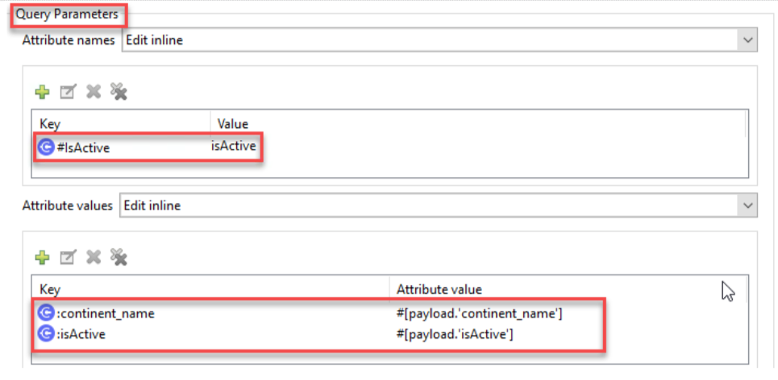

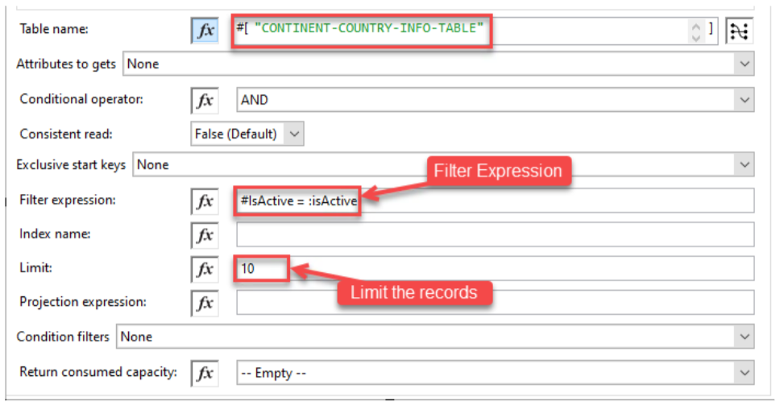

**Request**

Now, Let’s query the table `CONTINENT-COUNTRY-INFO-TABLE` and fetch all the records that satisfy the following criteria:

- `continent_name = 'ASIA'`
- `isActive = 'true'`

```dataweave
%dw 2.0
output application/json
---
{
	"continent_name" : {"S" : "ASIA"},
	"isActive" : {"Bool" : true}
}
```

**Response**

Once you execute the above flow, you will find 3 records in the response.

## 12. Scan

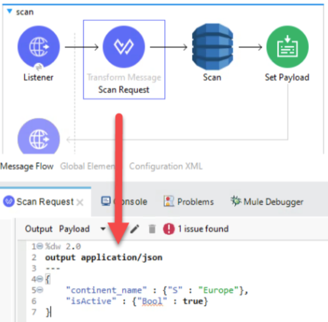

The scan operation returns one or more items or item attributes By accessing every item in a table or secondary index. To have DynamoDB return fewer items, you can provide a FilterExpression operation.

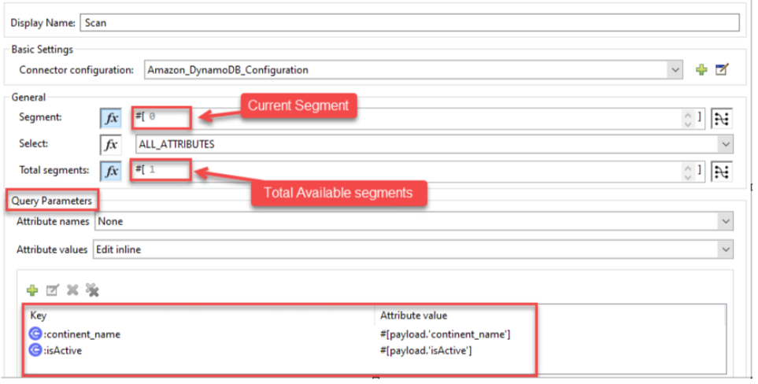

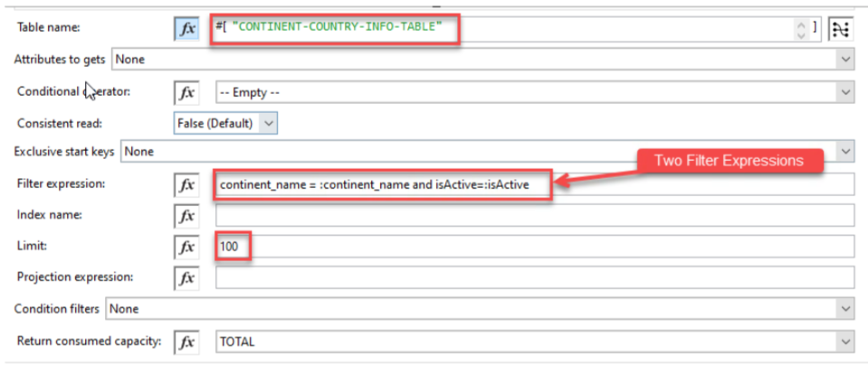

**Request**

Let's scan the table `CONTINENT-COUNTRY-INFO-TABLE` and fetch all the records that satisfy the following criteria:

- `continent_name = 'Europe'`
- `isActive = 'true'`

```dataweave
%dw 2.0
output application/json
---
{
	"continent_name" : {"S" : "Europe"},
	"isActive" : {"Bool" : true}
}
```

**Response**

Once you execute the above flow, you will find only 1 record in response.

## 13. Delete Item

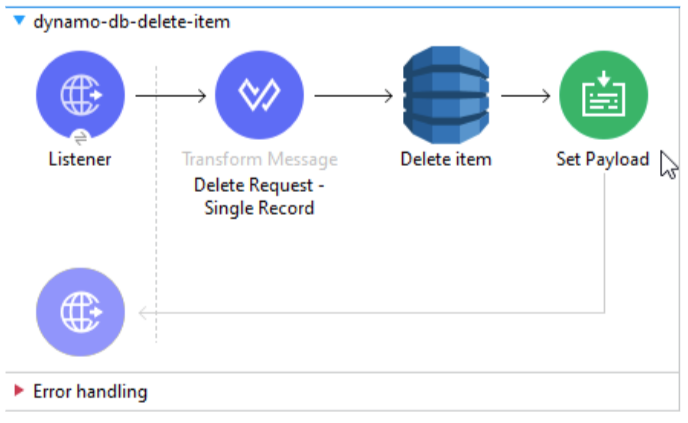

This operation deletes a single item in a table. Items are identified using primary key and sort key combination.

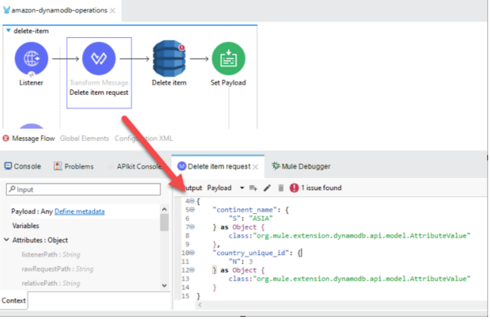

**Request**

Let's now delete the record with country = ‘Japan’ from table `CONTINENT-COUNTRY-INFO-TABLE`

```dataweave
%dw 2.0
output application/json
---
{
	"continent_name": {
		"S": "ASIA"
	} as Object {
		class:"org.mule.extension.dynamodb.api.model.AttributeValue"
	},
	"country_unique_id": {
		"N": 3
	} as Object {
		class:"org.mule.extension.dynamodb.api.model.AttributeValue"
	}
}
```

**Response**

Once executed, the record will be deleted from the table.

## 14. Batch Delete Item - Single Table

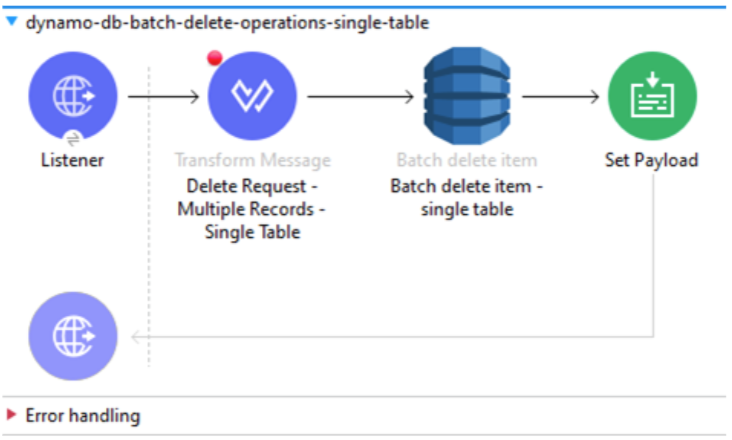

This operation deletes multiple items in one table.

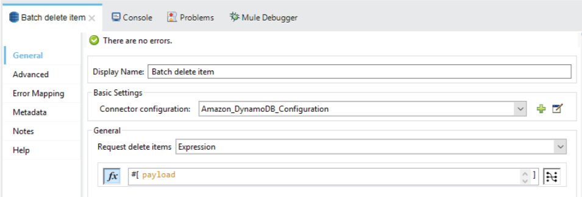

**Request**

We’ll now delete 2 records in a single request. Let’s delete both countries “Singapore” & “Switzerland” from the table `CONTINENT-COUNTRY-INFO-TABLE`.

```dataweave
{
	"CONTINENT-COUNTRY-INFO-TABLE": [{
		"DeleteRequest": {
			"continent_name": {
				"S": "ASIA"
			} as Object {
				class: "org.mule.extension.dynamodb.api.model.AttributeValue"
			},
			"country_unique_id": {
				"N": "2"
			} as Object {
				class: "org.mule.extension.dynamodb.api.model.AttributeValue"
			}
		}
	} as Object {
		class : "org.mule.extension.dynamodb.api.model.WriteRequest"
	},
{
		"DeleteRequest": {
			"continent_name": {
				"S": "Europe"
			} as Object {
				class: "org.mule.extension.dynamodb.api.model.AttributeValue"
			},
			"country_unique_id": {
				"N": "4"
			} as Object {
				class: "org.mule.extension.dynamodb.api.model.AttributeValue"
			}
		}
	} as Object {
		class : "org.mule.extension.dynamodb.api.model.WriteRequest"
	}]
}
```

**Response**

Once executed, both these records will have been deleted from the table.

## 15. Batch Delete Item - Multiple Tables

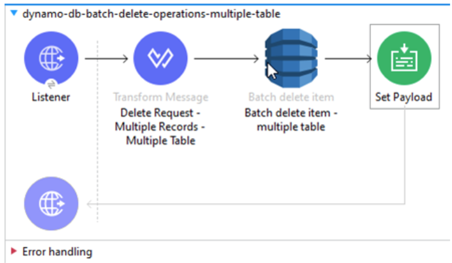

This operation deletes multiple items from multiple tables.

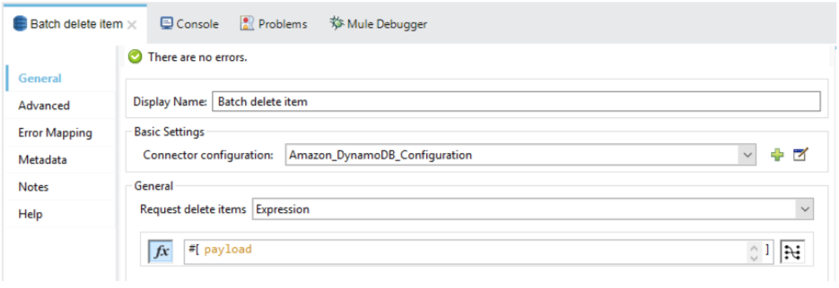

**Request**

We’ll delete country ‘India’ from table `CONTINENT-COUNTRY-INFO-TABLE` and its classified information from the table `COUNTRY-CLASIFIED-INFO-TABLE`.

```dataweave
{
	"CONTINENT-COUNTRY-INFO-TABLE": [{
		"DeleteRequest": {
			"continent_name": {
				"S": "ASIA"
			} as Object {
				class: "org.mule.extension.dynamodb.api.model.AttributeValue"
			},
			"country_unique_id": {
				"N": 1
			} as Object {
				class: "org.mule.extension.dynamodb.api.model.AttributeValue"
			}
		}
	} as Object {
		class : "org.mule.extension.dynamodb.api.model.WriteRequest"
	}
],
	"COUNTRY-CLASIFIED-INFO-TABLE": [{
		"DeleteRequest": {
			"country_unique_id": {
				"N": 1
			} as Object {
				class: "org.mule.extension.dynamodb.api.model.AttributeValue"
			}
		}
	} as Object {
		class : "org.mule.extension.dynamodb.api.model.WriteRequest"
	},
{
		"DeleteRequest": {
			"country_unique_id": {
				"N": 3
			} as Object {
				class: "org.mule.extension.dynamodb.api.model.AttributeValue"
			}
		}
	} as Object {
		class : "org.mule.extension.dynamodb.api.model.WriteRequest"
	}]
}
```

**Response**

Once executed, all 3 records will have been deleted from both tables.

## Conclusion

We have seen the working examples of 15 operations of DynamoDB connectors.

Stay tuned for the next part.

Thank you and happy learning!!
