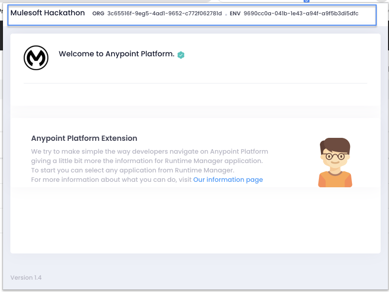
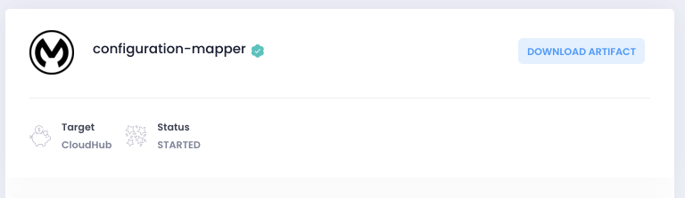
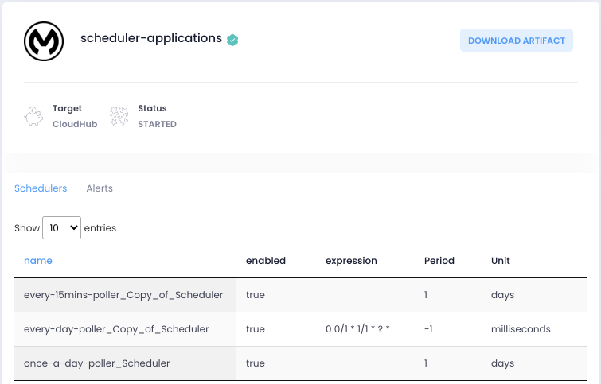
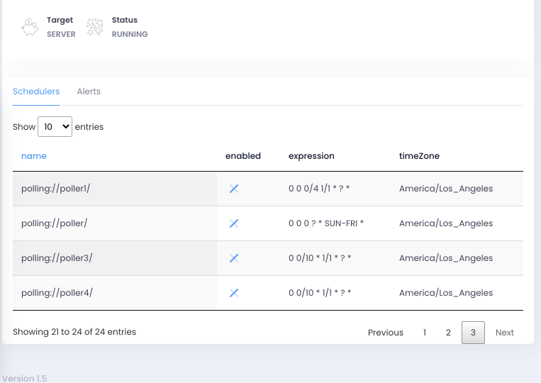
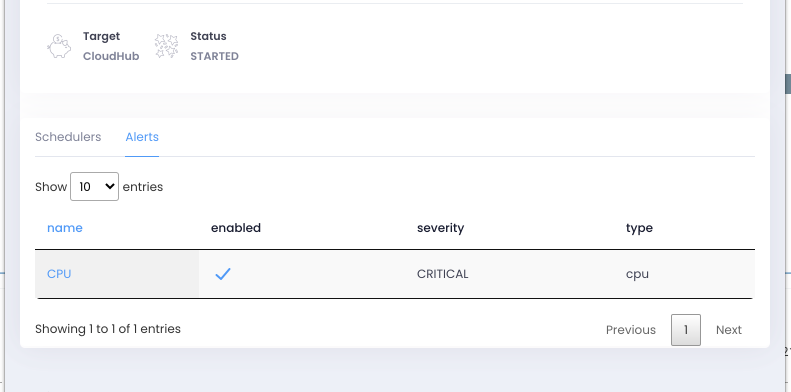

As developers we always want to have information at first hand whenever we need to access information.

One of the main reasons this extension was developed is that currently whenever we access Anypoint Platform we need to navigate with many clicks in the portal to see information about the organization or about a specific application. For example, what alerts does this application have? Or, does this application have any schedulers?

My motivation for developing this extension is to know what the MuleSoft community is looking for with tools like this and to know how we can create something useful for everybody.

We started really basic on this one but definitely the idea would be to make it as robust and helpful as we can.

In this post, I’ll show you some of the features that you can find in the Anypoint Platform Chrome Extension so far.

## See Organization name, Organization id and Environment id

These parameters are important for you, as a developer. Whenever you need to make an HTTP call using the CloudHub or Hybrid API, or when you are about to use Anypoint CLI.

This information is visible at the top of the extension.

## This only works so far on the Runtime Manager page

There is still a lot of work to do. For now, the extension only works on the Runtime Manager page and diving into the Runtime Manager applications. I will try to add some information for the main pages.

*Please don't judge so bad. :P*

## Runtime Manager Application

Once you select a specific application on Runtime Manager, you should be able to see more information in the extension. For example, on the top you should be able to see the name of the application, the target system where it’s deployed, and its current status.

As you can see above, there is a button allowing you to download the artifact (directly from your browser). If the application deployed is a Mule 4 application, you will get a .jar file. If the application was deployed in Mule 3.9.X, the artifact will be downloaded as a .zip file.

## See schedulers created in the application

Right now to be able to see if there are schedule processes in our application, we need to go into the application, click on “schedulers,” and there we are able to enable or disable the schedulers. In this case, in the application (and using the extension) you should be able to see the schedulers created in CloudHub and Hybrid.

## See alerts related to the application

You are able to see related alerts in the application just by clicking on the "Alerts" tab. The good thing about this is that you’re able to click on the alert and be redirected to make the changes that you need.

Finally, you can get the extension from [this link](https://chrome.google.com/webstore/detail/anypoint-platform-chrome/gofndnflkobgljnjjalmehnlamoifmhc?hl=en&authuser=0) (there are a few bug fixes on version 1.5, so wait for it).

Feel free to use the support page on the Chrome Extension page to give me any feedback, I'm really looking forward to hearing from the community about this.

Link to the original post can be found here: [Anypoint Platform Chrome Extension at yucelmoran.com](https://yucelmoran.com/anypoint-platform-chrome-extension/).
