It is very common to have the need to login into the Anypoint Platform console ([https://anypoint.mulesoft.com](https://anypoint.mulesoft.com/)) using what the customer already has in terms of an Identity Provider and an Identity Repository (LDAP). This could be for different reasons, such as:

- Promote the current Single Sign-on (SSO) functionalities, provided by the customer’s Identity Provider.
- Avoid the creation of new credentials and therefore, have the user memorize a new set of user/password to connect to Anypoint Platform.

It is also common for customers to use OKTA, OpenAM, AWS Cognito, Microsoft Azure, etc. as their Identity Provider. And with it, it is normal to configure Anypoint Platform to connect with them using OpenID or SAML. I have another post (in Spanish) on how to make the connection with OKTA and Anypoint Platform. You can find it [here](https://mulesoftdevelopersmx.blogspot.com/2020/10/mulesoft-anypoint-platform-openid.html).

On the internet, you will find information about how to configure SSO for Anypoint Platform, but with Identity Providers like OKTA or the ones I’ve mentioned at the beginning of this article.

In this post, we will talk about how to do it using Oracle Identity Cloud Services (IDCS), which is another Identity Provider alternative, and it may be an interesting one, if you are using MuleSoft to connect to Oracle SaaS Applications, for example.

## Prerequisites

The prerequisites for making this configuration are:

- An active Anypoint Platform Instance. It can be a 30-day trial.
- An active Oracle Identity Cloud Services tenant (can be a 300 credits free trial).
- Some knowledge on SAML 2.0.
- Understanding the role of an Identity Provider and a Service Provider. You can read [this article](https://www.okta.com/identity-101/why-your-company-needs-an-identity-provider/) to understand their differences.

In our case, Anypoint Platform is acting as the Service Provider and Oracle IDCS is working as the Identity Provider (IdP).

## IDCS Configuration

The first thing we need to do is to create an application in Oracle Identity Cloud Service that will generate the metadata that later we will import into Anypoint Platform.

Let’s do it!

Log in into your Oracle IDCS tenant and create a new application:

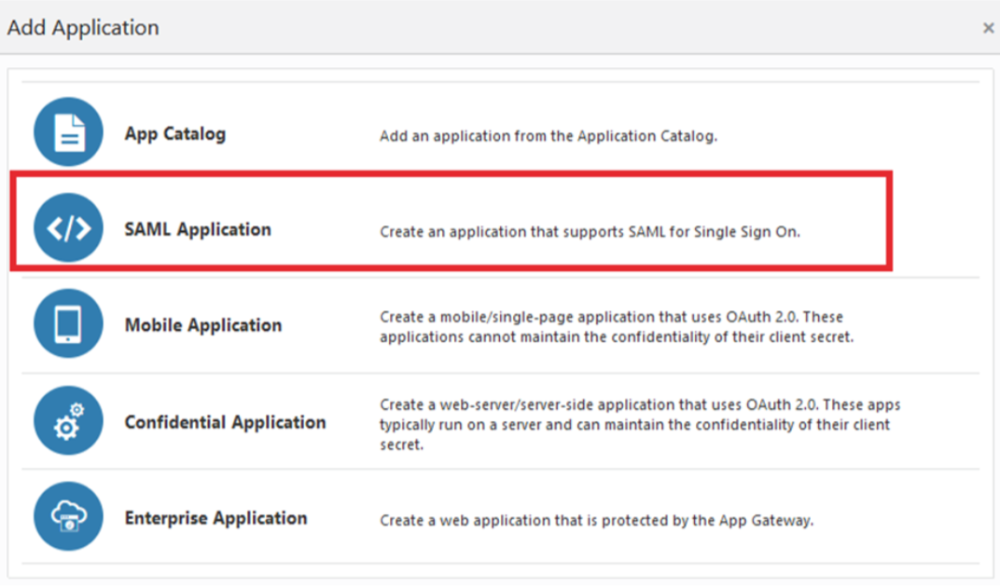

Click on SAML Application, the following screen will appear:

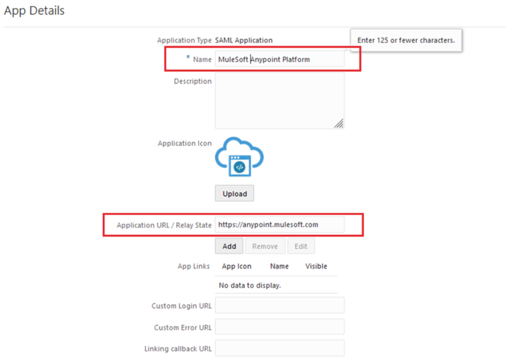

Fill in the parameters:

- Name: This can be anything and is the name that will represent your Application. In my case: MuleSoft Anypoint Platform
- Application URL/Relay State: This needs to be[https://anypoint.mulesoft.com](http://anypoint.mulesoft.com/)

Then click on the Next button:

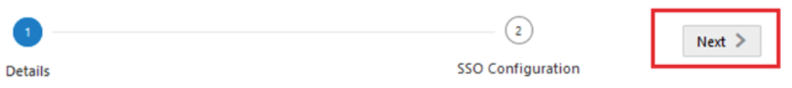

At the top of the next screen you will see this:

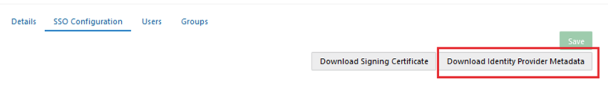

Click on Download Identity Provider Metadata. That will generate an XML file with all the information from the Identity Provider (IDCS), which we will use to import at Anypoint Platform.

## Anypoint Platform Configuration

Leave the IDCS screen open and log in to[https://anypoint.mulesoft.com](https://anypoint.mulesoft.com/) in another tab of your browser.

At the main menu, click on Access Management:

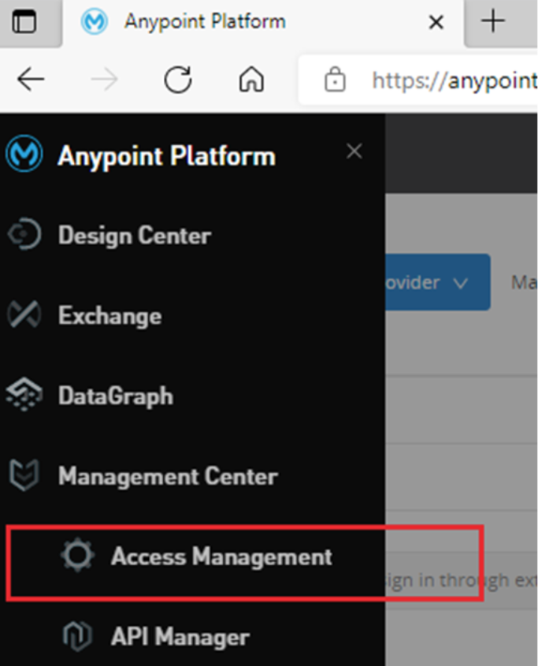

Once there, head into Identity Management:

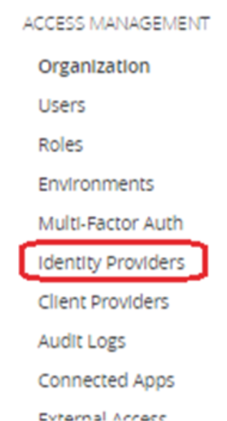

You will see that there is a default Identity Provider:

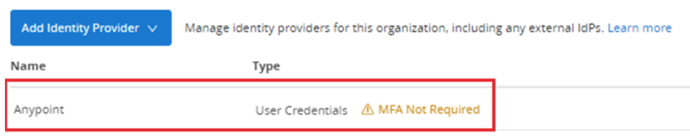

Which is Anypoint itself. And there is where the users are being created and maintained. But the intention of this post is to add a new Identity Provider and connect it to Oracle IDCS using SAML.

Just click on the Add Identity Provider blue button and select SAML:

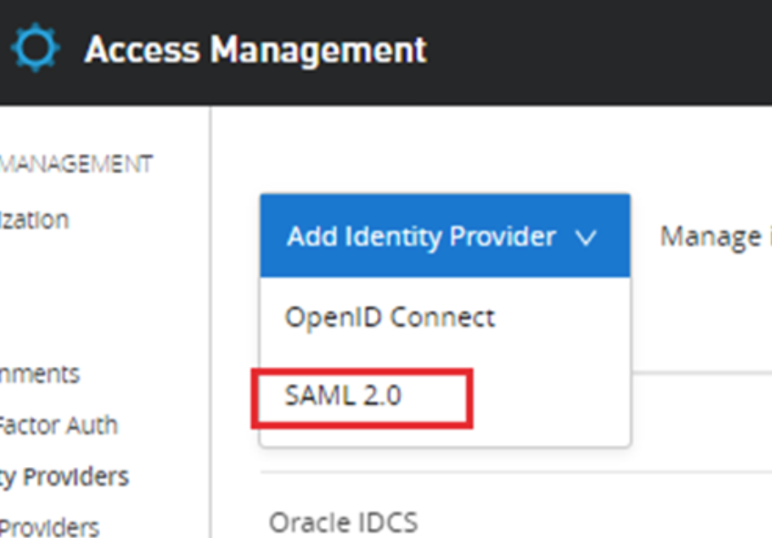

Once you are on the SAML 2.0 configuration page, it will allow you to import the metadata XML file that we’ve downloaded from the IDCS console in previous steps:

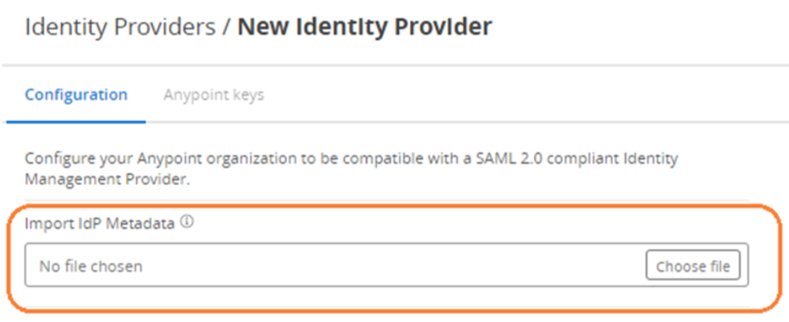

Click on the choose file, browse to the location where you’ve downloaded it, and import it. You will see that it will fill almost all the parameters on the screen:

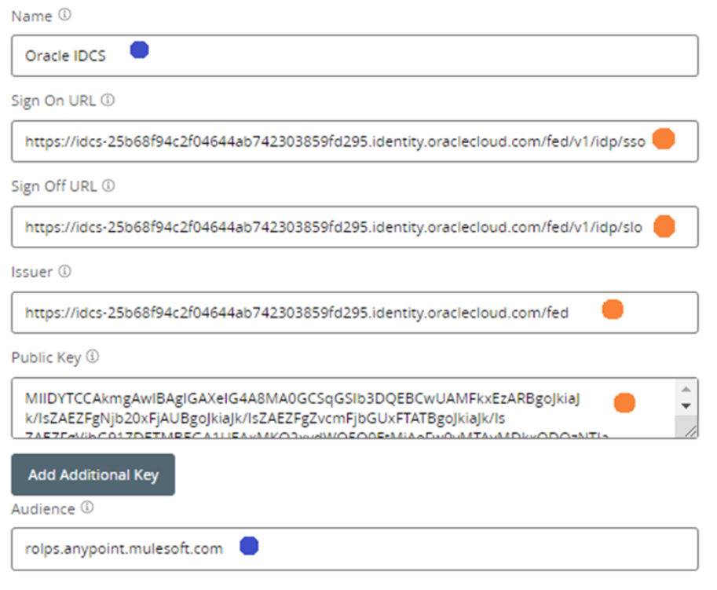

The ones that are marked with orange were filled automatically, and the blue ones are the ones where you need to make some decisions:

- Name: This is an arbitrary name that will identify this configuration.
- Audience: This is also an arbitrary name, but in this case, this parameter is very relevant, since it will match with the configuration at the IDCS side.

Then just click on Save Changes:

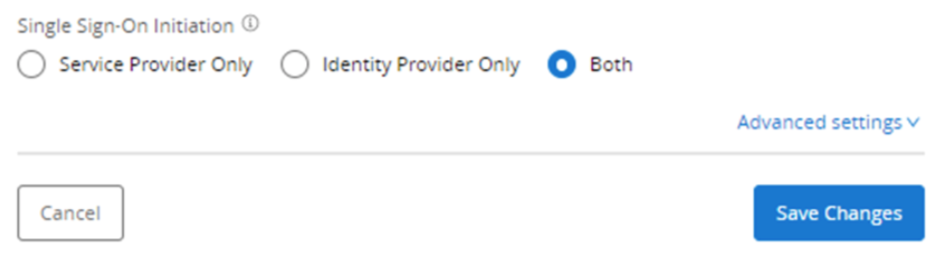

You will have two Identity Providers configured:

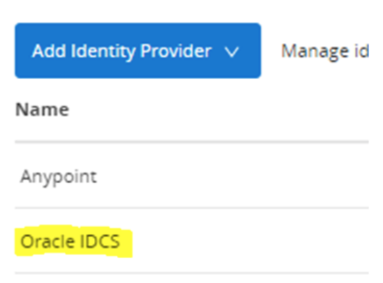

## Get Important Information

Before we get back to the Oracle IDCS console to finalize the configuration, we need to make a couple of things:

- Obtain the audience that needs to match with the Entity ID at the IDCS side
- Obtain the assertion consumer URL
- Obtain the certificate key from Anypoint
- Get the login URL that your Anypoint users will use to log in through Oracle IDCS

To get those four things, simply click on the identity provider that you have just configured (in my case Oracle IDCS):

1. Get the audience that needs to match with the Entity ID at the IDCS side:

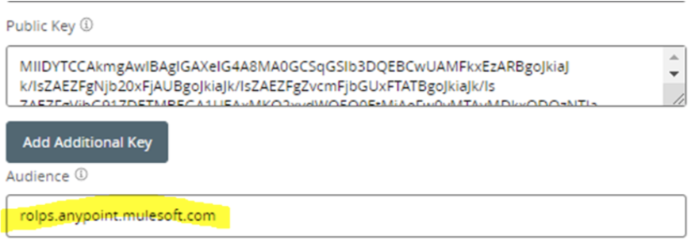

2. Assertion consumer URL is taken from here:

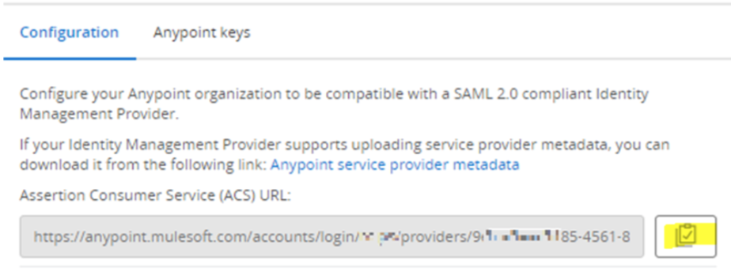

3. The certificate key is taken from the Anypoint Keys tab. Once there, simply click on the download button that I am marking in yellow. This will download a .pem file:

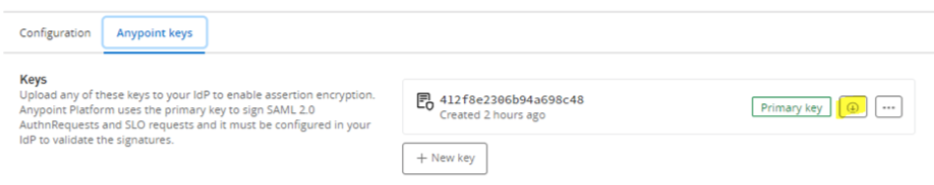

4. The login URL can be copied from here:

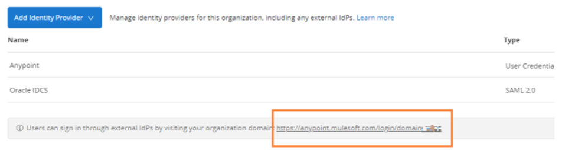

## Putting It Together

Now get back to Oracle IDCS console and fill the next parameters, accordingly to what we have just explained in the previous points:

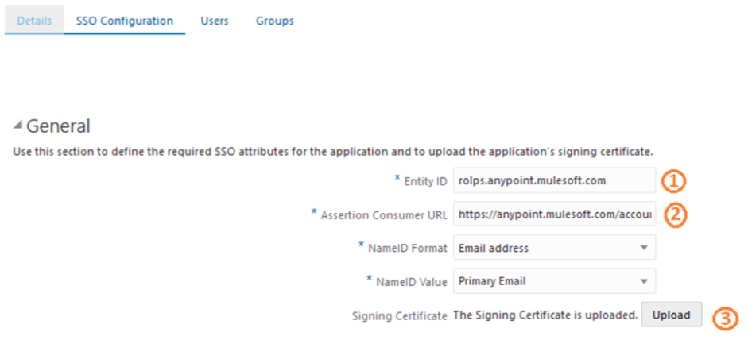

- In the Entity ID, copy the value of the audience that we’ve copied from the Anypoint Platform console
- In the Assertion Consumer URL, copy the value that we’ve copied from the Anypoint Platform console
- In the Signing Certificate, upload the .pem file that we’ve downloaded from the previous steps

We are almost done, we just need to map the email attribute that will be returned from Oracle IDCS and that Anypoint Platform will map it:

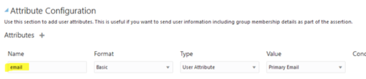

We just need to add **email** with the configuration we are showing in the image.

After that, save your Oracle IDCS application and activate it.

We are ready to test. Open a new browser and type the URL that we’ve copied from previous steps. It must be something like this:

```
https://anypoint.mulesoft.com/login/domain/<orgName>
```

You will see this:

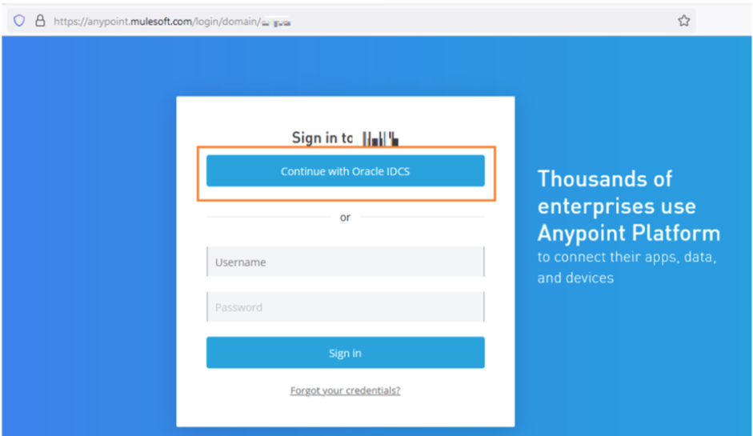

You now have two options to login to Anypoint Platform and as you can see the name of your Identity Provider Configuration appears in the button. If you click there, you will be redirected to Oracle IDCS default login form:

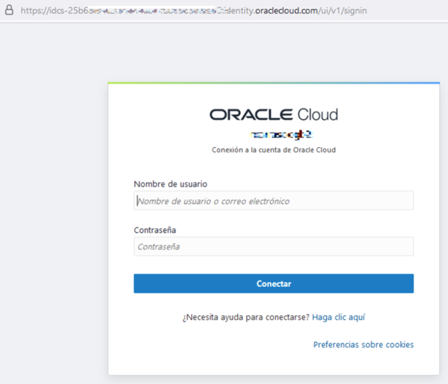

Use your Oracle IDCS credentials, and you will get logged in:

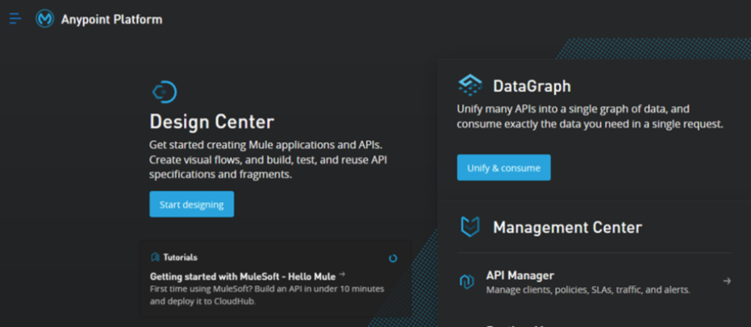

You will see this in the Users list at the Anypoint Platform:

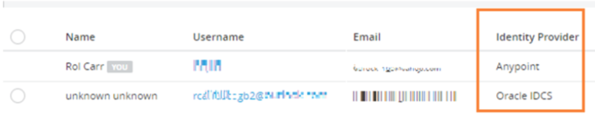

(I am deleting sensitive data for security reasons).

But you can see that it mapped the Username with the email provided by Oracle IDCS, and the email. You can also verify that the Identity Provider for that user is Oracle IDCS.

But you can be questioning yourself, what happened with the name? Why was it not mapped?

**Well, we will talk about that in the next article. We will elaborate on how to map attributes and roles coming from the Identity Provider, and mapped in Anypoint Platform.**
