Our[last article](https://www.prostdev.com/post/anypoint-platform-single-sign-on-sso-saml-configuration-with-oracle-idcs-part-1) was about how to integrate MuleSoft Anypoint Platform with Oracle Identity Cloud Services. With this, you can use Oracle IDCS as your Identity Provider. This is very useful for Single Sign-On purposes, and if you already have Oracle Cloud Infrastructure and you are using MuleSoft to integrate it with Oracle SaaS apps, this alternative for SSO should be a good fit for you.

In our last article, we mentioned that we would have a second part where we explain how to map attributes, such as

- Email
- First name and Last name
- Telephone Number
- Groups
- Etc

Your users are part of Oracle Identity Cloud Services. Some of those users need to enter to MuleSoft Anypoint Platform to perform different activities, like

- Design APIs
- Browse Exchange
- Deploy Applications
- Manage your organization

But you don’t want to assign those roles directly on MuleSoft, you want to have that information coming from your Identity Provider; at the end that is the place where you create your users and assign groups. So, it is natural to think that the user is already assigned to groups that can be mapped to your MuleSoft roles. Once the users log in to MuleSoft, through the Identity Provider and it Authenticates/Authorizes them, and finally are able to get into MuleSoft, the expectation is that the users are already assigned to their roles and start working with their duties.

Well, that is something that you can configure between MuleSoft and Oracle IDCS.

Let’s get back to the IDCS console and create a group:

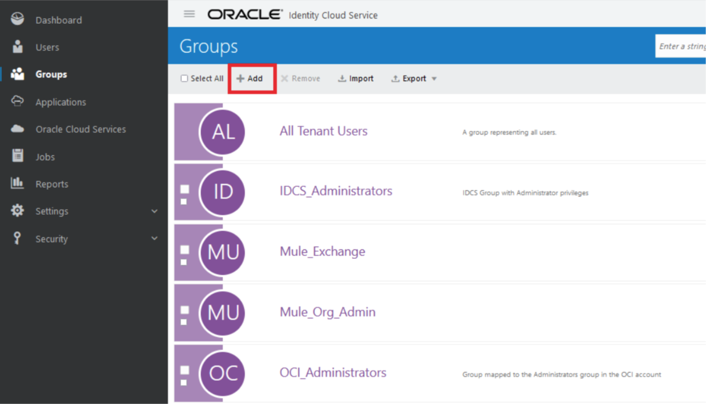

We just need to click on the Add button and create a group:

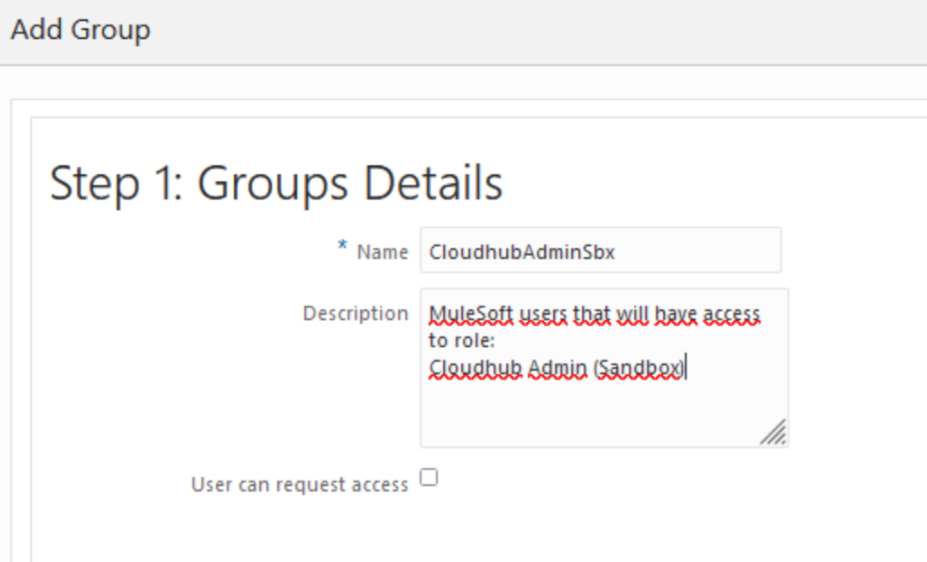

We are naming the user: CloudhubAdminSbx, and giving a brief description. Then click on Next and let’s assign a user:

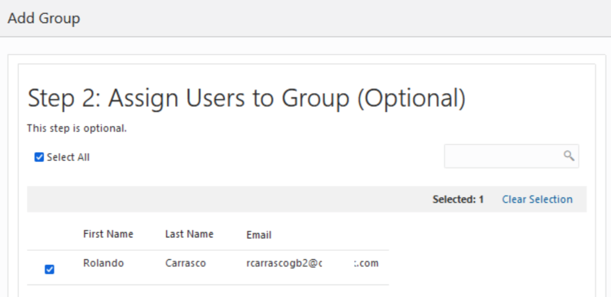

In this case, it is me: [rcarrascogb2@me.com](mailto:rcarrascogb2@me.com). Then just click on Finish.

What we have done is to create a new group (take a note of the name because we will use it later to map it inside MuleSoft Anypoint Platform), and we are assigning a user to it.

Now let’s get back to our Application inside IDCS (the one we configured in our previous article), to map attributes and groups. Let’s do it.

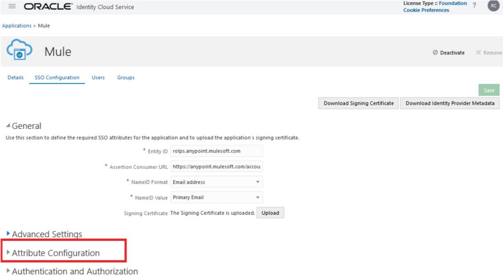

In the Attribute configuration, click on it and you will see something like this:

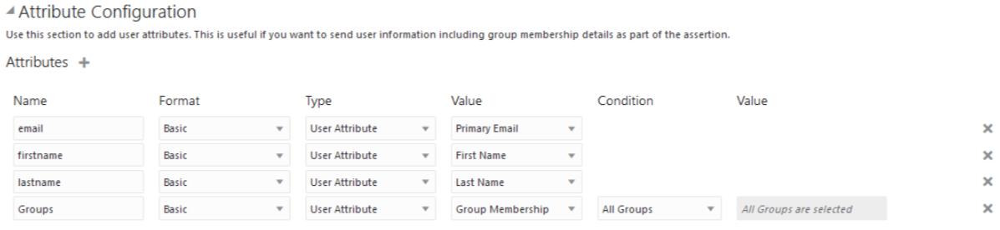

Your table may be empty and you will need to add the needed attributes, in my case:

- email
- firstname
- lastname
- Groups

Those are the attributes that will be sent from IDCS to MuleSoft inside the SAML assertion and MuleSoft will map into its attributes. Take a look at the names, and get back to MuleSoft Anypoint Platform console to the Access Management menu:

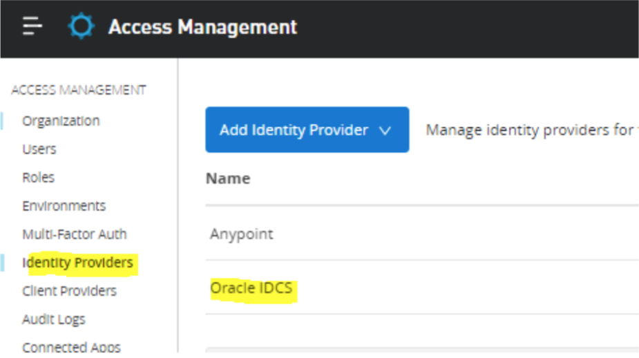

We created this configuration in our previous [article](https://www.prostdev.com/post/anypoint-platform-single-sign-on-sso-saml-configuration-with-oracle-idcs-part-1), click on it. Go almost at the bottom of that page:

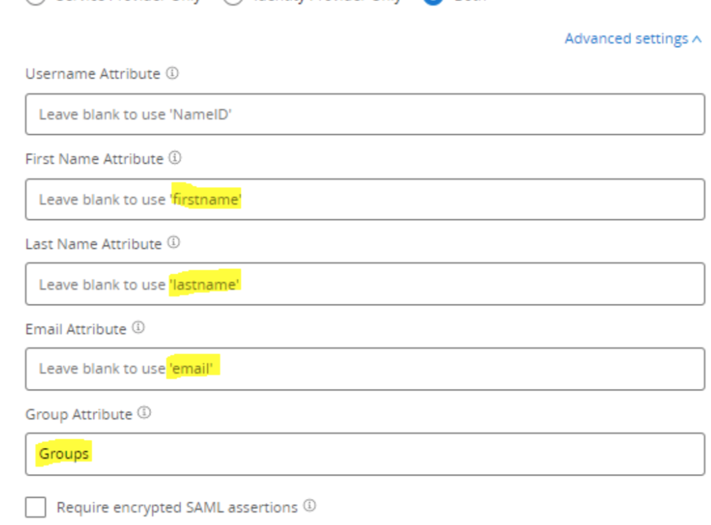

Those names are mapped into MuleSoft and they need to match. In IDCS those fields are going to be filled with the user information. If we zoom in to the configuration at IDCS you will see this:

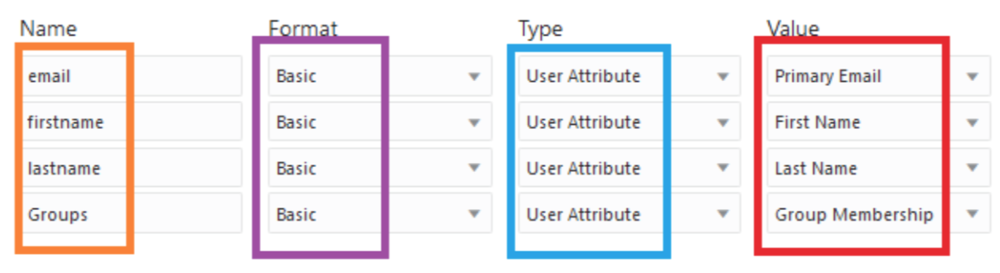

In orange are the attributes that we want to return, in purple are the format in this case basic. In blue is the type of attribute and finally the value that IDCS will populate on them in red. And for the groups in specific we’ve configured it like this:

We are returning all the groups that the user is a member of. We have other options, like:

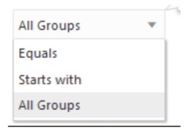

That means that our users can be assigned into multiple IDCS groups, but we can filter them to return just the ones the application needs. For this article, and to be practical, we are returning all of them.

Everything is in place, our user ([rcarrascogb2@me.com](mailto:rcarrascogb2@me.com)) can try to log in to MuleSoft, and not only that will make it through, but at the same type, depending on the list of groups where the user belongs, it will map it into MuleSoft roles.

But the question is: how does MuleSoft know that those group names (which by the way are arbitrary) are getting mapped with their roles? Just go to MuleSoft Anypoint Platform, and go to the Roles section:

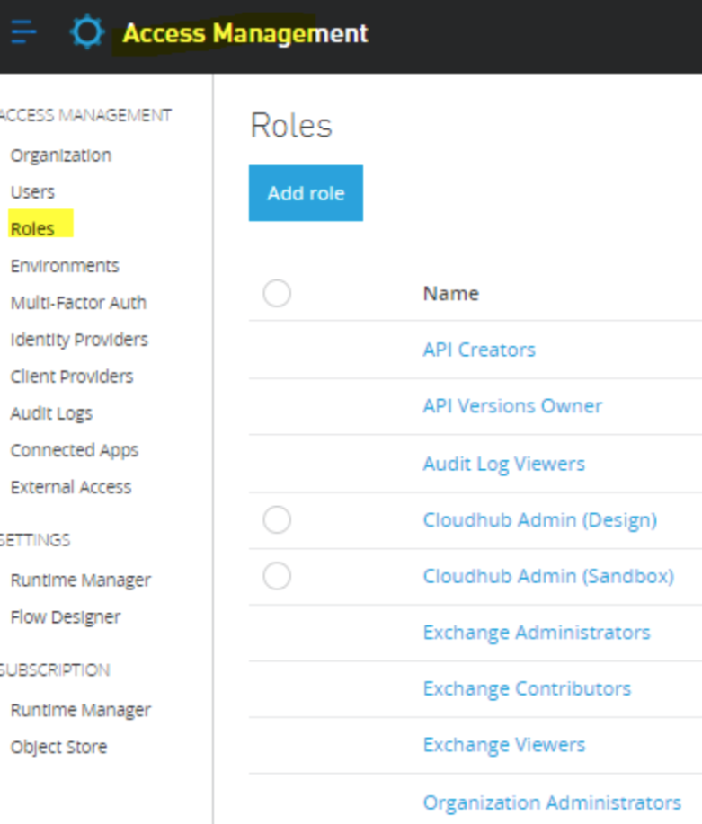

Click on the group Cloud Admin (Sandbox) and you will see this:

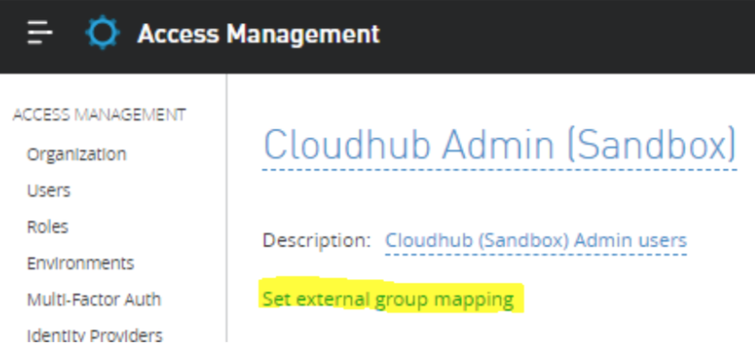

Click on “Set external group mapping”, and you will see this:

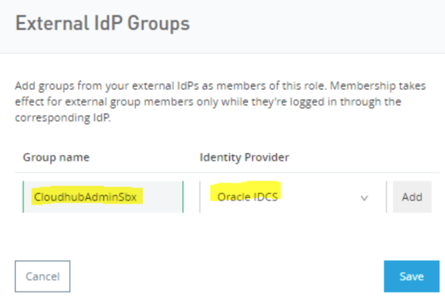

Type the group name that we’ve created at IDCS, choose the Identity Provider, and finally click on the add button.

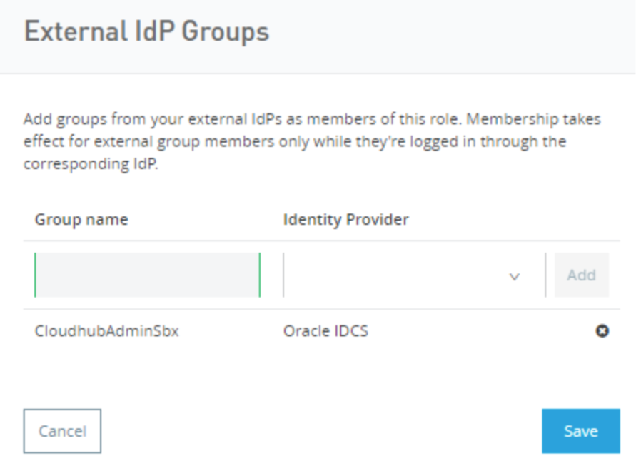

Click on Save.

Before testing it, let’s get back to MuleSoft Anypoint Platform, and review the user information:

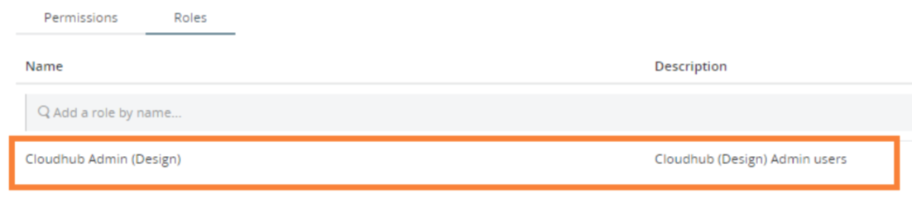

The user has only that role assigned. But now, after his next login, it will have an additional role ([Cloudhub Admin (Sandbox)](https://anypoint.mulesoft.com/accounts/#/cs/core/roles/edit/66151060-bb95-499d-868f-bd4bebbb7c7d/permissions)).

Also, as we saw in our previous article, the user did not have the attributes being mapped:

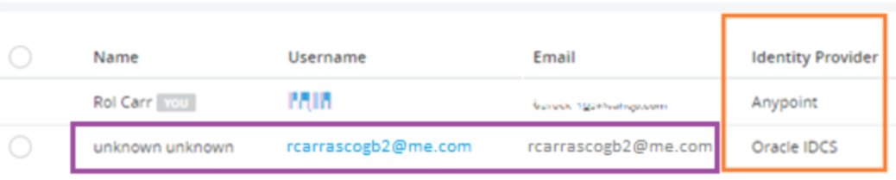

No name (firstname and last name), just the email was mapped. Now the new configuration will populate that information as well as the group.

Let’s see this action, let’s try to log in:

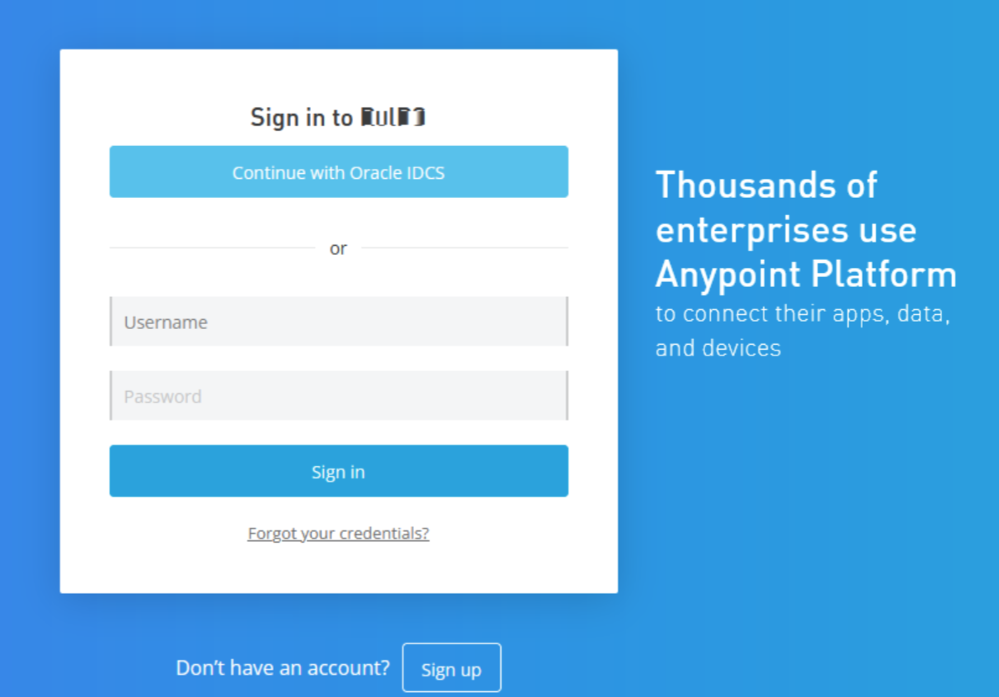

Click on Continue with Oracle IDCS:

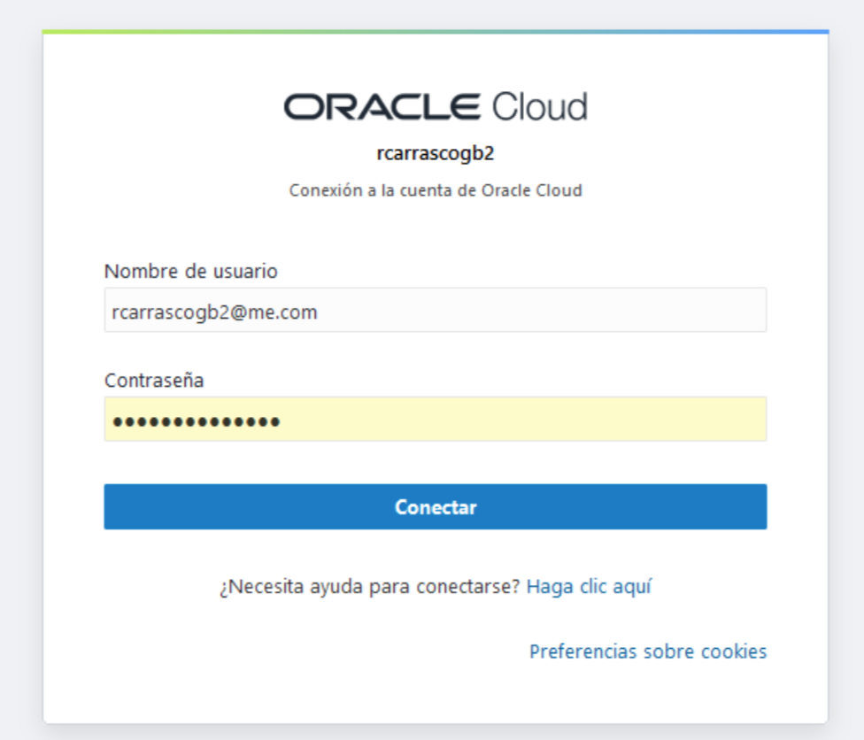

After we click on login, let’s capture the SAML response from IDCS:

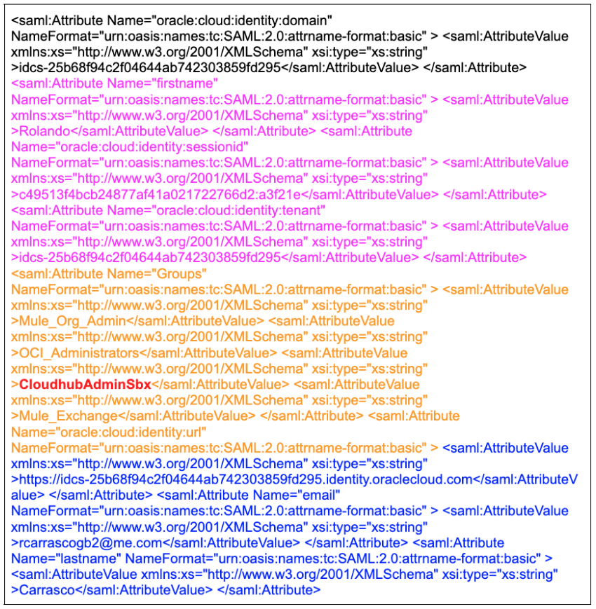

In pink, you can see that the firstname attribute was returned by Oracle IDCS. With orange (and highlighted in red), you can see the list of groups, including the one we created previously. And in blue we also see the lastname and email attributes being returned.

Now, if we go to the Roles section of the user rcarrascogb2@me.com, we will see that the role has been assigned:

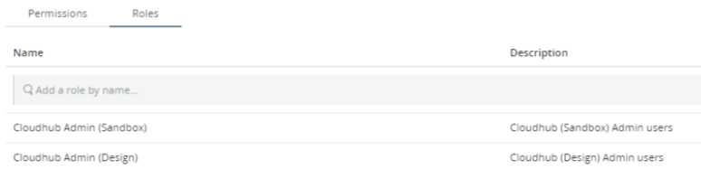

With this, you can provision users into your Identity Provider, assign groups at that level and then map them into MuleSoft.

I hope this is useful for you.
