Are you already using the newest version of Anypoint Studio? If the answer is yes, let me guide you through the coolest features it has. If the answer is no, go ahead and download it [here](https://www.mulesoft.com/lp/dl/studio) to start playing with it!

## New features

Anypoint Studio includes three new features that you will enjoy as a MuleSoft Developer:

- Support for Mule Runtime 4.4.
  - Correlation ID Management.
  - Improved Logging Capabilities.
  - DataWeave Updates (DataWeave 2.4 features!).
  - Mule Tracing Module.
  - Feature Flags.
- DataWeave 2.4. Including language improvements and new modules.
  - Read larger-than-memory strings automatically.
  - New modules, functions, types, annotations, and variables.
  - Helper functions for handling null values.
- “Referenced by” function. Now you can see a list of all flow references to a particular flow/subflow and you also can jump there with a few clicks.

If you are interested in learning more about Mule 4.4 new features, you will find all the details [here](https://docs.mulesoft.com/mule-runtime/4.4/whats-new-in-mule). Also, if you are an amazing DataWeave programmer, it’s a good idea to take a look at the [docs](https://docs.mulesoft.com/dataweave/2.4/whats-new-in-dw).

As soon as you start your Anypoint Studio installation, you will see the following:

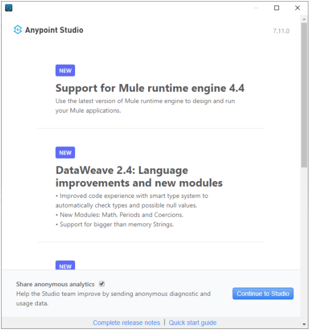

## Support for Mule 4.4

In this new version of Studio, you will have available the newest version of the Mule Runtime (4.4). When you create a new project just select Mule Server 4.4.0 EE and start enjoying the new features:

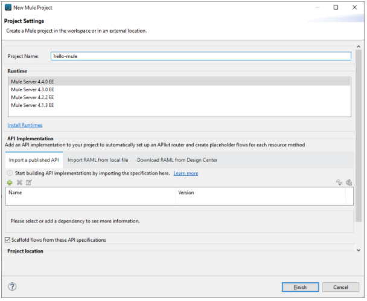

As you can notice you are using the Mule 4.4 version. You will find it everywhere in your project (`pom.xml` file, dependencies, and so on).

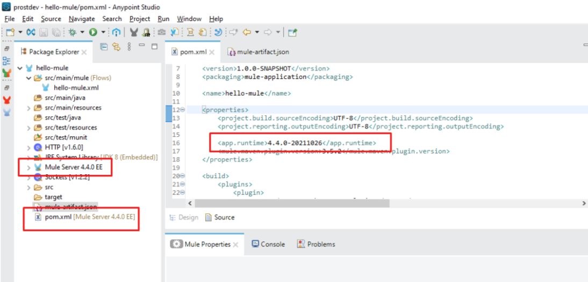

You will also find this version within the `mule-artifact.json` file:

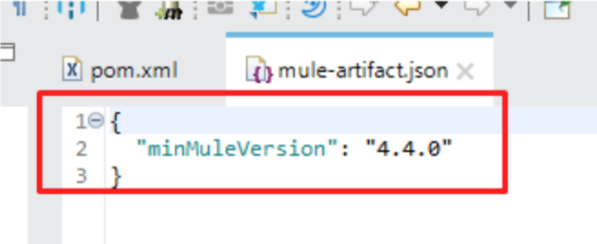

The new Tracing Module is already in the Mule Palette:

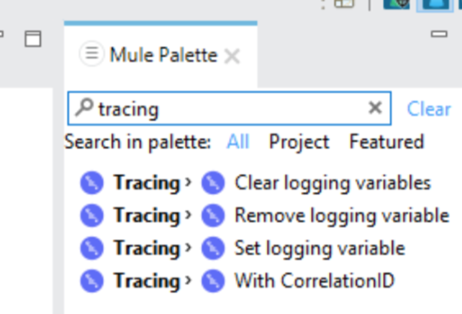

## DataWeave 2.4

There are various new DataWeave features, modules, and functions. Let’s try some of them.

### onNull function

The onNull function executes a callback function if the preceding expression returns a null value and then replaces the null value with the result of the callback.

In the following DataWeave script, we are concatenating ‘Hello’ with the content of the payload. But, what happens if the payload has a null value? We’ll receive an error like this:

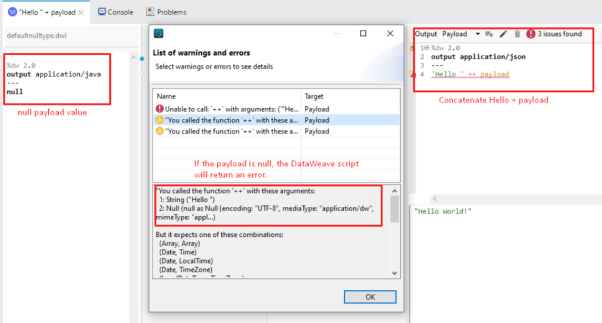

If we fix the input payload value, then the DataWeave script will return the expected (concatenated) value:

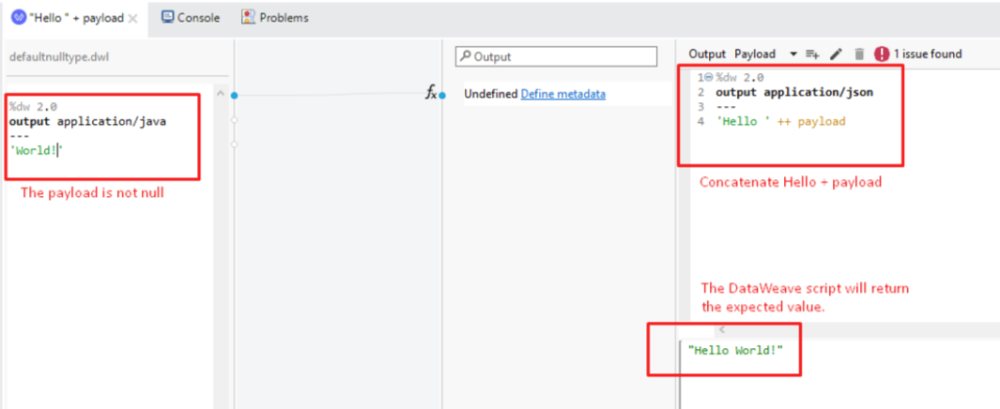

How can we avoid this type of error using DataWeave and particularly the onNull function?

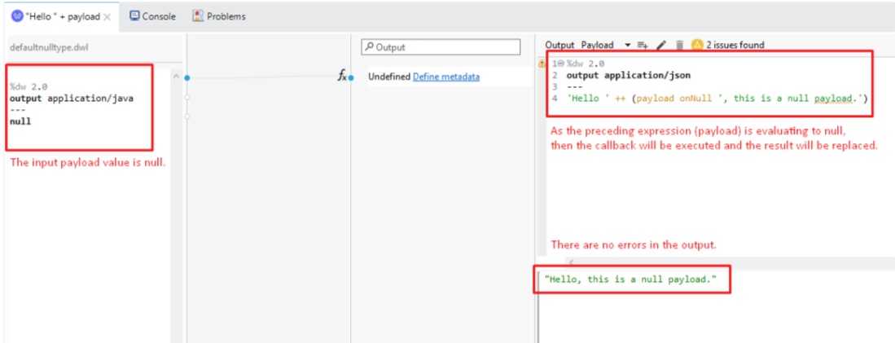

### hammingDistance function

Let’s try another new function that caught my attention: hammingDistance. According to Wikipedia, in information theory, the Hamming distance between two strings of equal length is the number of positions at which the corresponding symbols are different. Let me explain this with an example:

We have two strings:

- String 1 = 11011001
- String 2 = 10011101

Both strings have eight characters of length and they are different only at positions 2 and 5. So they have two positions at which their characters are different, then the result of the hamming distance should be 2.

We can confirm this using the DataWeave function. Notice that the hamming distance function is within the Strings module, so it must be imported explicitly in your DataWeave script.

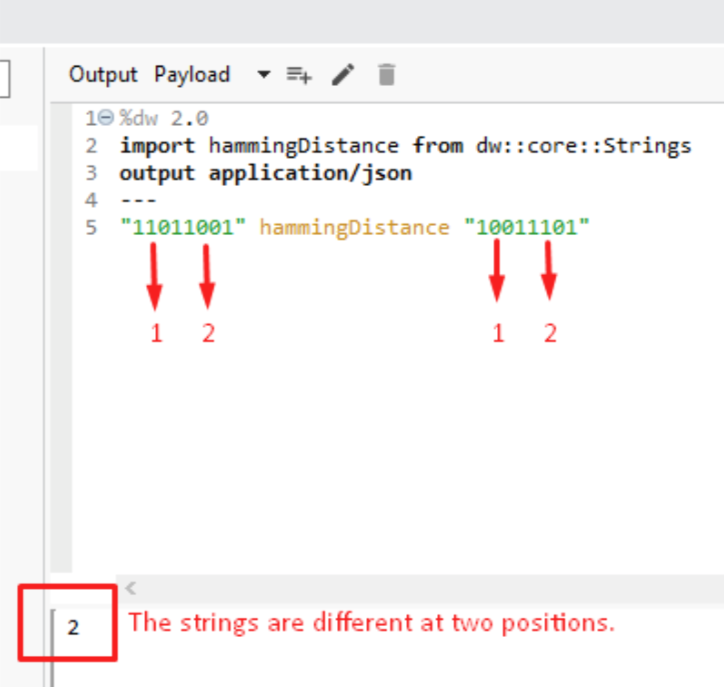

Those are only two of the new functions that were included in DataWeave 2.4. Please explore the docs and enjoy all the new features, modules, and functions.

## “Referenced by” function

Finally, let’s review this new feature called “referenced by”. This could be useful when you have multiple configuration files within a complex Mule application and you want to jump to the flows that are referencing a particular flow or subflow.

The only thing you need to do is right-click on the flow (or subflow) you are currently working on and then select the “Referenced by” option (Ctrl+Shift+G).

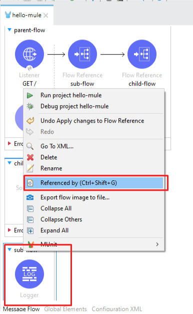

The result will be a list of flows that are referencing that particular flow and then you can jump to any of them.

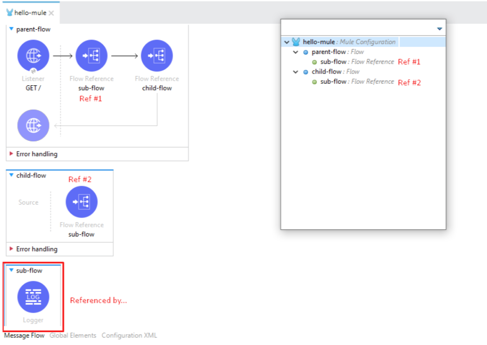

When you double-click over the reference, automatically you will be positioned on that particular flow reference:

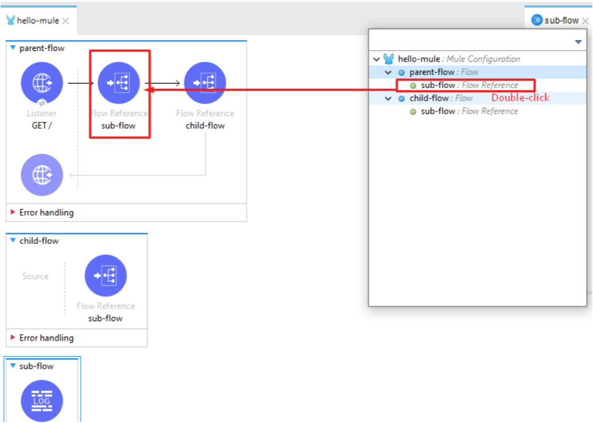

It is cool, isn't it?

Now you have explored the newest version of Anypoint Studio, please let us know what do you think? What are the new things you found on it? And… happy coding!
