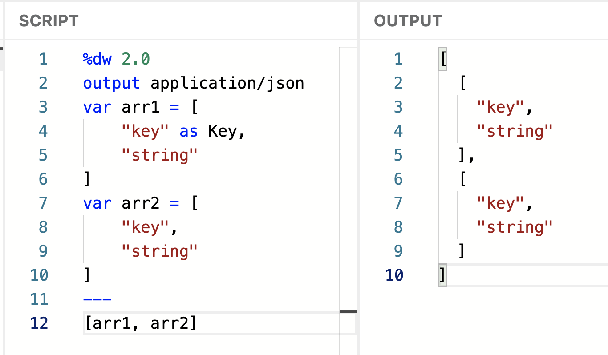
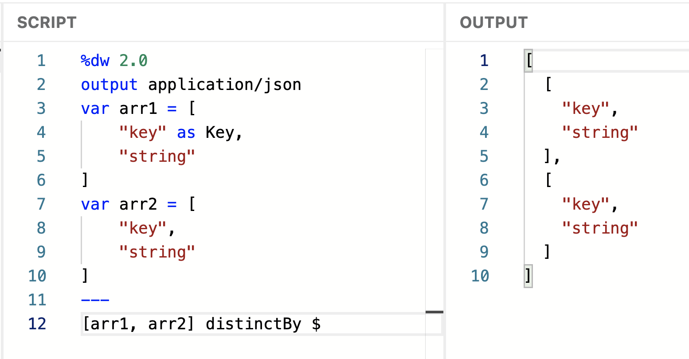
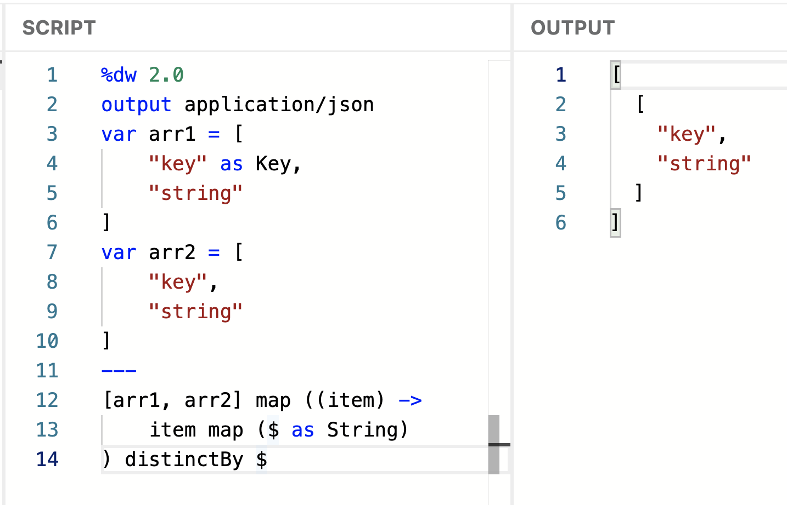
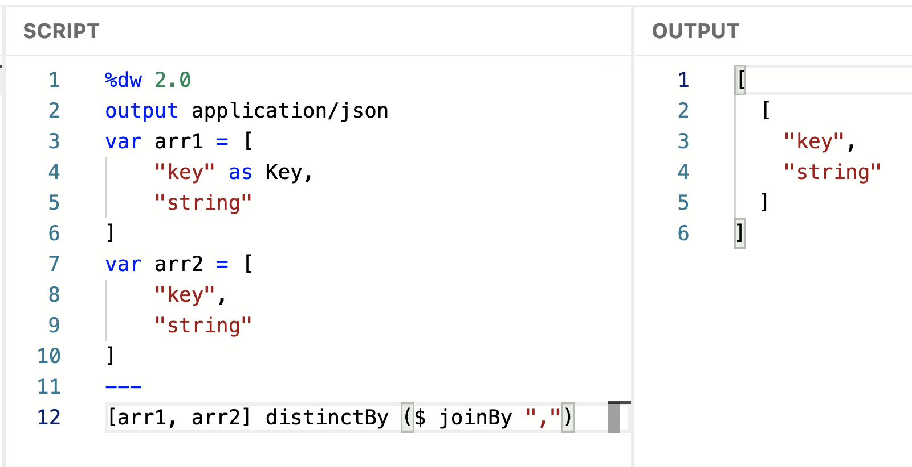

## The Problem

Ok so here's what was happening to me and I didn't know why.

I was doing a bunch of transformations and at one point I'd add some keys and/or values into an array. So, some of the arrays were of type Array&lt;String> (because no key was added here) while some of them where Array&lt;Key | String>

I didn't think much about it at first, since I would -incorrectly- see all the arrays in the JSON output were of type Array&lt;String>. Like this:

> [!NOTE]
> The item in line 4 was coerced into a Key for demonstration purposes.

So imagine my surprise when I tried to use a [distinctBy](https://docs.mulesoft.com/dataweave/latest/dw-core-functions-distinctby) function with the above arrays and I'd still get the same two arrays in the output.

I started losing my mind trying to troubleshoot the problem a million different ways because I didn't notice the items in the arrays were of different types!

It was until one of those million times finally led me to see the array types were actually different 🤦

## Possible Solutions

### Solution 1

There are different solutions for this problem. One would be to make sure any new items are of type String and not Key. This completely removes the issue since now you'd be comparing two arrays of type Array&lt;String>, which correctly returns only one array in the output.

### Solution 2

If you can't change the type of the items or it would take too many iterations to do, another thing you can do is to transform the items inside the [distinctBy](https://docs.mulesoft.com/dataweave/latest/dw-core-functions-distinctby) function itself. Like this:

Since we're using the [joinBy](https://docs.mulesoft.com/dataweave/latest/dw-core-functions-joinby) function, we're transforming the values of arr1 and arr2 into concatenated strings and THEN comparing them. Both arr1 and arr2 would be "key,string", which makes these values the same.

I hope this post brings you more DataWeave knowledge or helps you fix some code :D

Subscribe to receive notifications as soon as new content is published ✨

💬 Prost! 🍻
