*GitHub repository with the Mule project can be found at the end of the post.*

If we think about data storage the first thing that comes to our mind is a regular database, this can be any of the most popular ones like Mysql, SQL Server, Postgres, Vertica, etc. But I noticed not too many have interacted with one of the services Google provides with the same purpose **Google BigQuery.** And maybe it is because of the [pricing](https://cloud.google.com/bigquery/pricing?utm_source=google&utm_medium=cpc&utm_campaign=na-US-all-en-dr-bkws-all-all-trial-e-dr-1011347&utm_content=text-ad-none-any-DEV_c-CRE_573148306951-ADGP_Desk%20%7C%20BKWS%20-%20EXA%20%7C%20Txt%20~%20Data%20Analytics%20~%20BigQuery_Pricing%20Google%20Google-KWID_43700068582852990-kwd-166600832170&utm_term=KW_google%20bigquery%20pricing-ST_google%20bigquery%20pricing&gclsrc=aw.ds&gclid=Cj0KCQiAjJOQBhCkARIsAEKMtO3fCohKU2ihxQrQ21u9XixqWhXy9w7QNu8MqGaVp58zn59WTN0ekA4aAtAeEALw_wcB), but in the end, many companies are moving to cloud services and this service seems to be a great fit for them.

In this post, I would like to demonstrate in a few steps how we can make a sync job that allows us to describe a Salesforce instance and use a few objects to create a full schema of those objects (tables) into a Google Big Query Dataset. Then with the schema created we should be able to push some data into BigQuery from Salesforce and see it in our Google Cloud Console project.

## Prerequisites

To connect to Salesforce and Google BigQuery, there are a few prerequisites we need.

**Salesforce:**

- If you don’t have a salesforce instance, you can create a developer one [here](https://developer.salesforce.com/signup).
- From the Salesforce side, you will need a **username, password,** and **security token** (you can follow [this process](https://help.salesforce.com/s/articleView?id=sf.user_security_token.htm&type=5) to get it).
- A developer instance contains a few records, but if you need to have some more data, this will help the process to sync that information over.

**GCP (Google Cloud Platform)**

- You can sign up [here](https://console.cloud.google.com/freetrial/signup/tos?_ga=2.68094097.1640278748.1644510554-1516430238.1644510554&_gac=1.218077796.1644510554.Cj0KCQiAjJOQBhCkARIsAEKMtO0NyXkbcz86jMGZOta5V7HYUNkiDHCDR_6OSc4ioZFtAHlp0tw8_JUaAnI7EALw_wcB) for free. Google gives you $300 for 90 days to test the product (similar to Azure). If you already have a Google account, you can use it for this.

## Creating a new project in GCP and setting up our service account key

Once you sign up for your account on GCP, you should be able to click on the New Project option and write a project name, in this example I chose **mulesoft.**

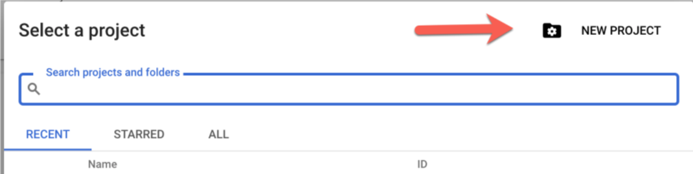

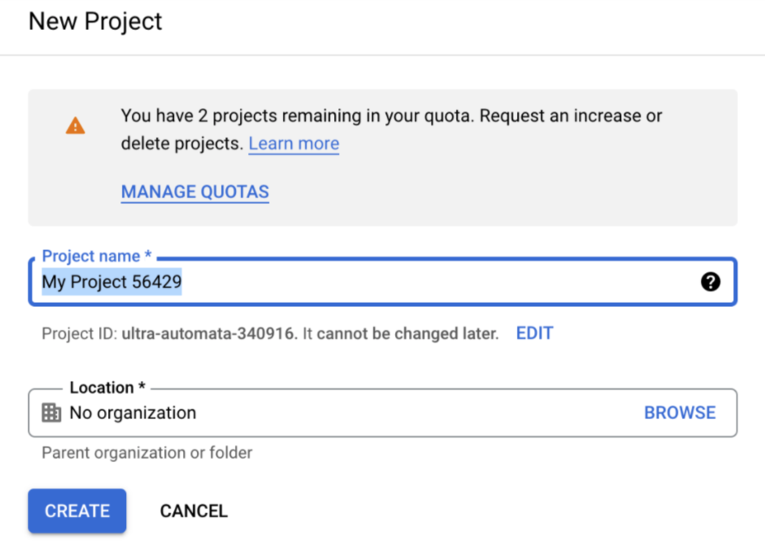

Once a project is created we should be able to go to the menu on the left and we should be able to select IAM & Admin > Service Accounts option.

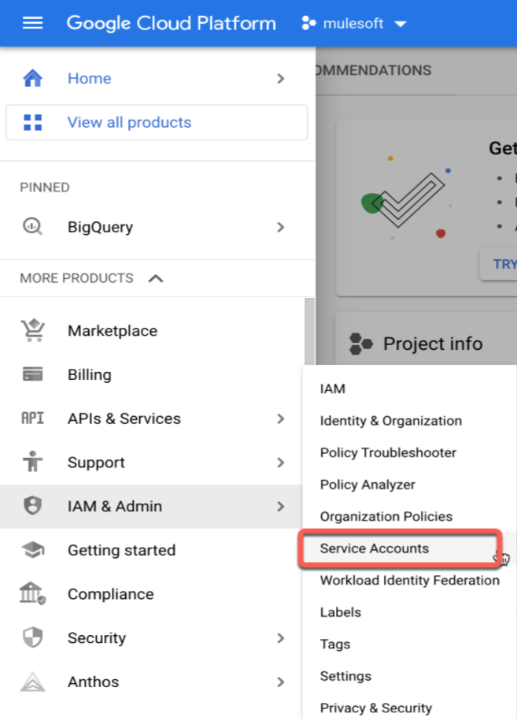

Now, we should be able to create our service account.

“A **service account** is a special type of Google account intended to represent a non-human user that needs to authenticate and be authorized to access data in Google APIs. Typically, service accounts are used in scenarios such as Running workloads on virtual machines.”

At the top of the page, you should be able to see the option to create it. Then, you just need to specify a Name and click on create and continue.

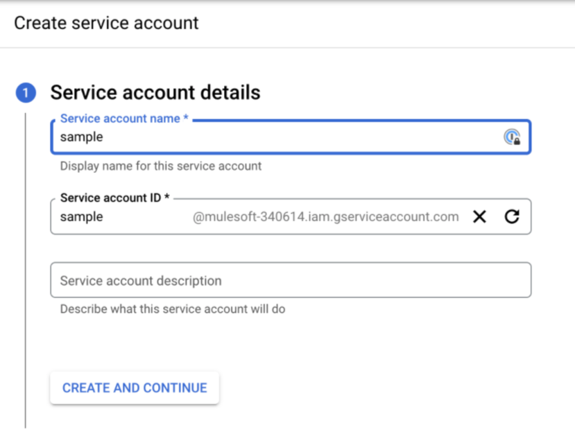

The next step is to set the permissions, so for this, we need to select from the roles combo BigQuery Admin.

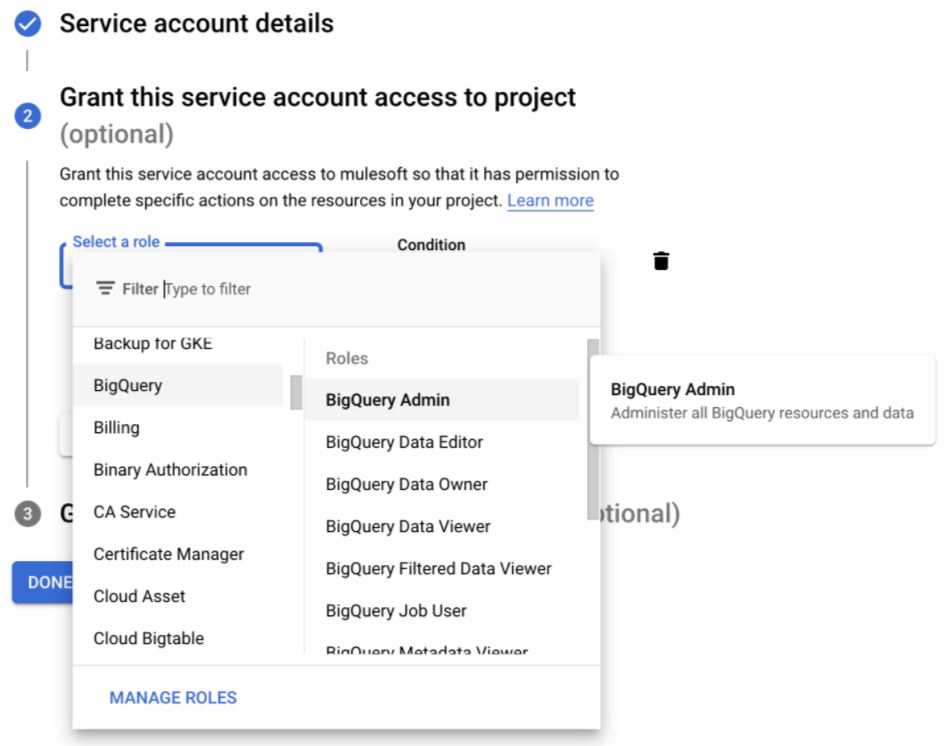

Once created, we should be able to select from the three-dot menu on the right the option **Manage Keys.**

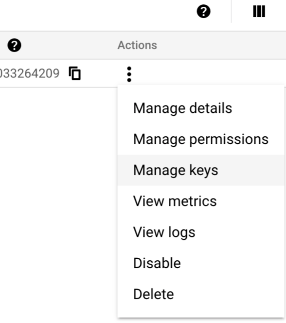

Then we can create a new Key, in this case, one as JSON should be enough. The key will get downloaded automatically to your computer (**please keep this JSON key somewhere you can use it later**).

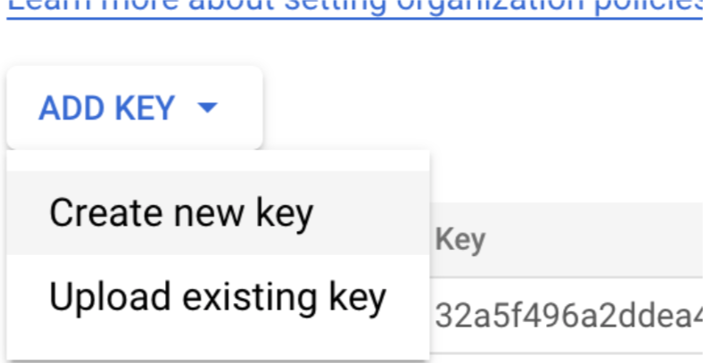

### Dataset in Big Query

Datasets are top-level containers that are used to organize and control access to your tables and views. A table or view must belong to a dataset, so you need to create at least one dataset before loading data into BigQuery.

From the left menu, we can search for BigQuery and click on it.

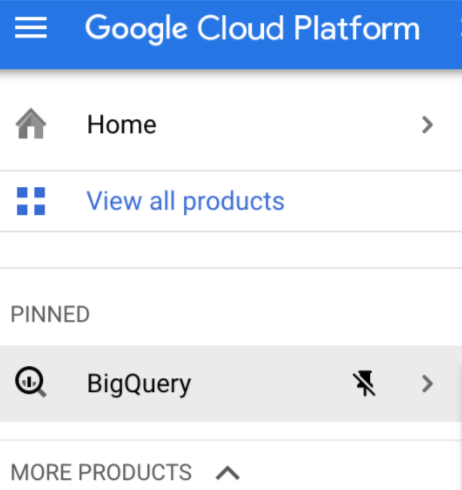

That will take us to the BigQuery console. Now we can click on the three-dots menu and select the **Create dataset** option.

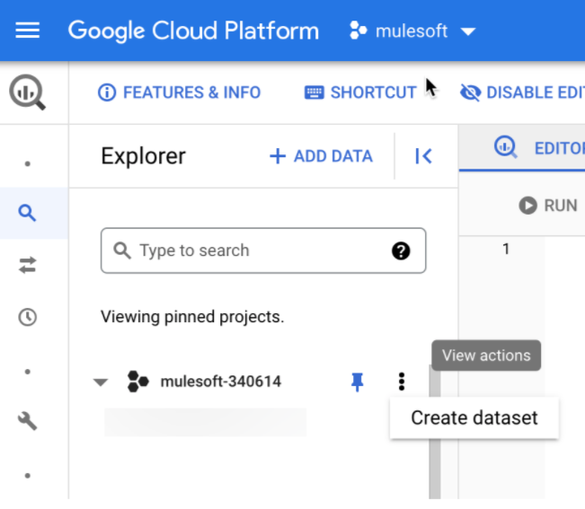

Now we just need to set the name as salesforce and click on “Create Dataset.”

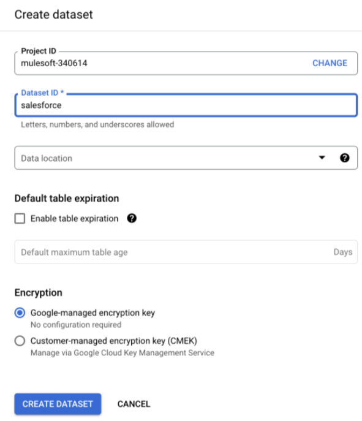

## Setting up our Mule application

Since this is a sync job, we don’t need any API specification but totally can fit some scenarios where we have another application that needs to consume specific endpoints/operations.

Let’s then open our Anypoint Studio app (In my case I’m using a mac) and let’s use the default template. For this we are going to create six flows:

- **Sync**. This flow just triggers the process.
- **DescribeInstance.** This flow will be in charge of calling the describe operation using the Salesforce connector and provide all objects information from the Salesforce instance, also will have a loop that will allow us to process the job for the objects we are going to use.
- **DescribeIndividualSalesforceObject.** Allows to describe a specific Salesforce object, this will basically will capture the fields and field types (STRING, EMAIL, ID, REFERENCE, etc.) and will be in charge to create a payload that BigQuery will recognize in order to get created in GBQ
- **BigQueryCreateTable.** This flow only will be in charge of creating the table in BigQuery based on the Salesforce object name and the fields.
- **QuerySalesforceObject.** This flow dynamically will query the Salesforce object and pull the data. (*For this we are limiting the output to 100 records but on a bigger scale it should be done on a batch process of course.*)
- **InsertDataIntoBigQuery**. This flow will push the data over into BigQuery only.

> [!NOTE]
> I will go over in detail each of the flows in the next sections.

Now let’s grab our JSON key generated by google and copy the file under the `src/main/resources` folder. The key will let us authenticate against our project and execute the operations.

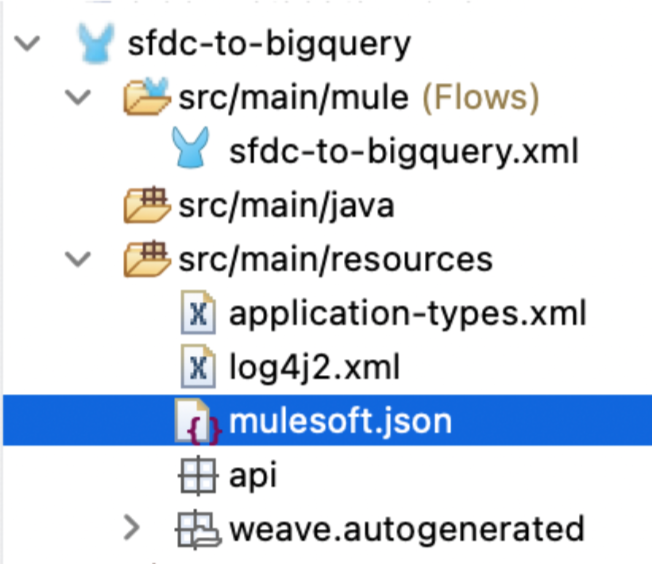

### Import the Google Big Query connector

From Exchange, we can search “BigQuery” and we should be able to see the connector listed.

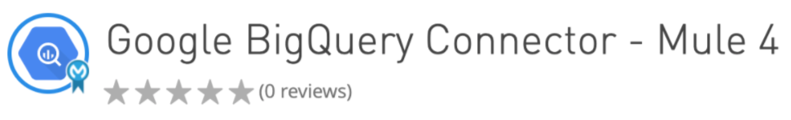

Then, we can just use the “Add to project” option and we should be able to see the operations in the Mule Palette.

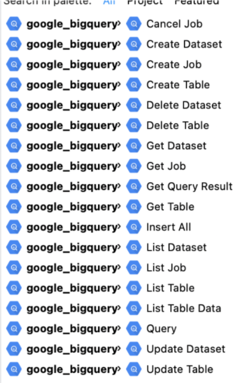

### Sync Flow

As I mentioned, this is only in charge of triggering the whole application, so we only need one scheduler component and a flow reference to the DescribeInstance flow.

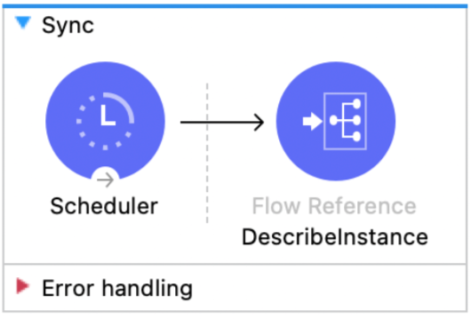

### DescribeInstance

This flow will describe the whole Salesforce instance using the [Describe Global](https://developer.salesforce.com/docs/atlas.en-us.208.0.api_rest.meta/api_rest/resources_describeGlobal.htm) operation. The next step on this is to use a DataWeave transform to get only the Objects we are interested in. So in this case, I’m only pulling three: Accounts, Contacts, and a custom object called `Project__c`. I left in the transformation a few more attributes to only pull the objects that we can query.

```dataweave
payload.sobjects filter (	$.queryable == true and 
							$.replicateable == true and 
							$.retrieveable == true and 
							$.searchable == true and 
							$.triggerable == true and
							($.name == "Account" or 
							 $.name == "Contact" or
							 $.name =="Project__c")) map $
```

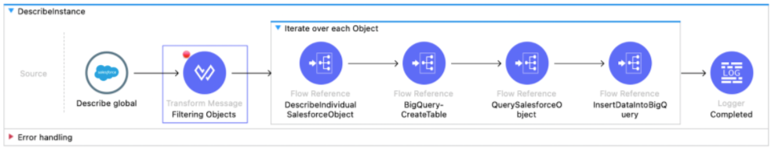

Finally, you need to loop over these three objects and there’s a flow reference for this sample that will call the other flows to be able to continue the process.

### DescribeIndividualSalesforceObject

This flow takes the name of the Salesforce Object and will allow it to describe it. The connector only asks for the object name, so we have a pretty interesting DW Transformation.

```dataweave
%dw 2.0
input payload application/java
output application/java
fun validateField(field) = if ( (field == "REFERENCE") 
                                or (field == "ID") or 
                                (field == "PICKLIST")  or 
                                (field == "TEXTAREA") or
                                (field == "ADDRESS")or
                                (field == "EMAIL")or
                                (field == "PHONE") or
                                (field == "URL")) 
                                "STRING" 
                                else  
                                if ( (field == "DOUBLE") or
                                	 (field == "CURRENCY")
                                ) 
                                "FLOAT" 
                                else 
                                if ((field == "INT")) 
                                "INTEGER" 
                                else field
---
(payload.fields filter ($."type" != "LOCATION") map {
   fieldName : $.name,
   fieldType : validateField($."type")
})
```

Salesforce data types are not 100% the same as BigQuery, so we need to make a little trick to be able to create the schema in BigQuery seamlessly as Salesforce. In this case, I’ve created a small function to convert some fields (like ID, REFERENCE, TEXTAREA, PHONE, ADDRESS, PICKLIST, EMAIL) to be STRING. In this case, the reference or values are not really anything else than a text. For DOUBLE and CURRENCY, I’m using the value FLOAT. Finally, for INT fields are changed to be INTEGER.

Because **Location** fields are a bit tricky and we are not able to make much with the API on them, I’m removing all location fields.

The output of this is the actual schema we will use to create the table in Google BigQuery.

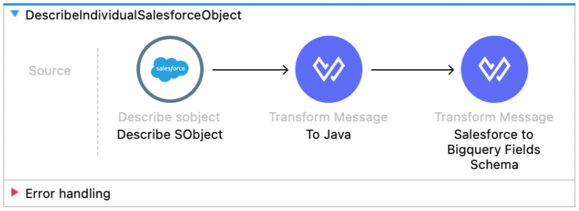

### BigQueryCreateTable

This flow allows us to create the table in BigQuery; we only need to specify Table, Dataset, and Table Fields.

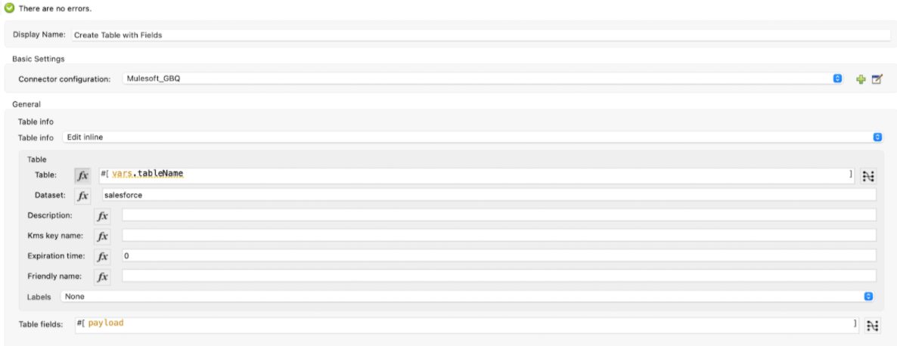

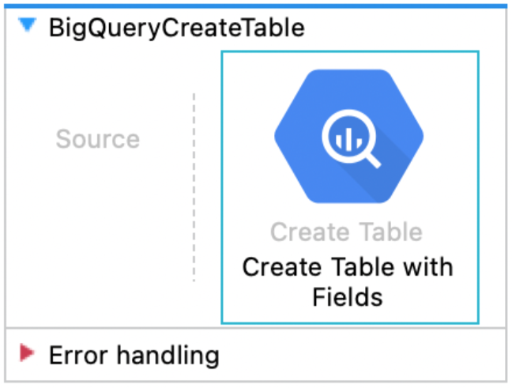

### QuerySalesforceObject

This flow queries the Object in Salesforce and then maps the data dynamically to prepare the payload for BigQuery.

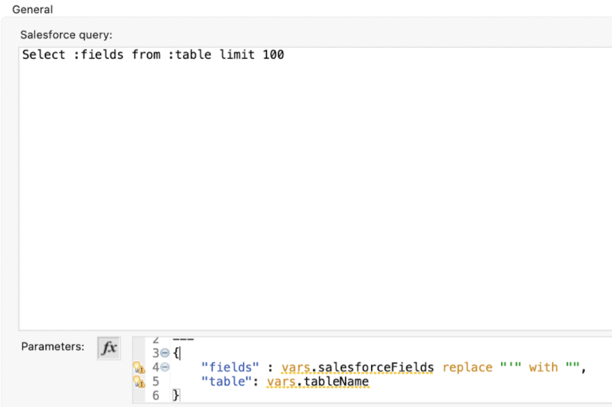

The query comes from a variable “salesforceFields” the same field we collected when we described the Object using this script:

```dataweave
(payload.fields filter ($."type" != "LOCATION") map {
   fieldName : $.name
}).fieldName joinBy ","
```

And finally, I’m limiting the result to only 100 records.

The next step is to map the Salesforce result data and map it dynamically using this script:

```dataweave
%dw 2.0
import try, fail from dw::Runtime
output application/java


fun isDate(value: Any): Boolean = try(() -> value as Date).success
fun getDate(value: Any): Date | Null | Any = ( if ( isDate(value) ) value 
            as Date as String else value )

---
(payload map (item,index) ->{
    (item mapObject ((value, key, index) -> {
        (key):(getDate(value))
    } ))
}) 
```

Thanks so much to Alex Martinez for the insights on the utilities for DW 2.0! ([https://github.com/alexandramartinez/DataWeave-scripts/blob/main/utilities/utilities.dwl](https://github.com/alexandramartinez/DataWeave-scripts/blob/main/utilities/utilities.dwl))

This last script maps the records and uses the key as field and the value, but the value needs to be replaced as Date in this case for the Strings that are date or date-time. So I consider this the best script in this app.

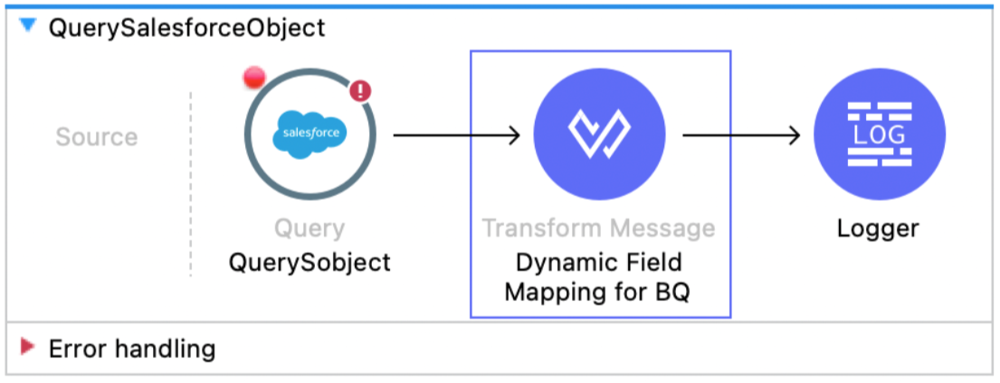

### InsertDataIntoBigQuery

This flow just inserts the data we prepared, so basically, we only need to specify table id, dataset id, and the Row Data.

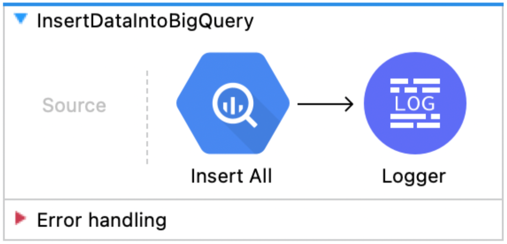

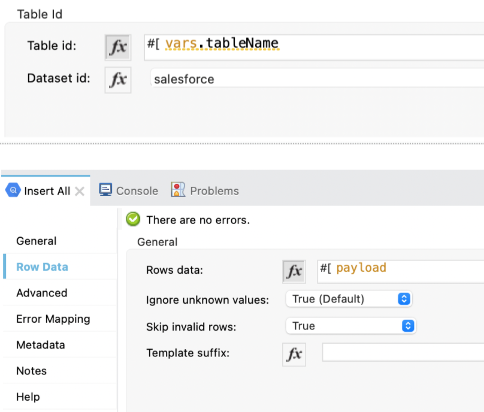

## Setting up our Mule application

Now we should be able to run our application and see the new tables and the data over Google BigQuery.

On GCP, I can see the tables I selected being created:

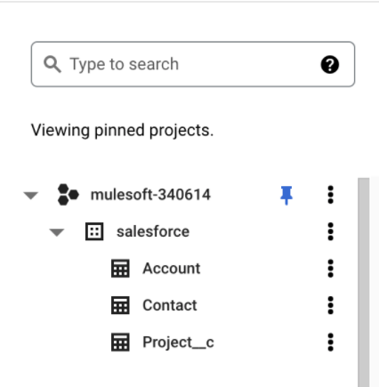

And if we open any of them we should look into the schema to verify all fields are there.

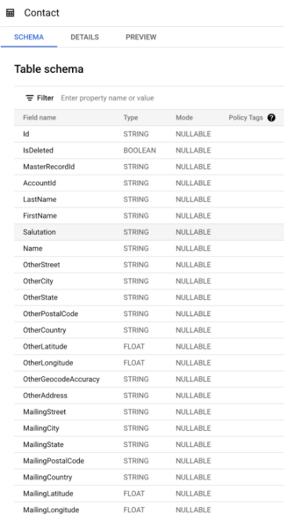

Finally, we should be able to query the table in the console or click on the Preview option to check the data is there.

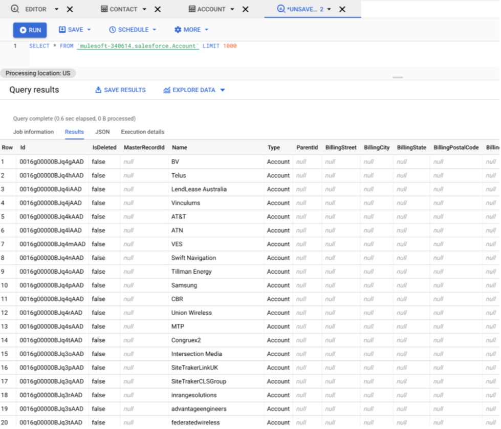

I think this is kind of a common request we get on the integration space and many tweaks can be implemented if we are thinking of big migrations or setting some jobs that eventually will require tables to be created automatically from Salesforce to GCP.

## GitHub repository

If you’d like to try it, I created this [GitHub](https://github.com/emoran/sfdc-to-bigquery) repository. I hope this was useful and I’m open to hearing any enhancement/scenario.
