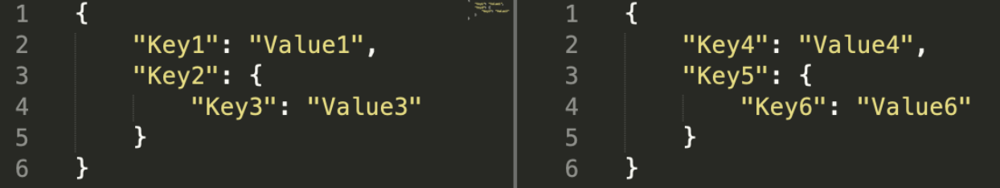
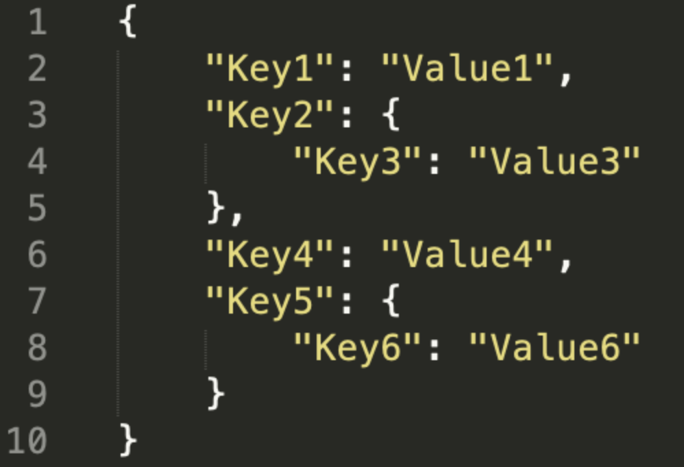
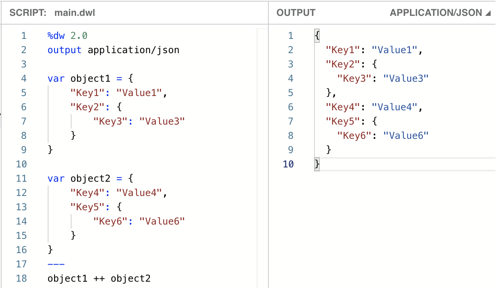
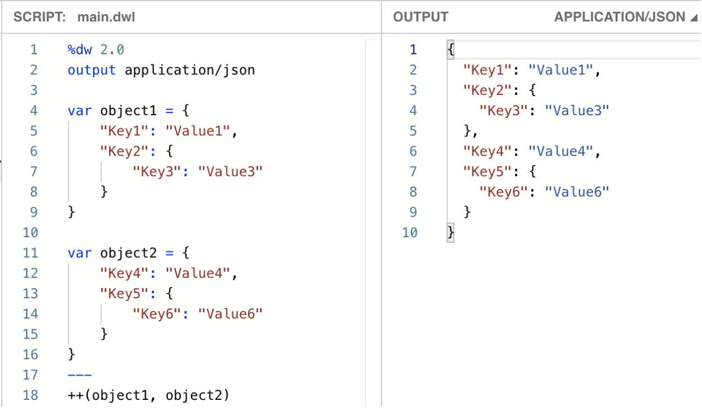
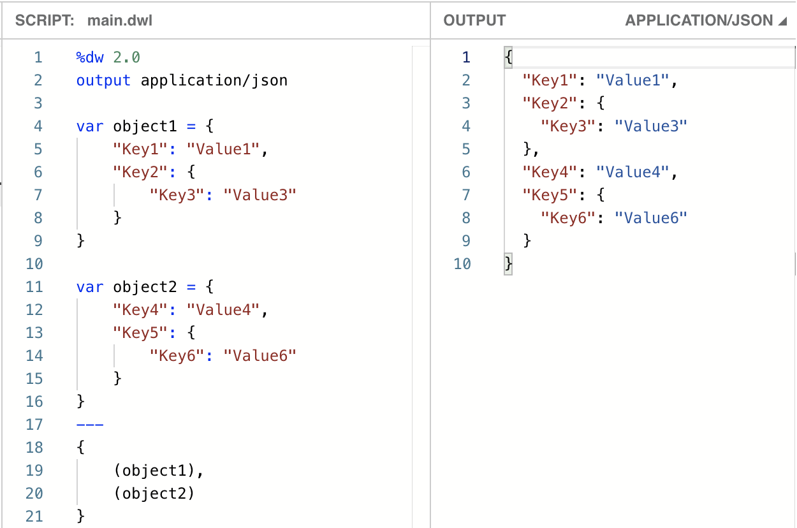
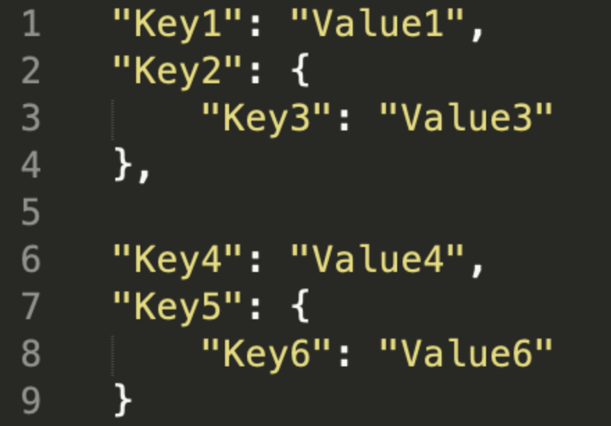
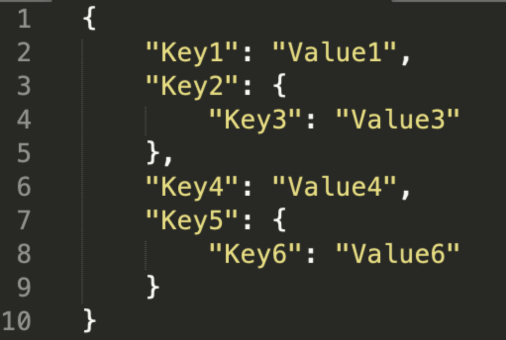
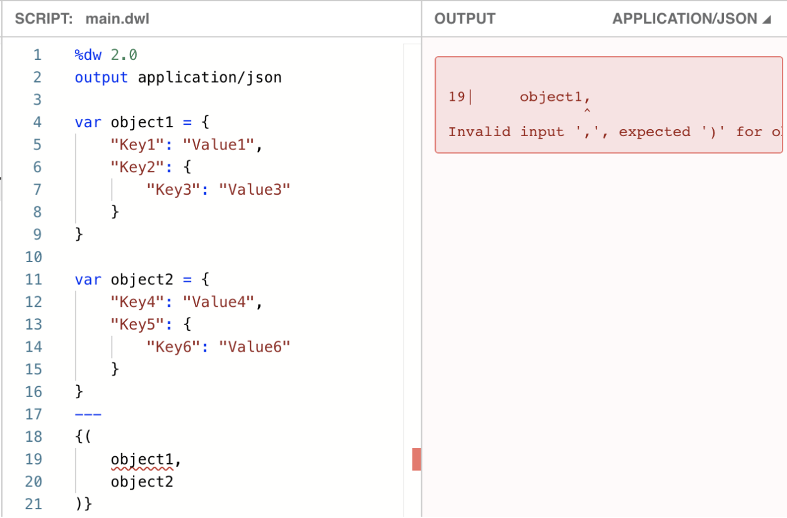

In this post, I will explain what object concatenation is and how to utilize it.

You may be familiar with other language’s concatenation functions, especially when using two strings. For example:

```
“Hello”.concat(“ World!”);
“Hello” + “ World!”;
print(“Hello”, “ World!”)
Concatenate ‘string “Hello” “ World!”
```

This can also be achieved in DataWeave with the ++ function.

```dataweave
“Hello” ++ “ World”
```

But, can this also be used for objects? Keep reading to find out!

## What is object concatenation?

When I say “object concatenation”, I mean the action of combining 2 different objects, and creating one single object containing all the fields (or keys) and values of these objects.

For example, we have these 2 JSON objects:



And we want to achieve this:



In the end, we have a single object, that contains everything that the other 2 objects had. This is object concatenation.

## Object concatenation using ++

The most commonly used way to achieve object concatenation in DataWeave, is the ++ function.

The previous operation, using DW, would look something like this:



You can see why this is one of the favourites. It’s easy to read and understand. It is very intuitive as well (object1 plus object2).

There is another syntax to do the same thing:



In this syntax, you are writing the function first, and then positioning the first and second arguments inside parentheses, separated by a comma. Either way is correct; it just depends on what you are used to or what is the standard practice in your project. Both parentheses and ++ do the same thing.

## Object concatenation using &#123;( )&#125;

This syntax can be cleaner to see in code, but it can also be a bit confusing for new developers if they’re not familiar with the use of &#123;( )&#125;.



I’m sure you’re wondering how this works, if you haven’t seen this syntax before.

When there are parentheses ( ) inside curly brackets &#123; &#125;, the parentheses become object destructors. The object in question is separated into pairs of keys and values, and these are then added to the new object that’s being created by the outer curly brackets &#123; &#125;.

This transformation would go like this:

Step 1: destroy object1 and object2 into their key/value pairs



Step 2: create a new object that contains all these key/value pairs.



I bet now that you understand how it works, you want to change all your old transformations from using ++ to using &#123;( )&#125;. At least that was my first reaction ;)

## Object concatenation using &#123;( [ ] )&#125;

In case you’re not familiar with DataWeave syntax, you can create an array of any type of data, using square brackets [ ]. For example, to create an array of numbers, you’d write it like this: [1, 2, 3, 4, 5].

“Wait, what? Why would I use arrays if I can just use parentheses for my object destructors?” Just hear me out… isn’t it a bit annoying to have to add parentheses for each of the objects? Sometimes I forget to add them and I end up with syntax errors, because you can’t just do this:



Turns out that the parentheses destructors not only destroy an object into key/value pairs, they also destroy arrays containing objects! Whaaat?

You can do something like this:

![DataWeave script using the {([ object1, object2 ])} array destructor syntax with successful merged output](../../assets/blog/combining-objects-concatenation-in-dw-2-0-9.png)

See? Now you can list your objects inside an array (using square brackets [ ]) and then use the object destructor &#123;( )&#125; on that array.

Yes, this is the most complex syntax out of the 3 that we saw today. It can be quite confusing for new developers, and you may have to write this explanation out in your internal project’s documentation (if you don’t want to keep repeating the same thing every time you get a new resource).

Lucky for you, you can send them the link to this post!

In summary, **there are three options** to concatenate objects in DataWeave.

1. You can use the most popular choice by Muleys

```dataweave
object1 ++ object2
++(object1, object2)
```

2. You can opt for a cleaner, but less known option, using the object destructor:

```dataweave
{
    (object1),
    (object2)
}
```

3. Or, the most complex one, but without having to surround each object in parentheses:

```dataweave
{([
    object1,
    object2
])}
```

Do you know of any more ways to achieve the same output? Leave me a comment and let me know!

Stay safe, get a beer, and *Prost*!

-Alex

## More links

- [DW Core Functions - PlusPlus](https://docs.mulesoft.com/mule-runtime/4.3/dw-core-functions-plusplus)
- [Gist from Alex Martinez - DW 2.0 Cheatsheet](https://gist.github.com/alexandramartinez/f7037eaf970fb02a04017657cd18b8ad)

## Videos

- [Getting to the point (under 30 seconds)](/video/3-ways-concatenate-objects-dataweave)
- [Complete explanation](https://youtu.be/4OGSdpmtR-s)
