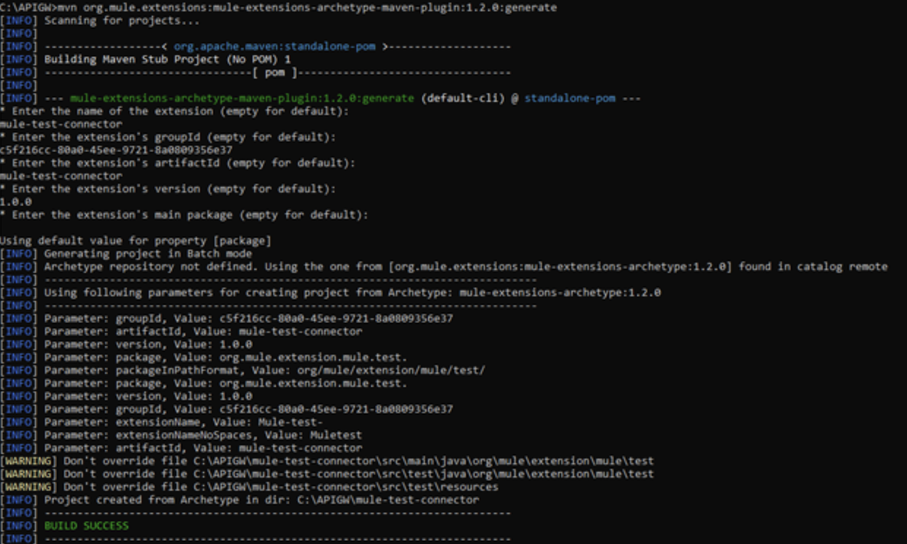
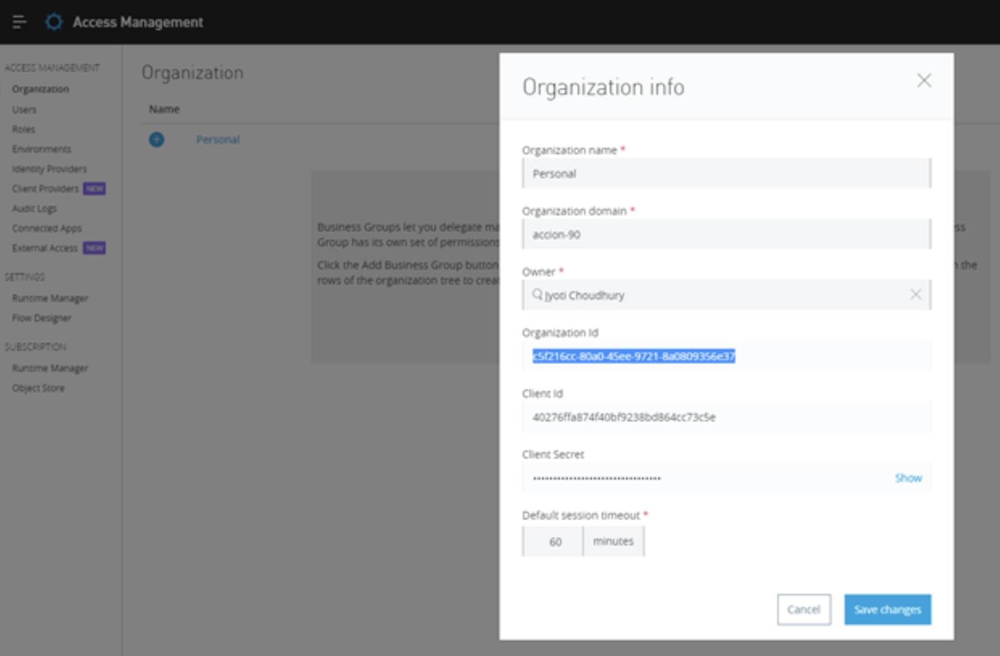
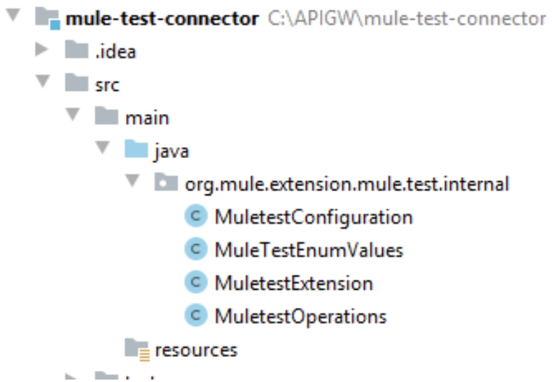
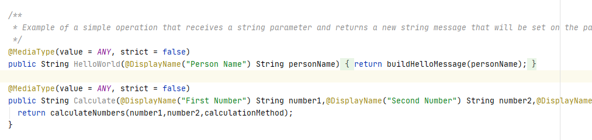
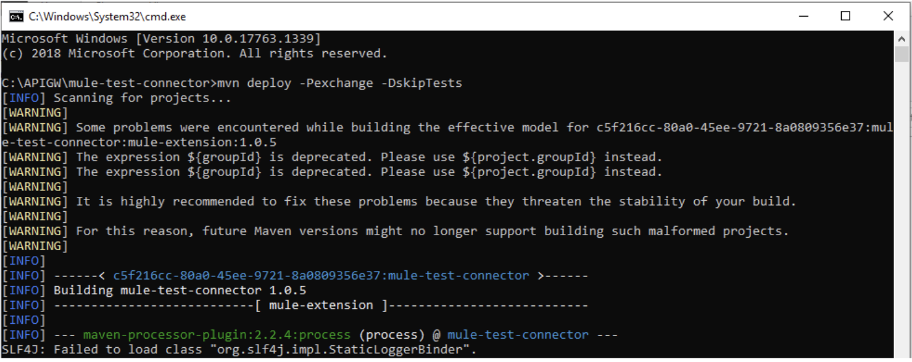
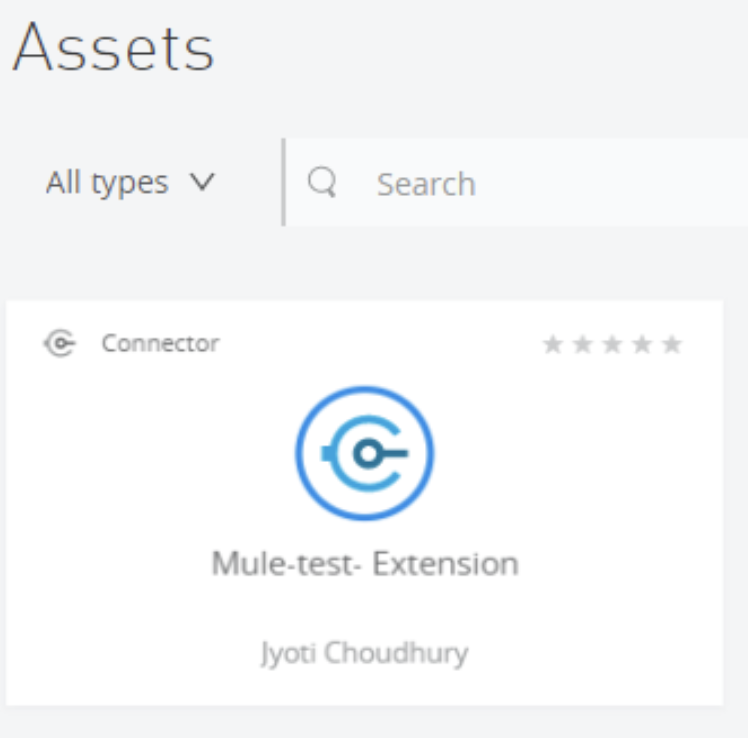
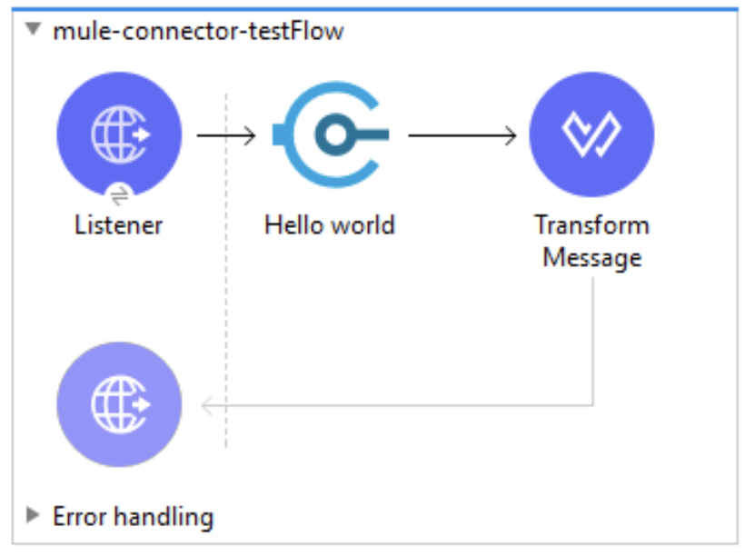

## What is a Connector?

An Anypoint Connector is a reusable component that interacts with Mule runtime and Anypoint Studio. A connector communicates with a target resource and conveys information between a resource and Mule, and transforms the data into a Mule message.

[Anypoint Connector DevKit](https://docs.mulesoft.com/connector-devkit/3.9/) abstracts the communication that happens between Mule and the external service or API, and generates a user interface to help simplify usage of the connector by the developer who would eventually use it in their application.

A well-developed connector makes the development of a Mule application much easier for users when handling tasks like pagination, session expirations, and input and output metadata. This tutorial shows you how to create a well-designed connector.

## Why create a Custom Connector?

In our MuleSoft journey we, as developers, may have used different connectors when creating Mule applications. We have a good number of connectors available out-of-the-box for us to use.

There could be a scenario where no out-of-the-box connector is available and we need to follow a series of complex steps (i.e. authorizing the client, getting access token, implement caching, calling database, etc.) to actually call a third party API.

In this scenario, it is recommended to use a custom connector which will be responsible for calling the third party API and hiding the complexity altogether. Consumer API would otherwise have no idea how that particular third party API is called by the connector.

## Creating a Custom Connector

In Mule 3, we had a separate API Dev Kit to create an Anypoint Connector Project directly from Anypoint Studio. However, with Mule 4, that is no longer required. Creating a connector project has become simpler than ever.

**Prerequisites**:

- Java JDK 1.8
- Maven Apache Plugin

Run the following command with maven. This should create a basic template for the connector project with test cases. This will create a project with sample operations and basic structure with required files. However, you can change the implementation anytime according to your needs.

```bash
mvn org.mule.extensions:mule-extensions-archetype-maven-plugin:1.2.0:generate
```

This will ask for some basic parameters like name and version of the project. If you don’t want to specify anything just press Enter or the Return key (for Mac users) leaving it empty. Maven will take the default values for that.

Some important parameters are:

- **Name of the extension**: specify the name you want to set for the connector.
- **GroupId**: If you are planning to deploy it to Exchange, you need to provide Organization Id as groupId. If your extension is certified by Mule, then you can use `org.mule.modules` which is the default value in case you do not provide anything.
- **Version**: you can provide a version number here. If you leave it empty, it will take 1.0.0 - SNAPSHOT as the default value.
- **ArtifactId**: Provide a name for the artifact. You can keep the same as the extension name (the first point).
- **Package**: You can specify the Java package namespace here. If you leave it empty, it will take the default one: `org.mule.extensions.project.name.internal` for Java implementation and `org.mule.extensions.project.name.test` for testing.



## How to Obtain Organization Id

To get the Organization Id for your Anypoint Platform instance; log-in to your Anypoint Platform Account, navigate to Access Management >> Organization, and click on the name of the business group. A new pop-up window will open where you can find the Organization Id.



## Configure the POM File for the Connector

This step is crucial. We will make some changes in the connector’s POM file to make it ready for publishing to Anypoint Exchange.

First add a mule-maven-plugin like below:

```xml
<build>
   <plugins>
       <plugin>
           <groupId>org.mule.tools.maven</groupId>
           <artifactId>mule-maven-plugin</artifactId>
           <version>${mule.maven.plugin.version}</version>
           <extensions>true</extensions>
           <configuration>
               <classifier>mule-application-example</classifier>
           </configuration>
       </plugin>
   </plugins>
</build>
```

Then create a profile with the exchange distribution repository information.

```xml
<profiles>
   <profile>
       <id>exchange</id>
       <distributionManagement>
           <repository>
               <id>ExchangeRepository</id>
               <name>Corporate Repository</name>
               <url>https://maven.anypoint.mulesoft.com/api/v1/organizations/${groupId}/maven</url>
               <layout>default</layout>
           </repository>
       </distributionManagement>
   </profile>
</profiles>
```

Please note, `groupId` is a variable which is extracted from the groupId properties from this section of the POM file.

```xml
<modelVersion>4.0.0</modelVersion>
<groupId>c5f216cc-80a0-45ee-9721-8a0809356e37</groupId>
<artifactId>mule-test-connector</artifactId>
<version>1.0.5</version>
<packaging>mule-extension</packaging>
<name>mule-test-connector</name>
<properties>
   <mule.maven.plugin.version>3.3.5</mule.maven.plugin.version>
</properties>
```

Finally, you need to add the server section in the `settings.xml` file from your `./m2` folder. You can use your username and password. Please note that the password is encrypted, because I am using `settings-security.xml` that contains an encrypted master password which is used for decryption of server password. The details for encrypting your password can be found in this amazing blog post: [How to Encrypt your Maven Password](https://dev.to/scottshipp/how-to-encrypt-your-maven-password-408d). However, for testing, you can stick with a plain password if you want to.

```xml
<server>
    <id>ExchangeRepository</id>
    <username>YourUserName</username>
    <password>{PCdHLVg1NrFdHY+ighZBQF4/DlJYCjxYxA=}</password>
 </server>
```

Please note that `server.id` should be the same as the `repository.id` mentioned in the profile section above.

## Java Project Structure

Once you create your Mule connector project which is basically a Java project and can be opened in any Java [IDE](https://www.prostdev.com/post/5-reasons-why-you-need-an-ide) (i.e. IntelliJ Idea). Once you open the project in a Java IDE, you should see the project structure as shown in the picture.



Please note that `org.mule.extension.mule.test.internal` is your Java package namespace that was mentioned during the creation of the connector project.

Any connector project has the 3 following class files:

- **&lt;project-name>Configuration**: It contains the configuration parameters. Whatever parameters we mention here will be used to create the connector’s configuration in Mule.
- **&lt;project-name>Extension**: This is the main extension file and starting point of the connector.
- **&lt;project-name>Operations**: This file contains the methods for the connector’s operations to do the specific task. This contains the actual connector operation’s implementation. Each connector operation is actually a method in this class file.



If you want unit tests designed for a connector, this project will contain some additional files for that purpose.

## Publish and Consume the Connector from MuleSoft

Once we have everything in place in our Java Connector project, we need to deploy this to Anypoint Exchange.

```bash
mvn deploy -Pexchange -DskipTests
```

Here with the -P parameter, we need to specify the profile name as mentioned in the POM file.



This should deploy the connector in Anypoint Exchange. You can see the asset in Anypoint Exchange as shown in the screenshot.



Now it’s time to consume that connector from the Mule project. We simply start by adding dependencies in the POM file.

```xml
<dependency>
    <groupId>c5f216cc-80a0-45ee-9721-8a0809356e37</groupId>
    <artifactId>mule-test-connector</artifactId>
    <version>1.0.5</version>
    <classifier>mule-plugin</classifier>
</dependency>
```

Please change the groupId, artifactId, and version based on your connector project POM file.

If everything is in place, maven dependencies will be resolved and the connector will be added as a component. Finally, we can use this custom connector like any other out-of-the-box connector that’s available in the market.



## Conclusion

We have learnt so far from this post:

- What is Connector and why do we use Custom Connector?
- Learn to create Custom Connector project.
- Learn to publish and consume Custom Connector from MuleSoft API.

Hope this has helped you. If you have any questions, please feel free to post your questions.

## References

- [https://docs.mulesoft.com/connector-devkit/3.9/devkit-tutorial](https://docs.mulesoft.com/connector-devkit/3.9/devkit-tutorial)
- [https://dzone.com/articles/how-to-publish-mule-custom-connector-to-anypoint-e](https://dzone.com/articles/how-to-publish-mule-custom-connector-to-anypoint-e)
- [https://javastreets.com/blog/publish-connectors-to-anypoint-exchange.html](https://javastreets.com/blog/publish-connectors-to-anypoint-exchange.html)

Thanks.

Jyoti
