*GitHub repository with the Mule project can be found at the end of the post.*

Mule 4 has a Cryptography module which includes these 3 different strategies:

- PGP
- XML
- JCE

In this article, we will see the PGP technique.

## PGP

Pretty Good Privacy (PGP) is a cryptographic way that allows secure communication between two entities. It uses the public and private key concepts to encrypt the data as shown in the below diagram.

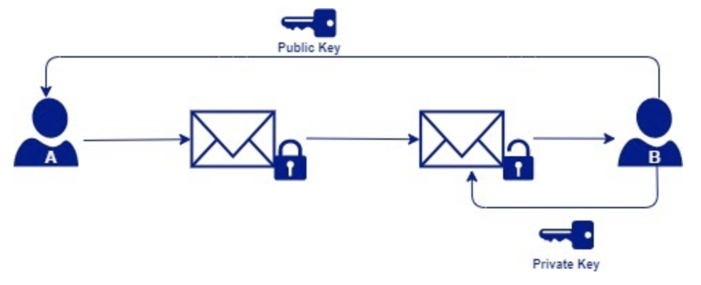

## Prerequisites

**1. Install the Crypto Module from Exchange, located in the Mule palette.**

> [!NOTE]
> Here is the reference documentation on how to install new modules to your Mule Project: [Adding Modules to Your Project](https://docs.mulesoft.com/studio/7.5/add-modules-in-studio-to).

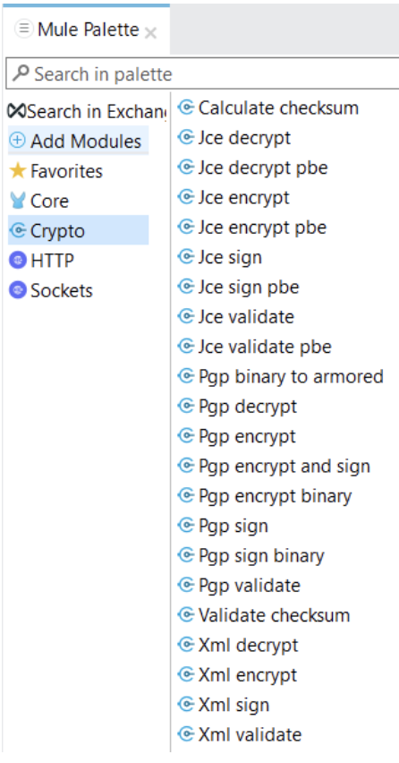

**2. Create private and public keys**

Please follow the below steps to generate a public/private key pair:

- Download and install the GnuPG from [this link](https://www.gnupg.org/download/index.html).
- Install [Kleopatra](https://www.openpgp.org/software/kleopatra/) to use a Graphical User Interface (GUI).
- To generate the keys, click on “New Key Pair” and follow the instructions on the screen.

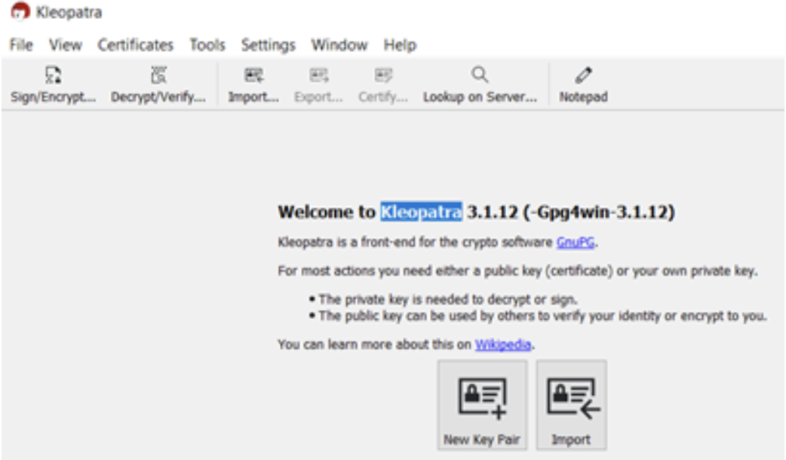

- Once the keys are generated, export them to the file system.

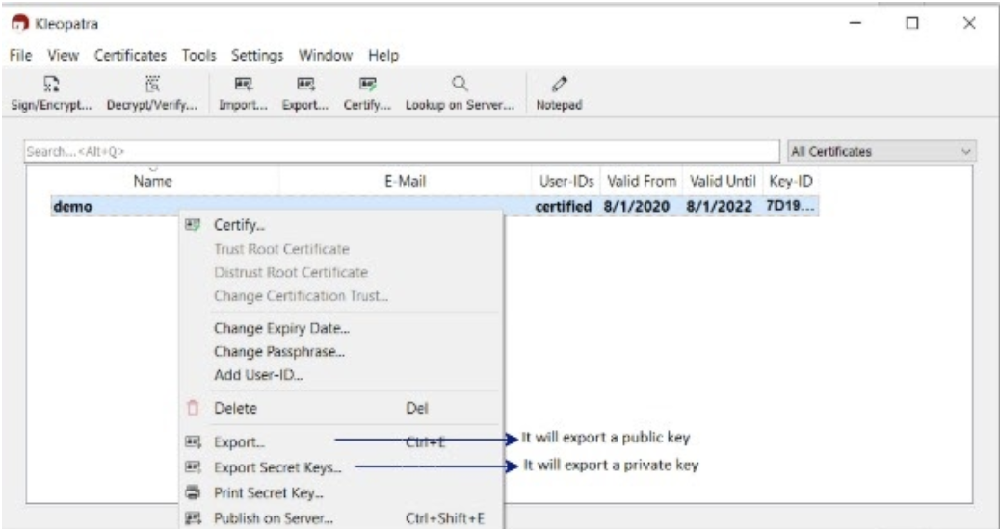

- The generated files are of ASC format, which is not supported by Mule yet, so we need to [dearmor](https://www.gnupg.org/documentation/manuals/gnupg/Operational-GPG-Commands.html) the keys first. Run the following command: `./gpg --dearmor <PATH_TO_YOUR_ASC_FILE>` for each of the keys. This command will create new files alongside the ASC files that will have .gpg appended to their filename which are supported in Mule.

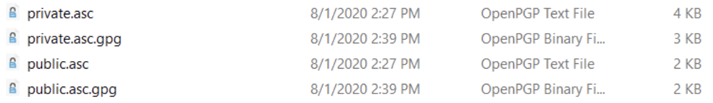

This is what you will get after following the previous steps:

- Public/Private keys
- Fingerprint
- Passphrase
- KeyId

## Mule Code Implementation

We will limit our scope to PGP encrypt/decrypt operation in this article.

### Global configurations

Create 2 global configurations:

- Encryption – Configure public key, keyId, and fingerprint.
- Decryption – Configure private key, keyId, and fingerprint.

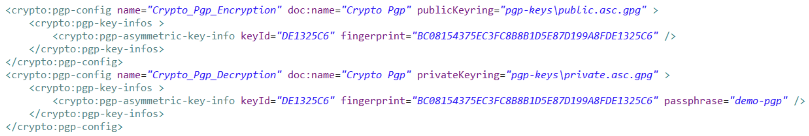

### Usage

**1. Encryption/Decryption of entire payload**

**Encryption:**

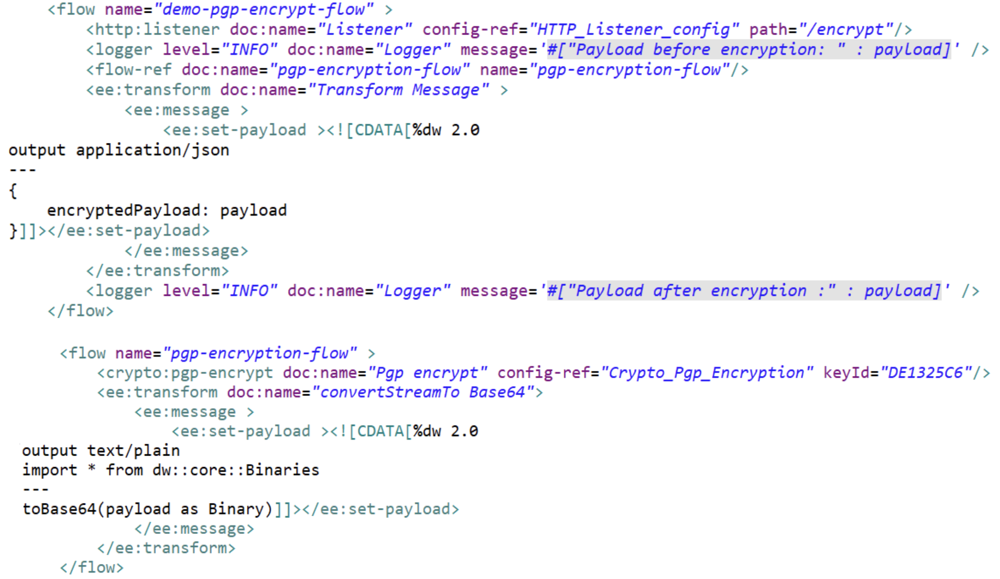

**Output:**

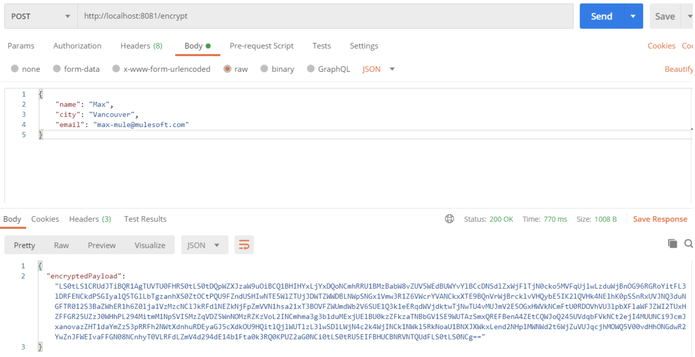

**Decryption:**

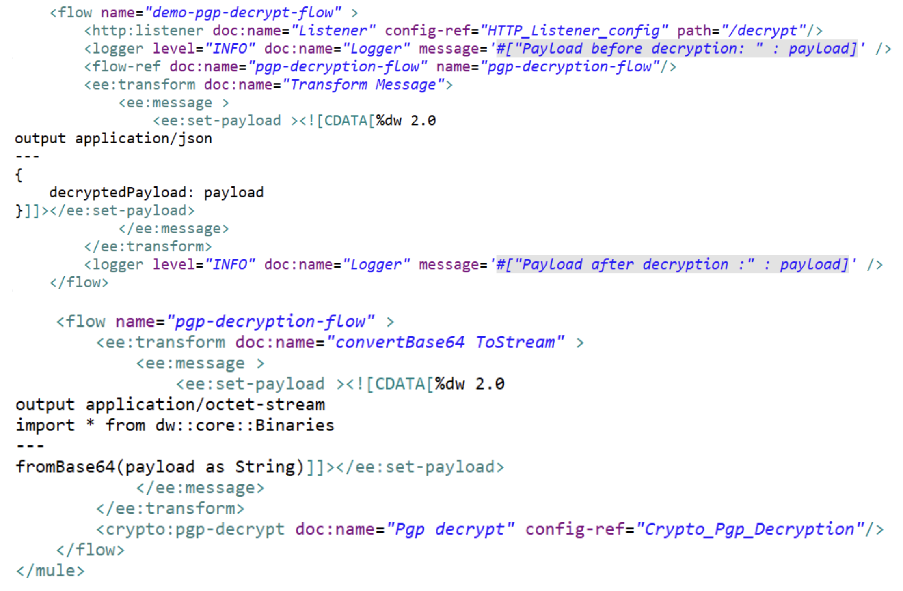

**Output:**

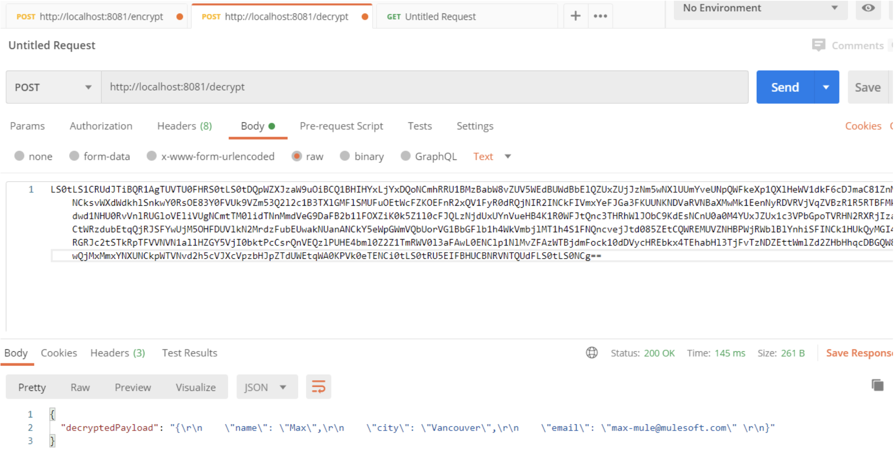

**2. Encryption/Decryption at field level**

This is a very common non-functional requirement where sensitive fields should be encrypted.

For this, we can still reuse the pgp-encryption-flow and pgp-decryption-flow flows. The only change would be the way we refer to these flows from the main flow, and for that, the DataWeave lookup function is very useful.

**Encryption:**

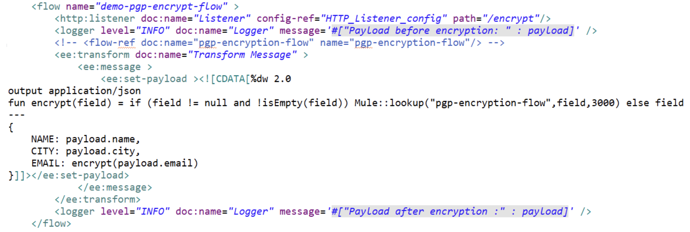

**Output:**

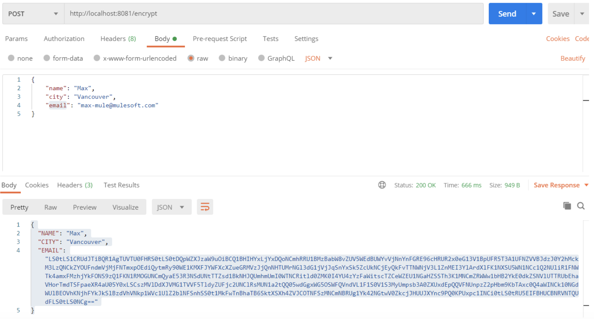

**Decryption:**

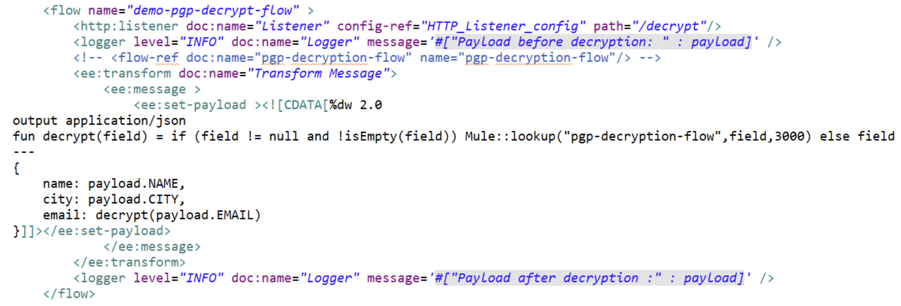

**Output:**

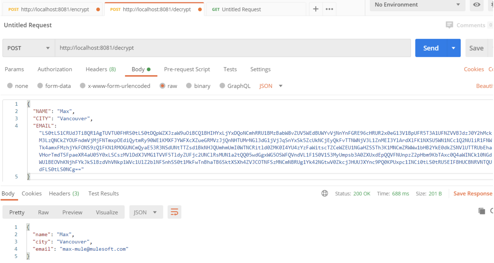

## Conclusion

So far we learned Mule code implementation for PGP. You can set this Mule code as a common service that will help to achieve the encryption/decryption non-functional requirement in many APIs.

Here are the 2 ways to set up this Mule code as a common service:

- Externalize the flow and publish it on the Anypoint Exchange.
- Create a common API, which will encrypt/decrypt the payload.

## References

- [https://docs.mulesoft.com/mule-runtime/4.3/cryptography-pgp](https://docs.mulesoft.com/mule-runtime/4.3/cryptography-pgp)
- [https://docs.mulesoft.com/mule-runtime/4.3/dw-mule-functions-lookup](https://docs.mulesoft.com/mule-runtime/4.3/dw-mule-functions-lookup)

## GitHub repository

[ProstDev GitHub - Demo PGP](https://github.com/ProstDev/demo-pgp)
