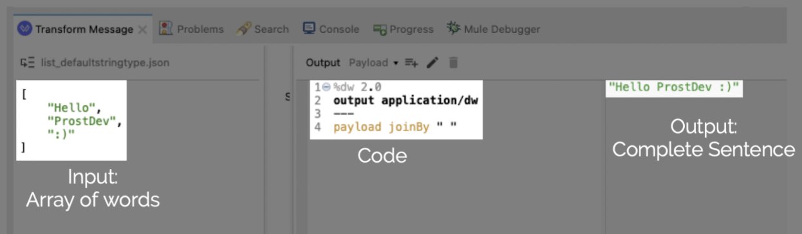
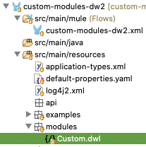
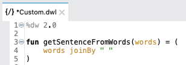
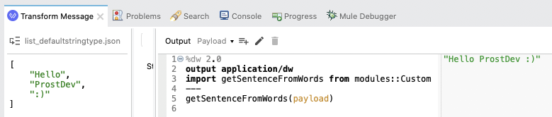
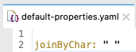
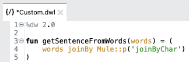
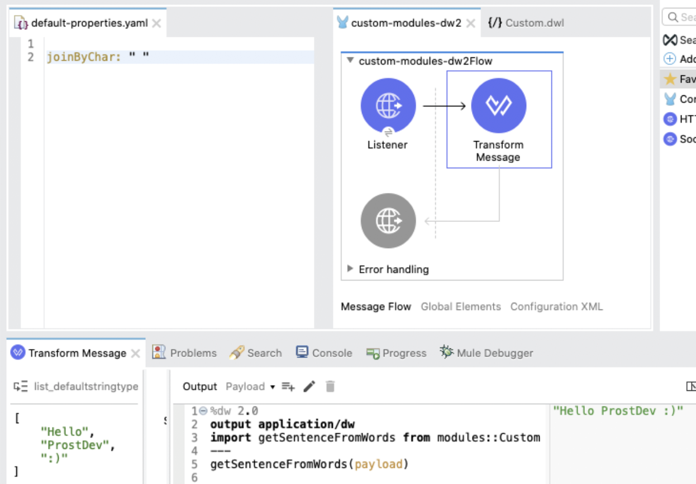
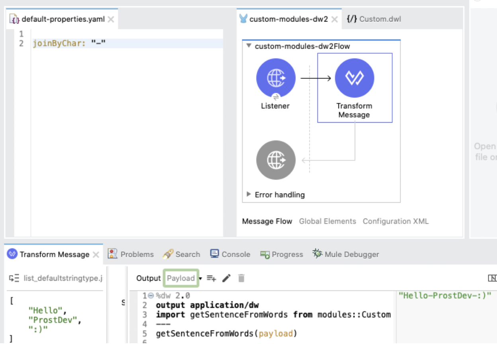

*GitHub repository with the Mule Project can be found at the end of the post.*

Some days ago, I started using this great functionality in DW 2.0, and I faced some challenges while creating the code, so I figured I’d write a blog post about my experience.

[MuleSoft’s documentation](https://docs.mulesoft.com/mule-runtime/4.3/dataweave-create-module) offers a great explanation of how to create these custom modules. One problem that I couldn’t find how to solve in the documentation was how to correctly load a property from the properties file into the custom module.

If you’re not familiar with custom modules, don’t worry, I got your back ;)

For this post, I’ll explain what a custom module is, why you would want to use it, some examples on how you can use it, and finally, how to load properties into this module.

## What are Custom Modules in DataWeave 2.0?

First of all, let me tell you what a regular Module is in DW 2.0: from [MuleSoft’s documentation](https://docs.mulesoft.com/mule-runtime/4.3/dw-functions), “*DataWeave 2.0 functions are packaged in modules. Functions in the Core (**dw::Core**) module are imported automatically into your DataWeave scripts.*”. Yes, all those functions that you use in your DW scripts, come from the Core module. Functions like [++](https://docs.mulesoft.com/mule-runtime/4.3/dw-core-functions-plusplus), [flatten](https://docs.mulesoft.com/mule-runtime/4.3/dw-core-functions-flatten), [map](https://docs.mulesoft.com/mule-runtime/4.3/dw-core-functions-map), [joinBy](https://docs.mulesoft.com/mule-runtime/4.3/dw-core-functions-joinby), that you may use on your day-to-day, come from Modules, you just don’t need to explicitly import them into your script. Other developers may call them [libraries](https://en.wikipedia.org/wiki/Library_(computing)#:~:text=In%20computer%20science%2C%20a%20library,classes%2C%20values%20or%20type%20specifications.) however in DW 2.0 they are called modules.

Mule offers a wide choice of modules that you can use to transform and manipulate your data, like the [Arrays](https://docs.mulesoft.com/mule-runtime/4.3/dw-arrays) module, the [Strings](https://docs.mulesoft.com/mule-runtime/4.3/dw-strings) module, the [Objects](https://docs.mulesoft.com/mule-runtime/4.3/dw-objects) module, even [Binaries](https://docs.mulesoft.com/mule-runtime/4.3/dw-binaries) or [Tree](https://docs.mulesoft.com/mule-runtime/4.3/dw-tree). You don’t need to know how all of these work, just understand the basic meaning of a module, which is: functions created by MuleSoft that can be reused into your DW scripts.

Custom Modules are pieces of code that can be stored into an external file, in order to be reused in other parts of the Mule application. These are not created by MuleSoft, but by yourself, or your company.

## Why are they useful?

Here is an example to illustrate why Custom Modules are useful: you just created a new function that will join an array of words into a complete sentence. Like this:

As you can see, we are using the joinBy function in the code to select which character we want our words to be separated by, in our complete sentence. If we were to change our code from joinBy “ “ to joinBy “-”, our final output would be "Hello-ProstDev-:)" instead.

If this piece of code, to create a complete sentence from an array of words, was used in several parts of your application, it would be a good idea to create a function inside a Custom Module to store this code. Then just reference that function from anywhere else in the rest of the app; instead of having to copy and paste this code into each part where you need to use it.

Let’s see how we can create this module for our Mule Application:

- Create a “modules” folder inside your `src/main/resources` folder, and then create a new “.dwl” file inside the new modules folder, you can name it something like `Custom.dwl` (you can name the folder and the file however you prefer).

- Inside this file, create a new function and paste the code that we had just created to generate the output sentence from our words array (note that you don’t need to add the “output” data type, or the 3 dashes (-) before the code).

- Save everything, and then go back to the Transform Message where we have our DW script. Import the new function from the “Custom” module by writing import getSentenceFromWords from modules::Custom under the output statement. Now you can simply call this function in your code to use the Custom Module and we’ll get the same results as before.

Of course, this is a very simple example, it’s only one line of code. You may think that we generated even more code by doing this than by copying and pasting the code in several scripts. Fair enough. But, imagine what would happen if you suddenly decide to change the functionality? You’d have to go to each of the DW scripts and manually change every single line of code. If you have a custom module setup, you’d only have to change the function from the `Custom.dwl` file, and all the scripts referencing it will automatically have the new functionality. Copy and Pasting means you have to go through and change each one but with this method it's done automatically - for graphic designers out there it's like the embed feature in photoshop.

## Loading properties into a Custom Module

Remember that character we used after the joinBy function? What if we wanted that character to be in a properties file, instead of hardcoded (added directly) in our script? Can we do that when using Custom Modules? Yes, we can!

I already have my `default-properties.yaml` file created under `src/main/resources`, with one property that I decided to name “joinByChar”

We can go back to our `Custom.dwl` file and change the script to reference this property instead of hardcoding the character there. You may already know that the properties can be used in your Mule Application by using either the $&#123; &#125; or the p(‘ ‘) syntax. However, if you try to use any of these from a Custom Module, DataSense will send you back an error (at least for Mule Runtime version 4.3.0 and Anypoint Studio version 7.5.0).

I was losing my mind trying to search in the [Mule Docs](https://docs.mulesoft.com/general/) or in the [Mule Forums](https://help.mulesoft.com/s/forum) how I could import a property from my custom module. In the end, one of the [Mule Ambassadors](https://developer.mulesoft.com/dev/ambassadors), Manish Yadav, was able to point me in the right direction. Remember at the beginning of this post, when I explained that all the DataWeave functions come from a module that is created by MuleSoft. Well, when you use this function: p(‘my-property’) to load a property into the script, do you know which module it comes from? It comes from the [Mule module](https://docs.mulesoft.com/mule-runtime/4.3/dw-mule)!

We can rewrite our function like this:

Aaaaand… Magic! We have our same output, but now we’re using an external property to generate the final sentence.

This way we can change our property joinByChar right from the `default-properties.yaml` file and we do not need to touch the code to select a new character.

Feel free to download the Mule project from our github repository and give it a try! Maybe you get it to work with another syntax :) I’d love to keep learning more DataWeave functions.

## Recap

Let’s do a quick recap on what we learned with this post:

- DataWeave 2.0 functions are packaged in modules.
- Modules are created by MuleSoft and you can use their predefined functions in your DW scripts by importing the module, using the import keyword.
- Custom Modules are just like regular modules, but they are created by you or your company, as opposed to MuleSoft.
- Modules are useful because they let you reuse the same piece of code in different DW scripts.
- Custom Modules are stored into an external file and can be imported into your DW script the same way that a regular module is imported: using the import keyword.

Special thanks to Manish for this tip and for being so quick to respond to my messages!

Stay tuned for more DataWeave tips and tricks.

*Prost!*

-Alex

## References

- [Mule docs - MuleSoft Documentation](https://docs.mulesoft.com/general/)
- [Mule docs - Create Custom Modules and Mappings](https://docs.mulesoft.com/mule-runtime/4.3/dataweave-create-module)
- [Mule docs - DataWeave Reference](https://docs.mulesoft.com/mule-runtime/4.3/dw-functions)
- [Mule docs - joinBy function](https://docs.mulesoft.com/mule-runtime/4.3/dw-core-functions-joinby)
- [Mule docs - Mule Module](https://docs.mulesoft.com/mule-runtime/4.3/dw-mule)
- [Mule Forum](https://help.mulesoft.com/s/forum)
- [Mule Ambassadors](https://developer.mulesoft.com/dev/ambassadors)
- [Wikipedia - Library](https://en.wikipedia.org/wiki/Library_(computing)#:~:text=In%20computer%20science%2C%20a%20library,classes%2C%20values%20or%20type%20specifications)

## GitHub repository

[ProstDev GitHub - Custom Modules DW 2.0](https://github.com/ProstDev/custom-modules-dw2)
