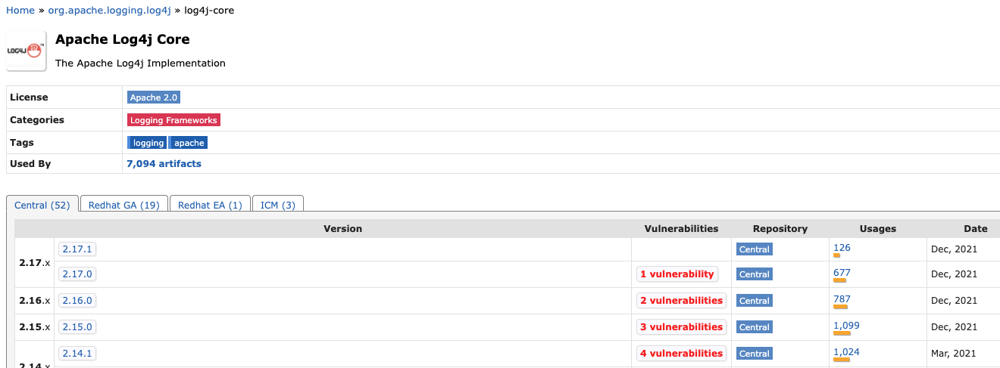
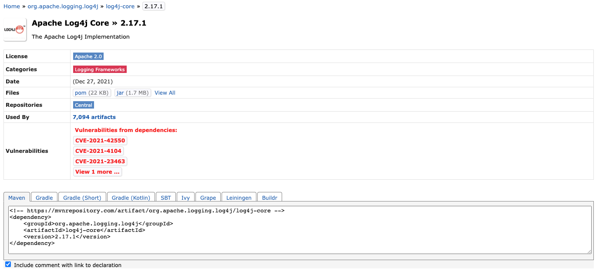
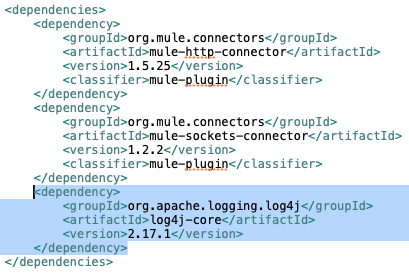
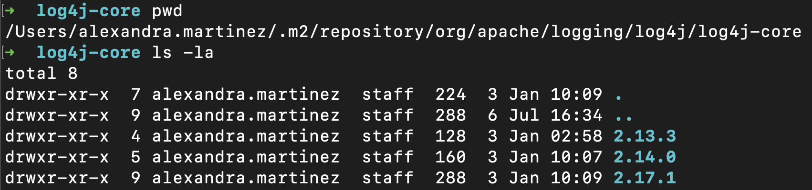

Over December 2021, a critical vulnerability has been unraveled pertinent to the popular Apache’s Log4j library. There is a high possibility that the code you have been working on this past few weeks has been using this component. So, let’s understand what is happening and what has happened.

## What is Apache Log4j?

Apache Log4j is one of the most popular logging libraries and is a part of the Apache Logging Project. This has been one of the easiest and most effective libraries to enable logging for applications and is extensively used in Java applications.

## What is RCE (Remote Code Execution)?

According to [Wikipedia](https://en.wikipedia.org/wiki/Arbitrary_code_execution): “arbitrary code execution (ACE) is an attacker's ability to run any commands or code of the attacker's choice on a target machine or in a target process. An arbitrary code execution vulnerability is a security flaw in software or hardware allowing arbitrary code execution. A program that is designed to exploit such a vulnerability is called an arbitrary code execution exploit. The ability to trigger arbitrary code execution over a network (especially via a wide-area network such as the Internet) is often referred to as remote code execution (RCE).”

## What happened?

Recently, a critical zero-day vulnerability has been discovered which impacts this ever-popular logging library. All versions of Log4j2 versions from 2.0-beta9 to 2.14.1 have been affected by this vulnerability and currently, this is being exploited in the wild. This vulnerability enables an option for RCE (Remote Code Execution) on the vulnerable server and has been rated at a severity level of 10.0 by CVSS. This has been globally addressed as **CVE-2021-44228**.

> [!NOTE]
> To learn more about Log4j 2.x Security Vulnerabilities, visit their [official site](https://logging.apache.org/log4j/2.x/security.html).

## What made this vulnerability so dangerous?

[CVE-2021-44228](https://cve.mitre.org/cgi-bin/cvename.cgi?name=CVE-2021-44228), also known as Log4Shell, is a vulnerability that enables RCE. The fact that it takes only a few lines of code to activate this makes this so much more dangerous. The attacker only needs to force into one of the servers to potentially gain access to the entire system which can be done by simply adding just one string to the log. Post this an entire arbitrary code can be uploaded into the application.

## Why did this happen?

This potentially happened due to a loophole in the JNDI (Java Naming & Directory Interface) which is an API that enables a Java application to perform lookups on any type of named Java objects.

Currently, in this case, the JNDI has not been restricted against unknown look-ups.

An attacker can send an artificially constructed request to an application employing a vulnerable version of Log4j. This request then can enforce an LDAP / LDAPS injection by using JNDI (which is not validating the authenticity of the incoming request) which then sends a malicious / ill-intended payload to the application from one of the attacker-controlled servers. This payload can contain a piece of arbitrary code (or a Java class) that can enable RCE.

## What can be done to fix this?

There are a couple of ways which have been discovered to fix this:

- One can update the Log4j package to version `2.17.0` which has been recently released by Apache. (**RECOMMENDED**)
- In the case of Log4j versions from 2.10 to 2.14.1, one can update the system property `log4j2.formatMsgNoLookups` or the environment variable `LOG4J_FORMAT_MSG_NO_LOOKUPS` to `true`.
- For Log4j versions before 2.10, one can simply remove the `JndiLookup` class from the classpath: `zip -q -d log4j-core – *. Jar org / apache / logging / log4j / core / lookup / JndiLookup .class`.

## How to fix it in MuleSoft

**CloudHub** customers:

If you are running on CloudHub, MuleSoft has released the fix for this vulnerability. The fix is scheduled to be applied to all runtimes in CloudHub starting Dec 11th, 2021 9 PM PDT to Dec 14th, 2021 10 PM PDT.

**On-Premise** customers:

This issue requires immediate attention. MuleSoft strongly recommends all on-premise customers take action to update their Mule runtimes as soon as possible.

Mule runtime engines associated with the following products will need to be patched as well:

- Anypoint Studio
- Runtime Fabric (RTF)
- Pivotal Cloud Foundry (PCF)
- Private Cloud Edition (PCE)

For details about how to fix this issue in Mule 4 or Mule 3, please follow the instructions on this MuleSoft article: [https://help.mulesoft.com/s/article/Apache-Log4j2-vulnerability-December-2021](https://help.mulesoft.com/s/article/Apache-Log4j2-vulnerability-December-2021)

## How to update log4j from Maven

Go to `mvnrepository.com` and search for `log4j-core` or click on [this link](https://mvnrepository.com/artifact/org.apache.logging.log4j/log4j-core). This will show you the latest version available at the top and if there are any vulnerabilities discovered for any specific version.

Click on version `2.17.1` to get the code for your `pom.xml` file. This will open a new view:

Simply click on the XML text under **Maven** and this will copy the code to your clipboard. Go to any of your Mule projects and open the `pom.xml` file located at the root folder of your project. Paste the copied code into the `<dependencies>` section.

That’s it! This will update your log4j version in the `.m2` folder. To verify, you can go to your `.m2` folder and follow this path: `.m2/repository/org/apache/logging/log4j/log4j-core` - there should now be a folder called `2.17.1`.

After that, remove the previous versions to make sure you only have the latest version. You can remove other folders using `rm -rf <folder 1> <folder 2> ... <folder n>`. For example, `rm -rf 2.13.3/ 2.14.0/`.

## Updates since this post was published

- Apache Log4j version 2.16.0 is now available
- Apache Log4j version 2.17.0 is now available
- Added section "How to update log4j from Maven"

We hope this information has been helpful in knowing what has happened and what can be done to mitigate the risk. As this issue is still being investigated, we will keep posting with any latest developments on this.

Also, you can comment if you want to add anything to this article / if anything needs to be changed.

Thank you!!

- [Soumyajit Sinha](https://www.prostdev.com/profile/soumyajitsinha888/profile)
- [Leonardo Gonzalez](https://www.prostdev.com/profile/32856a2a-f548-4d76-a415-447e4b1aa2d4/profile)
- [Alex Martinez](https://www.prostdev.com/profile/alexandramartinez/profile)
