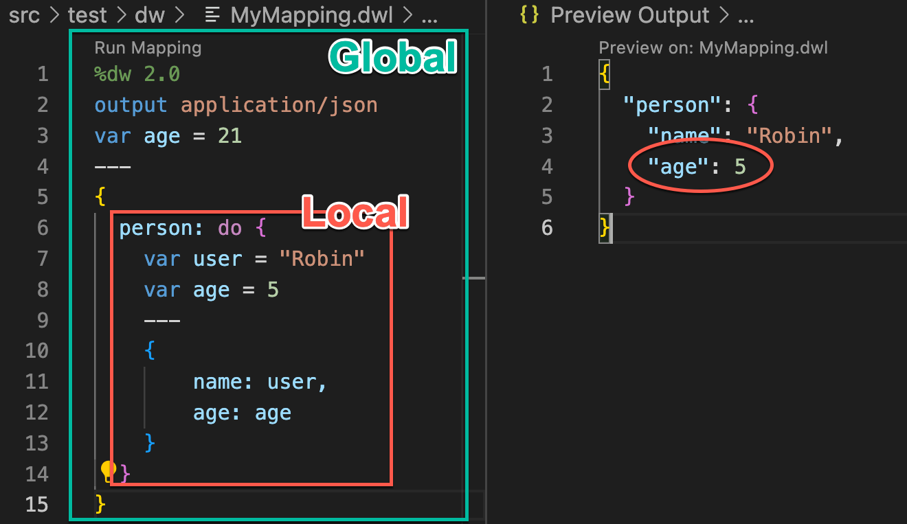
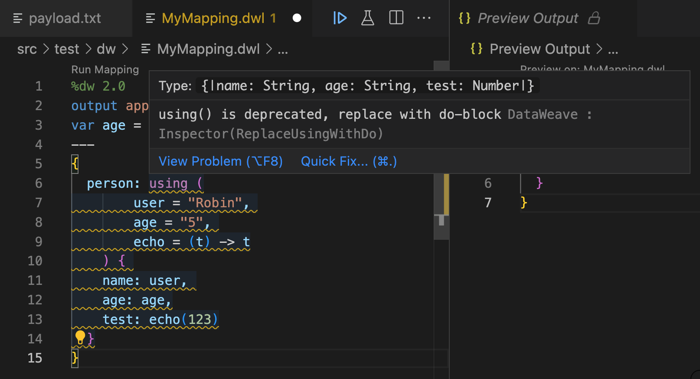

I had previously written a post with [my top 5 DataWeave tips to make your life easier](https://www.prostdev.com/post/my-top-5-dataweave-tips-to-make-your-life-easier) where I talked about the *do* operator. However, I’ve seen a lot of people asking about the *using* operator since it was inherited from DataWeave 1.0.

In this post, I’ll go through some of the main differences between these two operators so you decide which one to use in your DataWeave scripts!

> [!NOTE]
> By this point, I’m assuming you already have the basic DataWeave understanding. If this is not the case, I recommend you read [these tutorials first](https://developer.mulesoft.com/tutorials-and-howtos/dataweave/what-is-dataweave-getting-started-tutorial/).

## What are scopes?

If you come from a different programming paradigm, this concept might be easy to understand. To keep it simple, let’s just say that scopes are these imaginary boxes where you can keep variables, functions, and so on. These variables (or functions) are not available to anyone else outside of these boxes, only inside. We will see some examples in a bit.

In DataWeave, you can have **global** and **local** variables (and functions, annotations, etc.). The global variables are the ones that appear over the three dashes (---) that separate your script. For example

```dataweave
%dw 2.0
output application/json
var globalVar = "this is my global variable"
---
globalVar
```

These variables are accessible from anywhere in your script. They don’t have to exist inside a specific scope to be used.

Let’s talk about how to create local variables with the *using* or *do* operators so we can put together the meaning of *scopes*.

## Creating scopes and local variables with the *do* operator

Try out the following example. What age do you think will be outputted from this script?

```dataweave
%dw 2.0
output application/json
var age = 21
---
{
  person: do { 
    var user = "Robin"
    var age = 5
    ---
    {
        name: user, 
        age: age
    }
  }
}
```

The answer is 5. We used the *do* operator in line 6 to create a local scope. Notice how we created the variables *user* and *age* inside this scope. This new scope will work very similarly to a regular script in the sense that it can have its variables, functions, etc.

Notice how we have to add three dashes (---) in line 9 to separate the variable declaration from the localized script. This is because when you use the *do* operator, you can use this syntax for your new local scope.

Below is a graphical representation of how these two scopes are separated.



The age in the output is 5 because it will take the “closest” variable. In other words, the more local the variable, the more precedence it takes.

What do you think will be the output if you use the following code? Try to figure it out! The answer will be at the end of the post 🙂

```dataweave
%dw 2.0
output application/json
var age = 21
---
{
  person: do { 
    var user = "Robin"
    var age = 5
    ---
    {
        name: user, 
        age: age + do {
            var age = 10
            ---
            age
        }
    }
  }
}
```

You can create as many local scopes as you want, but I wouldn’t recommend having more than 1 unless completely necessary. Mainly to avoid spaghetti code. You can read more about *do* in this post: [My top 5 DataWeave tips to make your life easier](https://www.prostdev.com/post/my-top-5-dataweave-tips-to-make-your-life-easier).

## Creating local variables with the *using* operator

Now, I have to be completely honest here. I haven’t used the *using* operator. I did work on DataWeave 1.0 for a while, but it was confusing for me to understand how this syntax worked, so I never really used it. Here is an awesome post if you’re still developing with DataWeave 1.0: [How to use the “Using” Operator in DataWeave, the MuleSoft Mapping Tool](https://bitsinglass.com/mulesoft-dataweave-operator-tips/). Otherwise, I’ll explain how to create local variables in DataWeave 2.0 here.

Let’s follow the previous example to demonstrate.

```dataweave
%dw 2.0
output application/json
var age = 21
---
{
  person: using (user = "Robin", age = "5") { 
    name: user, 
    age: age
  }
}
```

We will have the same functionality as before but see how this syntax is different than *do*.

We can also create variables with lambda expressions to use them as functions. Like in the following example.

```dataweave
%dw 2.0
output application/json
var age = 21
---
{
  person: using (
        user = "Robin", 
        age = "5", 
        echo = (t) -> t
    ) { 
    name: user, 
    age: age,
    test: echo(123)
  }
}
```

However, this operator is considered deprecated since DataWeave 2.0. I personally don’t like the way the syntax works. It makes more sense for me to use *do* instead. But you can still use *using* if you’re really into it 😀- although you might get a huge warning in your scripts telling you to stop using this operator!



## My advice for you

The *using* operator is deprecated for a reason. The fact that the team didn’t remove it from DataWeave 2.0 doesn’t mean that it’s the best way to create local variables. Yes, you can still use it if that’s the way you’ve been doing it since DataWeave 1.0, but who knows when they’ll remove it? It might be risky to keep it that way.

I also feel it’s more intuitive to use *do* because of the three-dashes syntax that we already know how to use. We can easily declare local variables, functions, annotations, or namespaces the same way we do global ones. However, it can be tricky to use at first because of the curly brackets ( &#123; &#125; ). But I swear, the more you use it, the less time you take to do it automatically!

You can also check out the docs to read more about these two:

- (DataWeave 2.0) [Scope and Flow Control Operators](https://docs.mulesoft.com/dataweave/latest/dw-operators#scope-and-flow-control-operators)
- (DataWeave 2.0) [Example: Local DataWeave Variables](https://docs.mulesoft.com/dataweave/latest/dataweave-variables#example_local_variable)
- (DataWeave 1.0) [Scoped Variables](https://docs.mulesoft.com/dataweave/1.2/dataweave-reference-documentation#scoped-variables)

Oh! And the answer to the question is this:

```json
{
  "person": {
    "name": "Robin",
    "age": 15
  }
}
```

Try it out if you don’t believe me :-)

Let me know if you have any questions!

-alex
