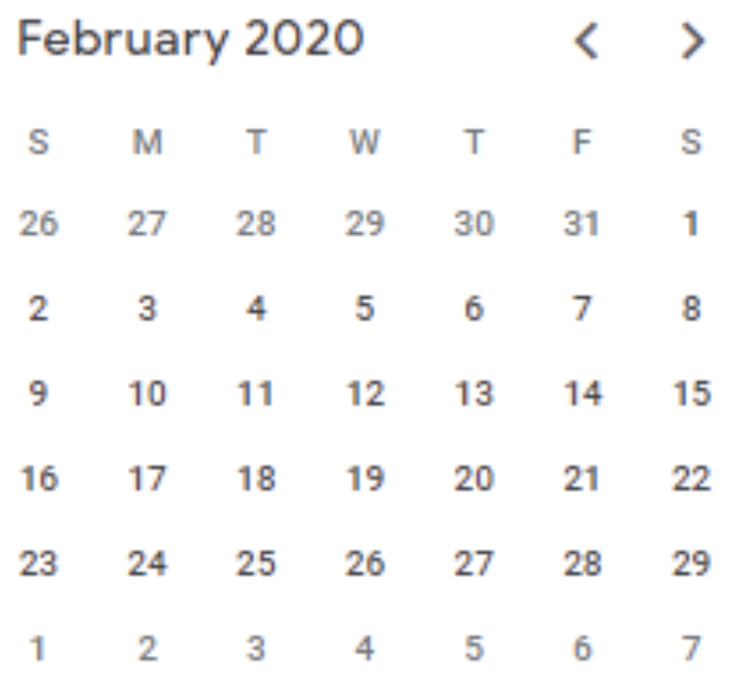

We know that in DataWeave the types can be coerced from one type to another. For that we use the **as** operator.

There is a limited list of type coercion that you can see here:

[https://docs.mulesoft.com/mule-runtime/4.3/dataweave-types-coercion](https://docs.mulesoft.com/mule-runtime/4.3/dataweave-types-coercion)

For example, you can coerce a String or Number to a DateTime or a Number or Boolean to a String. Depends on your use case.

There is a property called **mode** that we can use when we are parsing date and time values. The **mode** parameter has three different valid values:

- SMART
- STRICT
- LENIENT

## SMART (default) mode

The default mode when you are parsing dates is SMART. So you’ll have the same result if you explicitly use the **mode** parameter as SMART or not.

Let’s say we need to parse the following date in **‘MM-dd-yyyy’** format: **02-31-2020**.

As you can notice, this is an invalid date (take a quick look at your calendar), February 2020 had only 29 days.



Let’s try to parse that date using the default mode (no explicit mode parameter in your DataWeave script).

Here is the input:

```dataweave
%dw 2.0
output application/json
var badDate = '02-31-2020' //notice that this date doesn't exist
var dateFormat = 'MM-dd-yyyy'
---
{
   defaultDate: badDate as Date {format: dateFormat}
}
```

This is the output:

```json
{
    "defaultDate": "02-29-2020"
}
```

Did you notice that the default mode autocorrected the date value? It results in a valid date two days before the input date: **02-29-2020**.

Now, let’s use the SMART mode explicitly as follows:

```dataweave
%dw 2.0
output application/json
var badDate = '02-31-2020' //notice that this date doesn't exist
var dateFormat = 'MM-dd-yyyy'
---
{
   smartDate: badDate as Date {mode: "SMART", format: dateFormat}
}
```

Here is the SMART output:

```json
{
    "smartDate": "02-29-2020"
}
```

As you can see, you will have the same result using both: the DEFAULT mode and the SMART mode.

## LENIENT mode

We might think that the LENIENT mode, being tolerant, would also correct the date to a valid day on the calendar. However, the result is different from the default mode.

Let's do a test using the LENIENT mode as follows:

```dataweave
%dw 2.0
output application/json
var badDate = '02-31-2020' //notice that this date doesn't exist
var dateFormat = 'MM-dd-yyyy'
---
{
   lenientDate: badDate as Date {mode: "LENIENT", format: dateFormat}
}
```

The result is:

```json
{
    "lenientDate": "03-02-2020"
}
```

Did you notice that this mode gives us a valid date as well? But in this case it gives us a date two days after the input date: **03-02-2020**.

Why two days and not only one? That’s because February 2020 had only 28 days as we saw in our calendar and we are trying Feb 31, 2020. So, Feb 30, 2020 does not exist, Feb 31, 2020 does not exist either. There are two invalid days (not only one) between the last valid date (Feb 29, 2020) and the (invalid) input date (Feb 31, 2020). So, the LENIENT mode will shift forward the same number of invalid days.

## STRICT mode

Finally, we are going to use the STRICT mode. Let’s see the results. Here is the DataWeave script:

```dataweave
%dw 2.0
output application/json
var badDate = '02-31-2020' //notice that this date doesn't exist
var dateFormat = 'MM-dd-yyyy'
---
{
   strictDate: badDate as Date {mode: "STRICT", format: dateFormat}
}
```

This results in an error:

```
Cannot coerce String (02-31-2020) to Date, caused by: Text '02-31-2020' could not be parsed: Unable to convert `02-31-2020` to Date.

7|     strictDate: badDate as Date {mode: "STRICT", format: dateFormat}
                   ^^^^^^^^^^^^^^^^^^^^^^^^^^^^^^^^^^^^^^^^^^^^^^^^^^^^
Trace:
  at main::main (line: 7, column: 17)
```

It is obvious, being a strict mode, it validates the input date and returns an error message.

We should use the STRICT mode if our goal is to parse but also validate the input date. Which is a good idea, otherwise we would be transforming an invalid date all the time, and in the worst case, sending it to the backend.

## Bonus stage (LENIENT mode, again)

I did try another round using the LENIENT mode and I found the following:

```dataweave
%dw 2.0
output application/json
var badDate = '31-02-2020' //notice that this date doesn't exist
var dateFormat = 'MM-dd-yyyy'
---
{
   lenientDate: badDate as Date {mode: "LENIENT", format: dateFormat}
}
```

I used the same input date but intentionally changed the day and month as the opposite. Instead of passing the **‘MM-dd-yyyy’** format, as my transformation expects, I passed it using the **‘dd-MM-yyyy’** format.

The results are:

```json
{
    "lenientDate": "07-02-2022"
}
```

Not only do I have an invalid date, but the transformation gives me a completely different date value.

## Conclusion

When using and transforming date values, it’s very important to analyze what is the use case we are facing. If we need to validate the input date values, or if we need to correct the values (forward or backward) when receiving invalid dates. To do this, you can use the SMART, LENIENT or STRICT **mode** parameter to parse date values.

Evaluate which of them fits your use case and use it in an explicit way in your DataWeave scripts to avoid delivering inconsistent information to the downstream APIs or systems.
