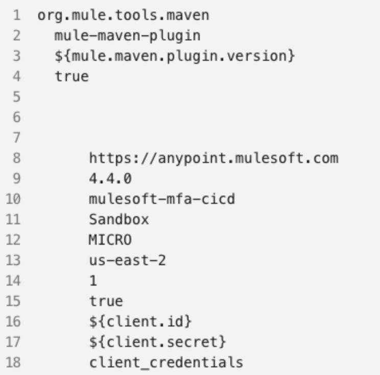

In case you're not familiar with my [dataweave-scripts](https://github.com/alexandramartinez/dataweave-scripts) GitHub repo, it's the place where I keep some of the scripts I've created to help the community with transformation questions or simply some scripts that have been handy to me.

In this post, I want to introduce you to two transformations I added because of a use case I came up with last week. Basically to help clean an XML or HTML to publish a script in a WordPress article.

## The problem

This problem started because I had written a blog post in a WordPress-based blog. I was sharing a Maven snippet (XML format). The issue is that WordPress mistook the XML tags as HTML code. So, instead of having a regular XML snippet, the article was showing something like this:



The fix was simple. Instead of having the regular `<` and `>` characters pasted in the code snippet, I had to use `&lt;` and `&gt;` respectively.

*(Thanks so much Julian Duque for providing the fix! I had no idea about this issue in WordPress* 🤗*)*

For example, instead of writing `<plugin>`, I had to replace it with `&lt;plugin&gt;`

I thought to myself: If I need to keep doing this for future blog posts, maybe I can create a DataWeave transformation to fix this for me so I can just easily copy and paste the new clean snippet.

These are the two approaches I came up with.

## First approach: XML input

The first thing I tried to do since I was using an XML format for the script, was to take an input XML format, transform it to a String, and then clean the text. This is the script I came up with:

```dataweave
%dw 2.0
output text/plain
---
write(payload,"application/xml") 
replace "<?xml version='1.0' encoding='UTF-8'?>\n" with ""
replace "<" with "&lt;"
replace ">" with "&gt;"
```

> [!PLAYGROUND]
> [Open in the Playground](https://dataweave.mulesoft.com/learn/playground?projectMethod=GHRepo&repo=alexandramartinez%2Fdataweave-scripts&path=functions%2Fclean-xml)

However, I quickly ran into issues when I tried to clean an HTML code snippet using this same transformation. This is how I came up with the second approach.

## Second approach: plain text input

This time I decided to use a plain text input instead of an XML input format. This way, both XML and HTML code snippets could be used as the input and I wouldn't need to use the `write()` function in the first place.

```dataweave
%dw 2.0
output text/plain
---
payload
replace "<" with "&lt;"
replace ">" with "&gt;"
```

> [!PLAYGROUND]
> [Open in the Playground](https://dataweave.mulesoft.com/learn/playground?projectMethod=GHRepo&repo=alexandramartinez%2Fdataweave-scripts&path=functions%2Fclean-html)

Plus, I got rid of one `replace()` because I no longer needed to remove the XML header.

It's a short post, but I hope it's insightful for you all 🤗 I'm sure I'll keep using this example in the Playground to modify my WordPress posts in the future.

Let me know if you've faced similar issues with WordPress before!
