The Atom Queue connector is used to send and receive messages to and from native Boomi Integration Atom message queues. The connector supports both Point-to-Point and Publish/Subscribe messaging.

For better understanding of how Atom Queue works, I did a proof of concept. Below are the screenshots of the flow which will give you a better idea of how this component works.

## 1. Creating a message and sending it to an Atom Queue

To send a message to another process, first you need to create the process where we’ll send the queue message from (in this case, we create the Send_Queue process).

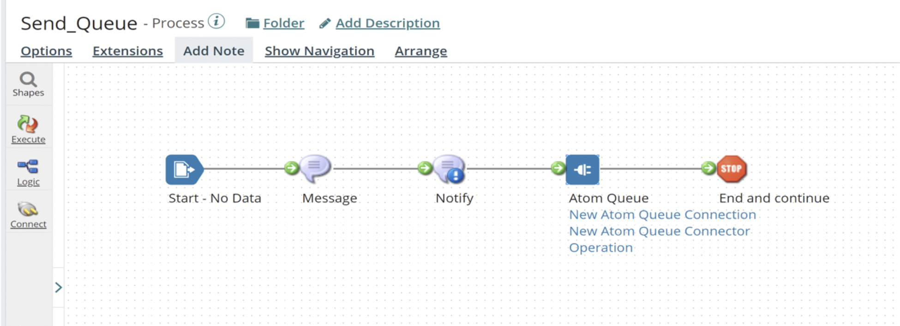

The “No Data” option should be selected in the “Start” Shape connector, if the process will not receive or retrieve data from any source.

In the Message connector, I have entered a “Hello” message (as shown below). This is the message that will be sent to the second process.

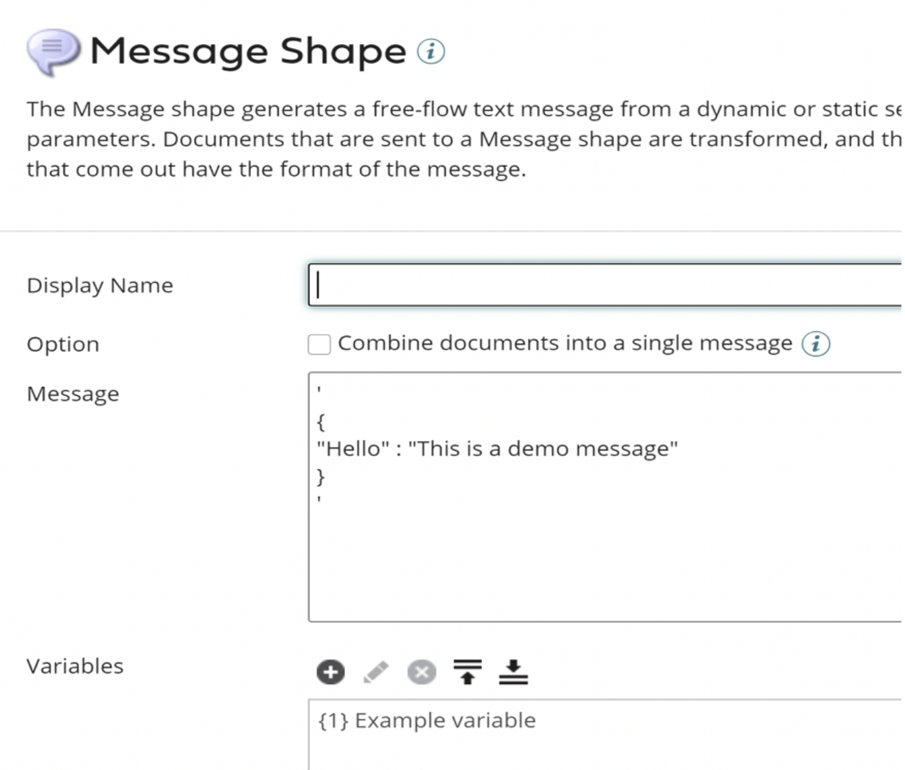

The message sent from the Message Shape is sent to the Atom Queue connector, which will be sending the message to native Boomi Integration Atom Message Queues.

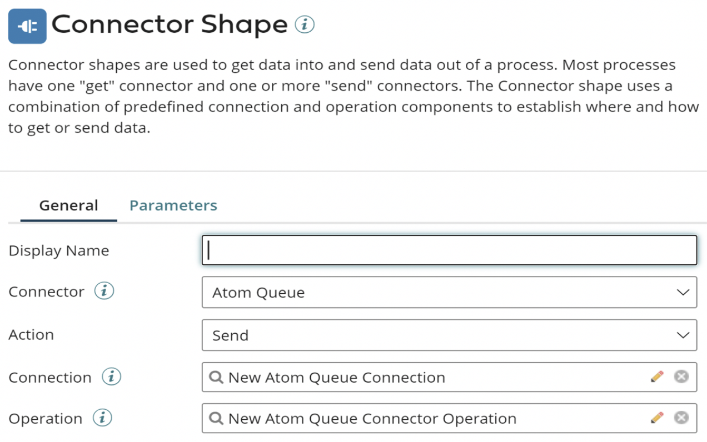

To configure a connector to send a message to an Atom Message Queue, I need to set up two components:

- Atom Queue Connection
- Atom Queue Operation

The Atom Queue Connection specifies the message queue for an Atom Queue Operation. As shown below, I have configured the Atom Queue Connection with the Queue Name “AtomQueue_Test”.

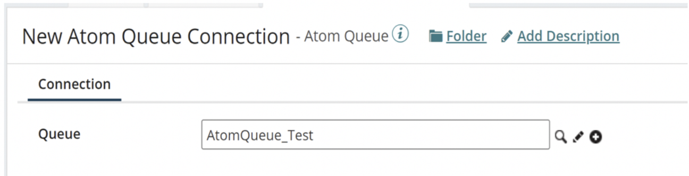

The Atom Queue Operation below is used to send (this is the Connection Action) messages to a Message Queue and Batch Size is set to 5 (default value), which means it sets the number of documents to batch in each outgoing message.

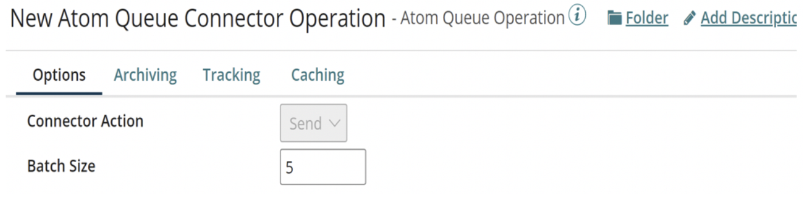

The Stop Shape indicates the “End and continue” of the flow.

## 2. Reading the message from the Atom Queue

After we send the message to the queue, the next step would be to read that message from the second flow. I created the below process (Read_Queue) to read the file that was previously sent to the queue.

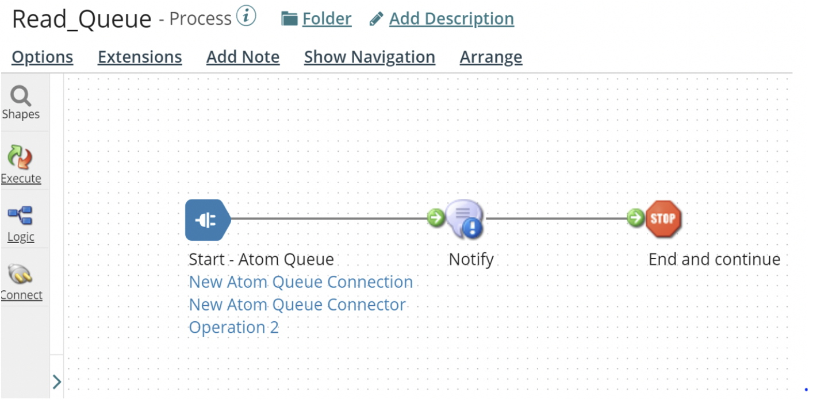

In the Start Shape connector, “Atom Queue” must be selected as the connector, and the Action must be selected as “Listen”.

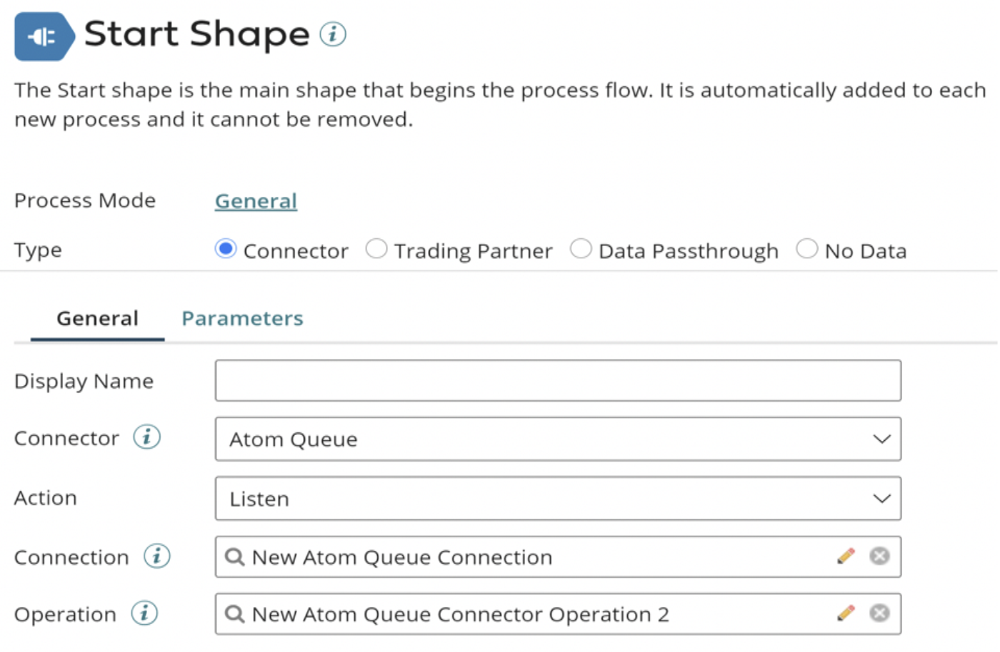

The connection will be the same as the Atom Queue Connection we used in the Send Process, and the operation will be set to Listen (Connector Action). “Listen” is set in event-driven retrieval of messages from a Message Queue.

To receive first-in, first-out (FIFO) processing of messages across nodes, set the Maximum Concurrent Executions value to 1.

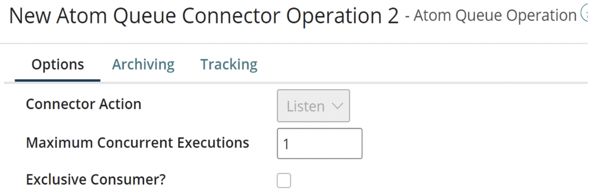

I used a Notify Shape to send a customized message. Here I am just using the Current Data option, which will print the message that was received from the Atom Queue.

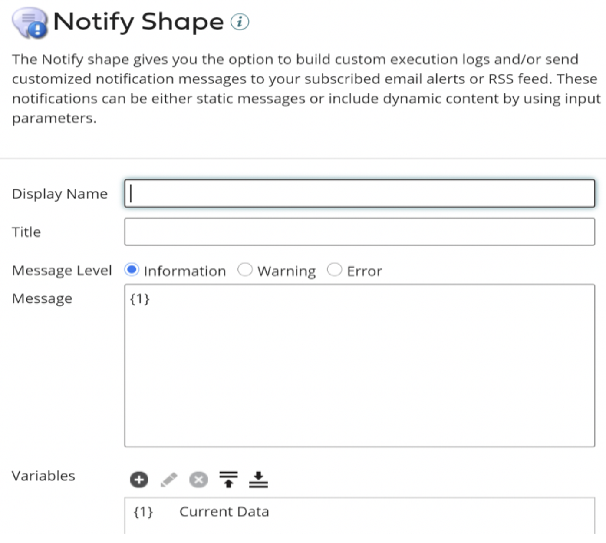

After these two processes are ready, the next step is to create a packaged component for the “Read_Queue” (Listen) process and deploy it.

After deploying, the process can be seen in the Atom Management page -> Listeners, which means the process is in Listen mode.

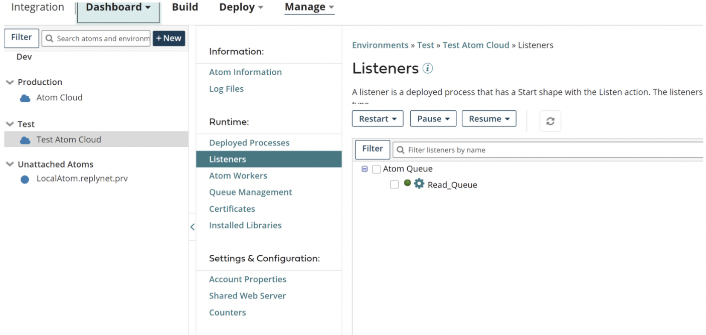

Next step is to test the process in Test Mode.

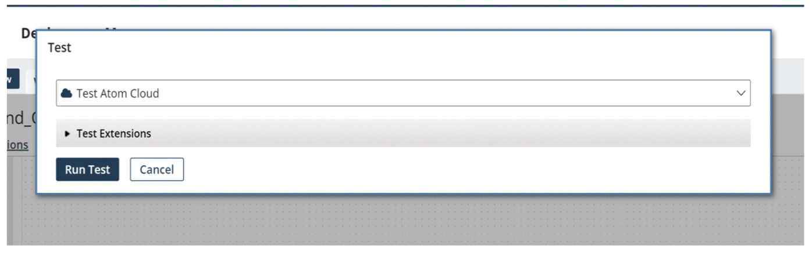

Since the “Read_Queue” is already deployed, I will run the first process (in this case, “Send_Queue”).

After the execution is completed without any errors, the message will be sent to the queue, which can be seen from the “Process Reporting” tab, as shown below.

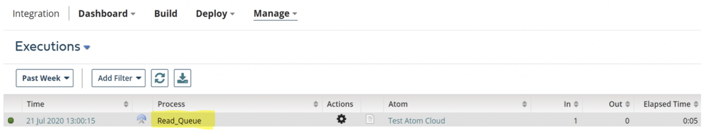

Click on the “View Process Logs” icon. The message can be seen from the Notify Shape, which prints the data that is passed from the first process (Send_Queue).

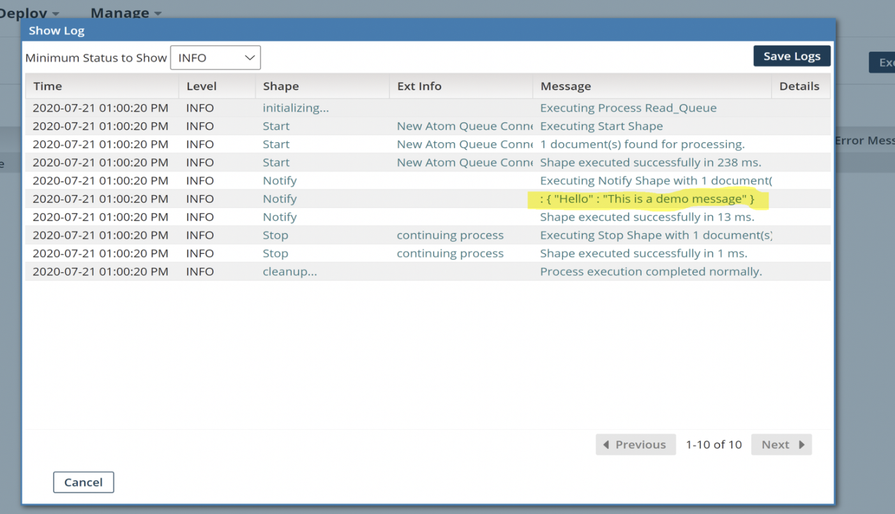

## Errors

Common errors when using Atom Queues are:

- If message delivery fails, the Dead Letter Queue will be created corresponding to the Destination Queue and the failed messages will be placed in the Dead Letter Queue after 6 retry attempts by the shared queue server of the same Atom Queue component. The messages in the destination Dead Letter Queue can be manually retried from the “Queue Management” tab, via the Platform UI.
- If the destination is other than an Atom Queue Server and there is a need to catch the failed messages in case of any failures, the best way to handle this scenario would be to re-queue the failed messages in the catch branch of a try/catch. They can either be placed back on the original queue or they could be placed on some sort of retry queue.
