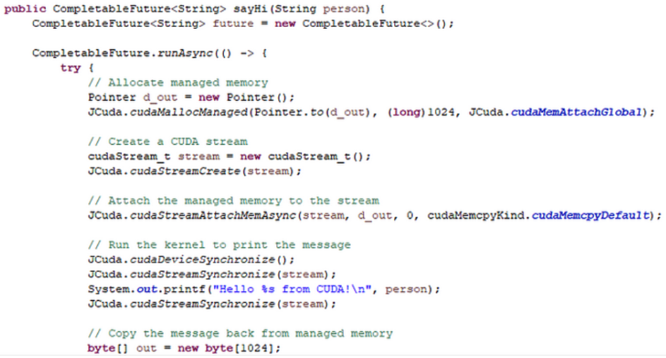
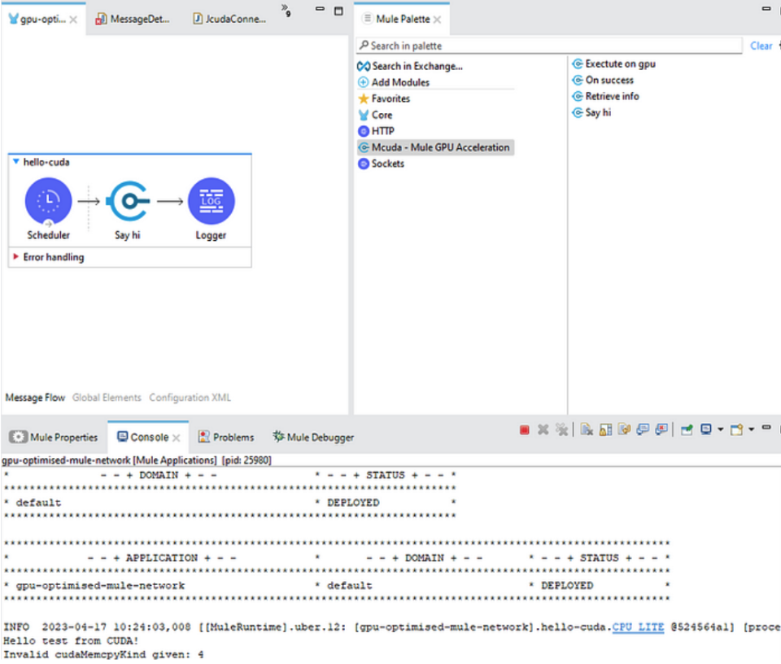

Hello, fellow tech enthusiasts! My name is Nicky, and I’m a MuleSoft expert developer and architect with six years of experience in the field. I’m also a recognized MuleSoft mentor and a big fan of learning by doing weird stuff.

Recently, I’ve been working on a pet project that I thought might interest some of you. I’ve written a Mule plugin that has the ability to use **Cuda cores for parallel asynchronous processing**. Now, I know what you’re thinking: “That’s not recommended or supported!” And you’re right. This is not something that should be done in a production environment. However, in theory, and practice, this idea works.

So why did I create this plugin? Well, I’m always on the lookout for new and innovative ways to push the boundaries of what’s possible with MuleSoft. And using Cuda cores for parallel processing is certainly one way to do that.

Think about it: with the ability to leverage Cuda cores, we can achieve incredible levels of processing speed and power. For example, we’ve been trying to train a neural network for payload validation, which so far has had some positive results. Image processing, video encoding, and other intensive tasks could also benefit from this kind of parallel processing.

Of course, there are some risks involved. If not done properly, using Cuda cores could cause instability, crashes, and other issues. That’s why I want to emphasize that **this is not something that you should start using in your projects**. However, for those who are interested in exploring the possibilities of this kind of technology, it’s definitely worth a read.

## Prerequisites

We won’t dive too deep into the technical details of how this plugin works, it’s important to note that it **requires a machine with an NVidia GPU**. Without this hardware, it won’t be possible to utilize Cuda cores for parallel processing. Who knows; maybe we’ll see GPU-enabled Mule Runtimes in the future?

Assuming you have the necessary hardware, the next step is to **install the developer packages for Cuda**. These packages include the necessary tools and libraries to program the Java code that will interact with the GPU.

Once you have the Cuda developer packages installed, you can then utilize JCuda to communicate directly with the GPU memory. JCuda is a Java binding for the Cuda runtime and driver API, which makes it possible to write Java code that can take advantage of Cuda cores.

(Runtime API = Basic, pre-compiled functionality. Driver API = write your own kernel, almost like low-level C programs.)

## Mule project

To get started with JCuda, you’ll need to include the JCuda JAR files in your Mule project. You can download these JAR files from the JCuda website. Once you have the JCuda JAR files included in your project, you can start writing Java code that will utilize the GPU.

> [!BUTTON]
> [JCuda Tutorial](http://www.jcuda.org/tutorial/TutorialIndex.html)

In conclusion, I’m excited to see where this kind of innovation could take us in the world of MuleSoft. As always, I encourage everyone to keep pushing the limits and exploring new ideas. Who knows what we might discover next?

The below image shows a proof of concept interaction of a Mule flow and the GPU. Ignore the memcpy error, that’s my fault ;-)

