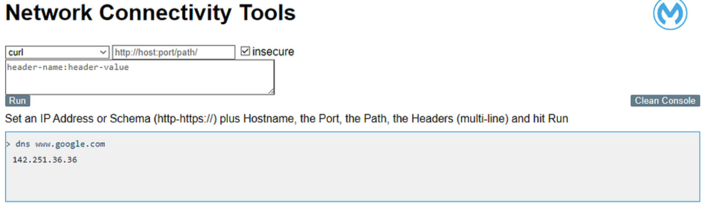
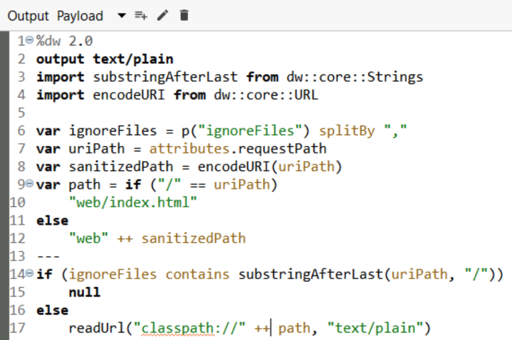
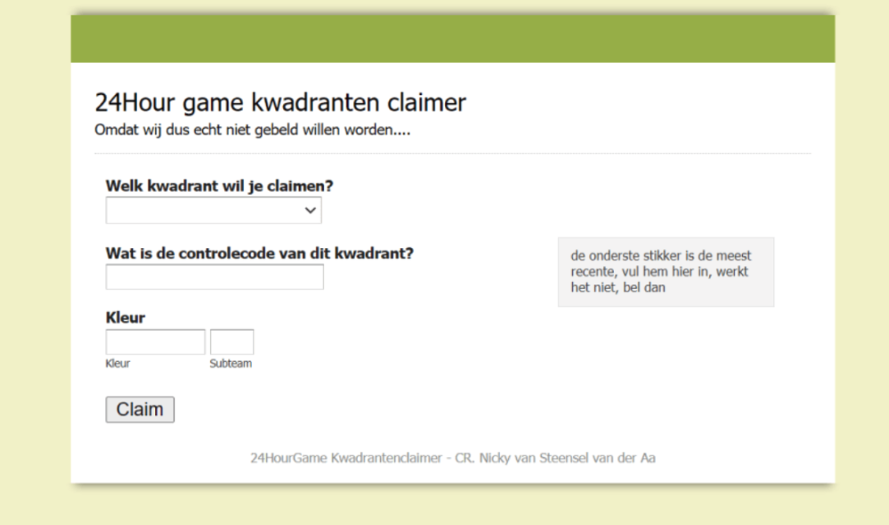

*GUIs, you love em or you hate em.*

Software these days often gets shipped with a fancy user interface, though many developer tools are still CLI based.

We devs seem to love the CLI. It is powerful and scares away the annoying managers and *The Business*, but most importantly: it works nicely with our scripts, builds, and pipelines!

We do use GUIs though and cannot live without them, think of your APIKit Console, or Postman. Yes, once your collections are done you’ll end up running them with CLI variant Newman, but that’s for some other blog.

No, What I want to cover today is GUIs in your integrations.
99/100 times this won’t be needed, but we’ll discuss those edge cases where a GUI might solve your problems.

GUIs are there to help and visualize, but if you ask me there is a gap in the development lifecycle where we’re not used to providing them.

We as developers are content to work with the console, we print DEBUG statements and ERRORs and can solve any problem with that. But that’s technical operations, what about the functional operations? Do I want to give the technical logs to the functional maintainer? Will they understand, or will they even check those logs regularly? As a developer I don’t mind checking if a batch has run, or which records failed, but if those questions arise regularly that quickly becomes a time sink.

Now let's assume our business user is as non-technical as they get, they don’t want to see logs, even if we’ve limited those to the notifications intended for them. We can hook up an in-flow SMTP connector and send them a mail, or use a platform alert, but that might not be a good way of sharing the information they want. Let's discuss an alternative and some examples of that. I promise you, a well-designed interface can make your life as a Dev/Ops engineer more relaxed, and keep your focus on those tasks that actually matter.

The first Mule GUI I ever made was years ago and used the static resource handler to display a simple HTML form, if you’re interested look at my horrible project here:[Mule Hackathon — RealLifeExploration Game](https://dev.to/wds444/real-life-exploration-game-powered-by-mulesoft-3bl6).

It’s a mess of code and was made under a time crunch without all the dedicated software and services a real company has. I didn’t have a web server, so Mule had to do it. Same for the app logic, or the “Database”. Which was just a CSV file getting updated whenever an action happened.

So far, I’ve only had to **work** with Mule GUIs four or five times. Only one of these was an actual customer integration, but two of them were deployed in production. I’m pretty sure you’ve even used one, maybe even in your CloudHub production VPC… Skeptical? 
I am of course talking about Professional service’s[net-tools API](https://github.com/mulesoft-consulting/net-tools-api)!

In the tried and trusted platform network testing toolkit, a client needs some connectivity tested? Use net-tools and curl to check if it’s working.

Mule can’t resolve a Hostname? Use net-tools to check if the DNS server is available.

> [!TIP]
> Make sure to remove it once done, and don’t expose it to the internet for too long, if someone can find it they have some powerful tools available to check out your network.

It offers some nice features, but what I'm more interested in is the code!

The net-tools project has some iterations out there on the internet, but here we see the engine of this version’s ‘webserver’ any URL requested gets parsed and cross-referenced with a file in the web directory. That directory contains an index.html file and any necessary .js, .css, or other resources.

The HTTP>Load Static Resource handler can do roughly the same but the result is that mule can serve a webpage on a chosen URL and port.

These flows can use security filters, like net-tools is doing, or even be secured by API-Manager Policies and thus be available to any user you choose.

In some of these projects, we took it a bit further, and we created specific Object stores for metadata, statistics, and even half-transformed payloads.

Using Ajax in the HTML page can easily change this static display into a page that can dynamically display whatever info you choose to supply it from the endpoint.

Now, we’ve discussed the HOW, now let’s look at the WHY.

A practical example was a gigantic project where we had non-technical business users that wanted live insight into the tests they were doing.

We’re talking about a few developers working on the APIs and dozens actively bombarding the system with tests. We could not handle the volume and logging all payloads was not feasible. The questions they had often had us look into the payload in different stages of processing. For reference, we’re talking input, JSON parsed input, two (hopefully identical) JSON responses, and a marshaled output. These messages were hundreds, sometimes thousands of lines long, and while we were not versed in reading them, they were.

Had something like Splunk or ELK been available we could have used that, but it was not possible within the limitations.

What we decided to do, at least during the development phase that lasted for over a year, was to store all these partially processed payloads into dedicated Object Stores with the correlation ID as their key.

A five-minute job created a few endpoints that would return this data in text format.

The interface from the net-tools API was *borrowed* and expanded with a few extra textboxes and UI elements. The dropdown box now used AJAX to populate the choices of correlation IDs and Ajax would GET these different payload values using the dedicated API endpoints.

Construction of this interface from concept to deployment took less than a day, and enabled Functional Operations to do their work without interference from us!

A few iterations of feedback later we would include some fancy CSS to mark those parts of the payload response that were not identical which was not too difficult either. Another feature was that we added a little metric stating the percentage of ‘correct’ requests which gave the entire functional team a great insight into the effectiveness and completion of the entire project. (parsing and processing 2000+ separate messages).

The Business was extremely happy with this, as their work now became magnitudes easier.

What started as a slight sidetrack to prevent a small annoyance is now used daily and really helps to show the total project progress!

Another small example: The business was used to providing a monthly CSV file, but the FTP server they did that on had to go. A quick HTML page later that allowed them to upload that CSV file instead, to be loaded straight into the application logic solved all the requirements! (Yeah, I did not recommend this solution architecturally, but we were limited in the accepted options…)

To sum up the post above: GUIs in Mule are really easy and can help you display data straight from the source.

From testing while the project is in development, to easily displaying metadata or debug info to less than technical users. Even updating data or logic is possible, just make sure you properly think of the access controls and who you're providing them to. And don’t forget the most important rule: **Sanitize and verify any input!**

