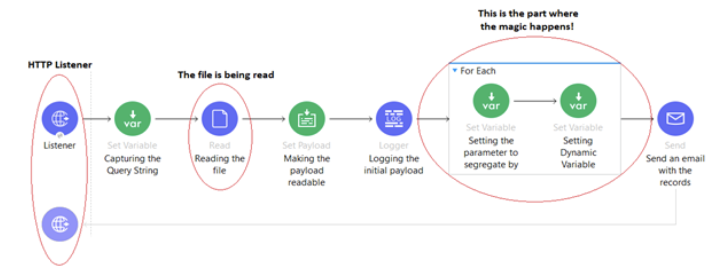
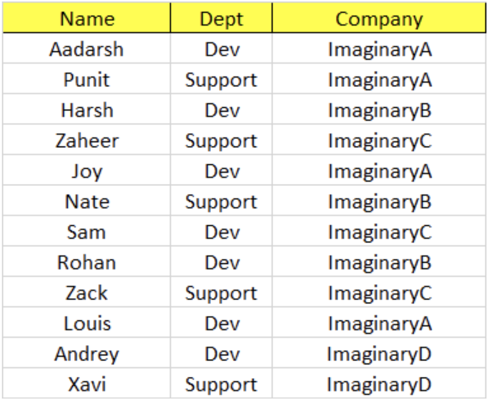
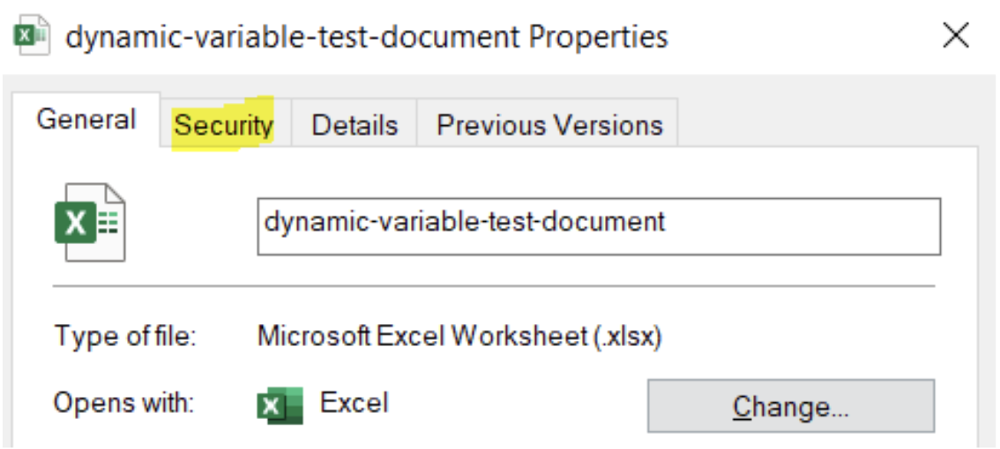
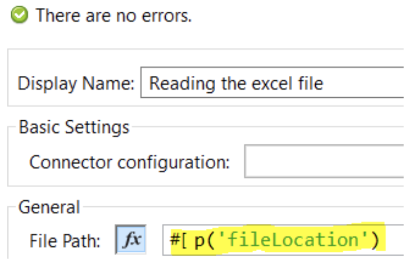
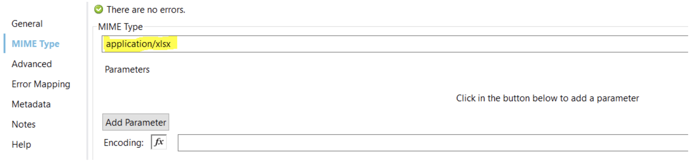
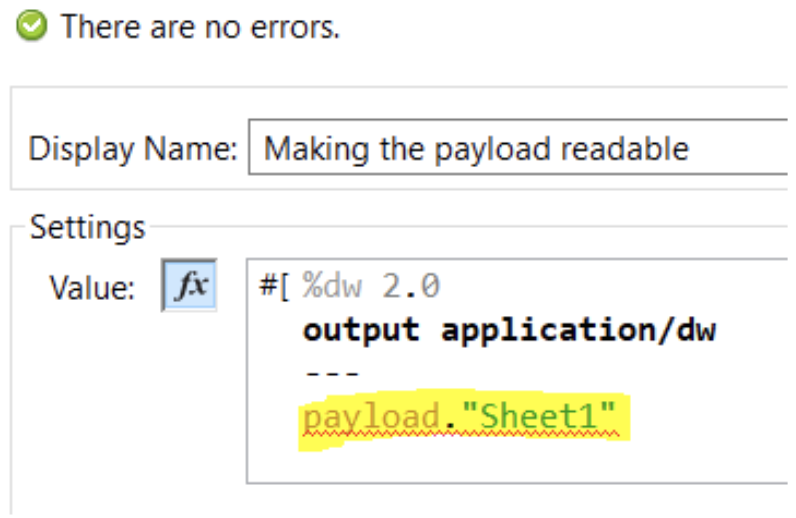
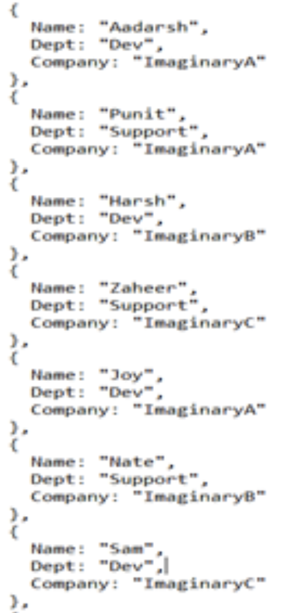
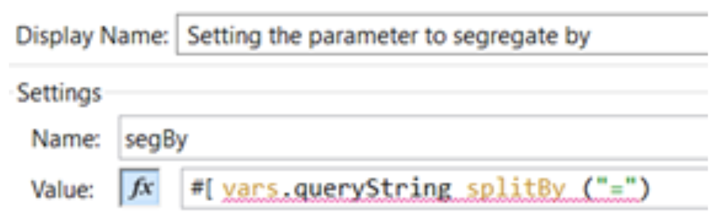

*GitHub repository with the Mule project can be found at the end of the post.*

On one of my assignments, I was presented with a rather peculiar demand. The demand was to write the records belonging to a unique identifier in a variable. Seems pretty easy, right?

But the catch was, we do not know how many such unique identifiers are going to come in a particular batch. So, to allocate a separate variable for segregating records belonging to a particular unique identifier where the number of such identifiers is unknown seemed to me like a task which needs some amount of research.

The immediate thought I got was, why not use a script which creates as many variables pertinent to the number of unique identifiers in a batch and then place all the records in the specific variable. In other words, I was thinking of creating a variable during the runtime.

As any developer would do, the first thing I did was to go to our own “stack-overflow”, i.e. MuleSoft documentation, to see if there is anything that is already available. Sadly, I could not find anything.

After hours of struggle and googling, I found a solution and it stuck to me that it might be helpful for other developers as well.

The idea was to create a POC to see whether the “idea” actually works or not. Basically, we will implement a flow which will:

- Will be listening to a HTTP call which will be equipped with a query parameter.
- Once the flow is summoned, it will read an excel file which has 3 features namely, “Name”, “Dept” & “Company”.
- Based on the query string, we will segregate the records and will send an email with the final payload.

## Let’s implement it in Anypoint Studio!

**1.** Create a new mule project in the studio.

**2.** Create a flow like this one:

**3.** The HTTP request should be something like below:

**4.** The file which we will be using looks like this:

Here, there are 4 companies namely, ImaginaryA, ImaginaryB, ImaginaryC & ImaginaryD. There are 2 departments namely, Dev & Support.

Let’s dive deeper into the DataWeave scripts and the for-each that we have used.

## Prerequisites

Well you may ask this question: How to read an excel file (or as a matter of fact, any file) from your local system?

Here you go!

**1.** First you need to use a “Read” component from the “File” palette and give the location of the file. You can get the “path” of a file by doing the following:

Right click on the file and click on the “Security” tab.

You can see “Object Name” on the top which depicts the location/path of the file that you are willing to use. Copy that string and keep it handy.

**2.** Come back inside Anypoint Studio and click on the “Read” component.

First Configuration

While copying the “path”, you will get something like C:\Users\Documents\Test Files\&lt;&lt;File Name>>. Mule does not understand “\”. Make sure to replace “\” with “/”.

So the final address you should be using for the “File Path” in the above configuration should be something like C:/Users/Documents/Test Files/&lt;&lt;File Name>>.

Second Configuration

You need to add the MIME Type. Since in this case we are dealing with an excel file, we will be keeping the MIME Type as application/xlsx.

**3.** Once this is done, we need to specify which sheet we are trying to read. A simple DataWeave script can help!

By writing payload.“Sheet1”, we are instructing it to read the data which is there in the Sheet1.

Now that you know how to read an excel file, we are good to go ahead. Let's explore now!

## Let's head back to our studio

**1.** Once the file is read, we have logged the payload to see what is being fed to the mule flow (Refer to the prerequisites to learn about reading a file).

**2.** We can see that the payload is being read like above. So, to intercept the entire payload as individual chunks, we have used a for-each which divides the payload uniformly.

**3.** On the onset of the flow, we have captured the queryString. A query string contains the total string which we have passed in the URL.

**4.** Once we reach inside the payload, we split the query string by the separator “=”.

We can see **Company** as **segBy[0]** and **ImaginaryA** as **segBy[1]** (please check the above point for getting the references).

**5.** Once that is done, we will write the DataWeave script to implement the dynamic variable concept.

![set-variable XML using a dynamicVar to build a variable name from segBy[0] at runtime](../../assets/blog/dynamic-variable-in-mulesoft-11.png)

The name of the variable is kept in accordance with the feature, which we have mentioned in the query string, by which we want to segregate our records. In this case we want that feature to be Company.

Here in the 3rd line, we have written dynamicVar = payload[vars.segBy[0] as String] as String

- We have created a local variable named dynamicVar which will create a placeholder as per the number of companies in the payload.
- This will be dynamic in nature, which means that the number of variables to be created will be decided during the runtime.

The script that follows it simply checks if the company named variable is available or not.

- If available, it pushes the records into that already available variable.
- If not available, it creates the company named variable and then inserts the records.

**6.** Once that is done, we will send an email to confirm whether our code has worked or not. In order to summon the variable, we will use the following script.

![Email Body config reading the dynamic variable via vars[vars.segBy[1]] as plain text](../../assets/blog/dynamic-variable-in-mulesoft-12.png)

In our case since we have 4 companies in our payload, 4 variables will be created. Now, if you remember the query string, we want the records belonging to the company **ImaginaryA.** The command **segBy[1]** will return the value **ImaginaryA** (please check step 4).

Hence, by the command we are trying to access the variable created for **ImaginaryA**.

**7.** Once the process completes, as per the POC we should receive a mail which should look something like this:

So, finally we have a solution which can address our issue.

## GitHub repository

[ProstDev GitHub - Dynamic Variable Mule](https://github.com/ProstDev/dynamic-variable-mule)
