## Using SonarQube and Docker

The quickest way to have an installation of SonarQube up and running is using a Docker container. SonarQube is a platform for continuous inspection of code quality to perform automatic reviews with static analysis of code to detect bugs, [code smells](https://en.wikipedia.org/wiki/Code_smell) and security vulnerabilities. This definition is not by me, it is from Wikipedia ([https://en.wikipedia.org/wiki/SonarQube](https://en.wikipedia.org/wiki/SonarQube)).

If you want to know more about SonarQube and all its capabilities, you can visit their website:

[https://www.sonarqube.org/](https://www.sonarqube.org/developer-edition/?gads_campaign=South-America-SonarQube&gads_ad_group=SonarQube&gads_keyword=sonarqube&gclid=Cj0KCQjwvYSEBhDjARIsAJMn0lga8FBAQxpXuiDOFvD4zK28tuA1_8TlLkBTOtDcFaWIahnsU2DtyKUaAgbGEALw_wcB)

On the other hand, Docker delivers software in packages called containers (they are ready to use). It is very cool, isn’t it? If you want to learn more about Docker, please visit their website:

[https://www.docker.com/](https://www.docker.com/)

## Docker Hub

Let’s use Docker Hub (the world’s largest library and community for container images) to find a SonarQube Docker container to perform our MuleSoft applications code reviews.

Step by step:

- Go to Docker Hub: [https://hub.docker.com/](https://hub.docker.com/)
- Sign in (or sign up if you do not have an account already)
- Download the following image: mulesonarqube
- Run the Docker image.

That is all! Now you have a SonarQube instance up and running, and it is ready to perform MuleSoft code analysis.

## SonarQube Docker Container

To download the Docker image (it will take a while):

```bash
docker pull fperezpa/mulesonarqube:7.7.3
```

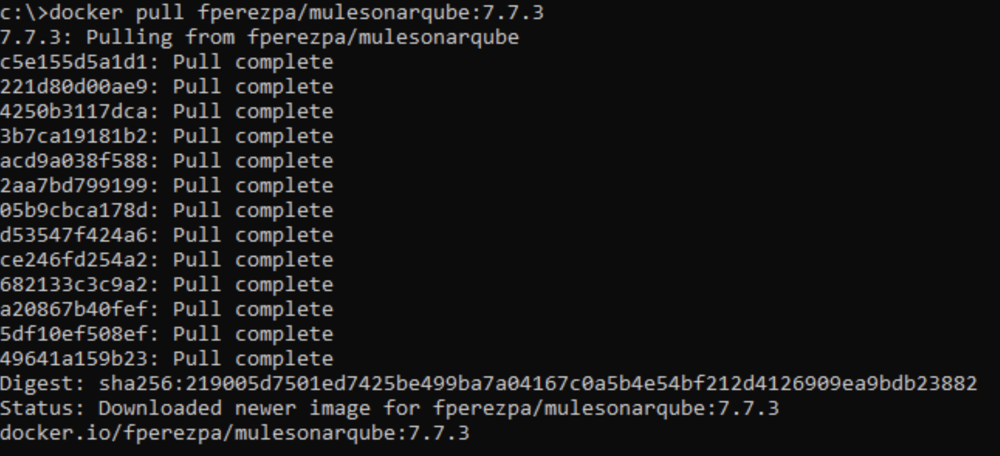

To run the Docker image:

```bash
docker run -d --name sonarqube -p 9000:9000 -p 9092:9092 fperezpa/mulesonarqube:7.7.3
```

You should see something like this in your command line:

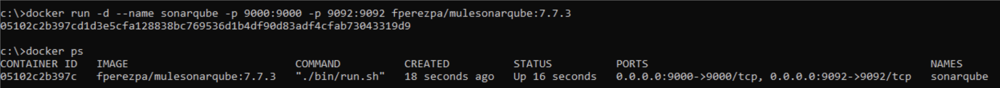

Or in your Docker Desktop:

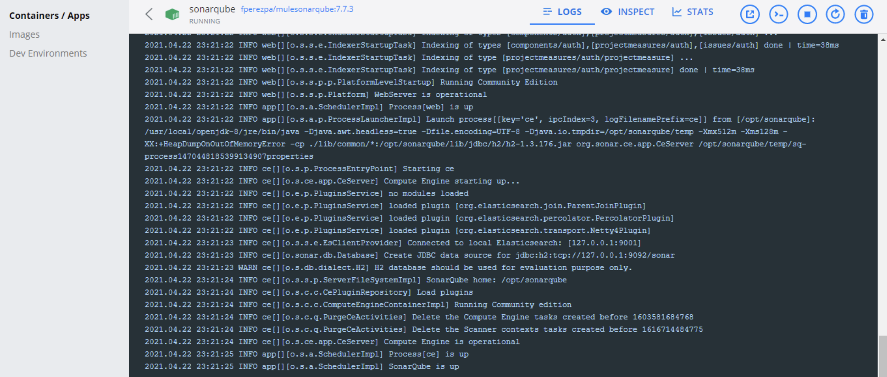

If you want to know more about Docker Desktop (available for Windows, Mac and Linux), visit this website: [https://www.docker.com/products/docker-desktop](https://www.docker.com/products/docker-desktop)

## Go to your SonarQube instance

That is it! Your SonarQube instance is ready to use.

Go to: [http://localhost:9000/projects](http://localhost:9000/projects) (use admin/admin as default username and password to Log In, you can change it later).

You should see something like this:

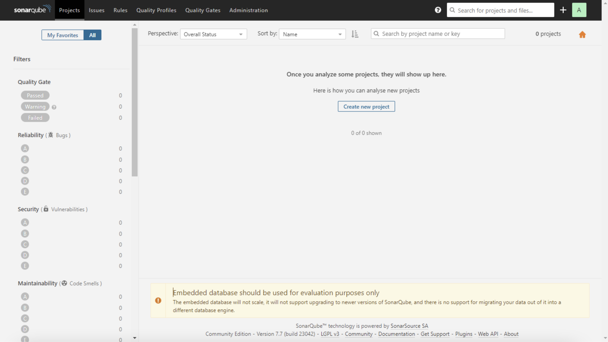

There is a set of Rules already configured in your SonarQube instance to analyze MuleSoft code. You can find those clicking on Rules (top menu) and then on Mule (left menu). If you are feeling lucky you can modify those rules as needed.

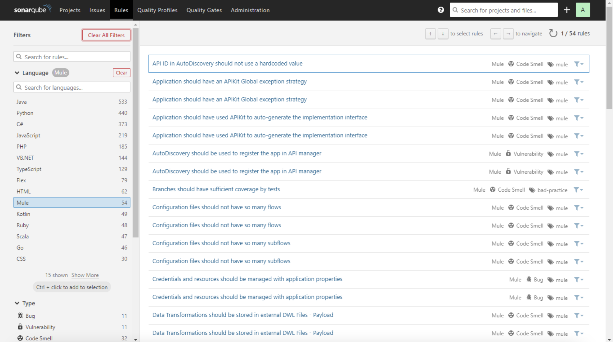

There are two Quality Profiles: one for Mule 4 applications and another one for Mule 3 applications. The default Quality Profile is Mule 4.

Explore it by clicking on Quality Profiles (top menu) and then filtering profiles by Mule (picking list).

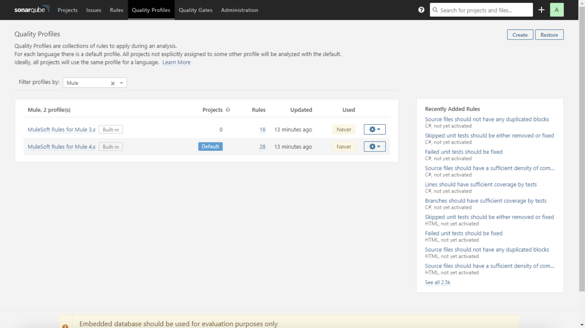

Continue exploring your SonarQube, enjoy the trip!

## Important! XML configuration

SonarQube already comes with an XML plugin. But…Your MuleSoft code is also XML. The plugin we are going to use inspects XML files, so you need to remove the XML files from the default XML plugin in SonarQube. This will avoid the XML plugin checks for your MuleSoft application and lets the Mule plugin into action.

To do that, click on Administration (top menu), then Configuration and General Settings (top left menu), click on XML (left menu) and remove the .xml extension from the XML plugin configuration. You should see something like this (click on the red cross to remove .xml line):

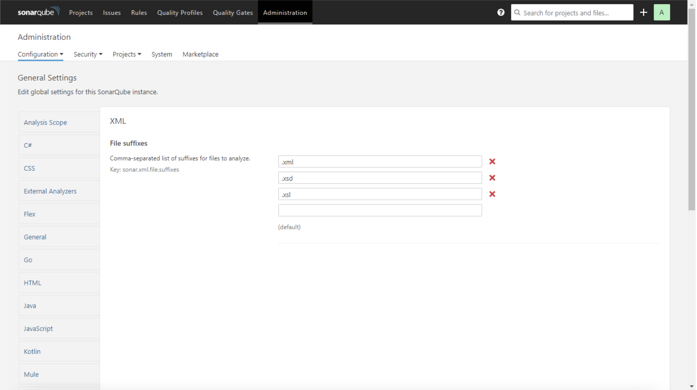

Then click on the Save button and you are done! Your SonarQube is ready to check your MuleSoft code.

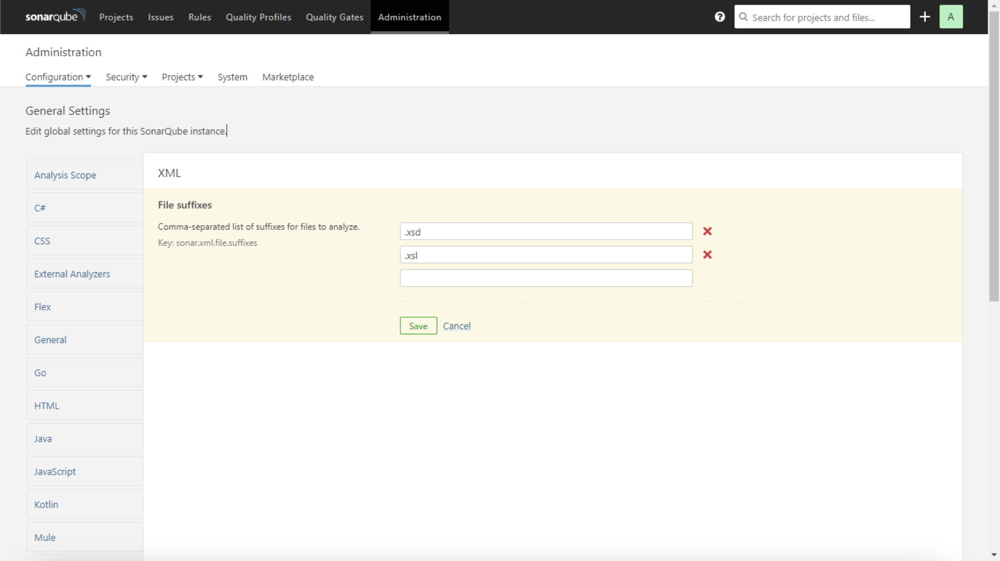

## Use the Maven Plugin

We are about to use a Maven plugin to verify the quality of our MuleSoft code using SonarQube. This plugin contains a set of rules and metrics that are going to be used and calculated every time a project is being inspected. This is a plugin developed by MuleSoft and it is unlicensed.

If you want to know more about this plugin, please refer to the official repository:

[https://github.com/mulesoft-catalyst/mule-sonarqube-plugin](https://github.com/mulesoft-catalyst/mule-sonarqube-plugin)

To use this plugin, open a command line and navigate to your MuleSoft project’s home directory and run the following command:

```bash
mvn sonar:sonar -Dsonar.host.url=http://localhost:9000 -Dsonar.sources=.\src
```

- -Dsonar.host.url is the URL where your SonarQube instance is running.
- -Dsonar.sources is the path where the code to analyze is (typically src folder under your MuleSoft project home).

I have quickly created a Kafka producer-consumer MuleSoft app and I will analyze this code.

You should see something like the following:

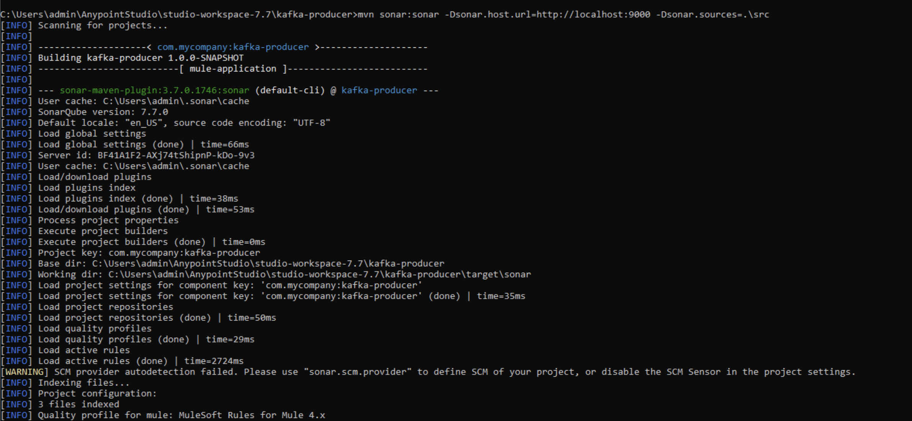

Finally, the plugin completes the code analysis, and the report will be available at your SonarQube instance:

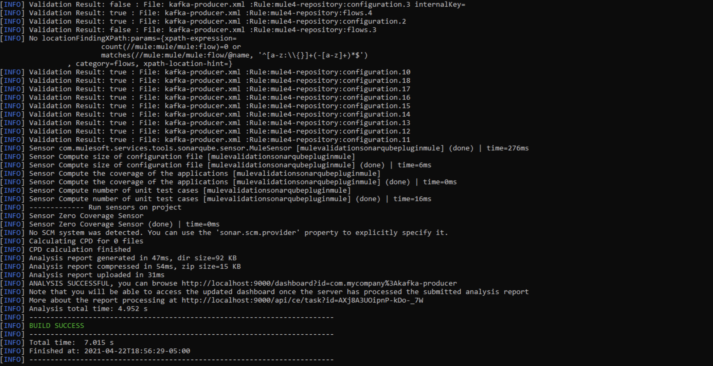

## SonarQube Report

You will find the report in your SonarQube instance. Just navigate to Projects (top menu), you should see your project there.

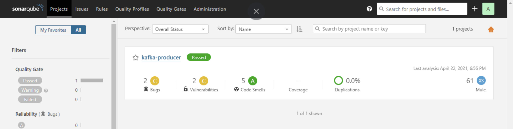

Click on your project and explore the report details.

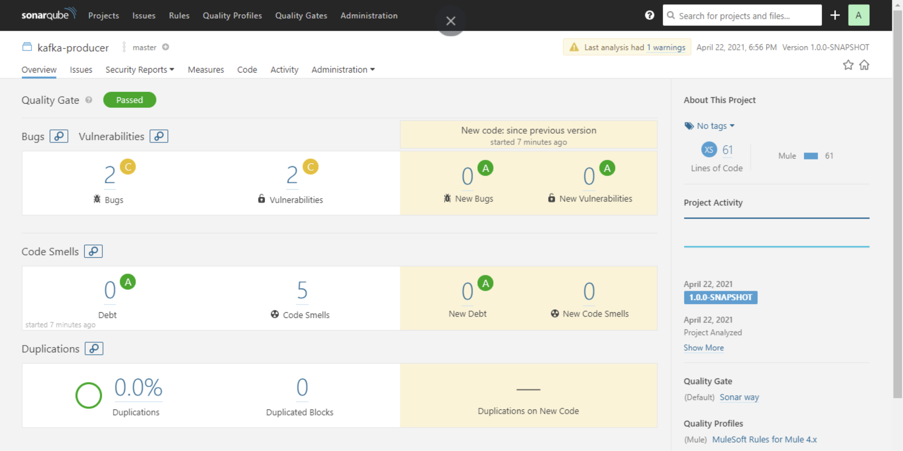

Let’s take a quick look at the Bugs section.

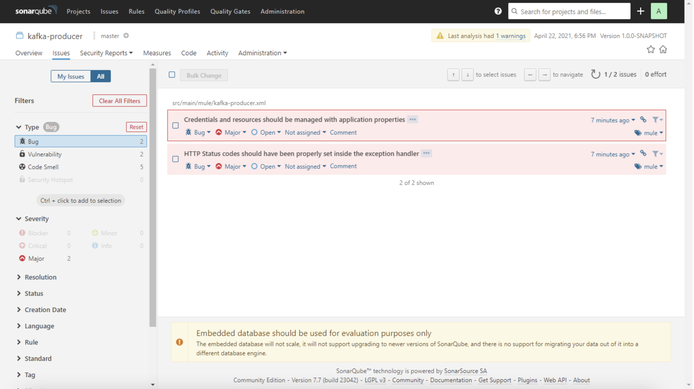

## Conclusion

The report is highlighting a bug that says that credentials and resources should be managed with application properties. This was intentional. The application has an HTTP Listener with hardcoded host and port values. This is not a good practice to develop MuleSoft applications, those should be placed in a properties file.

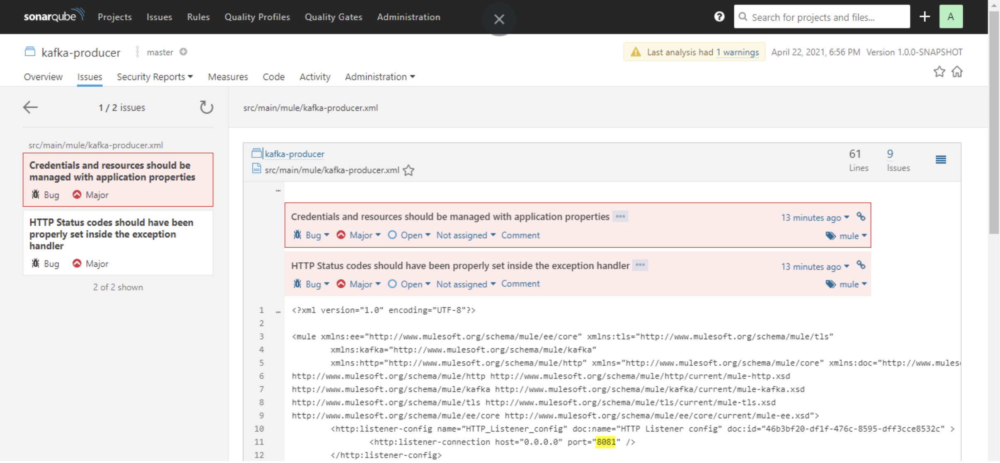

You can also explore the Mule default Rules definition in your SonarQube instance and modify/add rules as needed. If you have different MuleSoft coding standards you can enrich that set of rules.

This is the first step to semi-automate code reviews for MuleSoft projects. After this you can integrate this Maven plugin with a CI/CD pipeline. This is very cool, right?
