You installed the Anypoint Extension Pack, opened MuleSoft Vibes... and it just won't turn on. The AI
features are greyed out, and logging in to Anypoint Platform doesn't seem to change anything. The
catch: **MuleSoft Vibes needs a Salesforce org with Agentforce enabled behind it**, and that
connection isn't set up for you.

This guide walks through the whole thing end to end, from installing the extension to seeing *"How
can I help you today?"* in your editor. No prior Salesforce setup required; we'll spin up a free
Developer Edition org along the way.

## What you'll need

- **Visual Studio Code** installed ([download it here](https://code.visualstudio.com/download)).
- An **Anypoint Platform account** with admin permissions ([sign up for free](https://anypoint.mulesoft.com/login/signup)).
- A **Salesforce Developer org**, or a few minutes to [create a free one](https://developer.salesforce.com/signup) (we'll do that here).

## Step 1: Install the Anypoint Extension Pack

Open VS Code, go to the **Extensions** view, and search for `anypoint extension pack`. Install the
**Anypoint Extension Pack**, and make sure it's published by **Salesforce**.

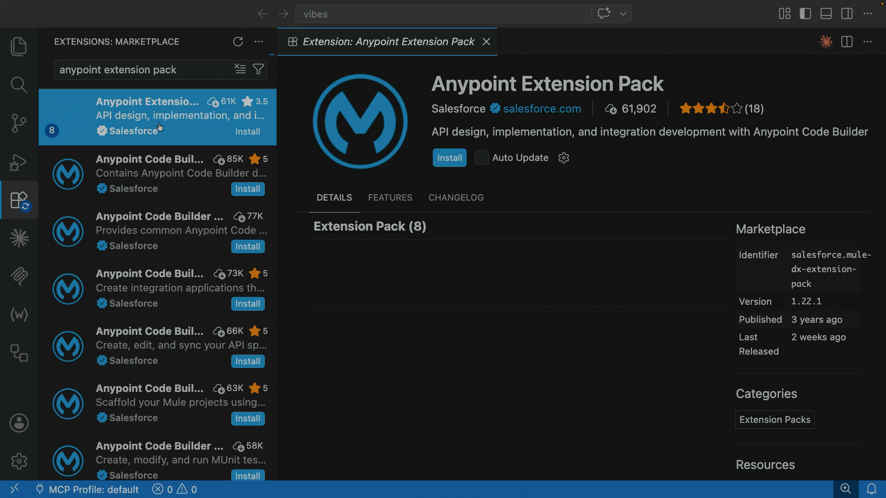

Once it finishes, you'll get two new icons in the VS Code activity bar. The first MuleSoft logo is
**Anypoint Code Builder**. The second one is **MuleSoft Vibes**, the AI assistant we're here for.
Click it, then click **Log In to Anypoint Platform** and follow the browser prompts to sign in.

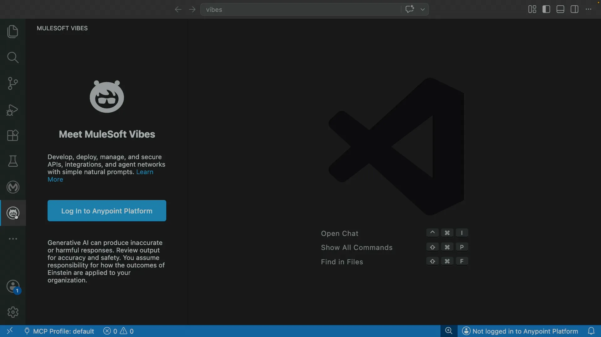

At this point Vibes still won't have its AI features. That's expected; the rest of the setup happens
in Anypoint Platform and Salesforce.

## Step 2: Enable Agentforce in Anypoint Platform

Log in to **Anypoint Platform** in your browser and open **Anypoint Code Builder**. From there,
select **Go to Access Management**.

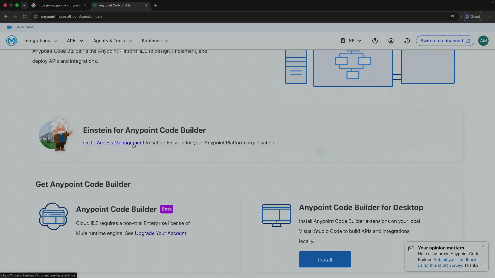

This will open **Access Management** in the **Salesforce** section. Find the **Accept** button to
enable Agentforce for Anypoint Platform.

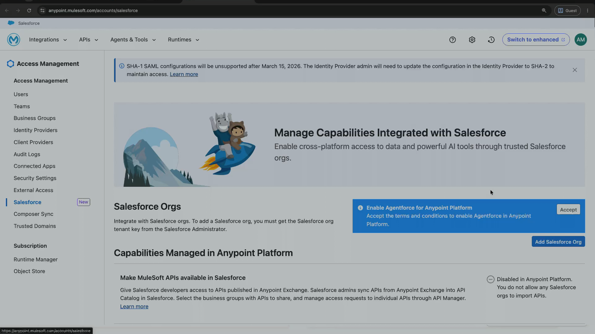

After you click **Accept**, this will open the terms and conditions. Check the **I accept** checkbox
and press **Accept** again.

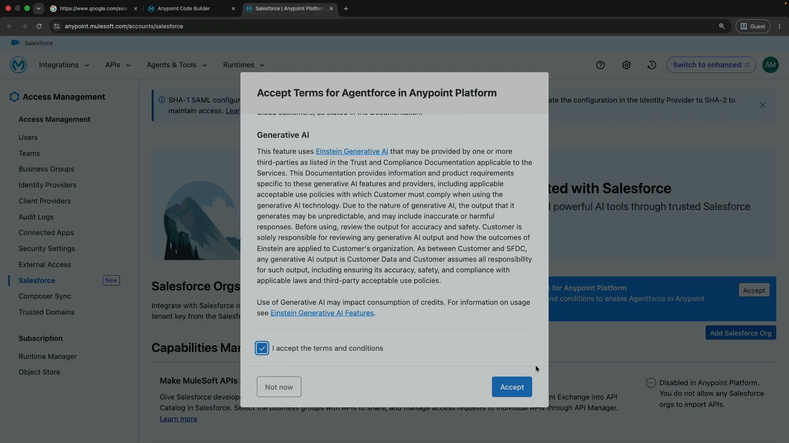

To finish enabling everything, you'll need to connect a Salesforce org. If you don't have one, the
next step creates a free one.

## Step 3: Create a free Salesforce Developer Edition org

Head to [developer.salesforce.com](https://developer.salesforce.com) and open **Browse trials**.
Pick **Get a Developer Edition**. It's free. Or you can go straight to the
[sign-up link](https://www.salesforce.com/products/free-trial/developer/) directly.

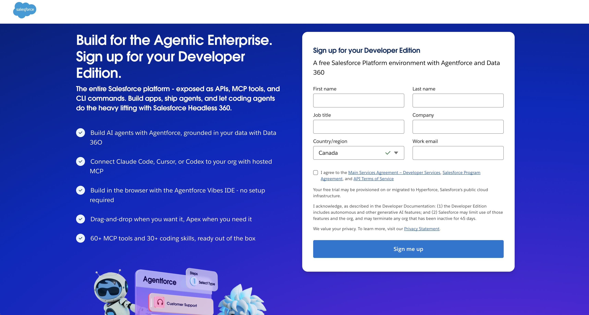

Fill in your details and click **Sign me up**. You'll get an email to set your password; once that's
done, log in to your new org. Salesforce will send a verification code to your email; enter it, and
you're in your Developer Edition org.

## Step 4: Turn on Agentforce and Einstein in Salesforce

Click the gear icon and open **Setup**.

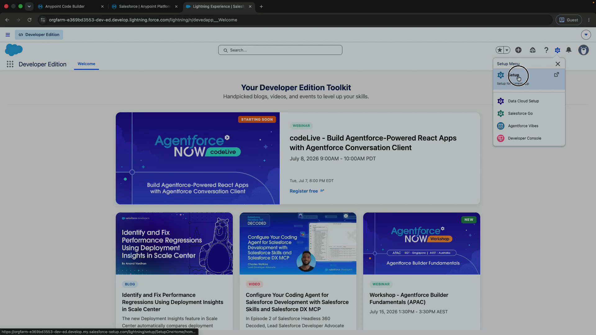

In **Quick Find**, search for `agentforce`, open **Agentforce Agents**, and toggle **Agentforce** on.

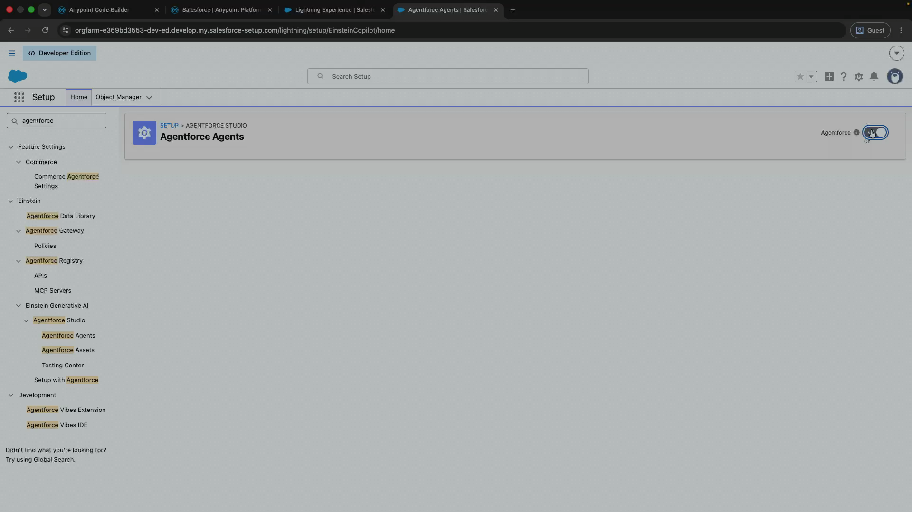

While you're here, search for `einstein`, open **Einstein Setup**, and make sure **Turn on Einstein**
is switched on too, just in case.

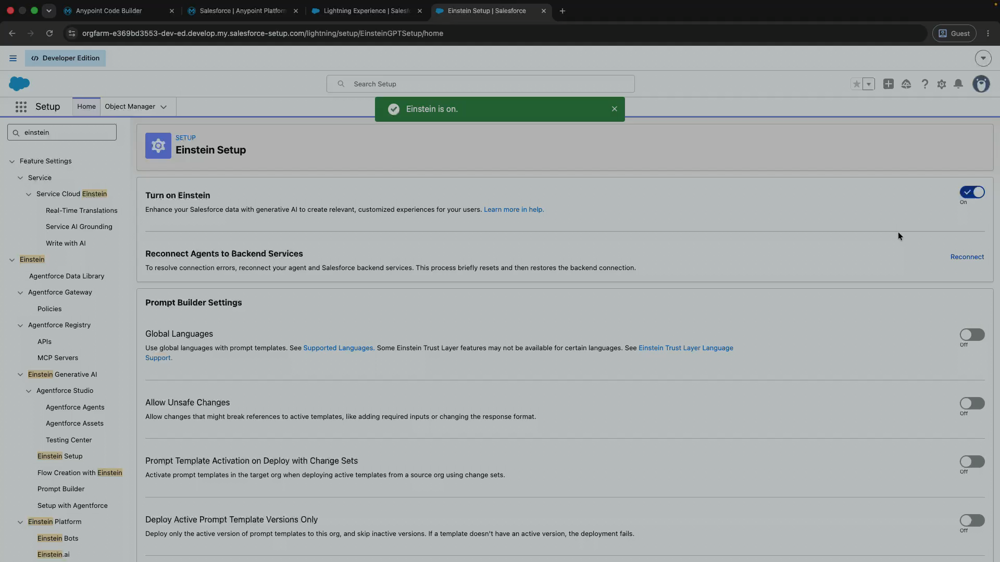

## Step 5: Connect Anypoint Platform to your Salesforce org

Still in Salesforce Setup, search for `mulesoft` and open **MuleSoft Anypoint Platform Setup**. Click
**Complete the Connection**.

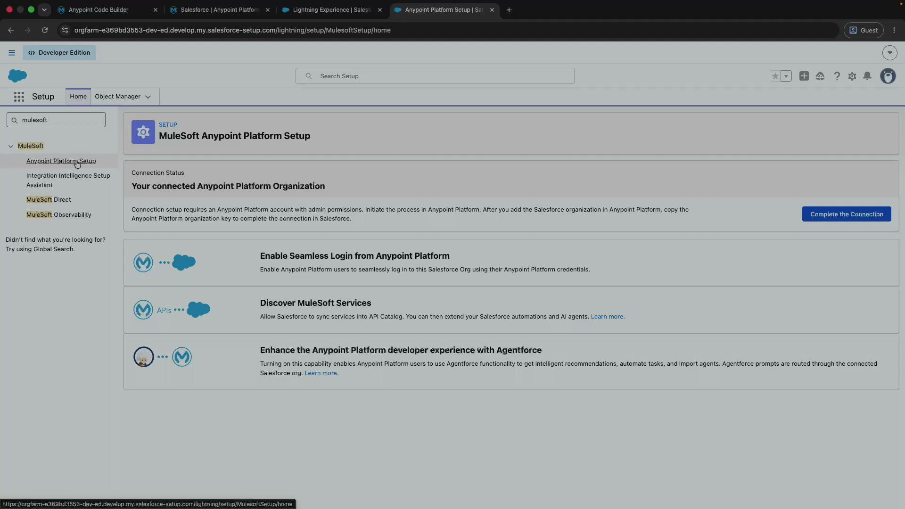

Copy your **Salesforce org tenant key** from the dialog.

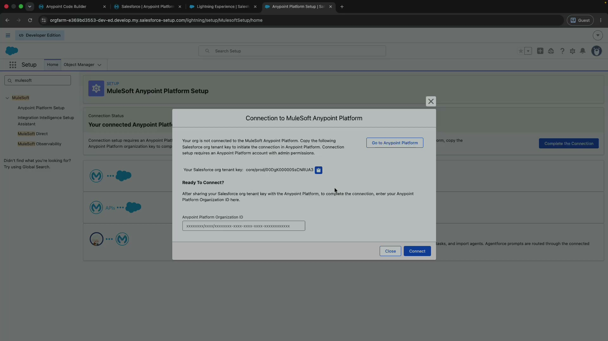

Now switch back to **Anypoint Platform**, go to **Access Management** and the **Salesforce** section,
and click **Add Salesforce Org**. Paste the tenant key you just copied.

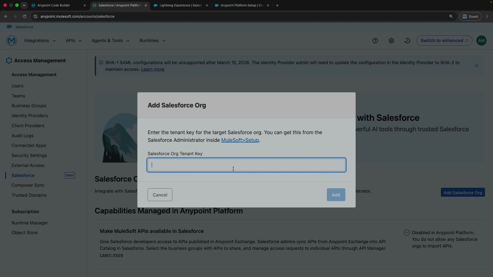

> [!TIP]
> If you see the error `An error occurred: Organization is not yet onboarded to GDoT`, don't panic.
> Just wait a couple of minutes, refresh, and try again. It usually clears on its own.

Give the org a name you'll recognize (I called mine `sfdevaccount`) and click **Add**.

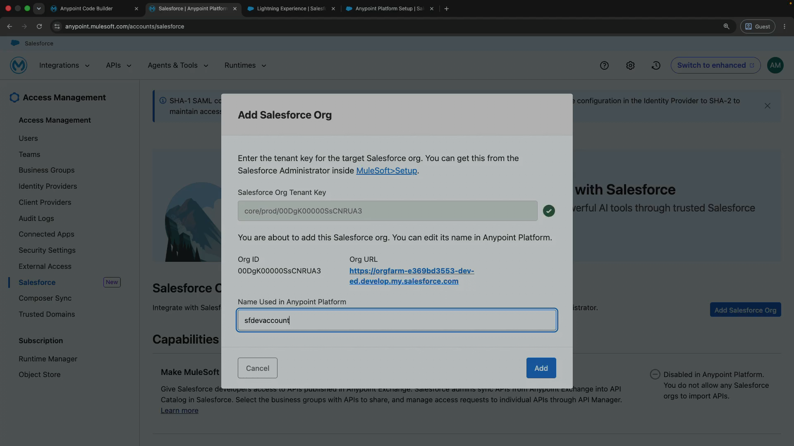

Anypoint Platform now gives you an **Anypoint Platform Org Key**. Copy it, go back to the
Salesforce connection dialog, paste it into the **Anypoint Platform Organization ID** field, and
click **Connect**.

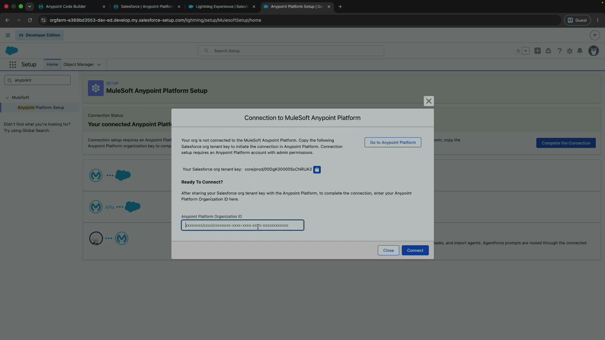

After that, you should see a success message saying the MuleSoft connection was created.

## Step 6: Flip the final Agentforce toggle

One last switch: on the MuleSoft Anypoint Platform Setup page you land on after the connection
succeeds, under **Managed in Salesforce**, turn on **Enable Agentforce in Anypoint Platform**.

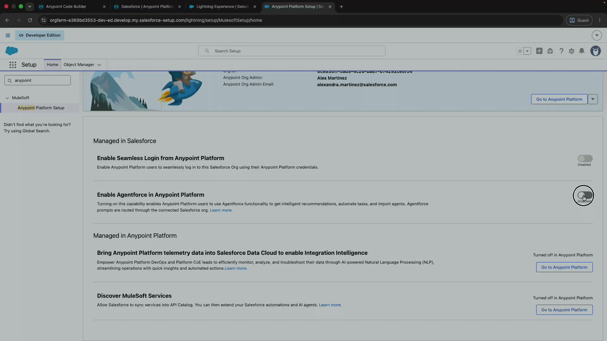

That's the last piece. With this toggle on, Agentforce is enabled in Anypoint Platform and your
Salesforce org is fully connected, so MuleSoft Vibes finally has everything it needs behind it. Time
to head back to VS Code.

## Step 7: Use MuleSoft Vibes!

Head back to VS Code and click **Try Again** on the MuleSoft Vibes panel (it might take a click or
two while everything syncs). When it loads, you'll see **"How can I help you today?"** with suggested
prompts. Vibes is live! 🎉

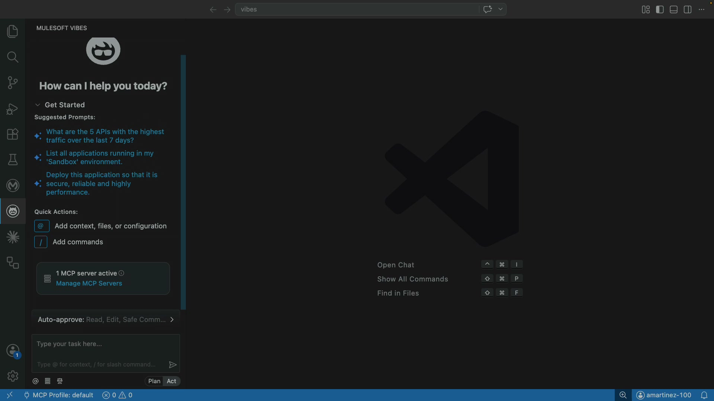

That's everything you need to enable MuleSoft Vibes from Anypoint Code Builder or VS Code. From here
you can ask it about your APIs, list running applications, or have it help you deploy, all right
inside your editor.
