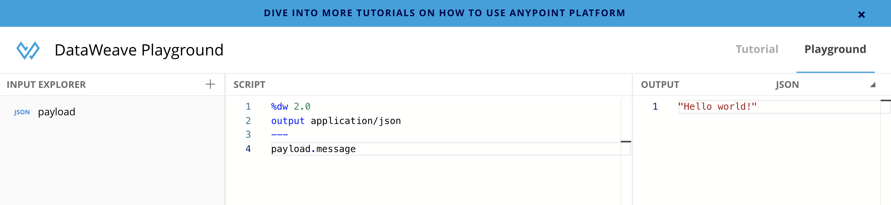
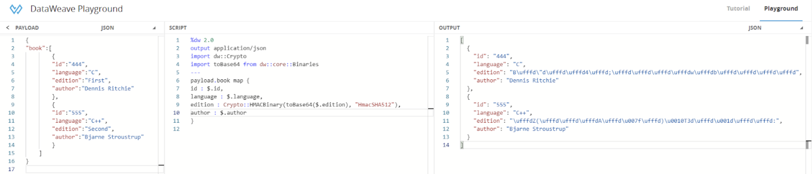

*GitHub repository with the Mule project can be found at the end of the post.*

The main objective of this post is to show how we can implement a field level encryption for a JSON payload in MuleSoft using DataWeave.

The motivation for this implementation came from a demand where the requirement was to mask certain confidential information (say 2 out of 10 fields) in a JSON payload before inserting the object into a database. Since the code was already implemented, we have a limited degree of freedom for bringing something new (like a connector) on board. The only thing that was implementable was a tweak in the already implemented DataWeave script which was performing some operations on the payload.

I used the Crypto module to achieve this. I was literally flabbergasted when I explored this component for the first time. It equips a developer with multiple encryption/decryption mechanisms. Let's start with a formal description of this Crypto module.

This module provides functions that perform encryption through common algorithms, such as MD5, SHA1, and so on. To use this module in your DataWeave script, use: import dw::Crypto.

## Let’s implement it in a DataWeave Script!

For this we will be using the DataWeave playground which you can access using the link[https://developer.mulesoft.com/learn/dataweave](https://developer.mulesoft.com/learn/dataweave).

This is what it looks like!



To implement this, we will be using the following input payload.

```json
{
    "book":[
        {
            "id":"444",
            "language":"C",
            "edition":"First",
            "author":"Dennis Ritchie"
        },
        {
            "id":"555",
            "language":"C++",
            "edition":"Second",
            "author":"Bjarne Stroustrup"
        }
    ]
}
```

Our objective will be to encrypt the edition field. In my case, I have turned the actual data into its Base64 counterpart before encrypting it with a standard encryption technique.

Base64 is an encoding technique that works by dividing every three bits of the binary data into corresponding six bit units. The resulting data is represented in a 64-radix numeral system and as seven-bit ASCII text. Since each bit of the data is divided into two bits, the converted data is larger than the original data (approximately by 33%). The final data is not human readable.

To use this Base64 component in our script, we need to import the “toBase64” function available in the dw::core::Binaries module.

The following 2 lines should be helpful in importing this component:

```dataweave
import dw::Crypto
import toBase64 from dw::core::Binaries
```

Once imported, we can start using it in our script.

We will be using the following code (which is aligned to the payload I have mentioned above) to accomplish our demand.

```dataweave
%dw 2.0
output application/json
import dw::Crypto
import toBase64 from dw::core::Binaries
---
payload.book map {
  id : $.id,                                                                
  language : $.language,       	                                          
  edition : Crypto::HMACBinary(toBase64($.edition), "HmacSHA512"),     	  
  author : $.author        	                                             
}
```

## Let's decode what we have done here!

The first line serves as an iterator all over our payload. It basically goes over the payload to capture the values for different fields.

Once done, we will get down to our encryption business!

```dataweave
%dw 2.0
output application/json
import dw::Crypto
import toBase64 from dw::core::Binaries
---
payload.book map {
  // {payload's ID value}
  id : $.id,
  // {payload's language value}
  language : $.language,
  // {ENCRYPTED edition value}
  edition : Crypto::HMACBinary(toBase64($.edition), "HmacSHA512"),
  // {payload's author value}
  author : $.author
}
```

This code should help us achieve what we wanted to!

Let’s see the original output.

Remember we are trying to encrypt the value for the “edition” field in our payload.



So, we are finally encrypting the data which we want out of the entire payload!

## GitHub repository

[ProstDev GitHub - Encryption DW](https://github.com/ProstDev/encryption-dw)
