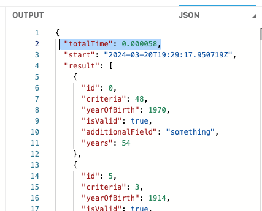
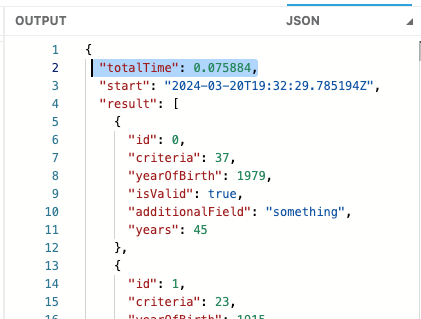

I was working on some code that was using both map and filter together and I started thinking if there was a better way to refactor this code to make it more performant.

Let me first talk about the use case so you get the context of the problem.

## The use case

It all starts with a JSON payload that is an array of objects with only three fields (to simplify the example):

```json
[
  {
    "id": 1,
    "criteria": 5,
    "yearOfBirth": 2000
  },
  {
    "id": 2,
    "criteria": 0,
    "yearOfBirth": 1990
  }
]
```

The goal is to filter out the objects in which the criteria is less than a number (let's say 3 for this example). Plus, some fields are being added to each object. So, the expected output would be something like this:

```json
[
  {
    "id": 2,
    "criteria": 0,
    "yearOfBirth": 1990,
    "isValid": true,
    "additionalField": "something",
    "years": 34
  }
]
```

The object with id 1 was removed because the criteria is not less than 3.

I'm sure you have already started thinking of ways to generate this output but we're not there yet. Stay with me.

## Using map and filter

The original solution was making use of both map and filter like this:

```dataweave
items map {
    ($),
    isValid: $.criteria < 3, // needed for filter
    additionalField: "something",
    years: now().year - $.yearOfBirth
} filter ($.isValid)
```

You might think that I should've done the filter before the map, but that's not the point of this article. Again, stay with me!

So I have this code. First I'm doing the map and adding the three new fields, and then I'm doing the filter. The first thing that came to my mind was that I was doing two sets of iterations to the whole array: one for the map and one for the filter.

> [!NOTE]
> Even if I did the filter before the map, it would've been more than one iteration to the whole array (one full iteration for filter and a partial iteration to map). But again, not the point xD

So I started thinking about how I could *reduce* the number of iterations to just one instead of two. And of course, the reduce function came to my mind.

## Using reduce

Here we go then. The code I first thought to use was this:

```dataweave
items reduce (item, acc=[]) ->
    if (item.criteria < 3)
        acc + {
            (item),
            isValid: item.criteria < 3, // no longer needed
            additionalField: "something",
            years: now().year - item.yearOfBirth
        }
    else acc
```

It's pretty much the same thing as the map, but it's only appending the objects in which the criteria is matched and leaving the other objects behind.

I figured this was definitely the better approach because now we're only doing one iteration of the whole array and not more than one!


Right?


## Timing the approaches

I hope you're in disbelief by this point and thinking "*There's no way map+filter is quicker than reduce"* because that's what I thought.

So let's see...We can use the [Timer](https://docs.mulesoft.com/dataweave/latest/dw-timer) module to check this out. Especially the [time](https://docs.mulesoft.com/dataweave/latest/dw-timer-functions-time) function.

And because I wanted to test these - like, *really* test them - I created some code to generate 10,000 objects. If you want to try it yourself, you can simply up this number in line 4.

Also, just because some of you are gonna be wondering about the times of filter+map as opposed to the map+filter, I did that too. Here's the code:

> [!PLAYGROUND]
> [Open in the DW Playground](https://dataweave.mulesoft.com/learn/playground?projectMethod=GHRepo&repo=ProstDev%2Fdataweave-playground-previews&path=scripts%2Ftiming-map-filter-reduce)

```dataweave
%dw 2.0
output application/json
import time from dw::util::Timer
var items = (1 to 10000) as Array map {
    id: $$,
    criteria: randomInt(100),
    yearOfBirth: 1900 + randomInt(123)
}
fun mapAndFilter() = 
    items map {
        ($),
        isValid: $.criteria < 50, // needed for filter
        additionalField: "something",
        years: now().year - $.yearOfBirth
    } filter ($.isValid)
fun onlyReduce() = items reduce (item, acc=[]) ->
    if (item.criteria < 50)
        acc + {
            (item),
            isValid: item.criteria < 50, // can be removed
            additionalField: "something",
            years: now().year - item.yearOfBirth
        }
    else acc
fun filterAndMap() =
    items filter ($.criteria < 50) map {
        ($),
        isValid: $.criteria < 50, // can be removed
        additionalField: "something",
        years: now().year - $.yearOfBirth
    }
---
{
    mapAndFilter: time(() -> mapAndFilter()) then $.end - $.start,
    onlyReduce: time(() -> onlyReduce()) then $.end - $.start,
    filterAndMap: time(() -> filterAndMap()) then $.end - $.start
} 
mapObject ((value, key, index) -> 
    (key): (value as String)[2 to -2] as Number
) orderBy $
```

And here's the result of the previous code (I ran it in the DW Playground)

```json
{
  "filterAndMap": 0.000046,
  "mapAndFilter": 0.000063,
  "onlyReduce": 0.124531
}
```

The exact timings will vary every time, but it mostly stays in the same order. We had already predicted that doing filter+map would be faster than map+filter, but had you predicted that reduce would be the slowest?! And by so much more?!

If you are skeptical about the results being generated correctly, you can also change the script to the following and run it for every function:

```dataweave
time(() -> filterAndMap()) then (
    {
        totalTime: (($.end - $.start) as String)[2 to -2] as Number
    } ++ $
)
```

I still see different times depending on the function. Check it out:





Both generate around 40,000 lines of output.

## Conclusion

Nothing is as it seems 🫨

If some milliseconds are a difference for your use case, time your approaches before assuming!

Subscribe to receive notifications as soon as new content is published ✨

💬 Prost! 🍻
