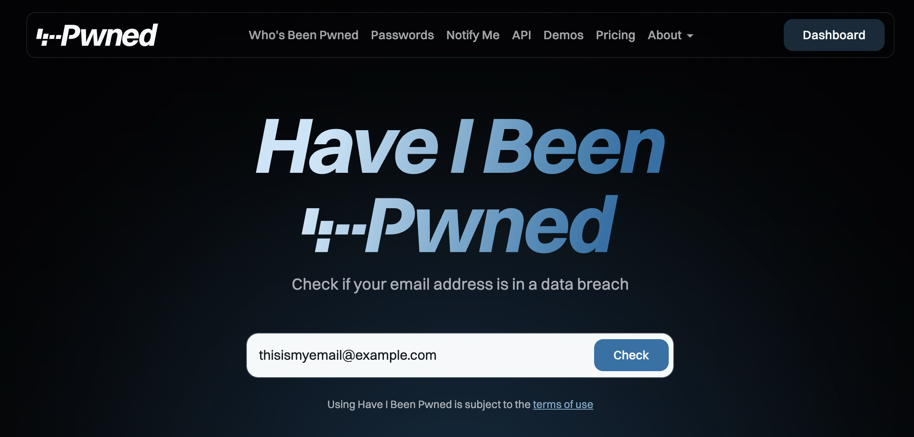
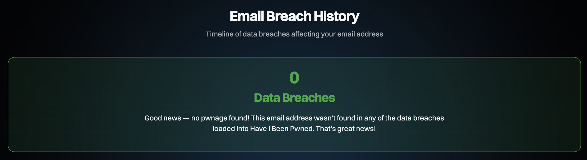
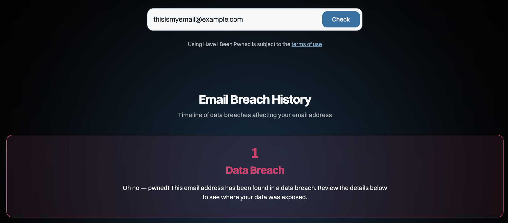
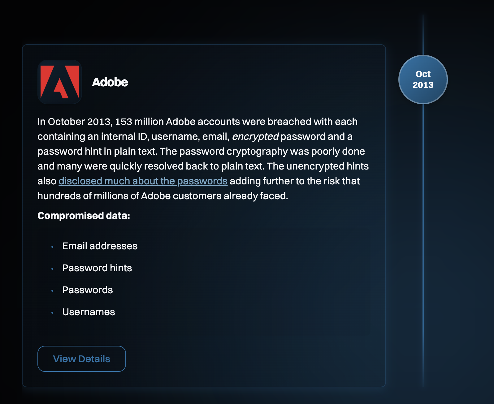
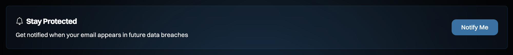

Here's an uncomfortable truth: your email address is almost certainly sitting in a leaked database somewhere. Mine sure is, in more than one. That's not because you did anything wrong. It's because a company you trusted with your data got hacked.

[Have I Been Pwned](https://haveibeenpwned.com/) is a free website that tells you which known data breaches your email address shows up in. I use it to check my own addresses, and in this post I'll explain what a data breach actually is, show you how to use the site, and walk through what I do after a "pwned" result.

I'll also share the two features of the site I personally skip (the password check and the Notify Me alerts) and why. And finally, how a breach can mean a company owes you money through a class action settlement.

## TL;DR

- Go to `haveibeenpwned.com` (type it yourself), enter your email, and click **Check** to see which breaches you're in and what data leaked.
- Don't type your real password into the site, even though its password check is well designed. Only ever type a password into the site it belongs to.
- I skip the **Notify Me** alerts: any service that stores your email can be breached, and if you never subscribe, every "breach alert" email is fake. Check manually every few months instead.
- If you've been pwned, change reused passwords, use a password manager, turn on 2FA, and freeze your credit if sensitive data leaked.
- Search for class action settlements for each breach you're in. You might be owed money, but never pay a fee to file.

## What is a data breach?

A data breach is when information that was supposed to stay private gets exposed to people who shouldn't have it. Usually, attackers get into a company's systems and copy its customer database. Sometimes it's not even a hack: somebody leaves a database open on the internet with no password, and anyone who finds it can download it.

What leaks depends on what the company stored. It can include:

- Email addresses and usernames
- Passwords (hopefully hashed, but not always)
- Names, phone numbers, and physical addresses
- Dates of birth
- IP addresses
- Credit card or bank details
- Government IDs, like Social Security numbers

Once that data is out, it gets sold, traded, and dumped publicly. Attackers use it for **credential stuffing**, which means trying your leaked email and password on *other* sites to see if you reused it. They also use it for **phishing**: convincing emails that use your real name or details to trick you.

So a breach at some random forum you joined in 2012 can still come back to bite your email or bank account today. Especially if you reused that password.

## What is Have I Been Pwned?

Have I Been Pwned (HIBP for short) was created by security researcher Troy Hunt. It collects data from known breaches and lets you search it by email address, so you can see where your information has leaked.

"Pwned" is gamer slang for "owned," as in someone took control of you. So "have I been pwned?" really just means "has my data been compromised?"

The scale is wild. As of October 2026, the homepage lists more than **17 billion pwned accounts** across over **1,000 breached websites**.

The site never shows anyone your actual leaked data (like your password or address). It only tells you *which* breaches your email appeared in and *what types* of data each one exposed. That's exactly what you need to decide what to do next.

## How to check your email on Have I Been Pwned

Checking takes about 30 seconds.

1. Type `haveibeenpwned.com` into your browser yourself. Don't click a link from an email or an ad. Lookalike sites exist, and you want the real one.
2. Enter your email address in the search box on the homepage.
3. Click **Check**.



4. Read your result. You'll get one of two answers:
   - A "no pwnage found!" message means your email wasn't in any of the breaches HIBP knows about. Nice! It doesn't guarantee your email never leaked, only that it hasn't shown up in the data HIBP has.
   - A "pwned!" message means your email was found in one or more breaches, and the site lists each one.
5. Look at each breach in the list. For every breach, HIBP shows when it happened and the **Compromised Data**, meaning the types of information that leaked. For example, the 2013 Adobe breach exposed email addresses, password hints, passwords, and usernames.
6. Repeat for your other email addresses. Old school accounts, old work accounts, that embarrassing one from high school. Those are often in the oldest (and messiest) leaks.

If you're lucky, you'll see a green "0 Data Breaches" result like this one:



But more often you'll get a red "pwned!" result telling you how many breaches your email showed up in:



Each breach is listed with its date and the exact data that leaked. Here's the 2013 Adobe breach as an example:



You might also see a **Paste Records** section. That covers cases where your email showed up on text-sharing sites or in public data dumps, which is often where stolen data appears first.

> [!TIP]
> Write down (or screenshot) the list of breaches you're in. You'll use it twice: once to fix your passwords, and again later when we talk about class action settlements.

## Don't type your password into the site

HIBP also has a **Pwned Passwords** page where you can type a password and see if it's ever appeared in a breach. My advice? Don't type your real password into it.

To be fair to HIBP, the check is cleverly designed. The site hashes your password inside your browser and only sends the first 5 characters of that hash to its servers, a technique called **k-anonymity**. Your actual password never leaves your device, and HIBP isn't trying to steal anything.

So why skip it? Because the rule that keeps you safe from phishing is dead simple: only ever type a password into the site it belongs to. Your bank password goes on your bank's site. Period.

The moment you start making exceptions ("it's okay, this site is trustworthy"), you get used to typing passwords into places they don't belong. And that's exactly the habit phishing pages count on. There are practical risks too:

- A fake lookalike site can copy the Pwned Passwords page and simply record whatever you type.
- A sketchy browser extension can read what you type on any page, no matter how well that page is built.

And honestly, you don't need it. If your email search says **Passwords** were part of a breach's compromised data, assume that password is burned and change it. No extra check required.

> [!TIP]
> If you use a password manager, it probably already checks your saved passwords against known leaks. 1Password (Watchtower), Bitwarden, Apple's Passwords app, and Google Password Manager all flag compromised passwords, without you typing them anywhere.


### For developers: the Pwned Passwords API

The Pwned Passwords API is a different story, and it's genuinely great. It's free, needs no API key, and it's built so *your app* can check a new user's password at sign-up and ask them to pick another one if it's leaked. That's the app doing the check, not a person pasting their password into a website.

It uses the same k-anonymity trick. Your code hashes the password with SHA-1, sends only the first 5 characters, and gets back every hash suffix that starts with them. For example, the SHA-1 hash of the word `password` starts with `5BAA6`:

```bash
curl https://api.pwnedpasswords.com/range/5BAA6
```

Each line in the response is the rest of a hash, a colon, and how many times it's been seen in breaches. Your code looks for the rest of its own hash in that list. Here's the line for `password`:

```text
1E4C9B93F3F0682250B6CF8331B7EE68FD8:52372427
```

Yep, more than 52 million times (as of October 2026). If your hash isn't in the list, the password hasn't shown up in any known breach. Full details are in the [Pwned Passwords API docs](https://haveibeenpwned.com/API/v3#PwnedPasswords).

## Why I don't sign up for "Notify Me"

On the homepage, HIBP offers a **Notify Me** link so you can "get notified when your email appears in future data breaches." Sounds great, right? I don't use it, for three reasons.



### Every database can be breached

To send you alerts, HIBP has to store your email address. According to its FAQs, it only keeps the email, the date you subscribed, and a random verification token.

That's a tiny footprint, and HIBP is run by people who take security very seriously. This isn't a knock on them. It's my general rule: the fewer places that hold my email, the fewer places it can leak from. No company is immune, not even one that tracks breaches.

### Fake breach alerts are easier to spot

Scammers love sending fake "your account was found in a data breach!" emails, because panic makes people click. If you never signed up for breach alerts, any email claiming to be one is fake. Easy rule, zero guesswork.

### You don't need it

You can get the same value by checking manually:

- Every few months (set a calendar reminder)
- Any time you hear about a big breach in the news
- Any time a company emails you to say it had a "security incident"

Same information, and your email stays in one fewer database.

## What to do if your email has been pwned

Okay, so you got the "pwned" result. Don't panic. Here's what I do, roughly in order of importance.

### 1. Change the affected passwords (and every reuse)

For each breach that included passwords, change that password. Then, and this is the important part, change it *everywhere else* you used the same one. Credential stuffing only works because people reuse passwords. Kill the reuse and you kill the attack.

### 2. Use a password manager and unique passwords

Nobody can remember 100 unique passwords, and you're not supposed to. A password manager generates a long, random password for every site and remembers them for you. Then a breach at one site affects exactly one account, not ten.

### 3. Turn on two-factor authentication (2FA)

2FA means a stolen password alone isn't enough to get in. Turn it on everywhere it's offered, starting with your email, your bank, and anything that holds money or personal info. If you can choose, prefer an **authenticator app** or a **passkey** over SMS codes, since text messages can be hijacked through SIM swapping.

> [!IMPORTANT]
> Protect your email account first. Your email is the "reset my password" key for almost everything else, so if someone takes over your inbox, they can take over the rest.

### 4. Freeze your credit

If a breach exposed things like your Social Security number, Social Insurance Number, or date of birth, lock down your credit file so nobody can open new credit in your name.

**In the US**, freeze your credit at all three bureaus: Equifax, Experian, and TransUnion. A freeze stops anyone (including you) from opening new credit in your name until you lift it. According to the FTC, it's free to place and free to lift.

**In Canada**, there are only two bureaus, Equifax and TransUnion, and what you can do depends on your province:

- **Quebec and Ontario:** You can place a security freeze, which Equifax calls a [credit lock](https://www.equifax.ca/personal/help/-/h/c/credit-lock/). Quebec residents have had this right since February 2023, and Ontario residents since July 1, 2026. In Quebec, it's free. Log in to your Equifax and TransUnion accounts to turn it on.
- **Everywhere else:** Equifax only offers its credit lock in Quebec and Ontario, so ask both bureaus to add a **fraud alert** to your credit report instead. It asks lenders to call you and confirm it's really you before approving credit in your name. The bureaus may charge a fee for it.

Either way, a lock at one bureau doesn't cover the other, so contact both. And remember to lift it before you apply for a loan, a credit card, or even a mortgage renewal.

### 5. Watch for phishing and weird activity

Leaked data makes scams more convincing, so expect emails, texts, and calls that use your real name or details. Don't click links in unexpected messages. Go to the company's site directly instead, and keep an eye on your bank and card statements.

Be extra careful with phone calls. Scammers can **spoof** caller ID, so your phone can show your bank's real number even when it's not your bank calling. They might know your name and some of your details (thanks, leaked data!), and they'll usually try to rush you: "We detected suspicious activity on your account, we just need to verify your card."

If you get a call like that, hang up and go to your bank's branch in person to check if anything is actually wrong.

> [!WARNING]
> Never give out your PIN, card numbers, passwords, or the one-time codes you get by text to anyone who contacts you. Not over the phone, not by text, not by email, even if it really looks like your bank.

If something has already gone wrong and you think your identity was stolen, the FTC's [IdentityTheft.gov](https://www.identitytheft.gov/) builds a personalized recovery plan for you.

## Data breach class action settlements: you might be owed money

Here's the part most people don't know about. When a company leaks a lot of customer data, lawyers often file a **class action lawsuit** on behalf of everyone affected. If the case settles, the company pays into a settlement fund, and people whose data was exposed can file a claim.

Depending on the settlement, you might be able to claim:

- A cash payment
- Reimbursement for money you lost because of the breach
- Payment for time you spent dealing with it
- Free credit monitoring or identity restoration services

The best-known example is **Equifax**. In September 2017, Equifax announced a breach that affected about 147 million people. The settlement included up to $425 million to help affected consumers, with cash payments, identity restoration services, and free credit reports. (The claim deadline passed on January 22, 2024, so don't go looking for that one now.)

### How to find settlements you qualify for

This is where your HIBP list comes in handy again. For each breach you're in:

1. Search for `<company name> data breach settlement` in your search engine.
2. Find the official settlement website. Real settlements are run by a court-appointed settlement administrator, and the official notice tells you exactly where to file.
3. Check the deadline. Every settlement has a claim deadline, and once it passes, that's it.
4. File your claim on the official site. It's usually a short online form.

You may also get a settlement notice by email or regular mail if the company has your contact info.

> [!WARNING]
> Fake settlement sites and emails exist, and they're after your personal or banking details. A real class action settlement will **never** charge you a fee to file a claim. Don't click settlement links in random emails. Search for the settlement yourself and make sure the site matches the one named in the official notice.

A few honest expectations before you get excited:

- **Payouts are often small.** When millions of people file claims, the fund gets split millions of ways. Sometimes it's a few dollars.
- **It can take a long time.** Payments can take months or even years to go out.
- **You usually give up the right to sue.** Filing a claim generally means you can't sue the company on your own later. Each settlement has an opt-out deadline if you'd rather keep that option. If you have serious losses from a breach, talk to a lawyer before you file. (I'm not a lawyer, and this isn't legal advice!)

Still, filing takes five minutes, and it's money a company owes you for losing your data. I think it's worth it.

## Wrapping up

Data breaches aren't a question of *if* anymore. Your data has most likely leaked already, and that's on the companies, not on you. What you do next is the part you control, and it only takes an afternoon to go from "pwned" to protected (and maybe a few dollars richer).

Here's where to start:

- [Have I Been Pwned](https://haveibeenpwned.com/) to check every email address you own. Email only: no passwords, no Notify Me sign-up.
- [AnnualCreditReport.com](https://www.annualcreditreport.com/) to pull your free credit reports.
- [IdentityTheft.gov](https://www.identitytheft.gov/) if something has already gone wrong.

Go check your emails. I'll wait. :-)
