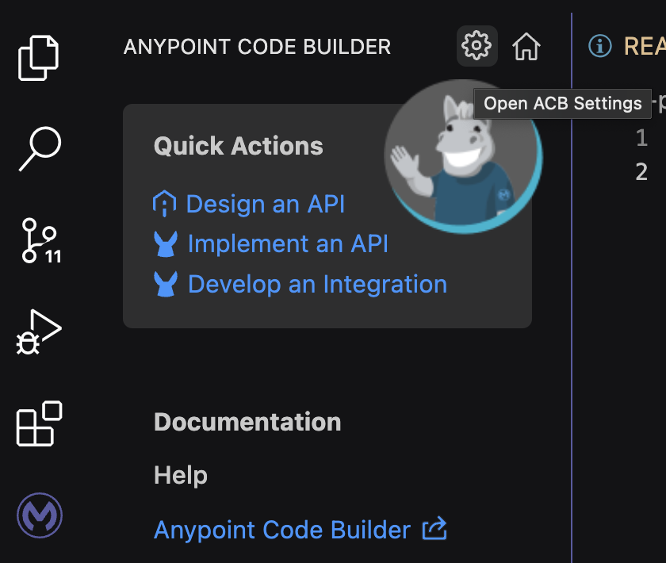
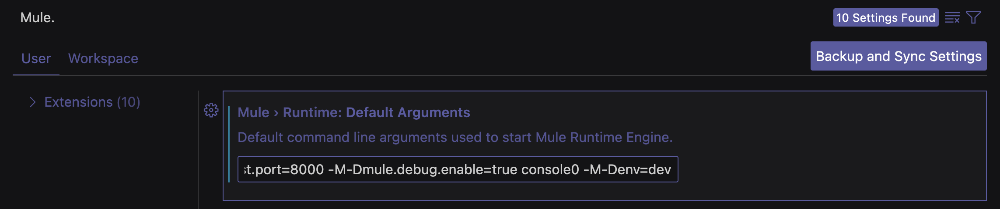
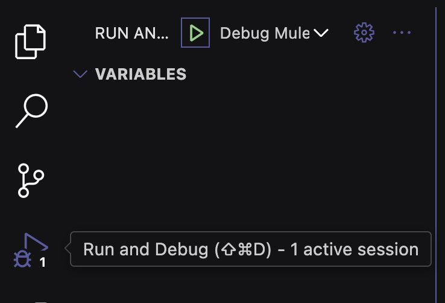
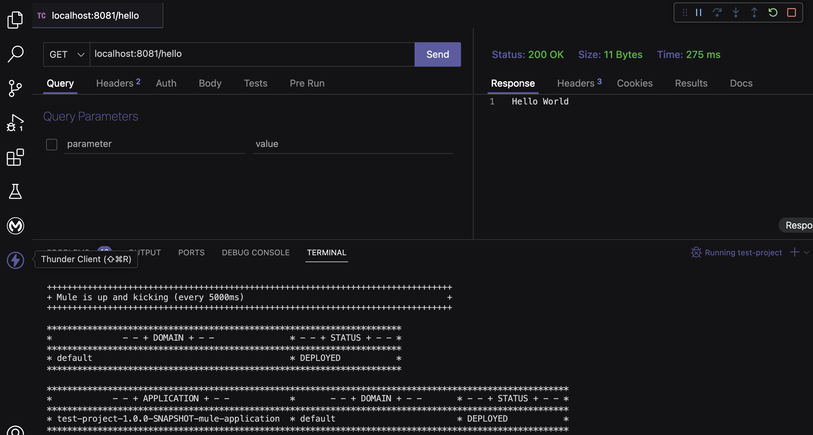

I've received this question a lot lately, so I figured I'd create a quick post about it.

Adding JVM or Command-line arguments to your Mule Runtime is especially useful when you're using properties files that are separated by environment. It is also useful to pass a secure/encryption key to your Mule application when you have secured properties. Let's learn how to pass these arguments in ACB.

## Prerequisites

- **Visual Studio Code** - To use Anypoint Code Builder (Desktop), you must first install VS Code. You can download it [here](https://code.visualstudio.com/).
- **Anypoint Extension Pack** - To enable Anypoint Code Builder in your Visual Studio Code, you must install this extension. You can install it from [here](https://marketplace.visualstudio.com/items?itemName=salesforce.mule-dx-extension-pack).
- **REST Client** - A lot of people use [Postman](https://www.postman.com/). You can also use [curl](https://curl.se/) if you're more into the command line, or [Thunder Client for VS Code](https://marketplace.visualstudio.com/items?itemName=rangav.vscode-thunder-client). We'll use Thunder Client for this post.
- **GitHub Repo** - If you want to follow along with the code I generated, you can check it out [here](https://github.com/ProstDev/args-in-acb).

## Create the Mule project

You can use the GitHub repository listed in the prerequisites, or you can generate your code by following the next instructions.

In ACB, click on **Develop an Integration** and give a name to the project. In our case, it will be test-project. Click on **Create project**.

Paste the following code before the `</mule>` tag.

```xml
<http:listener-config name="HTTP_Listener_config">
  <http:listener-connection host="${http.listener.host}" port="${http.listener.port}" />
</http:listener-config>
<configuration-properties file="${env}.properties" doc:name="Configuration properties" />
<flow name="test-flow">
  <http:listener path="hello" config-ref="HTTP_Listener_config" doc:name="Listener" doc:id="lbryit" />
  <set-payload value="Hello World" doc:name="Set payload" doc:id="tggriu" />
</flow>
```

This will create an HTTP Listener and a Set Payload component in the flow. You will also create two Global Element Configurations: one for the HTTP Listener configuration and another for the properties, in this case, using the $&#123;env&#125;.properties syntax.

> [!NOTE]
> You can use .properties or .yaml extensions for your properties files.

Create a new `dev.properties` file under `src/main/resources` and paste the following properties:

```
http.listener.host=0.0.0.0
http.listener.port=8081
```

> [!NOTE]
> You should have a different properties file per environment. For now, we are only creating the basic configuration for the dev environment to demonstrate.

## Add arguments to the runtime

Once you have the basic setup to run the Mule app, we'll now add the env argument to the list. So, every time you run this Mule app, the env property will be provisioned to the runtime.

Open the ACB Settings by clicking on the ⚙️ icon on the home screen.



Go to **Mule > Runtime: Default Arguments** and append the following argument at the end of the value.

```
-M-Denv=dev
```



## Run your app locally

You can start your Mule app from the **Run and Debug** tab and click on the green run button.



Finally, call your Mule application from your REST Client with the following URL:

```
localhost:8081/hello
```

You should receive a "Hello World" response.



Ta-da!!

I hope that was helpful.

Subscribe to receive notifications as soon as new content is published ✨

💬 Prost! 🍻
