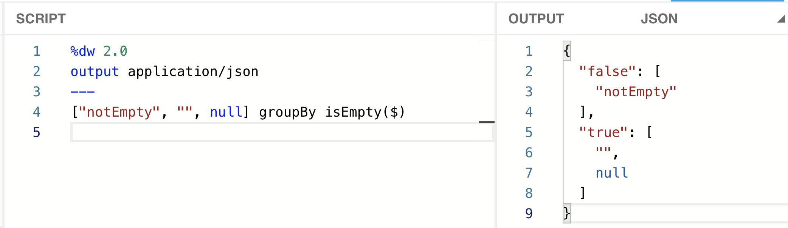
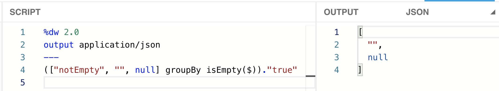
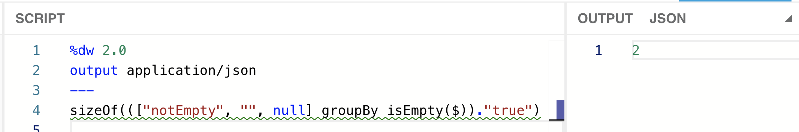
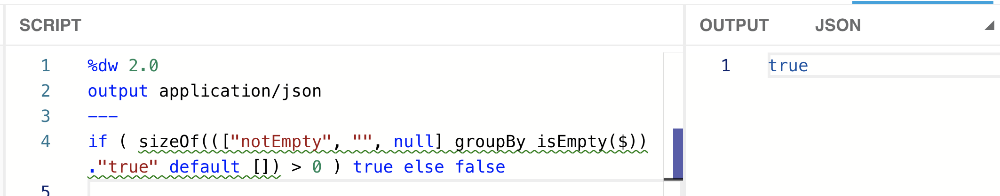
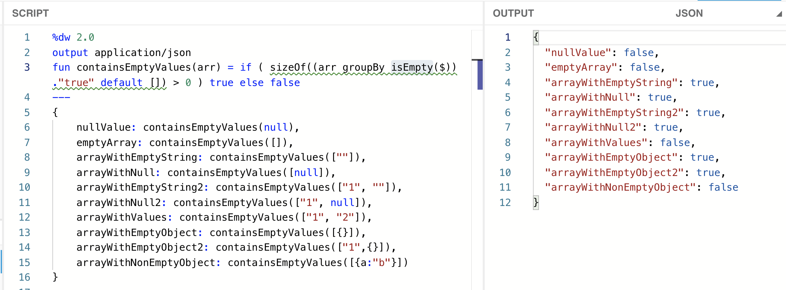

I had this use-case where I had to make sure all the values inside an [array](https://en.wikipedia.org/wiki/Array_data_structure) were not empty. By “empty,” I’m referring to an empty string (“”), a null value (*null*), or even an empty array ([]). There were some cases when I would receive a null value instead of an array. The array could only contain strings or nulls, but not objects. However, I’ll be adding tests to check for empty objects as well.

> [!NOTE]
> The term “null” refers to a null value, whereas “Null” refers to the data type. The same rule applies to string/String, array/Array, and object/Object. I can have an empty array ([]), which is of the type Array, or a string “abc,” which is of the type String.

In this series of posts, I explain 6 different approaches to achieve (almost) the same output using different DataWeave functions/operators. As we advance through the posts, the functions will become easier to read, and the logic will have fewer flaws.

- **Part 1: Using sizeOf, groupBy, isEmpty, and default.**
- [Part 2: Using sizeOf, filter, isEmpty, and default.](https://www.prostdev.com/post/how-to-check-for-empty-values-in-an-array-in-dataweave-part-2-sizeof-filter-isempty-default)
- [Part 3: Using isEmpty and filter.](https://www.prostdev.com/post/how-to-check-for-empty-values-in-an-array-in-dataweave-part-3-isempty-filter)
- [Part 4: Using the Arrays Module, Pattern Matching, and Function Overloading.](https://www.prostdev.com/post/how-to-check-for-empty-values-in-an-array-in-dataweave-part-4-arrays-module)

I use the DataWeave Playground throughout these articles. You can follow [this post](https://www.prostdev.com/post/how-to-run-locally-the-dataweave-playground-docker-image) to set up a local Docker image (no previous Docker experience is needed), or you can also open a new Mule project and use the Transform Message component.

> [!NOTE]
> You can also use the online DataWeave Playground tool from [this link](http://dwlang.fun/), if available.

## Building the solution

I’ll create an array to start building and testing this first solution. Something like this:

```dataweave
%dw 2.0
output application/json
---
["notEmpty", "", null]
```

**Step 1**: We’ll use the “groupBy” function to separate the non-empty and empty items from the array (using the “isEmpty” function).

```dataweave
["notEmpty", "", null] groupBy isEmpty($)
```

This will give us an object with two fields: one “false” and one “true.” The “false” field contains an array with the values that are not empty ([“notEmpty”]), and the “true” field contains an array with the values that are empty ([“”, null]).



**Step 2**: Since we want to count the number of values that *are* empty, let’s go ahead and extract the “true” field.

```dataweave
(["notEmpty", "", null] groupBy isEmpty($))."true"
```



**Step 3**: To count how many values are in this array ([“”, null]), let’s use the “sizeOf” function.

```dataweave
sizeOf((["notEmpty", "", null] groupBy isEmpty($))."true")
```



Oh, what’s that green line? Ah…It turns out that DataWeave is assuming that any data type can be returned here. It’s not an error, but it’s a warning. You can get rid of it by explicitly coercing the data inside the “sizeOf” function into Array.

```dataweave
sizeOf((["notEmpty", "", null] groupBy isEmpty($))."true" as Array)
```

> [!NOTE]
> The “[sizeOf](https://docs.mulesoft.com/mule-runtime/4.3/dw-core-functions-sizeof)” function only accepts the Array, Object, Binary, and String data types as arguments.

However, if you send a null value instead of an array, this will immediately fail. You can’t coerce Null to Array.

```dataweave
sizeOf((null groupBy isEmpty($))."true" as Array)
```

What can we do now? Oh! What about the “default” operator?

```dataweave
sizeOf((null groupBy isEmpty($))."true" default [])
```

![DataWeave Playground: a null input with default [] returns 0 from sizeOf](../../assets/blog/how-to-check-for-empty-values-in-an-array-in-dataweave-part-1-sizeof-groupby-isempty-default-4.png)

That works!

Now let’s put back the array we had before, instead of the null value, and continue to the next step.

```dataweave
sizeOf((["notEmpty", "", null] groupBy isEmpty($))."true" default [])
```

**Step 4**: We want to return a Boolean depending on whether there are empty values in the array or not. Let’s add a condition to return true when there *are* empty values or false if there aren’t any.

```dataweave
if ( sizeOf((["notEmpty", "", null] groupBy isEmpty($))."true" default []) > 0 ) true else false
```



We got what we wanted! Now we just have to make this a function and call it with different values to make sure that it works for all our cases.

## Setting up test values

To create the function, we can simply define it over the 3 dashes (---) using the “fun” keyword. We can copy and paste our previous code for this new function, and replace the [hardcoded](https://en.wikipedia.org/wiki/Hard_coding) array with the function’s argument. Like this:

```dataweave
%dw 2.0
output application/json
fun containsEmptyValues(arr) = if ( sizeOf((arr groupBy isEmpty($))."true" default []) > 0 ) true else false
---
```

Now we can create the rest of the payload that we’ll be using to test. Let’s create an object that will contain some different examples of the data that the function will receive. Something like this:

```dataweave
%dw 2.0
output application/json
fun containsEmptyValues(arr) = if ( sizeOf((arr groupBy isEmpty($))."true" default []) > 0 ) true else false
---
{
    nullValue: containsEmptyValues(null),
    emptyArray: containsEmptyValues([]),
    arrayWithEmptyString: containsEmptyValues([""]),
    arrayWithNull: containsEmptyValues([null]),
    arrayWithEmptyString2: containsEmptyValues(["1", ""]),
    arrayWithNull2: containsEmptyValues(["1", null]),
    arrayWithValues: containsEmptyValues(["1", "2"]),
    arrayWithEmptyObject: containsEmptyValues([{}]),
    arrayWithEmptyObject2: containsEmptyValues(["1",{}]),
    arrayWithNonEmptyObject: containsEmptyValues([{a:"b"}])
}
```



Note that there are 3 fields at the end to test the behavior of the function with Object. Even though this was not our initial use-case, our “containsEmptyValues” function works with the Object data type as well. Why? Because we’re using the “[isEmpty](https://docs.mulesoft.com/mule-runtime/4.3/dw-core-functions-isempty)” function, which accepts the Array, String, Null, and Object data types.

**Quiz**: What happens when we change the “isEmpty” function to “[isBlank](https://docs.mulesoft.com/mule-runtime/4.3/dw-core-functions-isblank)” instead?

*The answer will be revealed in the next post.*

## Does it work as expected?

It works for *most* of our use-cases. However, it’s not the best solution. Here are some of the cons of this function:

- It’s not very easy to read. There are a lot of parentheses that may confuse the developers that end up maintaining your code.
- DataWeave is still showing a warning. Yes, the code runs just fine, and there are no errors, but warnings are there for a reason!
- The null value (null) and the empty array ([]) are returning a false value, but they should be returning a true. This is a bug that needs to be fixed.

Aaaand…We’re done with the first function! Remember that the following posts will explain more elegant solutions, so subscribe now to receive an email as soon as the next parts are published!

Remember that the answer to the quiz, “What happens when we change the isEmpty function to isBlank instead?” will be revealed in the next post.

Keep learning!

-Alex
