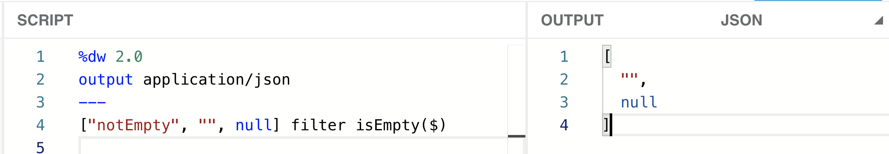
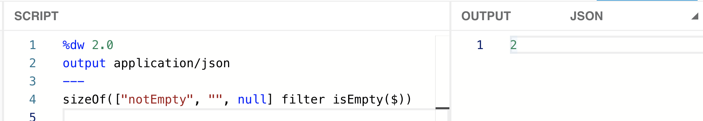
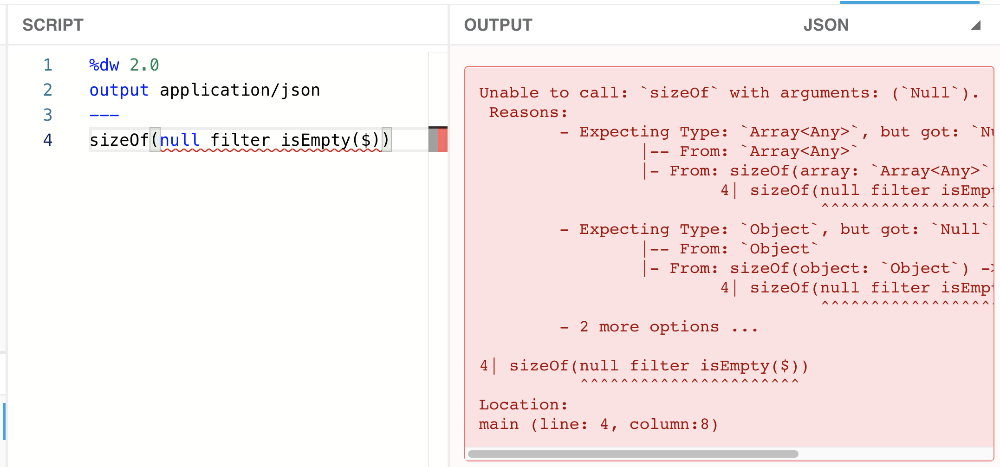
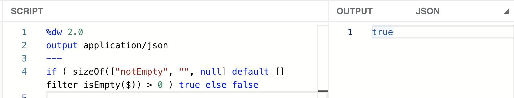
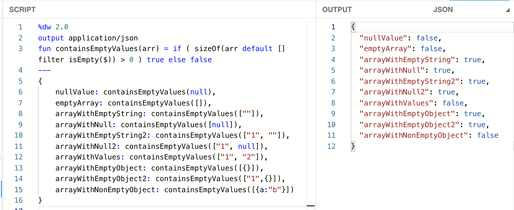

I had this use-case where I had to make sure all the values inside an [array](https://en.wikipedia.org/wiki/Array_data_structure) were not empty. By “empty,” I’m referring to an empty string (“”), a null value (*null*), or even an empty array ([]). There were some cases when I would receive a null value instead of an array. The array could only contain strings or nulls, but not objects. However, I’ll be adding tests to check for empty objects as well.

> [!NOTE]
> The term “null” refers to a null value, whereas “Null” refers to the data type. The same rule applies to string/String, array/Array, and object/Object. I can have an empty array ([]), which is of the type Array, or a string “abc,” which is of the type String.

In this series of posts, I explain 6 different approaches to achieve (almost) the same output using different DataWeave functions/operators. As we advance through the posts, the functions will become easier to read, and the logic will have fewer flaws.

- [Part 1: Using sizeOf, groupBy, isEmpty, and default.](https://www.prostdev.com/post/how-to-check-for-empty-values-in-an-array-in-dataweave-part-1-sizeof-groupby-isempty-default)
- **Part 2: Using sizeOf, filter, isEmpty, and default.**
- [Part 3: Using isEmpty and filter.](https://www.prostdev.com/post/how-to-check-for-empty-values-in-an-array-in-dataweave-part-3-isempty-filter)
- [Part 4: Using the Arrays Module, Pattern Matching, and Function Overloading.](https://www.prostdev.com/post/how-to-check-for-empty-values-in-an-array-in-dataweave-part-4-arrays-module)

I use the DataWeave Playground throughout these articles. You can follow [this post](https://www.prostdev.com/post/how-to-run-locally-the-dataweave-playground-docker-image) to set up a local Docker image (no previous Docker experience is needed), or you can also open a new Mule project and use the Transform Message component.

> [!NOTE]
> You can also use the online DataWeave Playground tool from [this link](http://dwlang.fun/), if available.

## Building the solution

I’ll create an array to start building and testing this solution:

```dataweave
%dw 2.0
output application/json
---
["notEmpty", "", null]
```

**Step 1**: We’ll use the “filter” function, followed by “isEmpty” to retrieve the empty items from the array.

```dataweave
["notEmpty", "", null] filter isEmpty($)
```



Compared to the solution in the previous post, which was using “groupBy” to retrieve all the empty values, we can get the same result in one step instead of two.

**Step 2**: As we did in the previous solution, we need to count how many values are in this array ([“”, null]). We’ll be using the “sizeOf” function as well.

```dataweave
sizeOf(["notEmpty", "", null] filter isEmpty($))
```



Will you look at that? There’s no green line! In the solution prior, we were getting a warning from DataWeave saying that it was auto-coercing the data type. Well, not this time, DataWeave!

Although…We do need to test what would happen if we sent Null instead of Array. Let’s see.

```dataweave
sizeOf(null filter isEmpty($))
```



And…That’s an error. :(

When you try to filter a null value in this case, the result is also null. So when we try to call the “[sizeOf](https://docs.mulesoft.com/mule-runtime/4.3/dw-core-functions-sizeof)” function with Null, it fails because it only accepts Array, Object, Binary, and String data types as arguments.

How can we fix this? We use the “default” operator. Pretty much like in the previous solution, but this time in a different place.

```dataweave
sizeOf(null default [] filter isEmpty($))
```

This operator will check for any null value and default the value to an empty array ([]). Now the “filter” will receive the empty array and will also output an empty array. The “sizeOf” function does work on empty arrays, and we end up with a zero (which is what we expect).

![sizeOf with null default [] filter isEmpty now returning 0 without error](../../assets/blog/how-to-check-for-empty-values-in-an-array-in-dataweave-part-2-sizeof-filter-isempty-default-4.png)

Now let’s put back the array we had before, instead of the null value, and continue to the next step.

```dataweave
sizeOf(["notEmpty", "", null] default [] filter isEmpty($))
```

**Step 3**: We want to return a Boolean depending on whether there are empty values in the array or not. Let’s add a condition to return true when there *are* empty values or false if there aren’t any.

```dataweave
if ( sizeOf(["notEmpty", "", null] default [] filter isEmpty($)) > 0 ) true else false
```



We got what we wanted! Now we just have to make this a function and call it with different values to make sure that it works for all our cases.

## Setting up test values

To create the function, we can simply define it over the 3 dashes (---) using the “fun” keyword. We can copy and paste our previous code for this new function, and replace the [hardcoded](https://en.wikipedia.org/wiki/Hard_coding) array with the function’s argument. Like this:

```dataweave
%dw 2.0
output application/json
fun containsEmptyValues(arr) = if ( sizeOf(arr default [] filter isEmpty($)) > 0 ) true else false
---
```

To test our use-cases, we’ll be using the same payload we created in our previous solution:

```dataweave
%dw 2.0
output application/json
fun containsEmptyValues(arr) = if ( sizeOf(arr default [] filter isEmpty($)) > 0 ) true else false
---
{
    nullValue: containsEmptyValues(null),
    emptyArray: containsEmptyValues([]),
    arrayWithEmptyString: containsEmptyValues([""]),
    arrayWithNull: containsEmptyValues([null]),
    arrayWithEmptyString2: containsEmptyValues(["1", ""]),
    arrayWithNull2: containsEmptyValues(["1", null]),
    arrayWithValues: containsEmptyValues(["1", "2"]),
    arrayWithEmptyObject: containsEmptyValues([{}]),
    arrayWithEmptyObject2: containsEmptyValues(["1",{}]),
    arrayWithNonEmptyObject: containsEmptyValues([{a:"b"}])
}
```



Note that there are 3 fields at the end to test the behavior of the function with Object. Even though this was not our initial use-case, our “containsEmptyValues” function works with the Object data type as well. Why? Because we’re using the “[isEmpty](https://docs.mulesoft.com/mule-runtime/4.3/dw-core-functions-isempty)” function, which accepts the Array, String, Null, and Object data types.

There was a **quiz** in the previous post. The question was, “*What happens when we change the “isEmpty” function to “*[isBlank](https://docs.mulesoft.com/mule-runtime/4.3/dw-core-functions-isblank)*” instead?*” and that same question can also be asked for this solution.

The **answer** is that there is an error whenever you try to pass a value that’s not String or Null. In other words, the last 3 fields (arrayWithEmptyObject, arrayWithEmptyObject2, and arrayWithNonEmptyObject) would fail because we’d be sending an object (&#123;&#125;) instead of a string or a null value inside the array.

## Does it work as expected?

It works for *most* of our use-cases. However, it’s not the best solution. Here are some of the cons of this function:

- It’s slightly easier to read than the previous solution. However, there are still some parentheses that may cause confusion.
- We still have the same problem as last time. The null value (null) and the empty array ([]) are returning a false value, but they should be returning a true.

And that’s it for the second function! Remember that the following post will explain a more elegant solution, so subscribe now to receive an email as soon as the next part is published!

Next time there will be dramatic changes, you’ll see!

*Prost!*

-Alex
