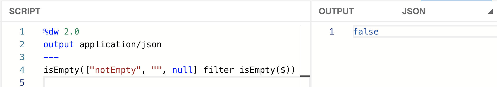
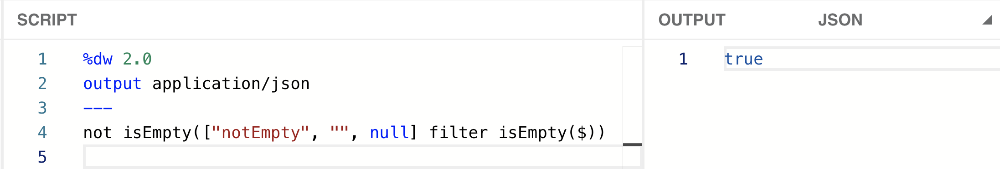
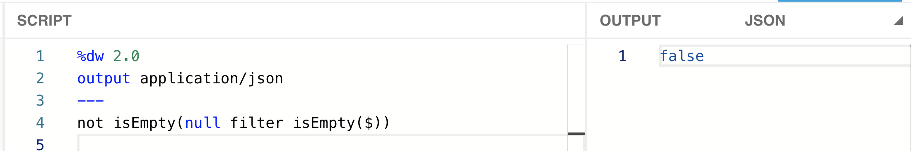
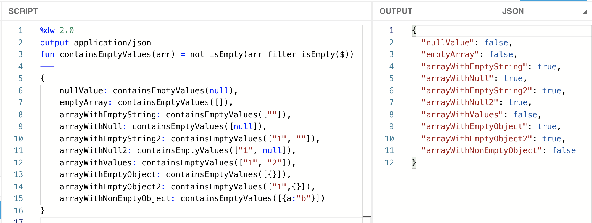
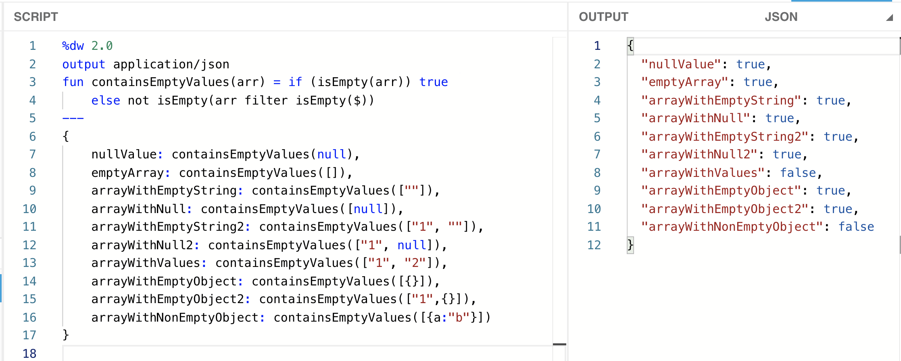

I had this use-case where I had to make sure all the values inside an [array](https://en.wikipedia.org/wiki/Array_data_structure) were not empty. By “empty,” I’m referring to an empty string (“”), a null value (*null*), or even an empty array ([]). There were some cases when I would receive a null value instead of an array. The array could only contain strings or nulls, but not objects. However, I’ll be adding tests to check for empty objects as well.

> [!NOTE]
> The term “null” refers to a null value, whereas “Null” refers to the data type. The same rule applies to string/String, array/Array, and object/Object. I can have an empty array ([]), which is of the type Array, or a string “abc,” which is of the type String.

In this series of posts, I explain 6 different approaches to achieve (almost) the same output using different DataWeave functions/operators. As we advance through the posts, the functions will become easier to read, and the logic will have fewer flaws.

- [Part 1: Using sizeOf, groupBy, isEmpty, and default.](https://www.prostdev.com/post/how-to-check-for-empty-values-in-an-array-in-dataweave-part-1-sizeof-groupby-isempty-default)
- [Part 2: Using sizeOf, filter, isEmpty, and default.](https://www.prostdev.com/post/how-to-check-for-empty-values-in-an-array-in-dataweave-part-2-sizeof-filter-isempty-default)
- **Part 3: Using isEmpty and filter.**
- [Part 4: Using the Arrays Module, Pattern Matching, and Function Overloading.](https://www.prostdev.com/post/how-to-check-for-empty-values-in-an-array-in-dataweave-part-4-arrays-module)

I use the DataWeave Playground throughout these articles. You can follow [this post](https://www.prostdev.com/post/how-to-run-locally-the-dataweave-playground-docker-image) to set up a local Docker image (no previous Docker experience is needed), or you can also open a new Mule project and use the Transform Message component.

> [!NOTE]
> You can also use the online DataWeave Playground tool from [this link](http://dwlang.fun/), if available.

## Building the solution

I’ll create an array to start building and testing this solution:

```dataweave
%dw 2.0
output application/json
---
["notEmpty", "", null]
```

**Step 1**: Just as we did in the previous solution, we’ll use the “filter” function, followed by “isEmpty” to retrieve the empty items from the array.

```dataweave
["notEmpty", "", null] filter isEmpty($)
```

![DataWeave Playground filtering ["notEmpty","",null] by isEmpty, outputting just the "" and null entries.](../../assets/blog/how-to-check-for-empty-values-in-an-array-in-dataweave-part-3-isempty-filter-1.png)

**Step 2**: This time, we will not be counting the values with “sizeOf.” Instead, let’s use another “isEmpty” function for this filtered array ([“”, null]). This function can let us know if the array contains any value or an empty array ([]).

```dataweave
isEmpty(["notEmpty", "", null] filter isEmpty($))
```



With this, we know that the original array ([“notEmpty”, “”, null]) indeed contains empty values (because it’s not empty after filtering it).

**Step 3**: Although our goal was to receive a true value if there were empty values, not a false, right? Not to worry! We can simply negate the whole thing with the “[not](https://docs.mulesoft.com/mule-runtime/4.3/dw-operators#logical_operators)” operator.

```dataweave
not isEmpty(["notEmpty", "", null] filter isEmpty($))
```



**Quiz**: Do the following scripts generate the same output?

```dataweave
1) not true or true
2) ! true or true
```

*The answer will be revealed in the next post...Surprise! - There will be more! :)*

And now…*drumroll*...we get to the test that broke our two previous solutions…What if we send a null value instead of an array?

```dataweave
not isEmpty(null filter isEmpty($))
```



It didn’t break this time! Woohoo! Since we’re no longer using the “[sizeOf](https://docs.mulesoft.com/mule-runtime/4.3/dw-core-functions-sizeof)” function, which only accepts Array, Object, Binary, and String data types (not Null), we don’t have that issue anymore! “[isEmpty](https://docs.mulesoft.com/mule-runtime/4.3/dw-core-functions-isempty)” is cool with Array, String, Null, and Object.

Look at that! We’re done! We’re already returning a Boolean, so there’s no need to create a condition. Now we just have to make this a function and call it with our test data.

## Setting up test values

To create the function, we can simply define it over the 3 dashes (---) using the “fun” keyword. We can copy and paste our previous code for this new function and replace the [hardcoded](https://en.wikipedia.org/wiki/Hard_coding) array (or null value) with the function’s argument. Like this:

```dataweave
%dw 2.0
output application/json
fun containsEmptyValues(arr) = not isEmpty(arr filter isEmpty($))
---
```

To test our use-cases, we’ll be using the same payload we created in our previous solutions:

```dataweave
%dw 2.0
output application/json
fun containsEmptyValues(arr) = not isEmpty(arr filter isEmpty($))
---
{
    nullValue: containsEmptyValues(null),
    emptyArray: containsEmptyValues([]),
    arrayWithEmptyString: containsEmptyValues([""]),
    arrayWithNull: containsEmptyValues([null]),
    arrayWithEmptyString2: containsEmptyValues(["1", ""]),
    arrayWithNull2: containsEmptyValues(["1", null]),
    arrayWithValues: containsEmptyValues(["1", "2"]),
    arrayWithEmptyObject: containsEmptyValues([{}]),
    arrayWithEmptyObject2: containsEmptyValues(["1",{}]),
    arrayWithNonEmptyObject: containsEmptyValues([{a:"b"}])
}
```



But the “nullValue” and “emptyArray” fields are returning false instead of the true value that we need.

**Step 4**: Let’s add a condition to check if the argument (arr) is empty and to immediately return true if that’s the case. Don’t forget to add the “else” with the logic we already had.

```dataweave
fun containsEmptyValues(arr) = if (isEmpty(arr)) true 
    else not isEmpty(arr filter isEmpty($))
```



Oh, look at that! We did it!!

## Does it work as expected?

It works for ALL of our use-cases! But there are more ways to achieve the same output. Have you heard of function overloading or pattern matching using match/case? We can also achieve this solution with these two additional approaches. Plus, we will review how to use the Arrays module!

Remember that the answer to the **quiz** will be revealed in the next post. Here is the question:

Do the following scripts generate the same output?

- not true or true
- ! true or true

Subscribe now to receive a notification as soon as the next content is published!

*Prost!*

-Alex
