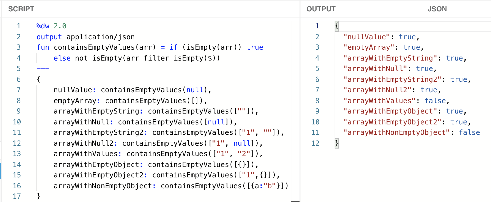
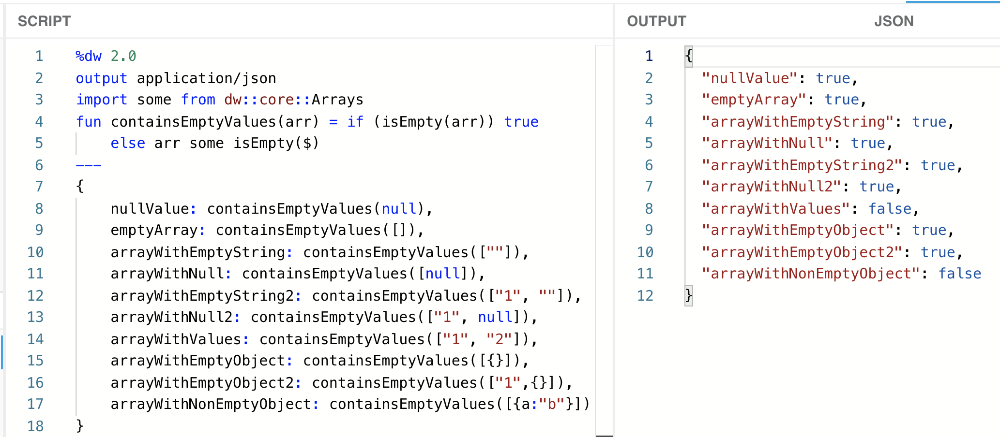
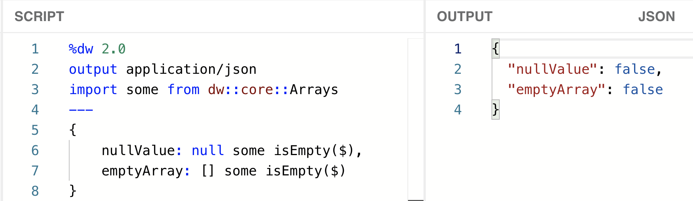
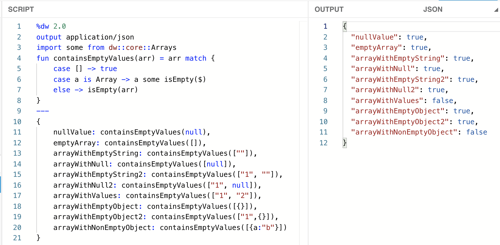
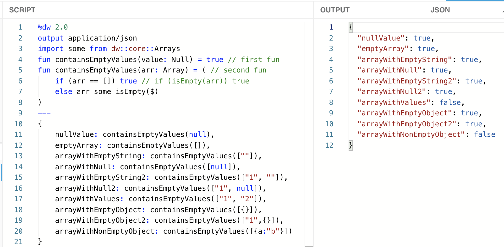

I had this use-case where I had to make sure all the values inside an [array](https://en.wikipedia.org/wiki/Array_data_structure) were not empty. By “empty,” I’m referring to an empty string (“”), a null value (*null*), or even an empty array ([]). There were some cases when I would receive a null value instead of an array. The array could only contain strings or nulls, but not objects. However, I’ll be adding tests to check for empty objects as well.

> [!NOTE]
> The term “null” refers to a null value, whereas “Null” refers to the data type. The same rule applies to string/String, array/Array, and object/Object. I can have an empty array ([]), which is of the type Array, or a string “abc,” which is of the type String.

In this series of posts, I explain 6 different approaches to achieve (almost) the same output using different DataWeave functions/operators. As we advance through the posts, the functions will become easier to read, and the logic will have fewer flaws.

- [Part 1: Using sizeOf, groupBy, isEmpty, and default](https://www.prostdev.com/post/how-to-check-for-empty-values-in-an-array-in-dataweave-part-1-sizeof-groupby-isempty-default) - This solution had some readability issues, the code was showing a warning, and it didn’t fully work for all of our use cases.
- [Part 2: Using sizeOf, filter, isEmpty, and default](https://www.prostdev.com/post/how-to-check-for-empty-values-in-an-array-in-dataweave-part-2-sizeof-filter-isempty-default) - This solution still had some readability issues, and it still didn’t fully work for all of our use cases.
- [Part 3: Using isEmpty and filter](https://www.prostdev.com/post/how-to-check-for-empty-values-in-an-array-in-dataweave-part-3-isempty-filter) - This solution worked as expected, but we can do better. ;)
- **Part 4: Using the Arrays Module, Pattern Matching, and Function Overloading.**

I use the DataWeave Playground throughout these articles. You can follow [this post](https://www.prostdev.com/post/how-to-run-locally-the-dataweave-playground-docker-image) to set up a local Docker image (no previous Docker experience is needed), or you can also open a new Mule project and use the Transform Message component.

> [!NOTE]
> You can also use the online DataWeave Playground tool from [this link](http://dwlang.fun/), if available.

## Using the Arrays Module

I’ll skip the step-by-step process that we’ve been doing for the past 3 posts to show you 3 different approaches this time.

Let’s take a look at the function we created in the last post.

```dataweave
%dw 2.0
output application/json
fun containsEmptyValues(arr) = if (isEmpty(arr)) true 
    else not isEmpty(arr filter isEmpty($))
---
{
    nullValue: containsEmptyValues(null),
    emptyArray: containsEmptyValues([]),
    arrayWithEmptyString: containsEmptyValues([""]),
    arrayWithNull: containsEmptyValues([null]),
    arrayWithEmptyString2: containsEmptyValues(["1", ""]),
    arrayWithNull2: containsEmptyValues(["1", null]),
    arrayWithValues: containsEmptyValues(["1", "2"]),
    arrayWithEmptyObject: containsEmptyValues([{}]),
    arrayWithEmptyObject2: containsEmptyValues(["1",{}]),
    arrayWithNonEmptyObject: containsEmptyValues([{a:"b"}])
}
```



We will be using the “[some](https://docs.mulesoft.com/mule-runtime/4.3/dw-arrays-functions-some)” function from the [Arrays module](https://docs.mulesoft.com/mule-runtime/4.3/dw-arrays). To do this, we first need to import the function from the array.

```dataweave
%dw 2.0
output application/json
import some from dw::core::Arrays
fun containsEmptyValues(arr) = if (isEmpty(arr)) true 
    else not isEmpty(arr filter isEmpty($))
---
```

> [!NOTE]
> You can also import all the functions from a module using “import  from…”

After that, we’ll replace the “else” expression with “arr some isEmpty($)”. This will check if at least one of the items inside the “arr” array is an empty value. If this is the case, it will return a true value.

```dataweave
%dw 2.0
output application/json
import some from dw::core::Arrays
fun containsEmptyValues(arr) = if (isEmpty(arr)) true 
    else arr some isEmpty($)
---
```



As you can see, we receive the same expected output. We didn’t remove the first condition from the code because when we try to do “arr some isEmpty($)” when arr is null or when arr is an empty array ([]), the output will be false instead of the true value that we’re expecting.



## Using Pattern Matching (match/case)

This alternative uses [pattern matching](https://docs.mulesoft.com/mule-runtime/4.3/dataweave-pattern-matching) with the match/case statements (sort of like the switch/case Java statements).

This is what our code would look like:

```dataweave
%dw 2.0
output application/json
import some from dw::core::Arrays
fun containsEmptyValues(arr) = arr match {
    case [] -> true
    case a is Array -> a some isEmpty($)
    else -> isEmpty(arr)
}
---
```



In this case, we’re immediately returning true when we receive an empty array ([]). If our data is not an empty array, then we go to the second “case,” which checks if the parameter is of type Array and runs the logic that includes the “some” function. Finally, if none of those two conditions match (when the value is null), we go to the “else” part and run the “isEmpty” function.

## Using Function Overloading

[Function overloading](https://docs.mulesoft.com/mule-runtime/4.3/dataweave-functions#overloading-functions) executes pattern matching logic underneath. If performance is an issue, use this solution instead of the previous one.

This is what our code would look like for our two types (Null and Array):

```dataweave
%dw 2.0
output application/json
import some from dw::core::Arrays
fun containsEmptyValues(value: Null) = true // first fun
fun containsEmptyValues(arr: Array) = ( // second fun
    if (arr == []) true // if (isEmpty(arr)) true
    else arr some isEmpty($)
)
---
```



We’re defining the same function twice, both with just one parameter. The difference is that the first one expects a Null data type, and the second one expects Array. By making this distinction, we can immediately return a true value if the parameter is a null value (the first function) and the rest of the logic is handled by the second function.

Note that you can define the condition either as “if (arr == []) true” or as “if (isEmpty(arr)) true”, and both will work as expected.

You can also use some pattern matching under the second function instead of using an if/else statement. This code would look something like this:

```dataweave
fun containsEmptyValues(arr: Array) = arr match { //second fun
   case [] -> true
   else -> arr some isEmpty($)
}
```

## Recap

Let’s finalize this series with a summary of all the approaches we have learned throughout these posts.

**Solution 1: sizeOf, groupBy, isEmpty, default**

```dataweave
fun containsEmptyValues(arr) = sizeOf((arr groupBy isEmpty($))."true" default []) > 0
```

- Not very easy to read (too many parentheses).
- DataWeave shows a warning.
- Null and empty array return false instead of true.

**Solution 2: sizeOf, filter, isEmpty, default**

```dataweave
fun containsEmptyValues(arr) = sizeOf(arr default [] filter isEmpty($)) > 0
```

- Slightly easier to read, but still confusing.
- Null and empty array return false instead of true.

**Solution 3: isEmpty, filter**

```dataweave
fun containsEmptyValues(arr) = if (isEmpty(arr)) true 
    else not isEmpty(arr filter isEmpty($))
```

- Works as expected, but may not be the best solution for larger payloads.

**Solution 4: Arrays Module**

```dataweave
import some from dw::core::Arrays
fun containsEmptyValues(arr) = if (isEmpty(arr)) true 
    else arr some isEmpty($)
```

- Works as expected, and the performance might be better for larger payloads.

**Solution 5: Pattern Matching**

```dataweave
import some from dw::core::Arrays
fun containsEmptyValues(arr) = arr match {
    case [] -> true
    case a is Array -> a some isEmpty($)
    else -> isEmpty(arr)
}
```

- Works as expected and leaves room to implement more “case” statements to handle additional data types or conditions.

**Solution 6: Function Overloading**

```dataweave
import some from dw::core::Arrays
fun containsEmptyValues(value: Null) = true 
// 1) using if/else
fun containsEmptyValues(arr: Array) = ( 
    if (arr == []) true // if (isEmpty(arr)) true
    else arr some isEmpty($)
)
// 2) using match/case
// fun containsEmptyValues(arr: Array) = arr match { 
//     case [] -> true
//     else -> arr some isEmpty($)
// }
```

- Works as expected and leaves room to implement more functions to handle additional data types.
- Function overloading executes pattern matching logic underneath. If performance is an issue, use this solution instead of solution 5.

Oh! And before I forget, there was a **quiz** in the previous post. The question was, “Do the following scripts generate the same output?”

```dataweave
1) not true or true
2) ! true or true
```

The answer is: NO! They do *not* return the same value. The first one returns false, while the second one returns true. Why? This is how these scripts are really run:

```dataweave
1) not (true or true) = not (true) = false
2) (! true) or true = (false) or true = true
```

Mind-blowing, right?! You can read more about this in the [Mule Docs - Logical Operators](https://docs.mulesoft.com/mule-runtime/4.3/dw-operators#logical_operators).

And now we’re really done with this series!

Which solution would you choose?

Don’t miss any DataWeave content! Subscribe to our newsletter or follow us on social media to become a DataWeave champion. :D

Keep on practicing!

-Alex
