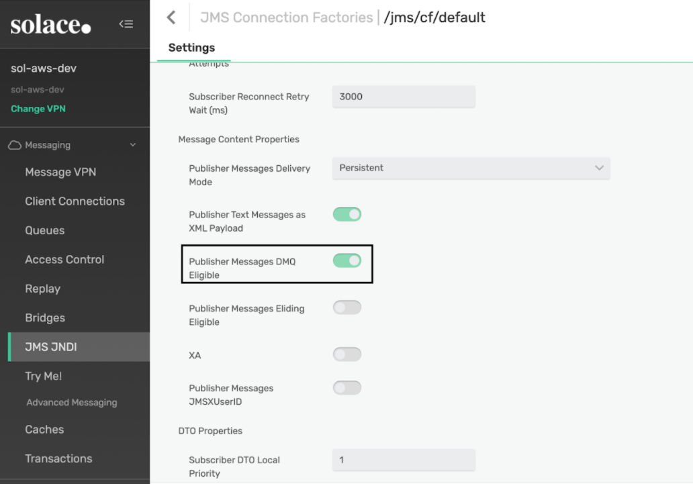
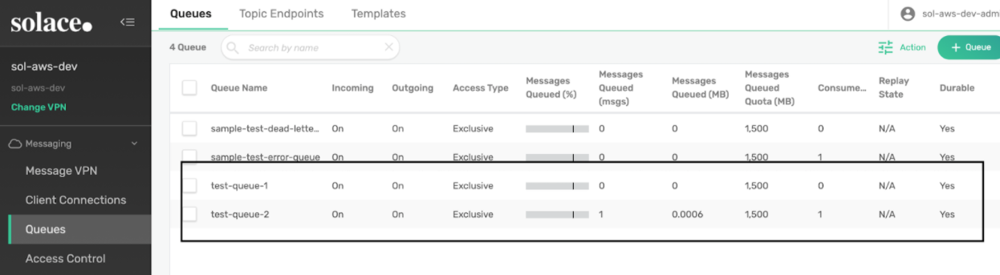
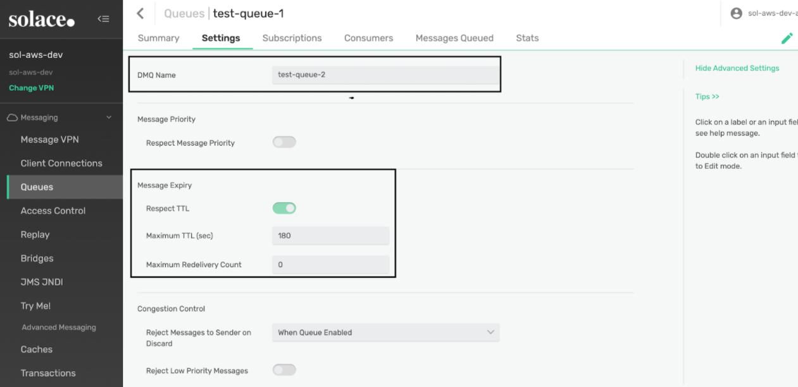
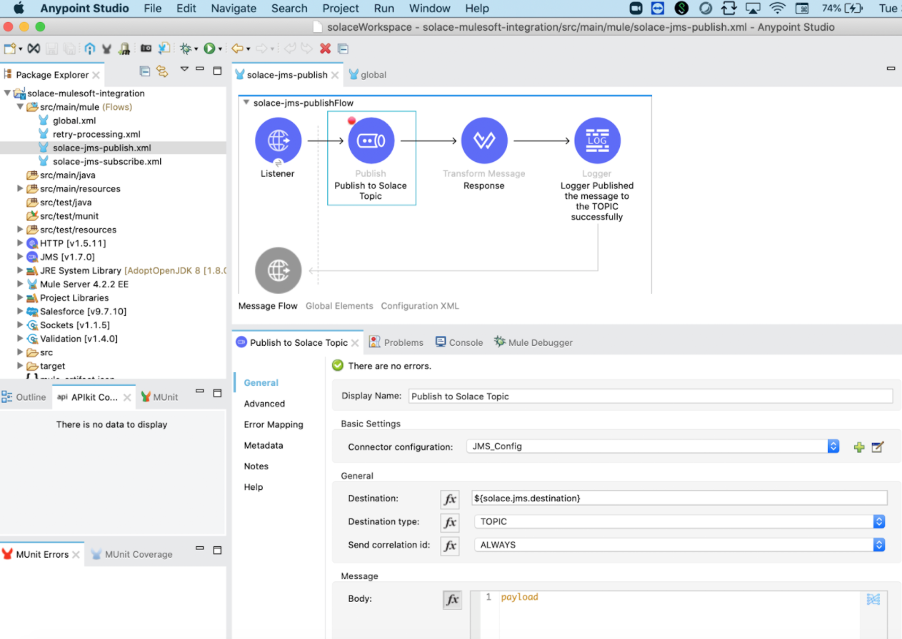
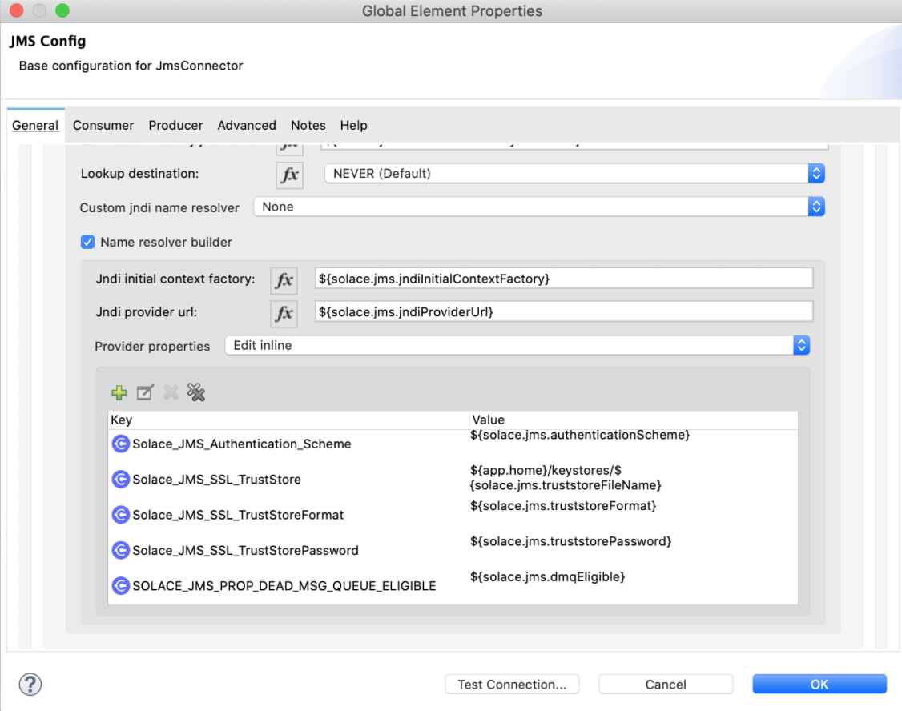
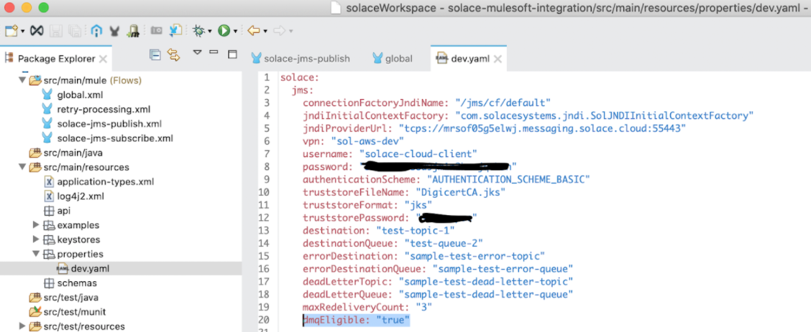
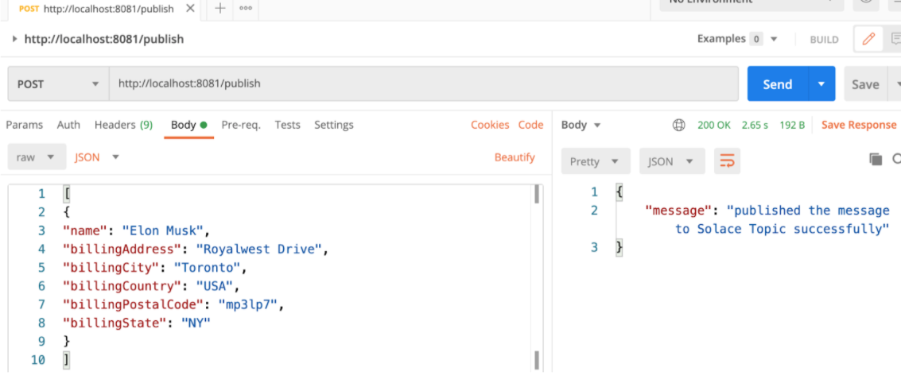
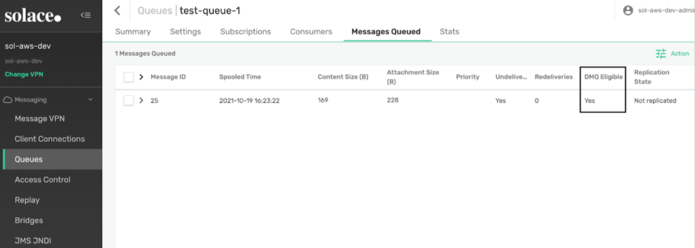
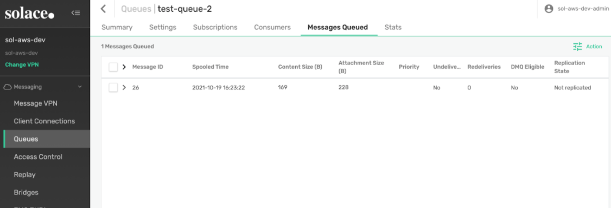

In this post, I will be explaining how to configure Solace DMQ through the Mule JMS Connector. There can be many business scenarios where the processing of the message will be delayed by a predefined amount of time. In such scenarios, we can make use of the concept of the TTL property and the DMQ.

## Dead Message Queues

By default, Guaranteed messages are removed from a durable endpoint's message pool and discarded when:

- The number of redelivery attempts for a message exceeds the Max Redelivery value for the original destination endpoint;
- Or, a message's Time-To-Live (TTL) value has been exceeded and the endpoint is configured to respect message TTL expiry times.

If you don't want the messages to be discarded, they can be moved to a dead message queue (DMQ) assigned to the endpoint.

## How DMQs Work

Any durable queue on the same Message VPN as the endpoint that the messages are being removed from can be assigned as a DMQ.

Messages flagged as DMQ-eligible by the publishing client will be sent to the endpoint's DMQ rather than be discarded.

However, if an endpoint's assigned DMQ doesn't exist, then the removed Guaranteed messages will still be discarded even if they are DMQ-eligible. By default, each durable endpoint is assigned a DMQ named `DEAD_MSG_QUEUE`, but this queue does not pre-exist and must be created by a management user.

Now let us see the steps involved in setting up DMQ and TTL.

## 1. Enabling the "Publisher Messages DMQ Eligible" property in the JMS JNDI of the Message VPN

Log in to Solace Cloud Message VPN. (Please refer to my first blog, “[How to integrate Solace PubSub+ Cloud with MuleSoft](https://www.prostdev.com/post/how-to-integrate-solace-pubsub-cloud-with-mulesoft),” which explains how to create a Solace Cloud Trial account and how to spin up a Service in Solace).

Click on JMS JNDI --> Click on Connection Factories --> Click on /jms/cf/default --> Scroll down and enable the property “Publisher Messages DMQ Eligible” as highlighted in the screenshot below.

## 2. Creating Queues and Topics

Create the new Queues and their corresponding Topics as shown below. As part of the POC, our queues of interest are highlighted below.

## 3. Setting up DMQ and TTL in the “test-queue-1” queue

In the advanced settings of the `test-queue-1` enable the ‘**Respect TTL’** and set the ‘**Maximum TTL**’ as 180 seconds (this can be set based on our need). Also, set the ‘**DMQ Name**’ as `test-queue-2`. As per this setting, whenever any message reaches `test-queue-1`, the message stays in this queue for 180 seconds before it’s pushed to DMQ (`test-queue-2`).

## 4. Publishing Message to Solace Topic with SOLACE_JMS_PROP_DEAD_MSG_QUEUE_ELIGIBLE set to true

In the `solace-jms-publish.xml`, I added an HTTP Listener to be able to listen to a request with the content that I want to publish into the Solace Topic. Here you can see how I have configured the JMS Publish connector:

Also, I have set the property `SOLACE_JMS_PROP_DEAD_MSG_QUEUE_ELIGIBLE` to `true` in the **JMS Config Provider Properties.**

## 5. Publishing the message from Postman

Now the message is published to the Topic with ‘**DMQ Eligible**’ set to ‘**Yes’**. This message stays in the Queue `test-queue-1` for 180 seconds before which it will be published to DMQ (`test-queue-2`) automatically for further processing.

## Recap

Now we know how a delay in the processing of the messages can be achieved in Solace using the DMQ and TTL feature. Thanks for reading my post and I hope it will help!

That’s it for now! See you in the next post!

-Pravallika
