If you’ve been working from home recently, you probably have had one of those dreaded WFH nightmares. You know the one I’m talking about. The one where you’re giving a presentation or you’re in the middle of a meeting with your webcam on, and your roommate or family suddenly enters the room.

Wouldn’t it be great to be able to use your Philips Hue Smart Lights and synchronize them with your Google Calendar so that they show a red light when you’re busy? This way, they’ll know when you’re in the middle of a meeting and they won’t enter the room.

For this post, I’ll guide you through some simple steps to synchronize your Philips Hue and Google account.

## Before starting

If you're new to Philips Hue or you're thinking of purchasing, you should read this post first: [Things to consider before buying a Philips Hue Smart Light](https://www.prostdev.com/post/things-to-consider-before-buying-a-philips-hue-smart-light).

I will be assuming that you already have your Google account (to use the Google Calendar) and your Smart Lights all set up with the [Hue application](https://www.philips-hue.com/en-ca/philips-hue-app).

> [!NOTE]
> This post will not guide you through the synchronization or installation of your Philips Hue Lights.

You should also create a [Philips Hue account](https://account.meethue.com/) where you will be storing all the data from Hue - your lights, rooms, scenes, zones, etc.

## 1. Sign in to your Philips Hue account

Go to [account.meethue.com](https://account.meethue.com/) and sign in with your credentials.

If you go into the [Bridge tab](https://account.meethue.com/bridge), you should be able to see an online status for your bridge.

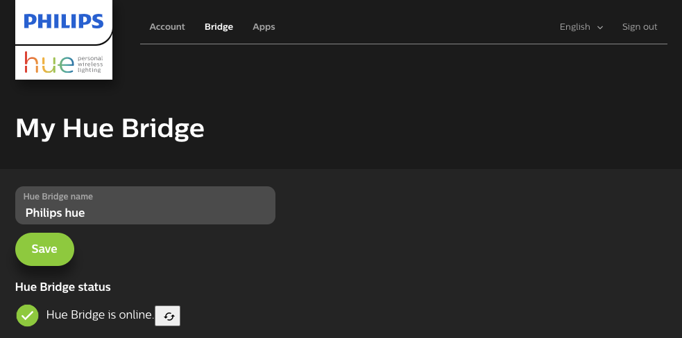

You can also go into the [Apps tab](https://account.meethue.com/apps) to check some of the other applications that you may already have synced up with your Hue account.

## 2. Connecting IFTTT to your Google account

Go into [ifttt.com](https://ifttt.com/home) (If This Then That) and create a new account using the Google account connected to your Google Calendar.

You can simply click on [Sign Up](https://ifttt.com/join) and then choose the “Continue with Google” button. This will open a new browser window (or tab), so you can sign in to your Google account. This will automatically link your Google account to your brand-new IFTTT account.

If you want to use a different email address from your Google account, you can create an IFTTT account with any email. Go into your [IFTTT account’s settings](https://ifttt.com/settings) and click on “Linked accounts” for Google.

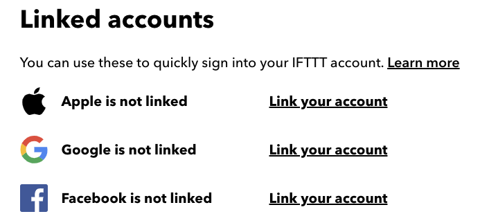

This will also open a new browser window (or tab), so you can sign in to your Google account. After doing this, your Google account will be linked.

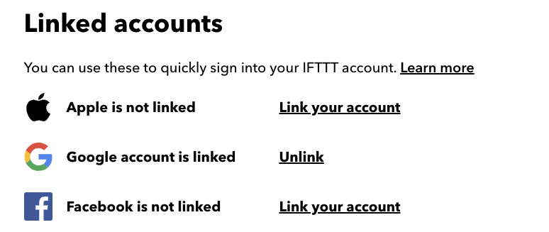

## 3. Configuring the trigger (If This)

Click on the [Create button](https://ifttt.com/create/) on the top right side of the screen. This will open the screen where you will be able to program the integration (If This Then That).

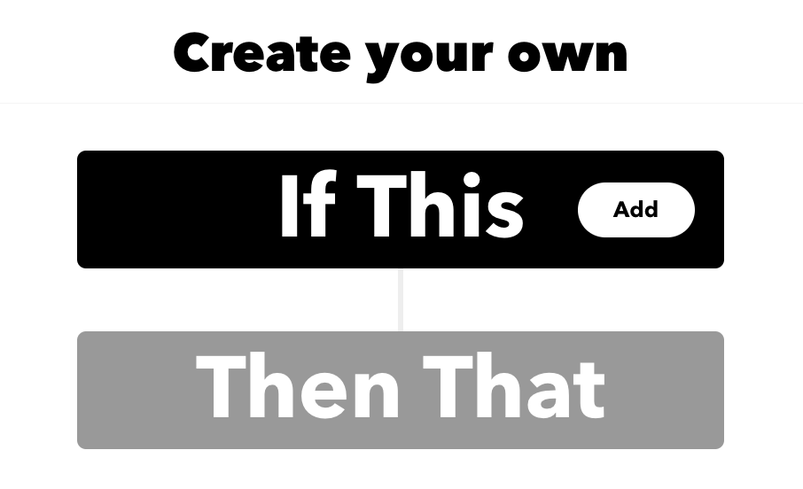

Click on “If This” and search for Google Calendar. Click on the Google Calendar icon.

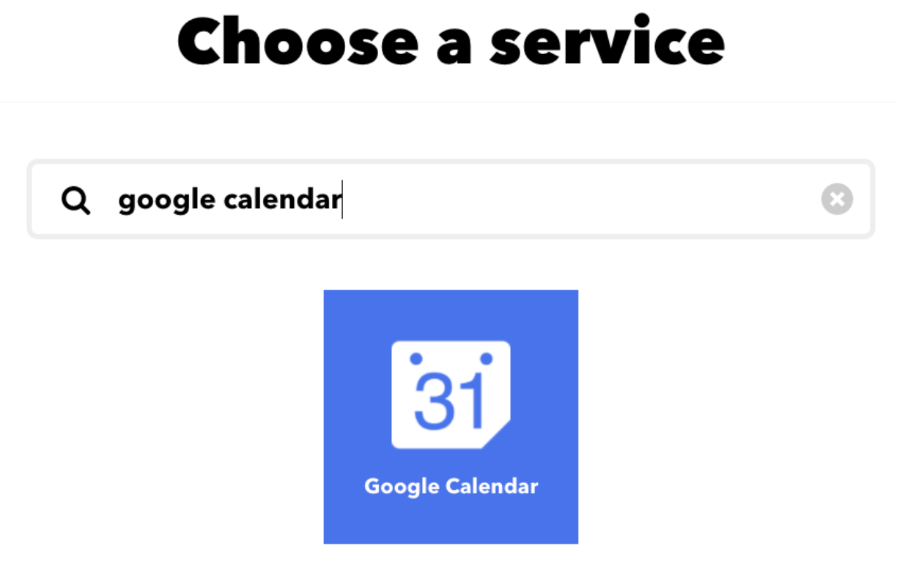

Now select the “Any event starts” trigger.

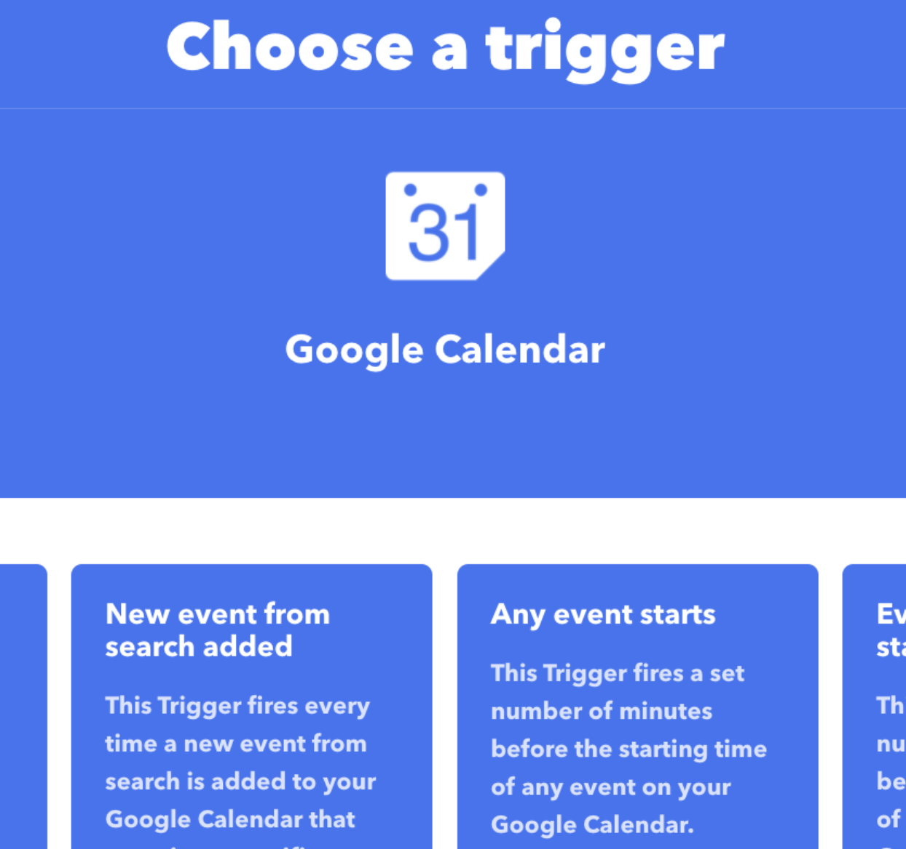

Select the calendar you want to use from your Google account. You can also select how much time before the event starts that you want this integration to trigger.

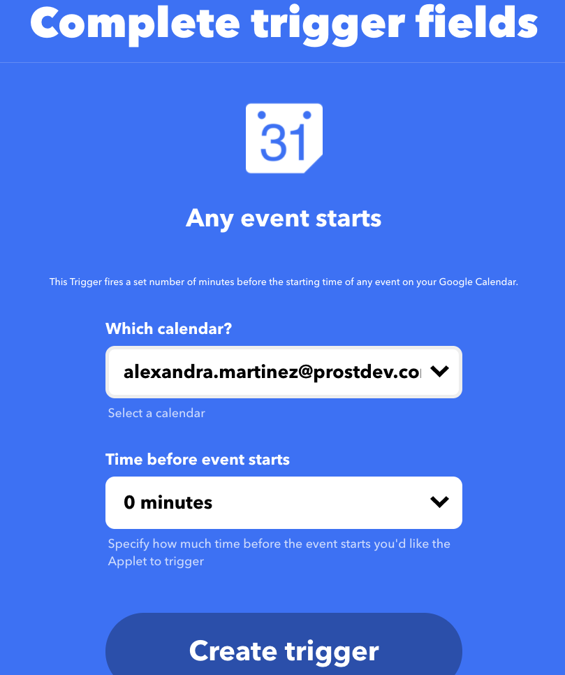

Click on “Create trigger,” which will return you to the create screen so you can set up the “Then That” part.

## 4. Configuring the behavior (Then That)

Click on this second button to continue with the configuration.

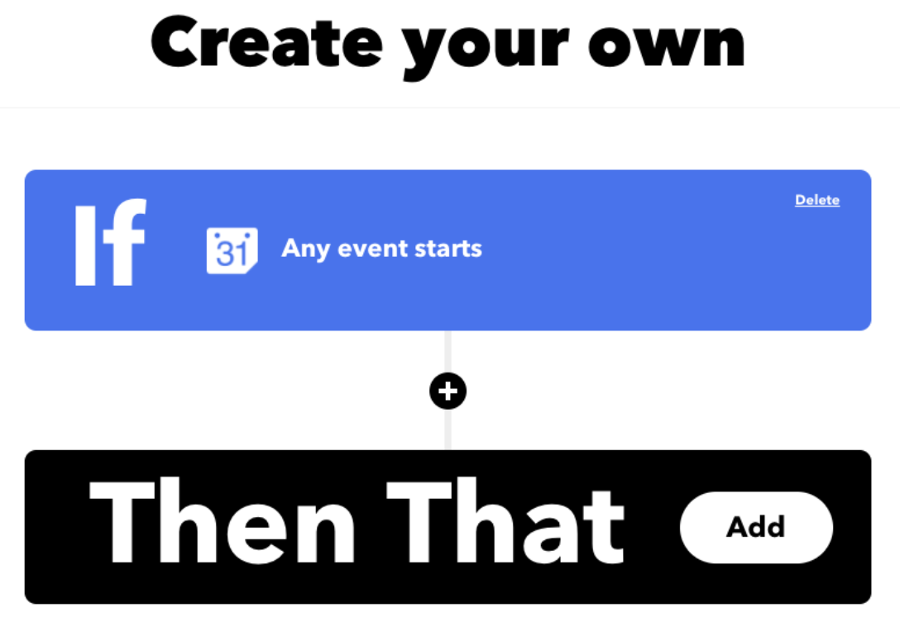

Now search for “Philips Hue” and click on the icon.

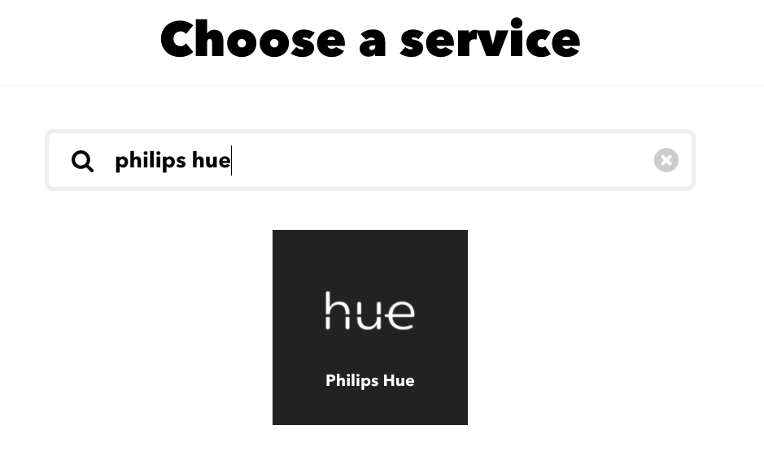

You can choose any action you want your lights to perform. I’m going to choose “Change color.”

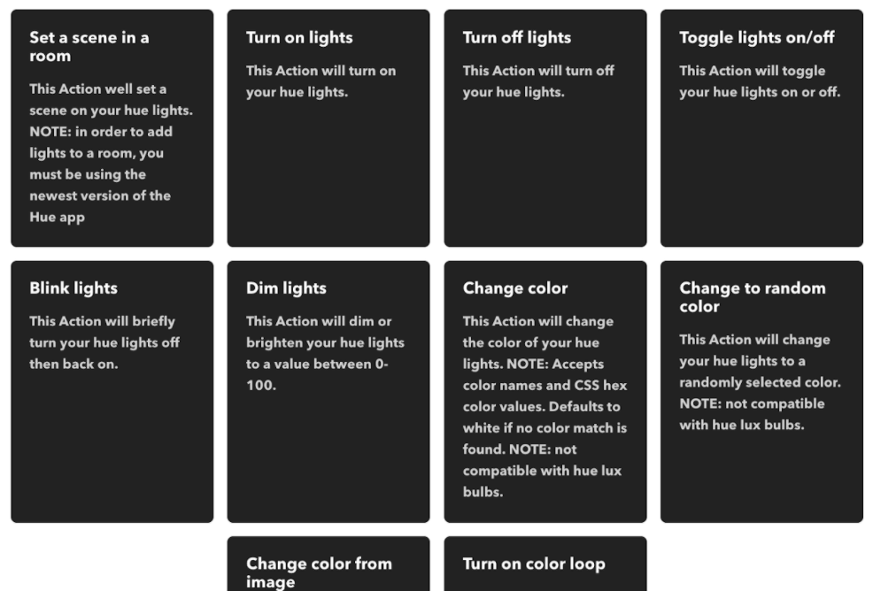

Click on “Connect” to select your Philips Hue account.

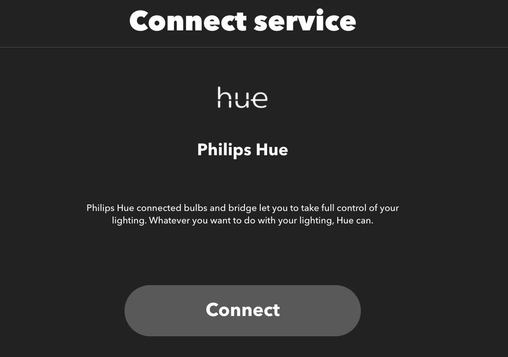

This will open a new browser window (or tab), so you can sign in to your Philips Hue account. Select “Yes” to finish the setup.

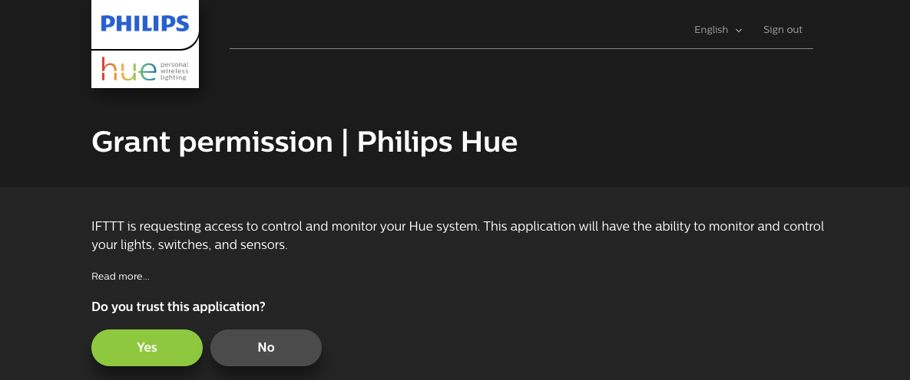

Now you can select the light, room, or zone from your Philips Hue account that will change its color, and you can write the color name (ignore the “Add ingredient” button). Click on “Create action” when you’re done.

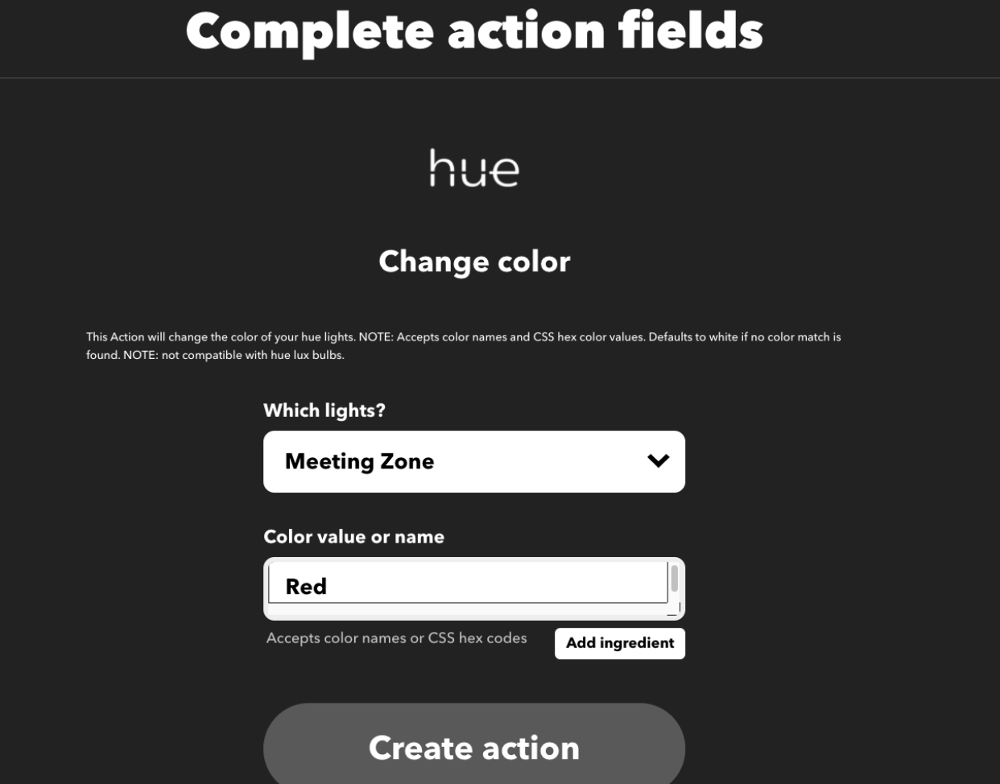

It’s all set up now! Just click on “Continue” to finish the configuration.

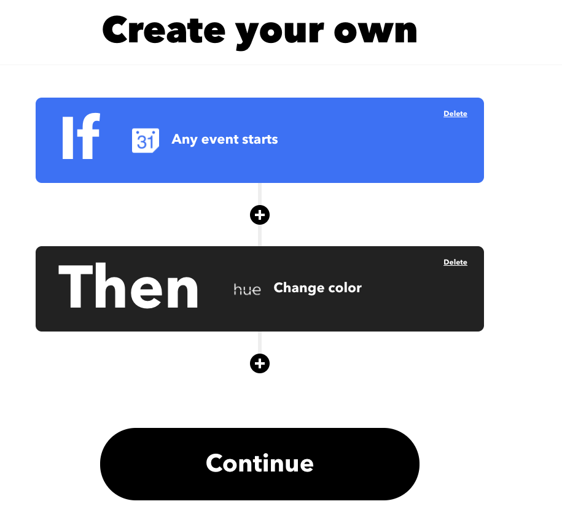

You can also set a name so you can remember what this integration will do. You can choose whether you want to receive a notification when the Applet runs or leave it turned off. Click on “Finish.”

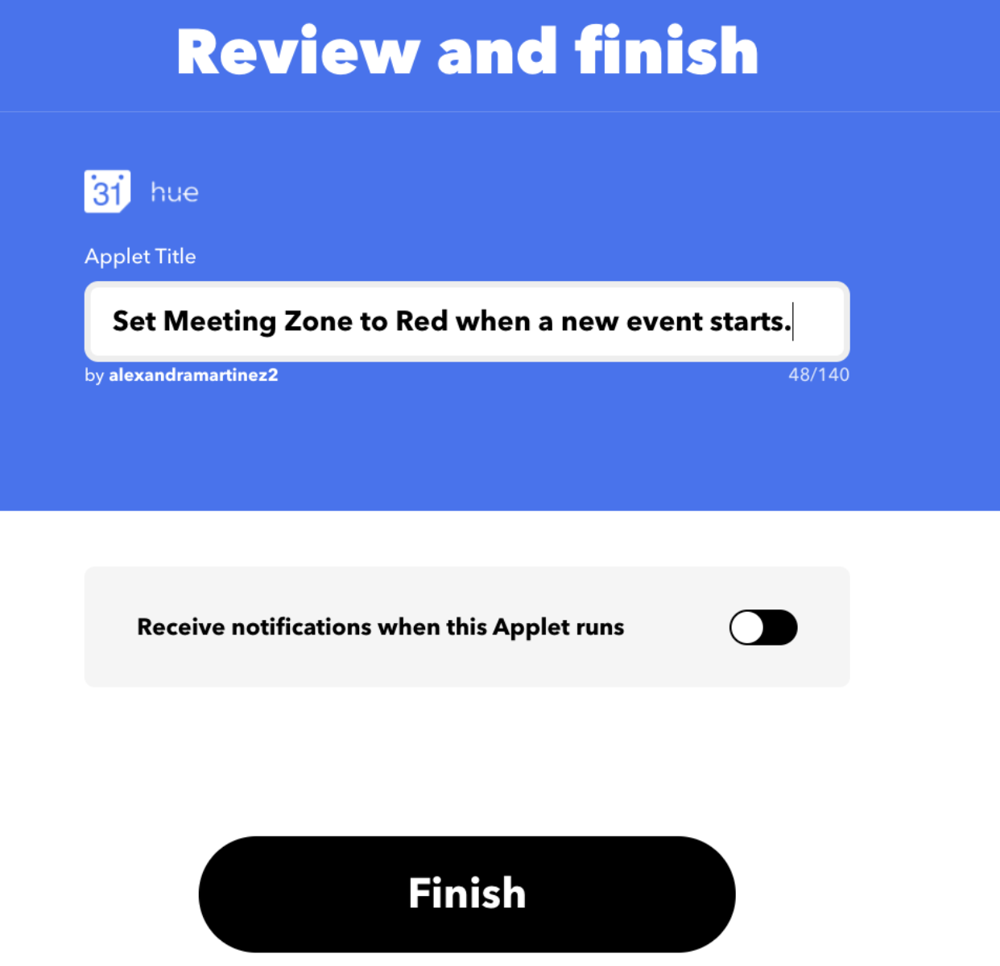

## 5. Did it work?

Try it out! Create an event on your Google Calendar and wait for the lights to change. :)

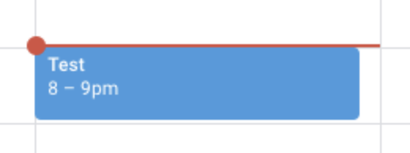

Worked for me!

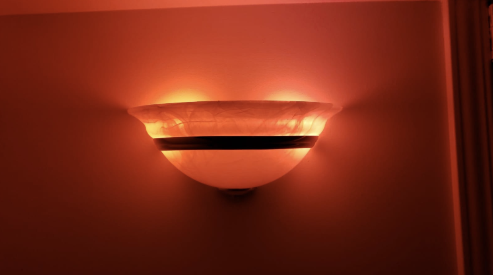

You can check out all the different integrations or Applets that you can create in IFTTT - you’ll have a lot of fun!

Let me know what else you create or if you have any questions.

*Prost!*

-Alex
