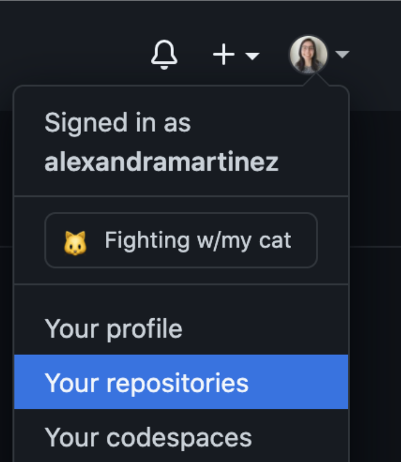
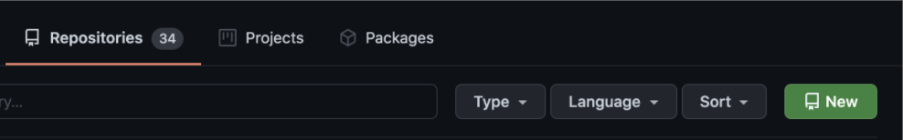
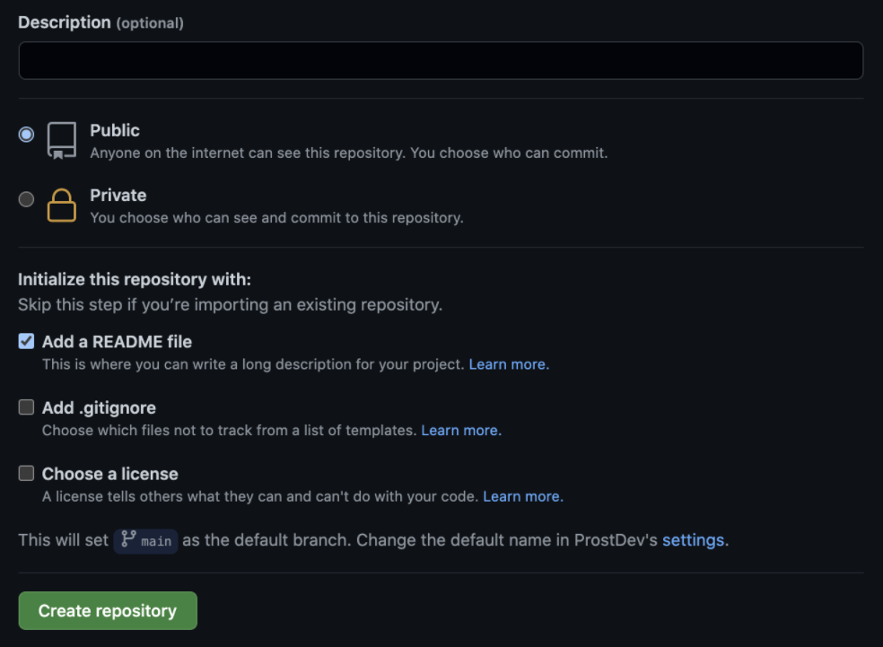
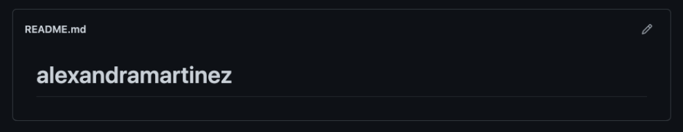
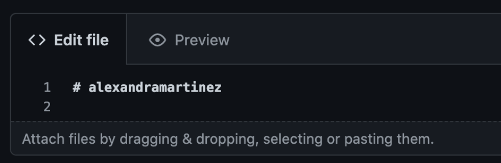
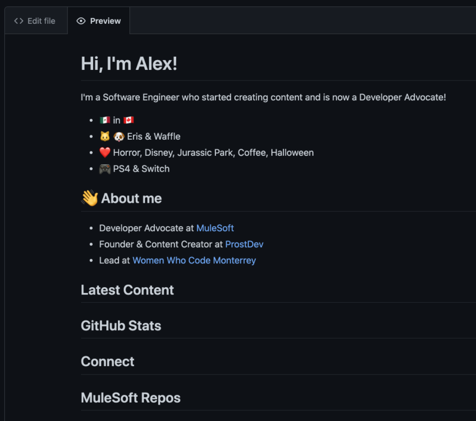
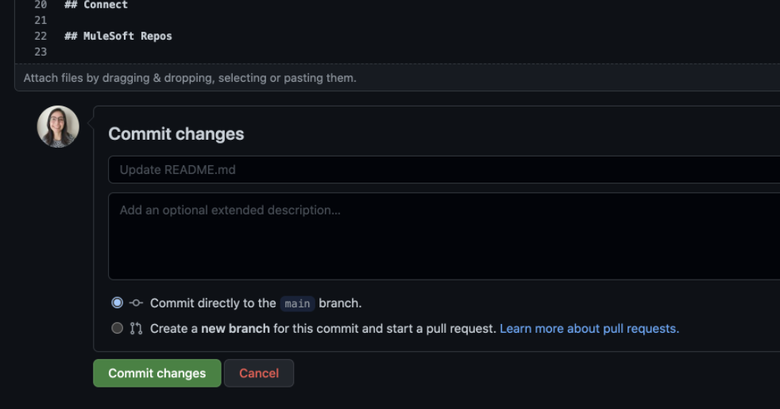
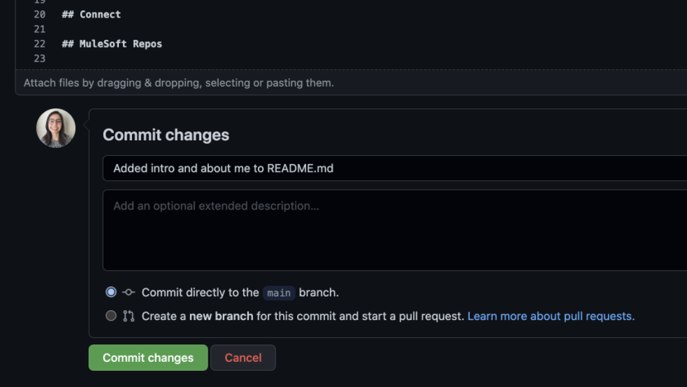
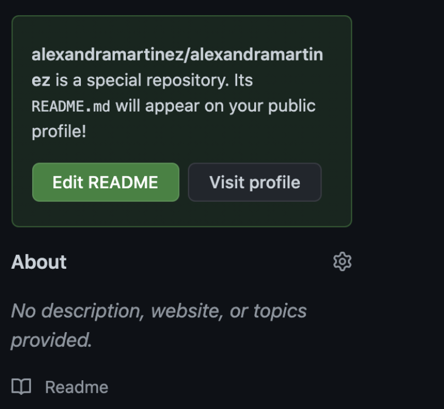

*GitHub repository with the final `README.md` file can be found at the end of the post.*

Having a [GitHub](https://github.com/) account in today’s world is a **must-have** for any software developer. In this series of posts, I’ll show you how to create a striking `README.md` file to attach to your GitHub profile. If you want to see an example of the final result, take a look at [my GitHub profile](https://github.com/alexandramartinez)!

If you’re new to Git, GitHub, or `README.md` files, make sure to check out the previous post of this series: [How to create a README file for your GitHub profile, part 1: Intro to Git, GitHub, and README files](https://www.prostdev.com/post/how-to-create-a-readme-file-for-your-github-profile-part-1-intro-to-git-github-and-readme-files).

Now, I’ll guide you through the basics of creating a Markdown file.

### What is Markdown?

[Wikipedia](https://en.wikipedia.org/wiki/Markdown) states that “Markdown is a lightweight markup language for creating formatted text using a plain-text editor. ... Markdown is widely used in blogging, instant messaging, online forums, collaborative software, documentation pages, and readme files.”

In summary, it’s a language used to write files using formatted text (like bold or italic characters, bulleted lists, numbered lists, headers, links, code, etc.). Markdown files end in `.md` (like `README.md`). I like to look at it as simplified [HTML](https://en.wikipedia.org/wiki/HTML).

But enough theory. You’ll learn more with practice.

### Create the repository to keep the README

If you don’t already have a GitHub account, please create one first. Once you have it, click on your profile picture at the top-right of the page and click on “Your repositories.”



Now click on the green “New” button.



**This is important** - you have to name your new repo exactly the same as your username. If you’re not sure what yours is, just click on your profile picture again, and you will see it after the “Signed in as …”. In my case, it’s “alexandramartinez”. You don’t have to add a description. Make sure to select “Public” and the “Add a README file” checkbox like in the screenshot below.



Click on “Create repository.” You now have a new repo with an (almost) empty README file. Click on the “edit” button on the right side of the `README.md` file.



This will bring you to the editor view. You also have a Preview tab in order to see the formatting of the file.



### How to add headers in Markdown

Ok, from this point on, I’ll mainly show you the code and the explanations of the formatting. I trust you’ll use the “Edit file” and “Preview” tabs to make sure it looks as expected.

Replace your username with your own title. In my case, I wrote:

```
## Hi, I'm Alex!
```

The hashtag character is used to specify headers. The single hashtag is the biggest one. You can use ##, ###, ####, and so on to specify what type of header you want to format (each smaller than the last one). In my README file, I’m just using the first title and the following header (H1 and H2). This is how my file looks so far, with all my headers and a brief introduction:

```
## Hi, I'm Alex!

I'm a Software Engineer who started creating content and is now a Developer Advocate!

### About me

### Latest Content

### GitHub Stats

### Connect

### MuleSoft Repos
```

### How to add bulleted lists in Markdown

Now, in the “About me” header, I am using a bulleted list to show my current positions. To create this list, you just have to use a dash (-) and leave a space between the dash and the following character. Like this:

```
- Developer Advocate at MuleSoft
- Founder & Content Creator at ProstDev
- Lead at Women Who Code Monterrey
```

### How to add hyperlinks in Markdown

I also want to add links to the companies I mentioned in this list. The syntax to add links in Markdown is the following:

```
[Text to display](link)
```

Here is what it looks like with the 3 links added to MuleSoft, ProstDev, and Women Who Code Monterrey:

```
- Developer Advocate at [MuleSoft](https://www.mulesoft.com/)
- Founder & Content Creator at [ProstDev](https://www.prostdev.com/)
- Lead at [Women Who Code Monterrey](https://www.womenwhocode.com/monterrey)
```

Finally, feel free to make your introduction a bit more fun or show who you are. In my case, I thought adding emojis was a bit more casual. Yes, you can also add emojis to Markdown!

### Final result (for now)

Here’s the result we have so far (following my own README file):

```
## Hi, I'm Alex!

I'm a Software Engineer who started creating content and is now a Developer Advocate!

- 🇲🇽 in 🇨🇦
- 🐱 🐶 Eris & Waffle
- ❤️ Horror, Disney, Jurassic Park, Coffee, Halloween
- 🎮 PS4 & Switch

### 👋 About me

- Developer Advocate at [MuleSoft](https://www.mulesoft.com/)
- Founder & Content Creator at [ProstDev](https://www.prostdev.com/)
- Lead at [Women Who Code Monterrey](https://www.womenwhocode.com/monterrey)

### Latest Content

### GitHub Stats

### Connect

### MuleSoft Repos
```



### Commit your changes

Once you feel happy with your changes, scroll-down until you see the “Commit changes” form and click the green button.



You can add a title to the commit, so you remember exactly which changes you did here, such as “Added intro and about me to `README.md`”.

Note that if you don’t write anything, GitHub will automatically add the title “Update `README.md`,” so you don’t *have to* add a title/description to the commit, but it’s a best practice to keep in mind for your future projects.



You’ll notice that there’s a green square on the right side of your repo that says this is a special repository.



You should now be able to see this README file in your GitHub profile!

If you have any issues, you can refer to the [official documentation here](https://docs.github.com/en/account-and-profile/setting-up-and-managing-your-github-profile/customizing-your-profile/managing-your-profile-readme) or leave me a comment to troubleshoot!

### Recap

- You need to create a repository with the same name as your GitHub username.
- The hashtags in Markdown are used to specify a header or a title. “#” is the main title, and the following ones can be used as header 2 (##), header 3 (###), and so on.
- Bulleted lists can be added in Markdown using the dash (-) character and leaving a space between the dash and the next character/word.
- Hyperlinks can be added in Markdown using this syntax: [Text to display](link). For example, [ProstDev](https://www.prostdev.com/).
- Remember to commit any changes done to the `README.md` file to your repository!

Don’t miss any articles! Remember to subscribe at the bottom of the page to receive email notifications as soon as new content is published. ✨

-Alex

### GitHub repository

[ProstDev - alexandramartinez](https://github.com/ProstDev/alexandramartinez)
