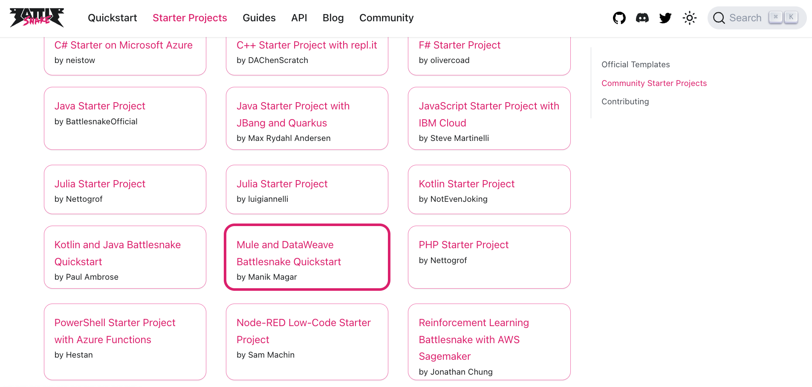
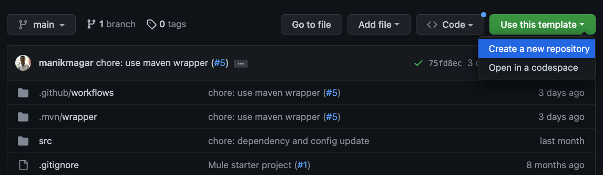
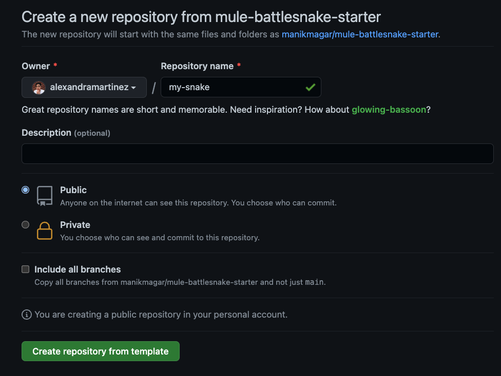
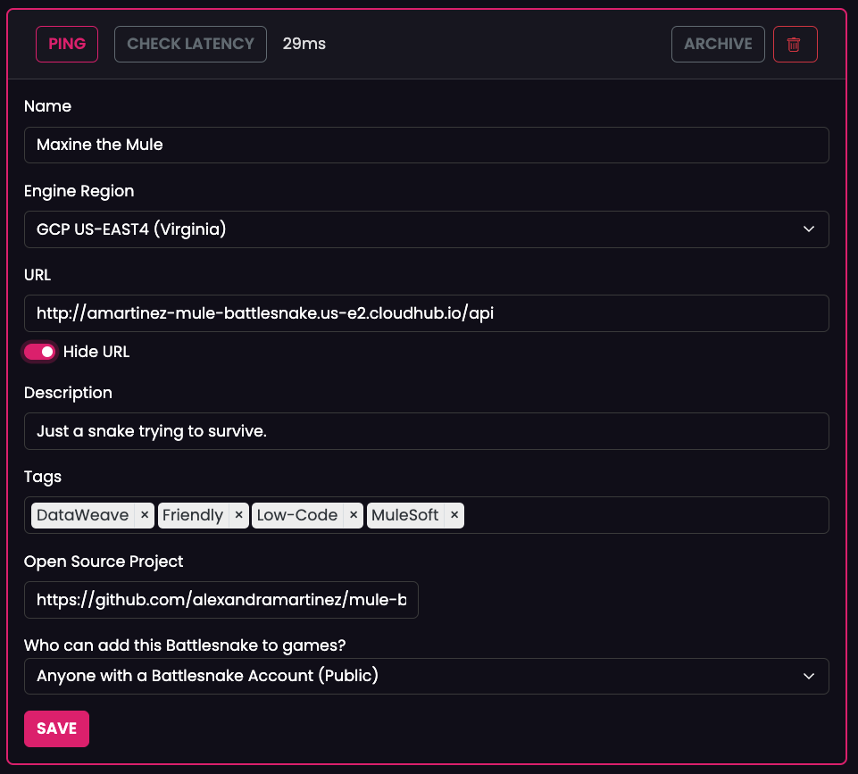
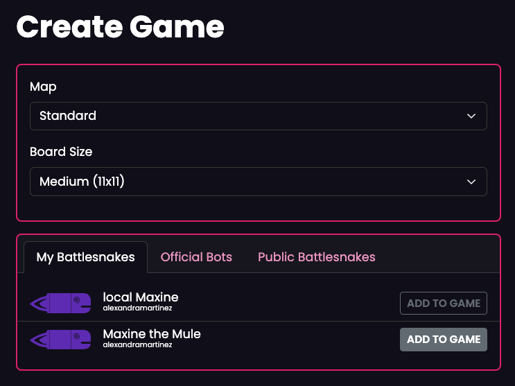
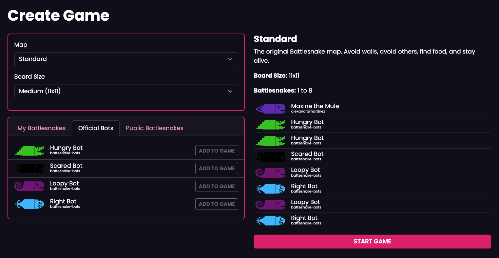
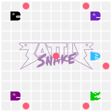
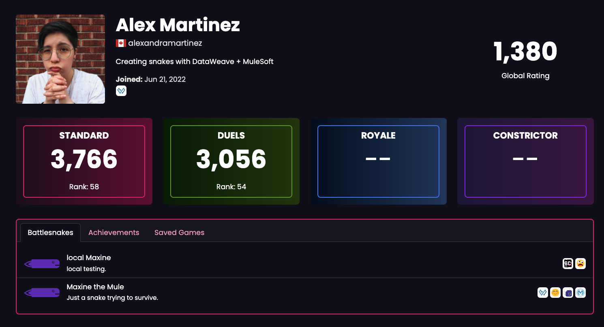

If you’re not familiar with the modern Battlesnake game, you must at least remember the snake game from those old cell phones. It’s basically the same, but developing APIs and deploying them to the cloud...And fighting other snakes 😂

In this post, I’m going to guide you through all the steps to generate your own MuleSoft starter project in GitHub and be ready to start modifying your DataWeave code to move the snake.

## Create your own GitHub repository

The first step is to get your own repo based on the Mule starter project that the great Manik created for us. To do this, you first have to go to the [official list of Starter Projects](https://docs.battlesnake.com/starter-projects) in the Battlesnake documentation. Scroll down until you see the **Mule and DataWeave Battlesnake Quickstart** project created by Manik Magar and click on it.



Once you open Manik’s GitHub repo, click on the **Use this template** button and select **Create a new repository**.



Add any name you choose for your repo and click **Create repository from template**.



This will generate your own GitHub repo. You’re now ready to start modifying your code!

## Personalize your snake

You can personalize your own snake. For example, changing its head/tail design or changing its color. You can modify this data at `src/main/resources/application.yaml`.

This is what Manik added to the starter project:

```yaml
battlesnake:
  config:
    "apiversion": "1"
    "author": "mmsonline"
    "color" : "#888888"
    "head" : "default"
    "tail" : "default"
    "version" : "0.0.1-beta"
```

And this is what I have for my snake:

```yaml
battlesnake:
  config:
    "apiversion": "1"
    "author": "alexandramartinez"
    "color" : "#6c25be"
    "head" : "caffeine"
    "tail" : "nr-booster"
    "version" : "0.0.1-beta"
```

You can read more about the customizations in the [Battlesnake docs](https://docs.battlesnake.com/guides/customizations), or you can go ahead and search for the available [head/tail customizations](https://play.battlesnake.com/customizations).

You can also leave the defaults as they are and your snake is still going to work. But it’s nice to be able to customize stuff :-)

## Find the DataWeave logic

The API is not the problem here. Manik generated a pretty good starter project. The thing is that you need to create all the DataWeave code on your own to tell the snake where to move to. Make sure you read the [Battlesnake docs](https://docs.battlesnake.com/guides) so you can understand how everything works. But I’ll give you a quick summary.

You will receive a [POST /move](https://docs.battlesnake.com/api/requests/move) request in your API containing the current turn. This will trigger the DataWeave code (located at `src/main/resources/dw/move-snake.dwl`) and return a response of where to move from here.

All your DataWeave code will return is a JSON object telling the game where you’re gonna move next. For example:

```json
{
  "move": "up",
  "shout": "Moving up!"
}
```

The trick here is to know exactly where to move based on a series of rules.

You will receive a payload with a general structure that looks something like this:

```json
{
   "game": {
      "id": "...",
      "ruleset": {
         "name": "standard",
         "settings": {...}
         }
      },
      ...
   },
   "turn": 42,
   "board": {
      "height": 11,
      "width": 11,
      "snakes": [
         {
            "id": "...",
            "name": "...",
            "body": [...],
            "head": {...},
            ...
         }
      "food": [...],
      "hazards": []
   },
   "you": {
      "body": [...],
      "head": {...},
      "length": 3,
      ...
   }
}
```

> To see a full example, please refer to the docs [here](https://docs.battlesnake.com/api/example-move#move-api-request).

So, your code will have to make decisions based on where the other snakes are, where the walls are, where the food is, etc. This is the challenging part! Manik gives you a pretty good way to start coding the logic. But the starter snake only knows to not collide with its own neck. It doesn’t know how to not hit walls, not hit itself, not hit others, or find food. You will need to code that on your own.

## Deploy the Mule app

Whenever you feel ready to try out your snake’s logic, you can deploy your Mule application directly to **CloudHub** and take the URL from there. It should look like this:

```
http://amartinez-mule-battlesnake.us-e2.cloudhub.io
```

> For information on how to deploy your application, see [Deploy to CloudHub](https://docs.mulesoft.com/cloudhub-1/deploying-to-cloudhub).

> [!TIP]
> If your Anypoint Platform account expires, you can create a new account using the same details as before (name, email, phone, etc.) and just changing your username.

However, deploying to CloudHub can take a long time. I’ve personally been using **ngrok** to do local deployments and be able to expose my local URL through the public internet. You can follow the next steps to use ngrok:

- Install [ngrok](https://ngrok.com/)
- Run your Mule application locally
- Run `ngrok http 8081`
- Retrieve the public URL

This URL would look something similar to this:

```
https://c0cb-2001-1970-5425-e000-00-7e86.ngrok.io
```

Now you’re all ready to create your actual snake on Battlesnake!

## Create your Battlesnake

First of all, you need to create an account at [play.battlesnake.com](https://play.battlesnake.com/). Once you have it, you can go to the **Battlesnakes** tab, click on **New Battlesnake**, and fill out the details. Make sure you add `/api` to the end of the URL (either CloudHub or ngrok).

Here’s my snake if you want to take it as an example:



After you click on **Save**, it will attempt to call the URL. If the app was successfully deployed, there shouldn’t be any issue with saving it.

Now you’re ready to test your snake!

## Create a new game

Go to the **Create Game** tab. I recommend you leave the default options selected. Scroll down if needed and click **Add to Game** next to your snake.



You can also click on the **Official Bots** tab to select more snakes for the game or click on **Public Battlesnakes** to add your friends’ snakes.



Once you feel the game is ready, simply click on **Start Game** and then press the play (▶️) button.



Look at my Maxine go!

## Add your snake to the leaderboard

Once you have a good and stable snake, you can go to the [leaderboards](https://play.battlesnake.com/leaderboards) and add your Battlesnake so it can start earning points and get a place!

These are my stats so far:



I work on my snake at least once per week during my live streams. You can watch me live on [Twitch](https://www.twitch.tv/devalexmartinez) or watch my previous streams on [YouTube](https://www.youtube.com/playlist?list=PLb61lESgk6hi60IazebMZ7pmZBZeIcEKt).

I hope this was helpful!

Feel free to play around with Maxine the Mule if you want :) just search for/select her from the **Public Battlesnakes**.

Send me any good games you have with her! I’d love to see them playing :D
