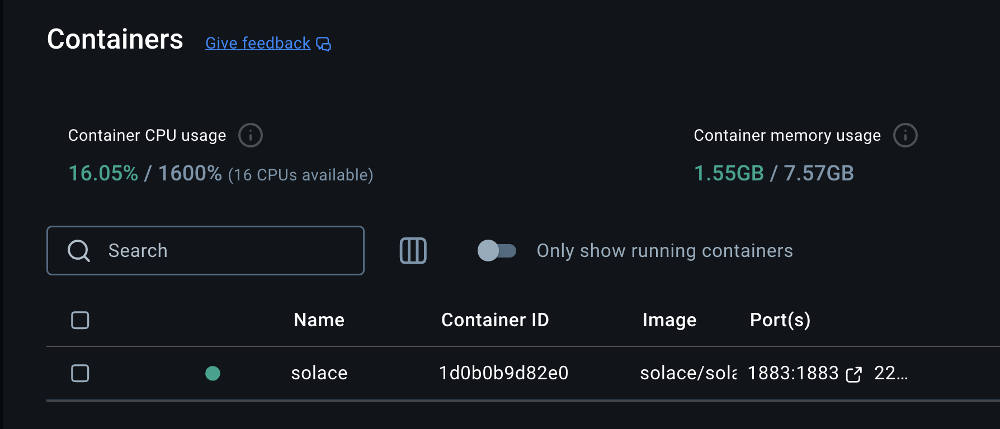
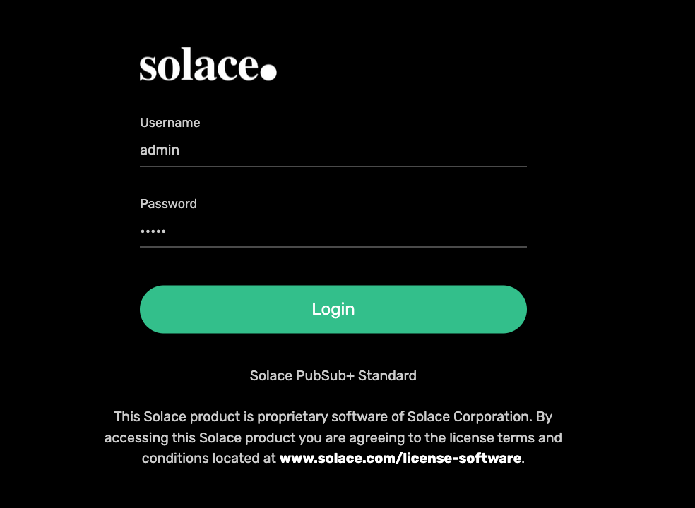
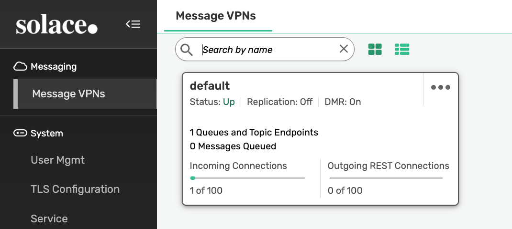
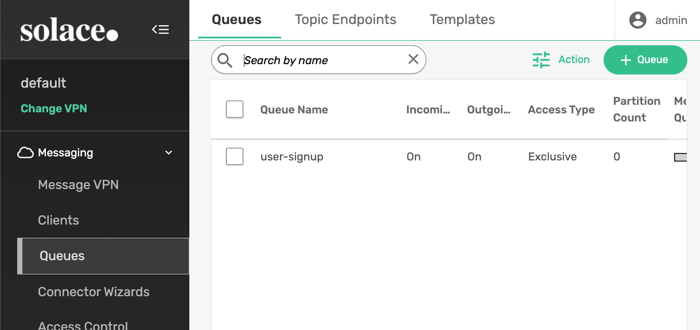
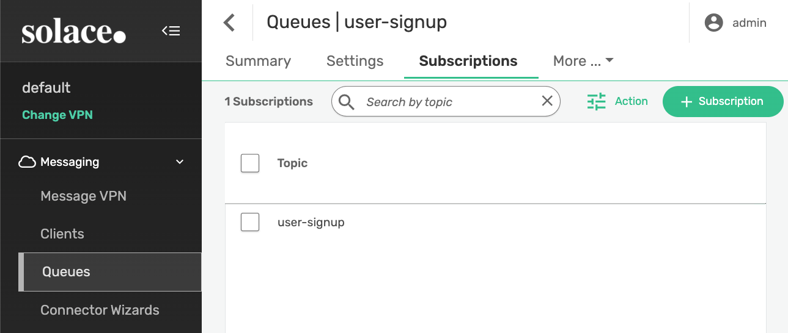
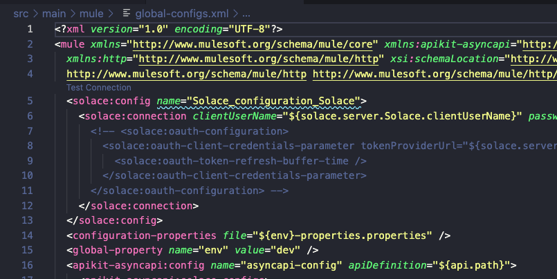
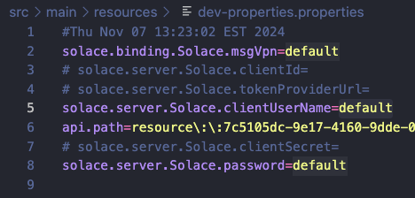
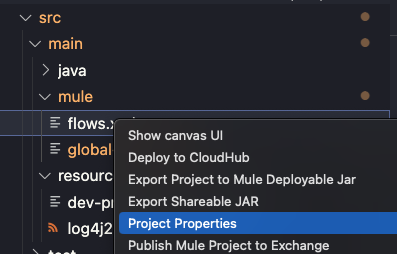
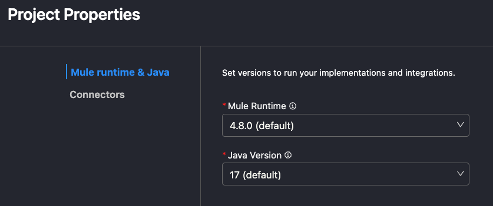
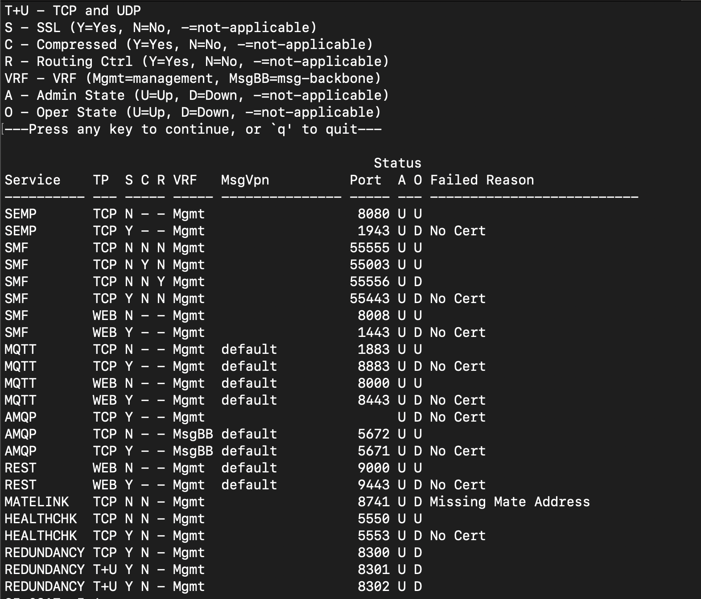

First of all, I am brand-new to any Solace stuff. So there I was, working on a demo to connect Mule with [Solace](https://solace.com/) PubSub+ (Message Broker) but I didn't want to create a 30 or 60-day cloud trial account with them because I wanted to be able to re-run this demo as many times as needed. So, I saw you could run the broker using Docker. The problem is that all the documentation from the MuleSoft side were for Solace in the cloud and not local.

So, here I am creating this post for you! If you want to run Solace locally, using their Docker image/container, and then connect that to a MuleSoft AsyncAPI specification/application -- then, keep reading.

> [!NOTE]
> Take a look at the following GitHub repo to follow along with the code: 
> [asyncapis-accounts-email](https://github.com/alexandramartinez/asyncapis-accounts-email)

## 1 - Start the Solace Docker Container

I started by following the [Getting Started with PubSub+ Standard Edition](https://solace.com/products/event-broker/software/getting-started/) page, which pretty much gives you the command to run to start the new Docker container:

```bash
docker run -d -p 8080:8080 -p 55554:55555 -p 8008:8008 -p 1883:1883 -p 8000:8000 -p 5672:5672 -p 9000:9000 -p 2222:2222 --shm-size=2g --env username_admin_globalaccesslevel=admin --env username_admin_password=admin --name=solace solace/solace-pubsub-standard
```

> [!NOTE]
> The command above is used for Mac only. Please refer to the website for the Linux/Windows command.

However, I had one issue with the port 9000, so I had to change that to map to the port 9001 instead. If you have a port issue, you can also change it. Make sure you change the port at the **left** side and not the one at the right side:

```bash
<your-local-port>:<docker-port>
```

The other thing you'll notice from the website is that the commands are different depending on the operating system you're running. It states: *Your applications can use Solace APIs to connect to the message broker on this port. Note that for Mac users we are mapping port 55554 to the default Solace SMF port of 55555 because Mac OS now reserves port 55555.*

Anyway, long story short, if you can run the command from the website without errors, good. If not, modify it to match your available ports. For example, since my port 9000 was busy (and I'm running Mac), this is the command I had to use:

```bash
docker run -d -p 8080:8080 -p 55554:55555 -p 8008:8008 -p 1883:1883 -p 8000:8000 -p 5672:5672 -p 9001:9000 -p 2222:2222 --shm-size=2g --env username_admin_globalaccesslevel=admin --env username_admin_password=admin --name=solace solace/solace-pubsub-standard
```

Once your container is running, you should be able to see a green icon next to it from your Docker Desktop application.



## 2 - Set up the queue

Once everything looks good, open your browser and head to [http://localhost:8080/](http://localhost:8080/). This will open a log-in screen to connect to Solace's management tool. If you're not seeing this screen immediately, wait a few minutes.



Write the credentials admin/admin and log in. Once inside, click on the default VPN.



From the left side, click on Queues and add a new Queue by clicking on the green **+Queue** button on the top right. Write the name of your queue and leave all the defaults. For our example, we'll use the name user-signup.



Click on this new queue to open its properties and head to the **Subscriptions** tab at the top. Add a new subscription/topic with the same name (user-signup).



You will need to do this configuration in order to receive the messages from MuleSoft.

## 3 - Create the AsyncAPI specifications

Head to Anypoint Code Builder and create a new AsyncAPI specification called **Accounts Service**. We will be using version 2.6 YAML for this example. Paste the following spec.

```yaml
asyncapi: '2.6.0'
info:
  title: Account Service
  version: '1.0.0'
  description: Publishes the UserSignedUp event when a new user account is created.
  contact:
      name: Alex Martinez
      email: alexandra.martinez@salesforce.com
      url: alexmartinez.ca
  license:
      name: test
      url: test
defaultContentType: application/json
tags:
    - name: solace
      description: makes use of Solace PubSub+
servers:
  Solace:
    protocol: solace
    bindings:
      solace:
        msgVpn: default
    url: localhost:55554
channels:
  user-signup:
    subscribe:
      description: Publishes the UserSignedUp event
      operationId: emitUserSignUpEvent
      message:
        $ref: "#/components/messages/UserSignedUp"
components:
  messages:
    UserSignedUp:
      payload:
        type: object
        properties:
          firstName: 
            type: string
            examples:
              - Alex
          lastName: 
            type: string
            examples:
              - Martinez
          email:
            type: string
            examples:
              - fake@email.email
          createdAt:
            type: string
            examples:
              - 2024-01-01T15:00:00Z
```

Note that we are using the **default** VPN and the `localhost:55554` URL. From the first step, the installation, you can see which port you're exposing locally to make use of port 55555 in Docker. In my case, since I'm using a MacOS, my port was changed to be 55554:55555. If you're using Linux/Windows, you probably set it up as 55555:55555. If this is the case, then please change the URL to match your port (the one on the left of the colon - 55555:).

Publish this spec to Exchange and create a new one called **Email Service**. Paste the following code.

```yaml
asyncapi: '2.6.0'
info:
  title: Email Service
  version: '1.0.0'
  description: Subscribed to receive the UserSignedUp event to send the new user a welcome email.
  contact:
      name: Alex Martinez
      email: alexandra.martinez@salesforce.com
      url: alexmartinez.ca
  license:
      name: test
      url: test
defaultContentType: application/json
tags:
    - name: solace
      description: makes use of Solace PubSub+
servers:
  Solace:
    protocol: solace
    bindings:
      solace:
        msgVpn: default
    url: localhost:55554
channels:
  user-signup:
    publish:
      description: Subscribed to receive the UserSignedUp event
      operationId: onUserSignUp
      message:
        $ref: "#/components/messages/UserSignedUp"
components:
  messages:
    UserSignedUp:
      payload:
        type: object
        properties:
          firstName: 
            type: string
            examples:
              - Alex
          lastName: 
            type: string
            examples:
              - Martinez
          email:
            type: string
            examples:
              - fake@email.email
          createdAt:
            type: string
            examples:
              - 2024-01-01T15:00:00Z
```

Same as before, make sure your VPN and URL match what you set up in Docker. Publish it to Exchange.

> [!DOCS]
> For more information about why we're using these two specifications, see [Design AsyncAPI Specifications With a Practical Example](https://blogs.mulesoft.com/dev-guides/how-to-design-asyncapi-specifications/). Video version can be found at the end of that article.

## 4 - Develop the Mule apps

From Anypoint Code Builder, select the **Implement an API** option. Search for the **Accounts Service** specification you published to Exchange and start implementing it.

Take a look at the `global-configs.xml` file. Since we are running Solace locally, there's no need to use the OAuth configuration. We can comment this out.



Apart from that, let's just add an HTTP Listener connection.

```xml
  <http:listener-config name="HTTP_Listener_config" >
    <http:listener-connection host="0.0.0.0" port="8081" />
  </http:listener-config>
```

Now head to the `flows.xml` file. Add a flow with an HTTP Listener and a Publish operation (from the APIKit AsyncAPI module). You can copy and paste the following XML code.

```xml
<flow name="name1">
    <http:listener path="publish" config-ref="HTTP_Listener_config" doc:name="Listener" doc:id="lqpqzh" />
    <apikit-asyncapi:publish config-ref="asyncapi-config" channelName="user-signup" serverName="Solace" doc:name="Publish" doc:id="sfizra" />
</flow>
```

Finally, head to the `dev-properties.properties` file. Add the **default** value for the username and password properties. Since we won't be using OAuth, you can comment out the clientId, tokenProviderUrl, and clientSecret properties.



Once you're done with the Accounts Service application, open a new VS Code window and create the Email Service application (based on the Email Service specification we just published to Exchange).

Change the properties and remove the OAuth configuration from the `global-configs` file just as we did with the Accounts app. In this case, you don't need to change anything in the `flows` file.

## 5 - Run apps and test locally

Run both projects locally.

Since ACB doesn't allow this, as workaround, change the Mule runtime version from one of the projects to a different one. For example, accounts with runtime 4.8 and email with runtime 4.7. You can do this by right-clicking any of the files under `src/main/mule` and selecting **Project Properties**.





Once both projects are running at the same time on your local, open any REST application like Postman and send a request to localhost:8081/publish with the following JSON body:

```json
{
  "firstName": "Alex",
  "lastName": "Martinez",
  "email": "fake@email.email",
  "createdAt": "2024-01-01T15:00:00Z"
}
```

You should be able to see this payload from the Email app's console in ACB.

## Troubleshooting

I had to do some troubleshooting because it wasn't clear to me which port I should be using to connect to my Solace broker. [This post](https://stackoverflow.com/questions/50641285/solace-connectivity-issue-using-spring-4-x) in StackOverflow was incredibly helpful!

I also discovered that MuleSoft is connecting to Solace via [JCSMP](https://docs.solace.com/API/Messaging-APIs/JCSMP-API/jcsmp-api-home.htm) - it makes a LOT of sense since Mule is Java/SpringBoot under the hood, it just wasn't obvious from reading the main docs.

Anyway, what I gathered from the StackOverflow post was that, in case your port (55555) was modified for whatever reason, you could double-check it with the following commands:

- On a regular terminal in your local (not in Docker), run *docker exec -it solace /usr/sw/loads/currentload/bin/cli -A*
- This connects to the Docker container using the Solace CLI. Then, execute *show service*
- Press any key to continue

You should see an output like the following:



And from the StackOverflow post, "You are looking for the SMF over TCP port. The default port number is 55555." And as you can see from the previous image, it indeed is port 55555. If you have a different port, you will see a different number here. Then, you will just have to check which local port is exposing *that* port from Docker and use that one instead.

That's all for this article! I hope this helped guide you to run Solace PubSub+ locally and understand how to run it from MuleSoft! It took me a while to understand it so I really hope if helps someone.

Subscribe to receive notifications as soon as new content is published ✨

💬 Prost! 🍻
