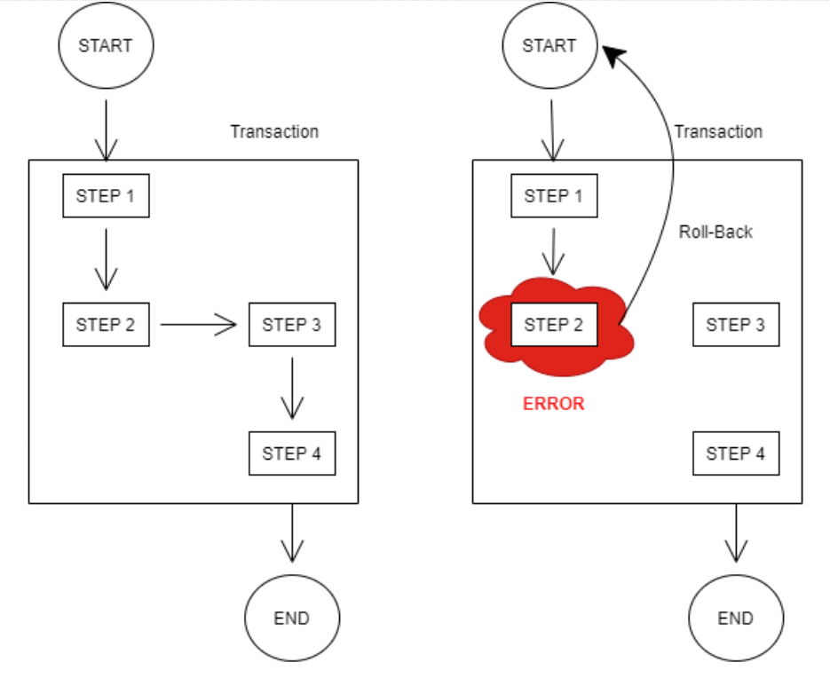
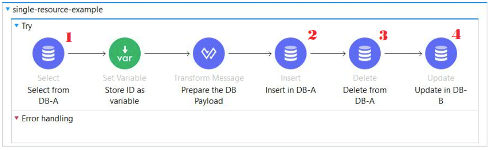
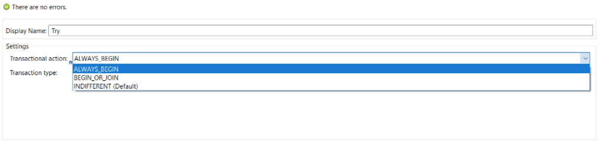
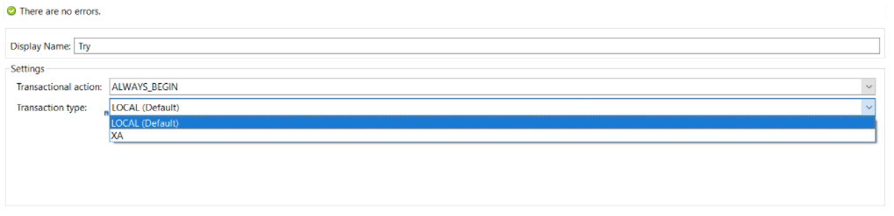
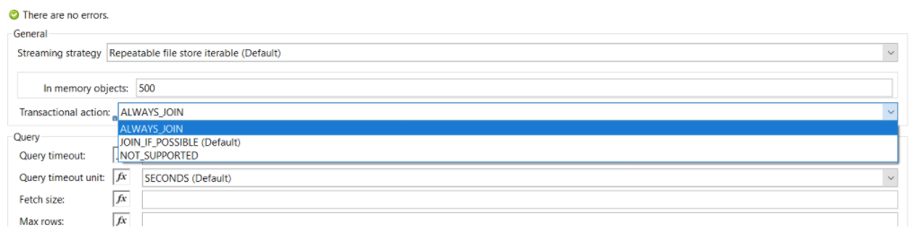
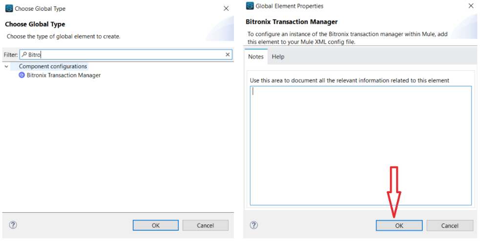
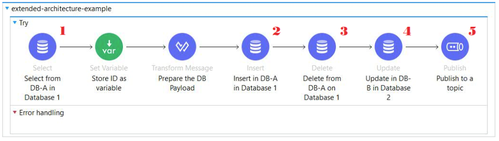
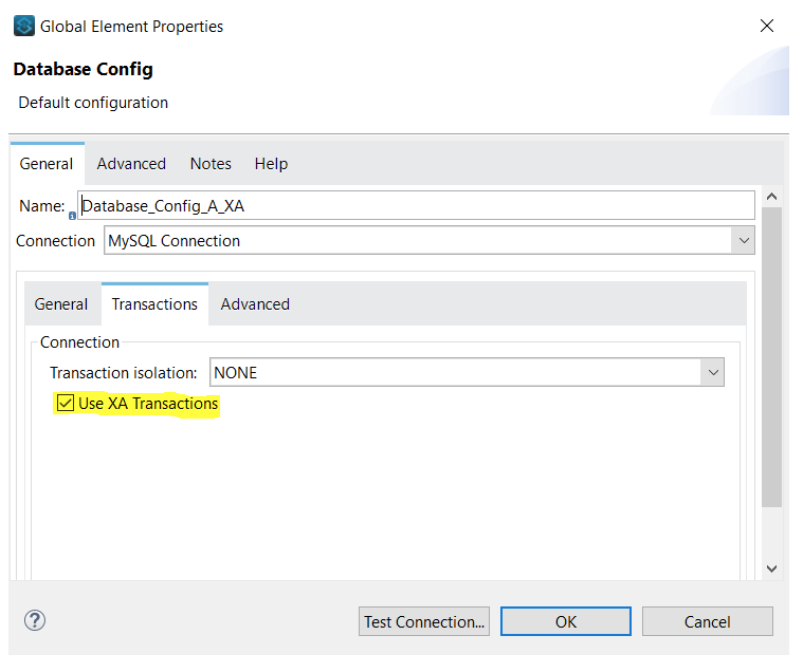
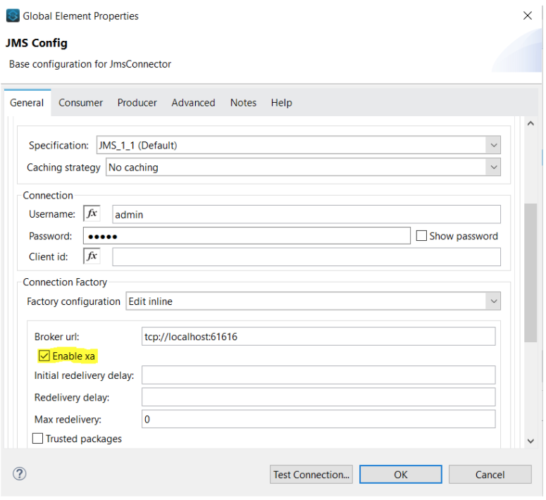

"Transaction" is a word that is used way too frequently in our daily lives. We use it whenever we are engaged in purchasing or selling any commodity. In our daily lives, a transaction signifies an instance of buying or selling something. Also, a transaction can be deemed as completed only upon the overall completion of the buying/selling activity along with the monetary affair associated with it.

In the software industry, we use the word ‘transaction’ in multiple areas. Predominantly, it is used while discussing SQL queries. Transactions make up a very important component of any software development life cycle (SDLC). Let’s see how transactions are changing lives!

A transaction is a group of operations where all the steps are needed to be successful to commit a result. If any one of the intermediate steps fail, the whole chain of steps fails collectively.

Let’s understand it using a pictorial reference.

Let’s consider a case where we have a chain of steps that represents the following:

| Step | Action | Table involved |
|---|---|---|
| Step 1 | This is a SQL fetch operation that fetches information on a certain deal | Table A |
| Step 2 | This is a SQL insert operation that inserts the new record after consolidating the data received in the previous step | Table A |
| Step 3 | This is a SQL delete operation that deletes the previously available record | Table A |
| Step 4 | This is a SQL update operation that updates the amount update in another table | Table B |

We want all the steps to be completed collectively or else we want none of them to happen. In layman’s terms, we want the event to be committed only if all the steps are successful. If any intermediate step fails, we do not want the event to be committed and we do not want any step to be actioned upon.

In the above picture, we have encapsulated these 4 steps in a **transaction**. The first diagram starts and completes without any errors and gets committed.

But in the second diagram, we can see that in step 2 we encountered a certain error. Now, we don’t want the event to be committed. This is made possible by the **transaction** action. It will make sure that all the steps are rolled back to the initial state from which the event was kicked off.

Now that we are clear on what transaction is and how it helps in software development, let’s indulge ourselves in bringing it to life in MuleSoft.

MuleSoft supports two types of transactions:

- Single resource
- XA transactions (Extended Architecture)

Let's talk about them in detail.

## Single Resource transactions

Let's consider a Mule flow where we are dealing with a single mode of data transaction. Consider our flow is having only JDBC affairs or JMS activities or VM Queues.

We have created a flow in which we are dealing with 2 tables connecting to the same database. This is how the flow looks like:

Here, the following database actions are carried out:

| Step | Action | Table involved |
|---|---|---|
| Step 1 | A JDBC select operation (**1**) fetches information on a certain publication | Table A |
| Step 2 | A JDBC insert operation (**2**) inserts the new record after consolidating the data received from the user & the data received in the previous fetch operation | Table A |
| Step 3 | A JDBC delete operation (**3**) deletes the previously available record in the table in which data is inserted in step 2 | Table A |
| Step 4 | A JDBC update operation (**4**) updates the author details of the publication in another table in the same database | Table B |

Here, we have encapsulated all the JDBC components within a **TRY** block.

**Why use the TRY block?**

Try block is helping us to enforce the transaction on the JDBC operations by acting as the initiator of a transaction thread. The JDBC components simply connect themselves to the transaction initiated by the try component.

In a try block, you can set how you want to deal with transaction action.

The try-block provides us the following transaction actions:

| Transactional action | Description |
|---|---|
| `ALWAYS_BEGIN` | It will always initiate a new transaction |
| `BEGIN_OR_JOIN` | It will initiate a new transaction if there are no preceding transactions. In case there is a transaction that has already been set up, the try block will join that transaction |
| `INDIFFERENT` | It will be neutral. It will neither create a transaction nor join an existing transaction |

*For more information on the Transactional Actions, please refer to the* [official documentation](https://docs.mulesoft.com/mule-runtime/4.3/transaction-management#transactional-actions)*.*

Once you have defined the transaction action, you can go ahead and set the transaction type.

The try-block provides us the following transaction actions:

| Transaction type | Description |
|---|---|
| LOCAL | Single Resource |
| XA | Extended Architecture Transactions |

In our case, since we are dealing with Single Resource (only JDBC operation), we will be selecting the LOCAL transaction type and we will let the try-block initiate the transaction.

Once the transaction has been kicked off by the try block, all we need to do is to instruct our JDBC components to JOIN this transaction. We can do that simply by going to the “advanced” section of the JDBC operator.

We will select `ALWAYS_JOIN` as the transactional action so that it joins the transaction initiated by the try block earlier. We will be selecting the same option for all our JDBC components.

Once this is done, we can go ahead and deploy our code.

## Extended Architecture transactions

Let’s consider a case when we need to deal with multiple data exchange sources. For example, if we need to use a JMS broker along with a JDBC operation and VM queues and we need all of these operations to be performed atomically.

We want all these operations to be performed following the ACID (Atomicity, Consistency, Isolation & Durability) concept.

| ACID property | Description |
|---|---|
| Atomicity | The entire transaction should be performed at a single go with all the components being successful |
| Consistency | The results from all the operations should be consistent across all the sources/data exchanges |
| Isolation | The operations should be performed separately and sequentially. There should be no overlap |
| Durability | Once the transaction is committed, then under no circumstance it should be rolled back |

The XA transaction follows a **2-Phase-Commit protocol**.

The first phase of the 2PC is used to check whether all the actions/steps (we can consider these steps to be our JDBC/JMS components) in a transaction have been successfully completed.

If all of them pass or get completed, the transaction manager commits the transaction and writes the corresponding completion logs which can be found in a file with a name ending with “tx-logs” in the .mule folder of your workspace directory.

If any of the components fail execution, the transaction manager rolls back the entire transaction.

We will be using **Bitronix Transaction Manager** as our transaction manager to accomplish this. We can add this in our Global Elements section in Anypoint Studio.

To add **Bitronix Transaction Manager**, head on to the Global Elements section and search for Bitronix (left image). Once done, another window (right image) will pop up. Click on “OK” and you are all set!

Let’s try this out in Anypoint Studio. This is how the flow will look like in this case:

Here, the following database actions are carried out:

| Step | Action |
|---|---|
| Step 1 | A JDBC select operation (**1**) fetches information on a certain publication from a table in **Database A** |
| Step 2 | A JDBC insert operation (**2**) inserts the new record after consolidating the data received from the user & the data received in the previous fetch operation in a table in **Database A** |
| Step 3 | A JDBC delete operation (**3**) deletes the previously available record in the table in which data is inserted in step 2 from a table in **Database A** |
| Step 4 | A JDBC update operation (**4**) updates the author details of the publication in another table in the **Database B** |
| Step 5 | Publish the author update details in a JMS Queue (**5**) |

Compared to what we have done in our implementation of Single Resource transaction, we will do the same thing with the try block, JDBC & JMS components. The only difference is that we have to intimate Mule that we will be using XA transactions.

To do that, we have to select XA as “transaction type” in the Try scope settings.

For JDBC & JMS components, this is configurable in their Global Settings.

In the Database connection config palette, we can head to the “transactions” section where we will have a tick-box to turn the XA transaction on.

In the JMS connection config palette, we need to scroll down to the “Connection Factor” section. Select “Edit inline” for the “Factory configuration”. Then we will have a tick-box to turn the XA transaction on.

> [!NOTE]
> For JMS Connection, XA will not work when caching is activated. Please select “No caching” as the Caching Strategy and then click on “Test Connection…” to see whether the connection is successful or not.

We will select `ALWAYS_JOIN` as the transactional action so that it joins the transaction initiated by the try block earlier. We will be selecting the same option for all our JDBC and JMS components.

Once this is done, we can go ahead and deploy our code.

So, now we have the knowledge of what a transaction is and how to set up one in MuleSoft. Apart from that, we have talked about the various kinds of transactions and how to consider one based on the requirement.

Following this up will be an article in which we will take a deeper dive into other intricacies of transactions.

Thank you!!
