*GitHub repository with the Mule project can be found at the end of the post.*

In my previous post ([How to integrate Solace PubSub+ Cloud with MuleSoft](https://www.prostdev.com/post/how-to-integrate-solace-pubsub-cloud-with-mulesoft)), I explained the happy path of the Solace PubSub+ and MuleSoft Integration. In this post, let us see how we can handle an error efficiently.

Even though the error handling logic varies depending on use cases, business requirements, organizational processes, etc. I believe the core approach to error handling for message-based integrations would more or less remain the same for different applications.

The most common approach consists of the following steps:

- In case of an error, the error is captured in the error handler logic.
- Enrich the message with additional information that could be later used for reprocessing.
- Keep track of the “deliveryCount” and other useful information in the “User Properties.”
- Publish the message to an Error Topic for retrying.
- Process the message from the error queue and depending on the “redelivery_count” attribute, either route it back to the source queue or the dead letter queue (or Dead Message Queue). Further reprocessing can happen by the operations team.

Let us see how I have implemented the above approach in the following use case. Before that, please take a look at my [previous blog post](https://www.prostdev.com/post/how-to-integrate-solace-pubsub-cloud-with-mulesoft) on how to publish the message to the Solace Topic using the JMS “Publish” connector.

**1)** The message is received by the “On New Message” JMS Connector. The incoming message is transformed in the “Request Transformation” component, While attempting to create the Salesforce Account using the “Create” connector, there is an error (in case the account already exists). The choice router validates if a successful response is received from SFDC. In case of failure, an error is thrown.

(Note that you can also add an “Until Successful” block around the “Create” SFDC connector to retry for a specified amount of time before throwing an error.)

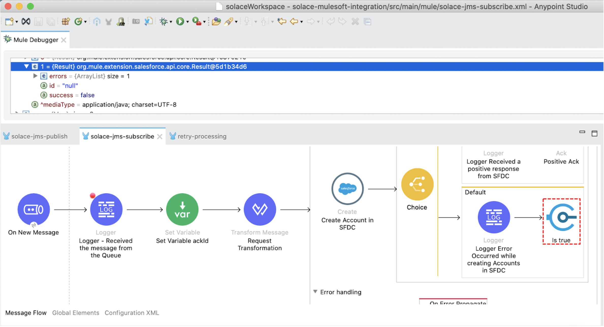

The error is caught in the “On Error Propagate” error handler and invokes the “processSFDCError” flow.

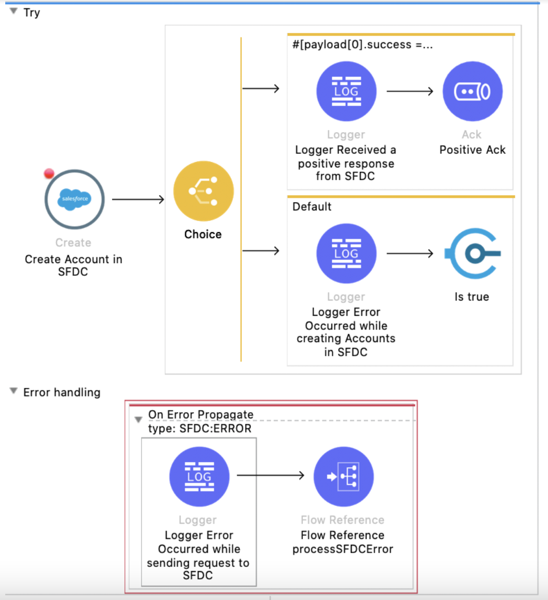

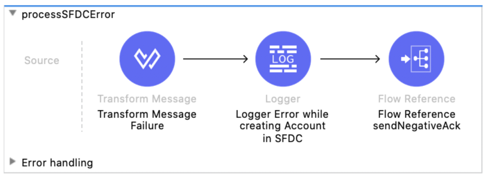

In case of Salesforce Connectivity error, then the error is thrown in the “Create” SFDC connector and caught in the “SFDC:ERROR” (On Error Propagate) as the error mapping is done in the connector level as shown in the following screenshot.

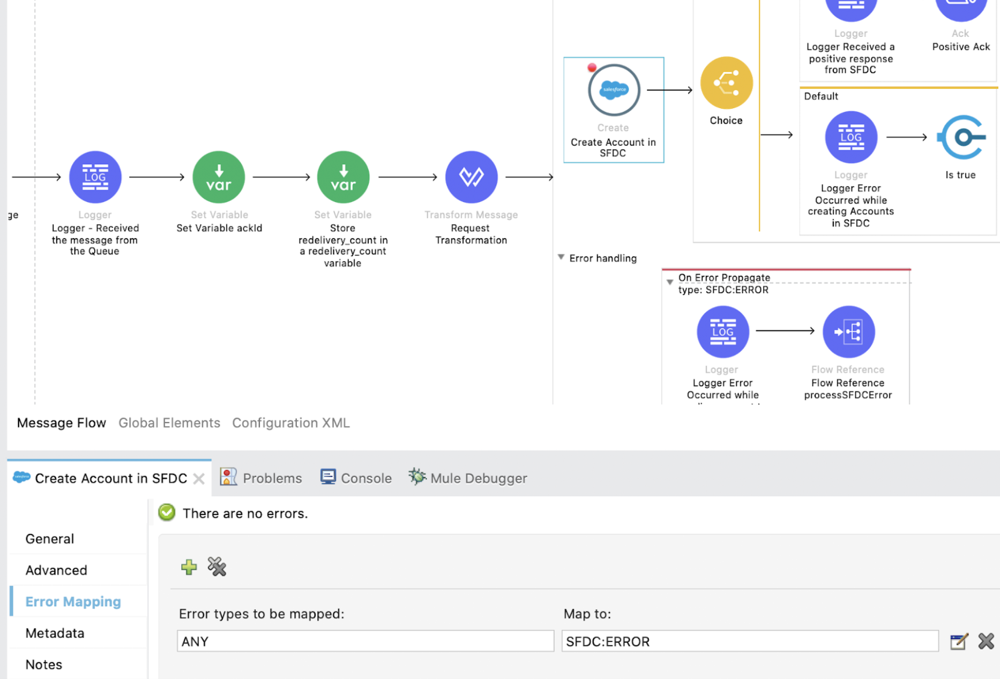

**2)** The message is published to the Error Topic as shown in the following screenshot:

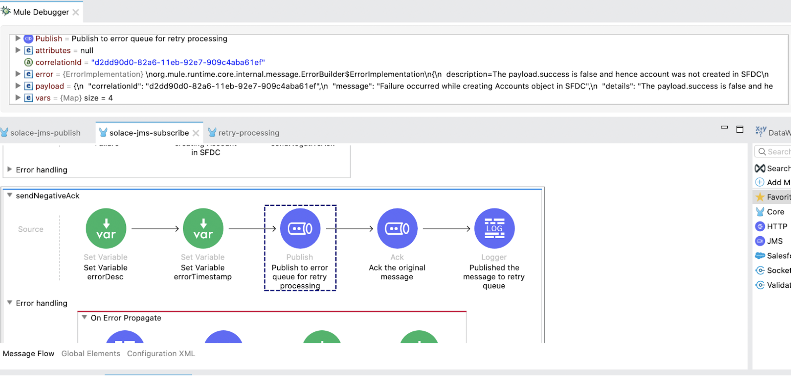

Note that I am capturing the “DELIVERYCOUNT”, “EXCEPTIONDETAILS” and “TIMESTAMP” in the “User Properties” field.

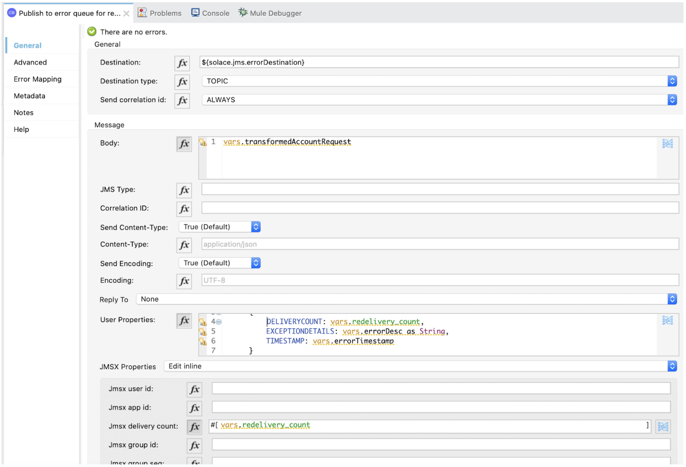

**3)** The message from the Error Queue is received in the retry-flow. In this flow, if the “redelivery_count” (`attributes.properties.jmsxProperties.jmsxDeliveryCount`) value is less than or equal to the “maxRedeliveryCount” variable, which will be fetched from the properties file, then the message will be published to the source Topic.

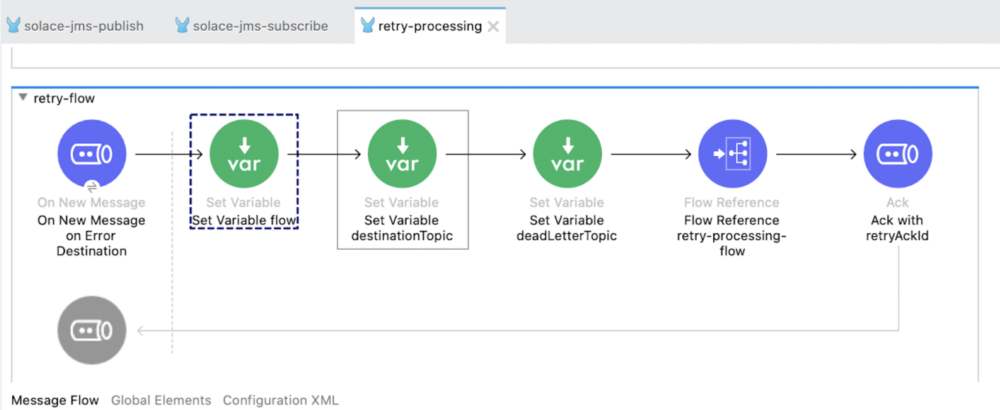

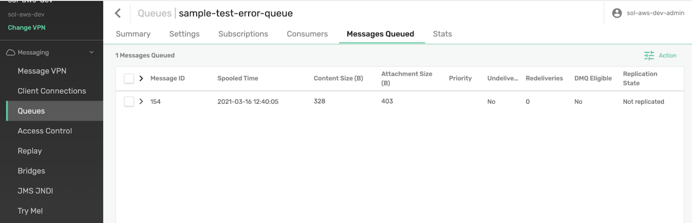

Since the redelivery count is 1, the message is published back to the source Topic.

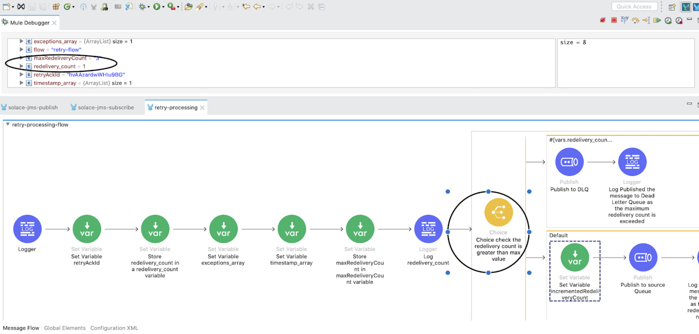

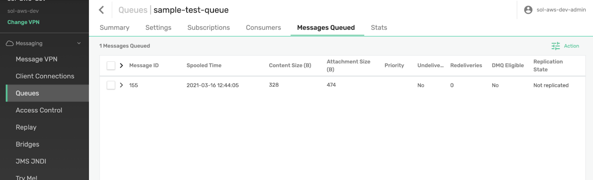

**4)** The message is received by the subscribing flow and tries to process it. In case of error during the second time, the message is again published to the Error Topic with redelivery_count=2.

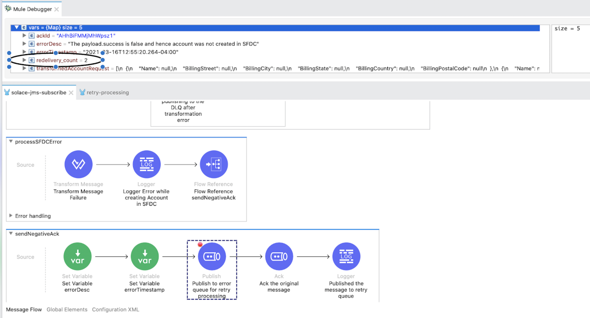

**5)** In case of failure during the third retry, the message is again published to the Error Topic with redelivery_count=3.

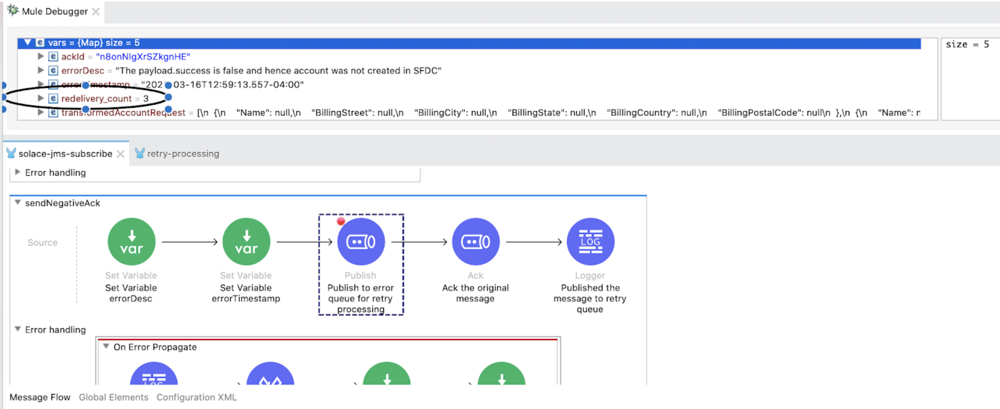

**6)** Since the “redelivery_count” now equals the “maxRedeliveryCount” variable, the message is published to the Dead Letter Topic or Dead Message Topic. A notification email can be triggered to the operations team for further processing of this message.

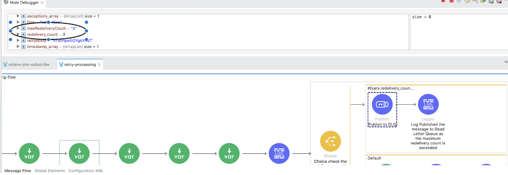

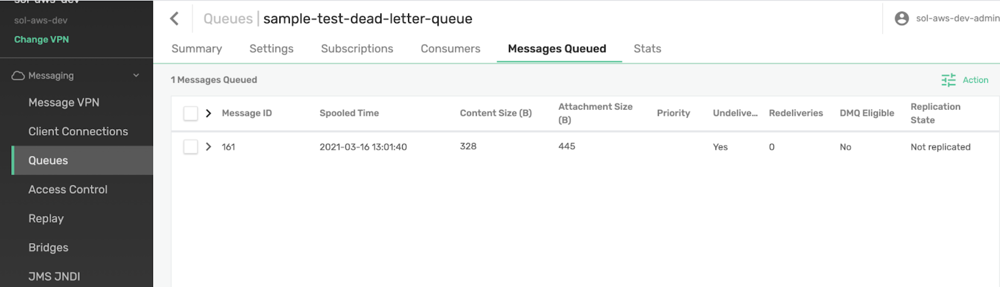

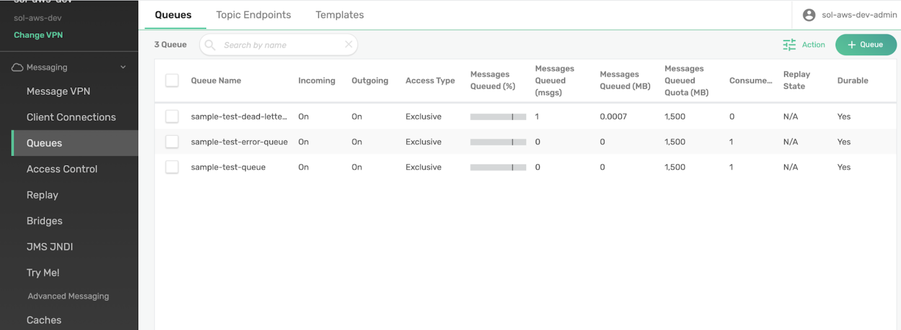

The message in the Error Topic is Acknowledged with the “retryAckId” variable as shown in the following screenshot.

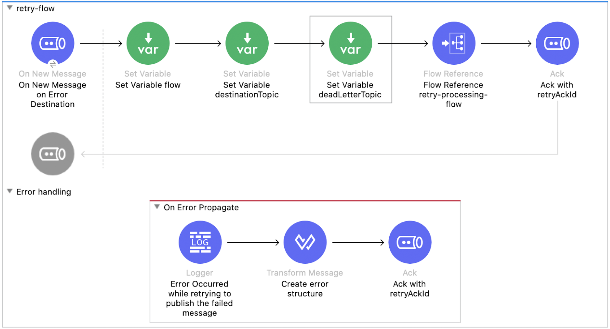

**7)** In case of a Transformation error, the message can be sent directly to the Dead Letter Queue as retrying does not make any sense.

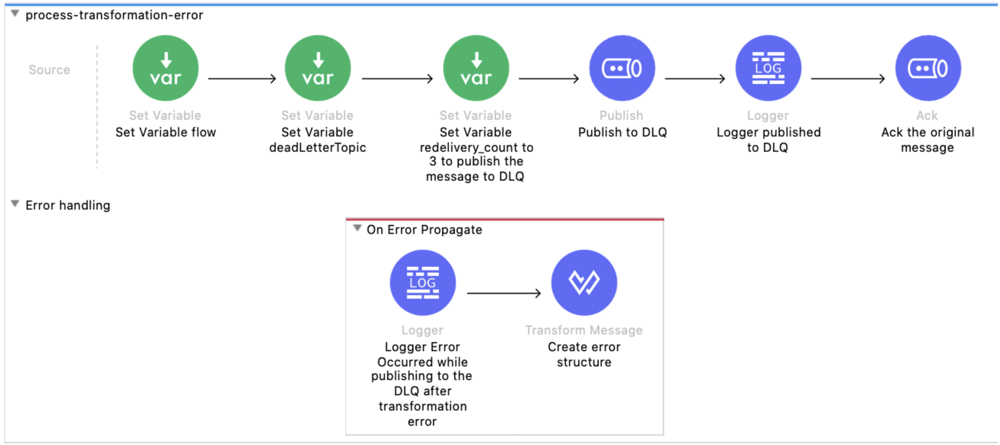

Thank you for reading my blog post :)

Happy Learning,

Pravallika Nagaraja

## GitHub repository

[ProstDev GitHub - Solace MuleSoft Integration](https://github.com/ProstDev/solace-mulesoft-integration)
