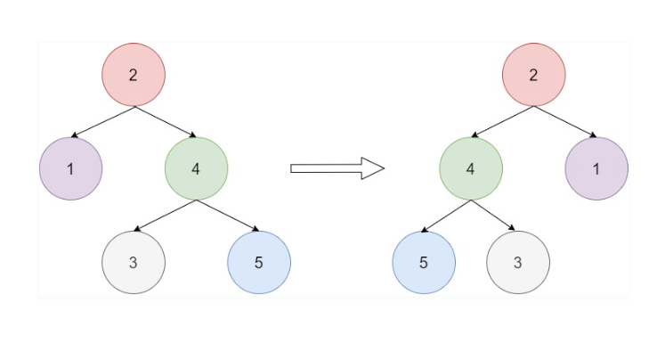

The [DataWeave language](https://docs.mulesoft.com/mule-runtime/latest/dataweave) is a simple, powerful tool used to query and transform data inside of Mule.

But you can also use it to solve algorithmic problems.

How to invert a Binary Tree is a popular coding question to test your skills.

Let’s try to solve this with DataWeave.

## Definition

Ok, but what is a binary tree? Yes, sure!

Firstly we define a **tree** as a set of elements (nodes), with the following properties:

- Each node can be connected to many children
- Each node has one parent, except the root node that has no parent

A **binary tree** is a tree where each node has at most 2 children: “left” and “right”.

We can define the DataWeave **binary tree** structure in the following way:

```dataweave
type Tree= {
    value: String,
    right?: Tree,
    left?: Tree
}
```

## Problem

In order to invert a binary tree, we need to swap left and right for every level of the tree, as you can see in the following example:



## Solution

It's easier than it looks. Thanks to Mr. Recursion!

We can solve the problem for the first children by swapping them and then recursively applying the same solution for the left and right sub-tree.

**Input**

```json
{
    "value": "2",

     "left":
    {
        "value": "1"
    },

    "right": 
    {
        "value": "4",
        "left":
        {
            "value": "3"
        },
        "right": 
        {
            "value": "5"
        }

    }

}
```

**DataWeave Solution**

```dataweave
%dw 2.0
output application/json

type Tree= {
    value: String,
    
    left?: Tree,
    right?: Tree
}

fun invertTree(node ) : Tree =  

    {
         value:   node.value ,
     
       ( left: invertTree(node.right )) if (node.right?),
       ( right:   invertTree(node.left )) if (node.left?)
    }  
---
invertTree(payload)
```

**Output**

```json
{
  "value": "2",
  "left": {
    "value": "4",
    "left": {
      "value": "5"
    },
    "right": {
      "value": "3"
    }
  },
  "right": {
    "value": "1"
  }
}
```

> [!NOTE]
> This solution is using regular recursive functions. If the recursion level exceeds 255 iterations, you will receive a Stack Overflow error. To avoid this, you can also use tail-recursive functions. To learn more about this, see [this article](https://blogs.mulesoft.com/dev-guides/how-to-tutorials/untie-multilevel-structures-dataweave-recursive-calls/).

## Conclusion

Now we know how to use Mr. Recursion in DataWeave in order to solve the invert binary tree problem.

Thanks for reading my post and I hope it will help understand this wonderful language.

That’s it for now! See you in the next post!

-Stefano
