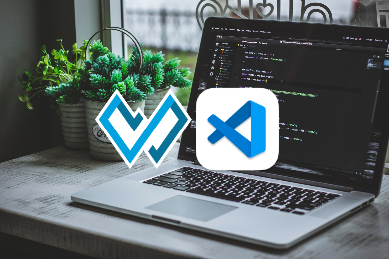
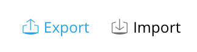
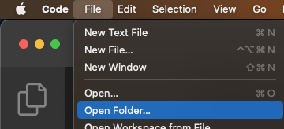
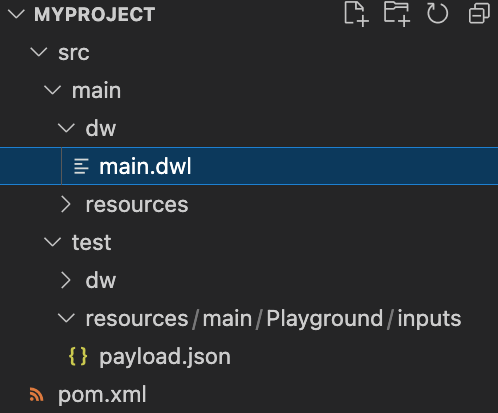
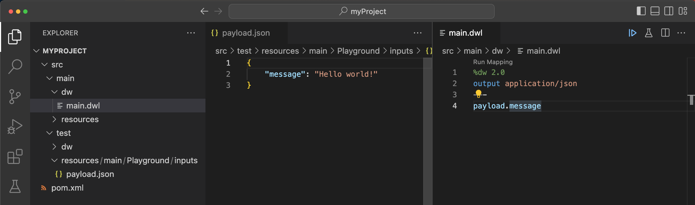
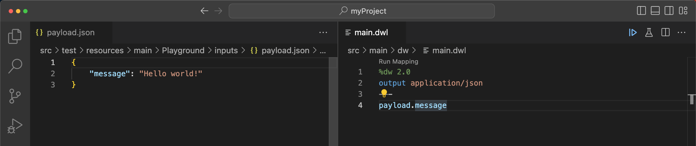
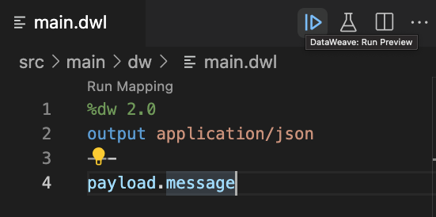
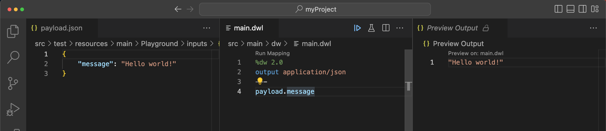
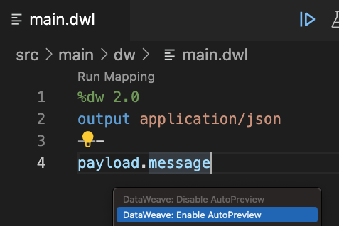

If you’re not familiar with the online DataWeave Playground yet, this is an online tool that you can access from your browser to develop DataWeave code without having to open Anypoint Studio. It is mainly recommended for training purposes because of its limitations - since it’s running from your browser, it’s limited to the amount of memory allocated in your browser. There is a workaround to run it locally with the Docker image (see [How to run locally the DataWeave Playground Docker Image](https://www.prostdev.com/post/how-to-run-locally-the-dataweave-playground-docker-image)) but this image might stop being supported in the future. That’s why it’s best to start using Visual Studio Code if you want to develop more complex code and need more performance for bigger payloads.

Here’s a video to complement your learnings from this article:

## Advantages

Here are a few advantages of using the DataWeave extension for Visual Studio Code instead of the DataWeave Playground (there are more, but these seemed more important for now):

- Handle bigger payloads
- Get code suggestions
- Create unit tests for your code
- Create documentation for your code
- Debug your scripts

## Install the extension on VSCode

Before starting, make sure your extension on VSCode has been correctly installed. You can follow the next steps or see a detailed guide here: [Getting started with the DataWeave extension for Visual Studio Code](https://developer.mulesoft.com/tutorials-and-howtos/dataweave/dataweave-extension-vscode-getting-started/).

- Install [Visual Studio Code](https://code.visualstudio.com/Download).
- Install [Java 8](https://www.oracle.com/ca-en/java/technologies/javase/javase8-archive-downloads.html) and [Maven](https://maven.apache.org/download.cgi) version 3.6.3 or higher.
- Install the [DataWeave extension](https://marketplace.visualstudio.com/items?itemName=MuleSoftInc.dataweave) for Visual Studio Code.

And that’s it!

## Export the code from the Playground

We are assuming you already have some code going on in the DataWeave Playground. If this is not the case, you can simply [open the Playground](https://dataweave.mulesoft.com/learn/playground) and use the sample code that is automatically generated.

1. From the DataWeave Playground, click on the **Export** button at the top.

2. This will download a `.zip` file to your computer.

3. Extract the contents of the `.zip` file. This root folder is the one you’ll refer to from VSCode. It contains a `pom.xml` file and a `src` folder.

4. Open VSCode and select **File > Open Folder**

5. Select the root folder from step 3.

6. You should now have a structure like the following one.

## Configure your layout

1. You can open both files (`payload.json` and `main.dwl`) and drag-and-drop them to where you want them to be. This will give you a similar layout as the Playground.

2. You can click on the **Explorer** button on the far left if you want to minimize that section.

3. Click on the `main.dwl` window and click on the **Run Preview** button to see the output.

4. Success!

> [!NOTE]
> If you don’t get the correct output, make sure you installed Java 8 and the appropriate version of Maven, as well as the latest version of VSCode.

## Enable AutoPreview

If you don’t change the AutoPreview settings, you’ll have to click on the **Run Preview** button every time you make a change to the script or the payload. This is useful if you want to save resources and only run the code when you need to update the preview.

If you want to enable AutoPreview so it updates automatically when you make changes to the script (as it currently does in the DataWeave Playground), simply:

- Open the `main.dwl` file
- Right-click on the window
- Select **DataWeave: Enable AutoPreview**

That’s it! You can disable it again if you want using the **Disable** button :)

## More resources

As mentioned before, there are a lot more advantages to using the VSCode extension that we didn’t list here. Check out the following resources for more information:

- [DataWeave landing page](https://dataweave.mulesoft.com/)
- [Developer tutorial] [Getting started with the DataWeave extension for Visual Studio Code](https://developer.mulesoft.com/tutorials-and-howtos/dataweave/dataweave-extension-vscode-getting-started/)
- [Developer tutorial] [Getting started with DataWeave libraries in Anypoint Exchange](https://developer.mulesoft.com/tutorials-and-howtos/dataweave/dataweave-libraries-in-exchange-getting-started/)
- [Short video tutorial] [How to export a script from the DataWeave Playground to Visual Studio Code](https://youtu.be/_8kCFBdgX5A)
- [Twitch live stream] [Exploring products: DataWeave extension for VSCode](https://www.twitch.tv/videos/1525009818)
