You may already know about the DataWeave (DW) Playground that can be used for both versions of DW: 1.0 and 2.0. DataWeave version 1.0 is used in Mule 3, and DataWeave version 2.0 is used in Mule 4.

If this is your first time hearing about the DW Playground, check out this post to see why you need to start using it now to test your DataWeave scripts or transformations. I will explain how to get this Docker Image running on your laptop (even if you don’t know how to use Docker). I’ll also show you how to install Docker Desktop and what exact commands you need to run to have it up and ready to use.

## What is the DW Playground, and why is it useful?

DataWeave is MuleSoft’s scripting language that is mainly used to transform the data in your integration apps. To be able to use this, you need to download, install and open [Anypoint Studio](https://www.mulesoft.com/platform/studio) (Mule’s [IDE](https://www.prostdev.com/post/5-reasons-why-you-need-an-ide)). Then you need to create a new Mule Project, create a new flow, and finally add the Transform Message component. There are times when you already have a project, and you just want to test out a function to make sure that it works correctly. You can either create a new flow, or create a new project, and then add a new Transform Message component in order to test it out. After you test your code, you normally just delete whatever you created, right? Well, what if there was a way to use a browser, like Google Chrome, and already have your Transform Message component right there to test out the script you want directly? There *is* a way! It’s the DW Playground!

Yes, you read that correctly. Let me show you a screenshot of the DW Playground for the 2.0 version.

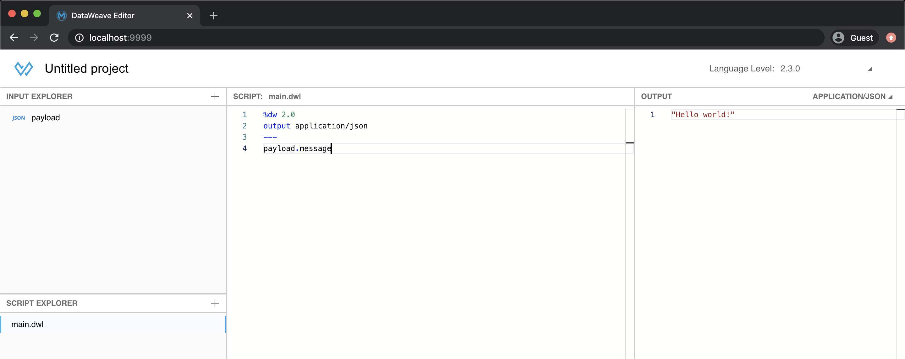

As you can see, I’m accessing it through Google Chrome, and it’s running on my local computer. There’s no need to open Anypoint Studio to create transformations to practice my DataWeave skills. Talk about convenience! Everything I create using the DW Playground is temporary, so there’s no need to delete any project or files after I finish using it.

This Playground is just a Docker Image that can be downloaded to your computer. You can run it with various commands and have it ready to use whenever you want.

## How to install Docker Desktop

I’m not going to explain the details of Docker, but I’ll leave some resources at the end of the post to learn more about it if you want to. Just know that previous knowledge in Docker isn’t needed in order to get the Playground running.

If you already have Docker Desktop installed, you can skip this part.

**1. Download and Install the Docker Desktop app**

You can go to [this link](https://www.docker.com/products/docker-desktop) and select your operating system (Windows / Mac) in order to download the corresponding installer.

Just follow the instructions to install as you would with any other regular application.

**2. Run Docker**

Double click on the installed application to open it and make sure that Docker is running in the background. To verify this, you can check your taskbar and look for the Docker icon.

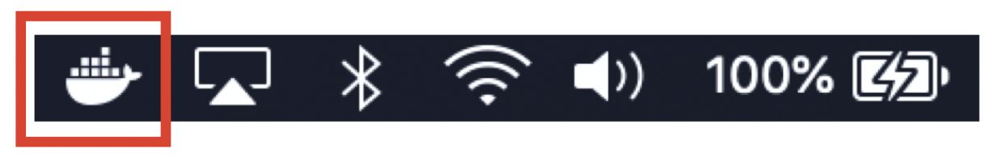

**3. Open the Docker Desktop application**

Once you double click on it, you will see the main screen of the application. Notice that you can see whether Docker is running, and you can also sign in to your DockerHub account.

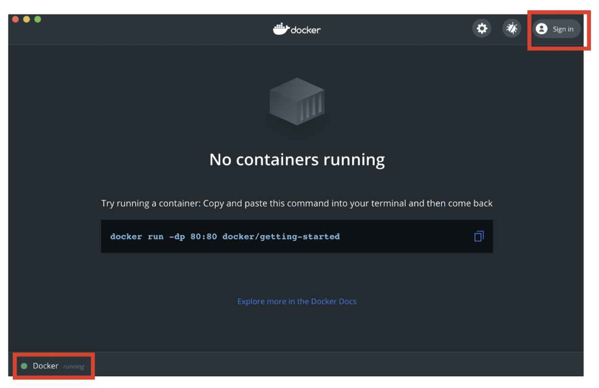

## How to run the DataWeave Playground Docker Image

Now, let’s get started with the fun part: how to get the DW Playground up and running on our local computer.

> [!NOTE]
> DockerHub is where all the images are stored for you to download or pull to your local computer. You can create an account if you want to save your favorite images there, but it’s unnecessary.

**1. Get the Docker Image from DockerHub**

Go to [this link](https://hub.docker.com/r/machaval/dw-playground/tags) so you can see the different versions of the Playground and select the version you want. For this demo, I’ll choose the latest one, which is 2.3.1. On the right side of the Docker Image, you can see there’s a command ready to copy. Feel free to copy this by clicking on the copy button, but don’t run it just yet.

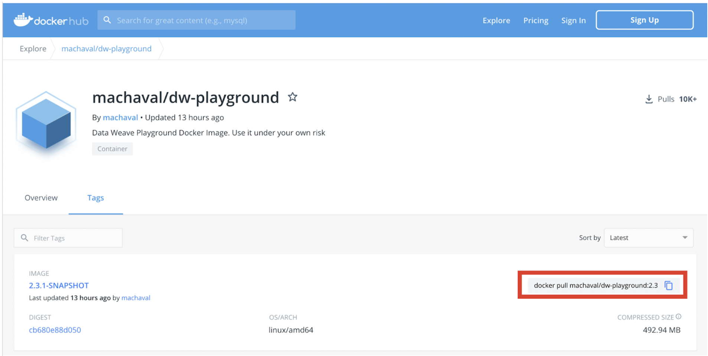

**2. Docker Run command**

This is what you get when you copy the previous “docker pull” command:

```bash
docker pull machaval/dw-playground:2.3.1-SNAPSHOT
```

You just need the last part (the docker image and tag) to paste it into the next docker run command. In this case, machaval/dw-playground:2.3.1-SNAPSHOT.

We’ll run the container with this command:

```bash
docker run -d --name DWPlayground2 -p 9999:8080 machaval/dw-playground:2.3.1-SNAPSHOT
```

Here is a brief explanation of what you’re running with it:

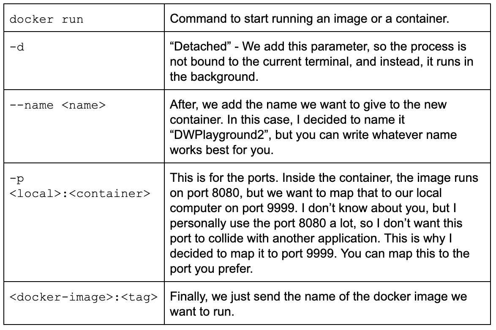

Once the command runs, you will see something like this in your terminal or console output:

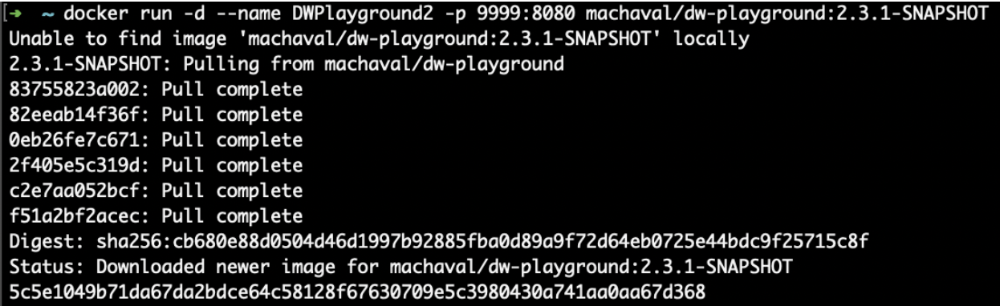

**3. Verify the container is running in the Docker Desktop app**

Once the previous command is done with its execution, you can go to your Docker Desktop application, and you will see the new Docker Container running.

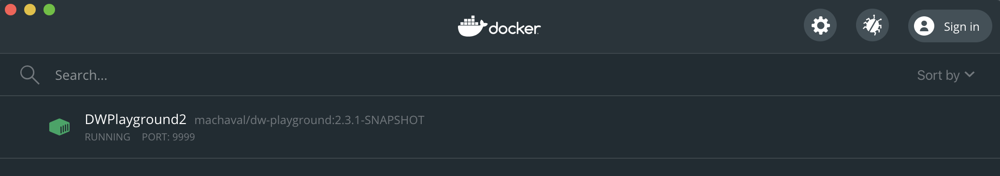

**4. Open the DW Playground**

Now you’re ready to open the Playground from your browser! Simply click on the “Open in browser” button from the Docker Desktop app, and this will automatically open the Playground for you.

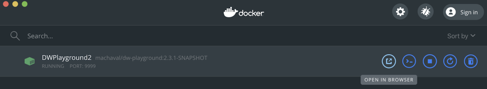

Alternatively, you can manually open your favorite browser and go to this address:

```bash
http://localhost:9999/
```

Note that the port should be replaced with the port you chose in case you changed the 9999 port from the original command.


You're all set!

To run the Playground for any other version, you can simply repeat the previous steps. But instead of using machaval/dw-playground:2.3.1-SNAPSHOT you would have to copy the docker image of the version of your preference. For example, to run the version 1.1.8, you could run the following command:

```bash
docker run -d --name DWPlayground1 -p 9998:8080 machaval/dw-playground:1.1.8-SNAPSHOT
```

> [!NOTE]
> if you intend to run both containers at the same time, you should change the ports to use different ones, so they don’t collide in your local computer. I personally run the DW Playground version 1 on port 9998 and version 2 on port 9999 even when I don’t have them both running at the same time. Here is my Docker Desktop app:

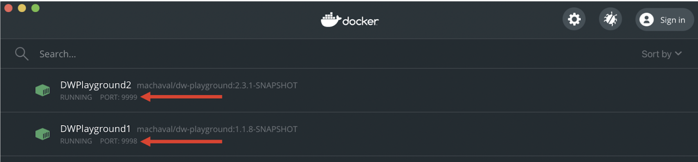

## How to remove or stop the Docker Containers

Maybe you don’t want to use the Playground anymore, or you just want to clear the containers from your app. Luckily for us, the Docker Desktop application provides a button to stop and remove the containers. Take a look at the screenshots below to be able to manipulate your containers.

**Stop a running container**

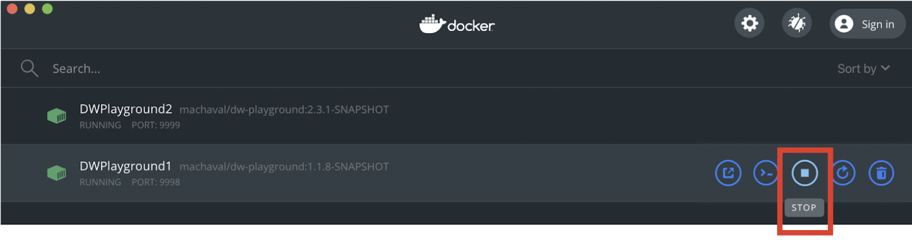

**Start a container**

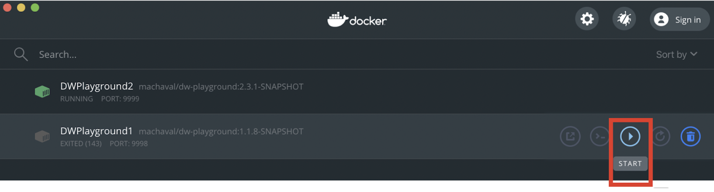

**Delete an existing container**

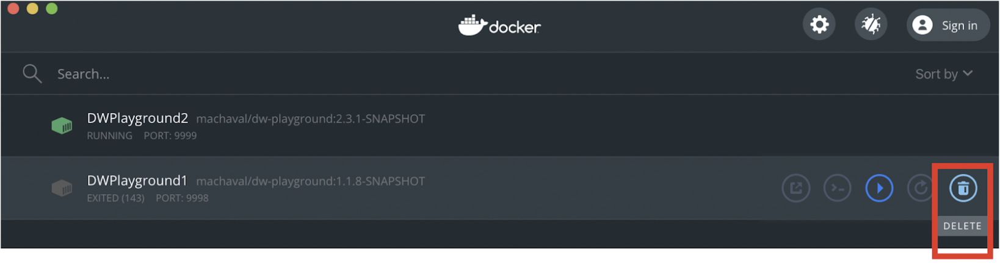

## Recap

In summary, this is what you need to do to run the DataWeave Playground Docker Image:

- Download, install and open the Docker Desktop application to get Docker up and running.
- Go to DockerHub to find the version of the Playground that you want to download: [https://hub.docker.com/r/machaval/dw-playground/tags](https://hub.docker.com/r/machaval/dw-playground/tags)
- Run the docker container with the following command:

```bash
docker run -d --name DWPlayground2 -p 9999:8080 machaval/dw-playground:2.3.1-SNAPSHOT
```

*Remember to replace the name (**DWPlayground2**), the port (**9999**), and the DW Playground version (**2.3.1-SNAPSHOT**) with your own settings.*

- Open the local container by clicking on the “Open in browser” button from the Docker Desktop app or manually access it through the browser with

```bash
http://localhost:9999/
```

- Stop the running container right from the Docker Desktop app by clicking on the “Stop” button. You can start it again with the “Start” button; there’s no need to re-run the command.

I hope this helped you to get started with the DW Playground. Let me know if you had any issues when running these commands or with any of the steps mentioned.

*Prost!*

-Alex

## More links

- [Get Started with Docker](https://www.docker.com/get-started)
- [Docker 101 Tutorial](https://www.docker.com/101-tutorial)
- [Pluralsight training: Getting Started with Docker](https://www.pluralsight.com/courses/docker-getting-started)
- [Docker Cheat Sheet](https://www.docker.com/sites/default/files/d8/2019-09/docker-cheat-sheet.pdf)
