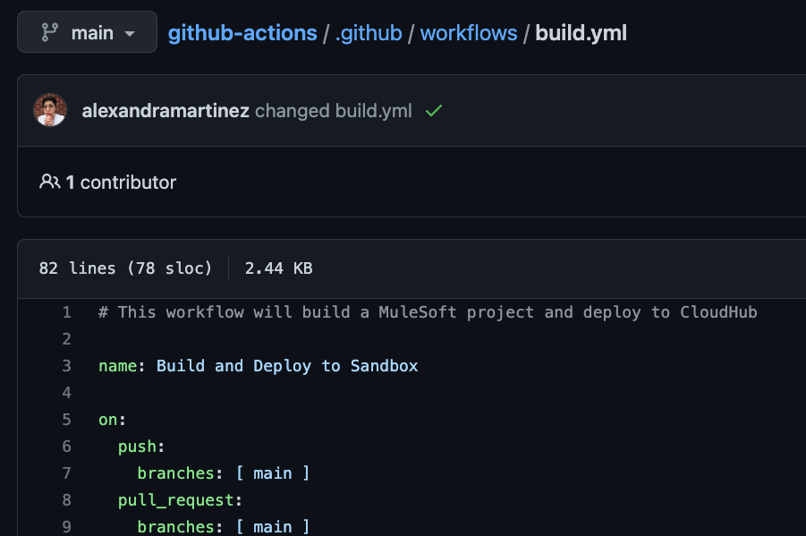
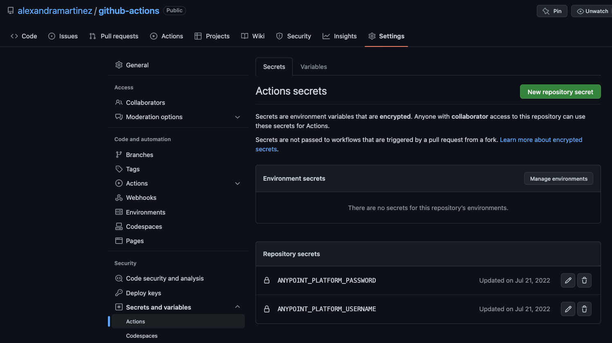
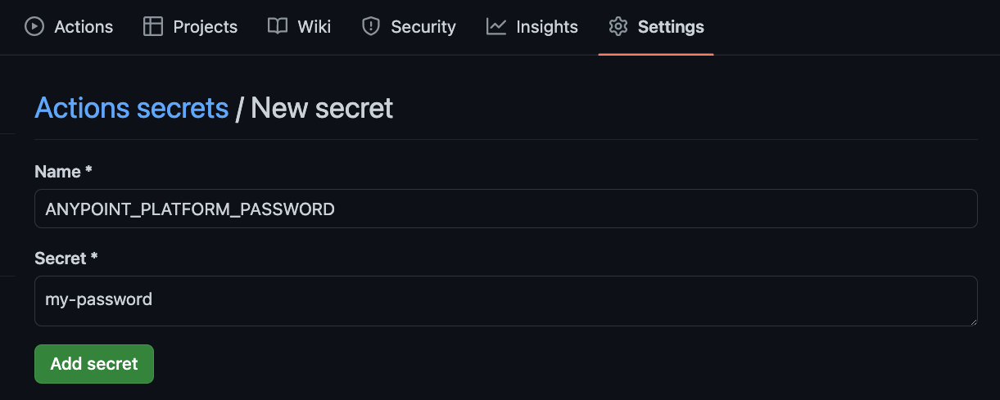
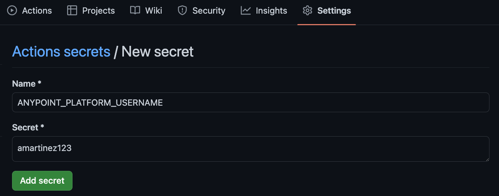
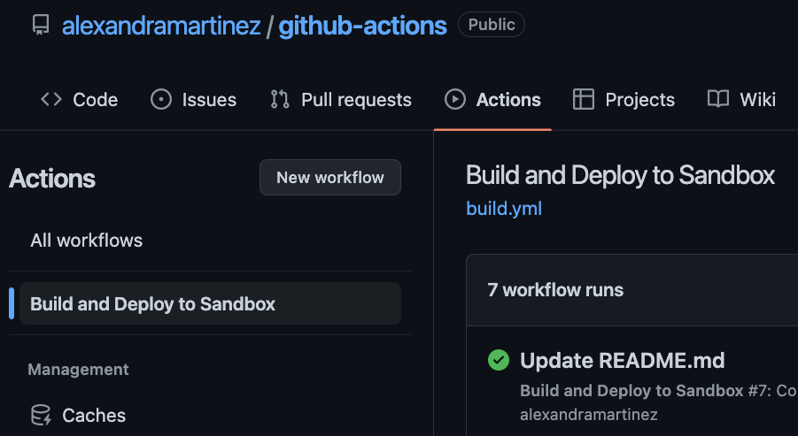
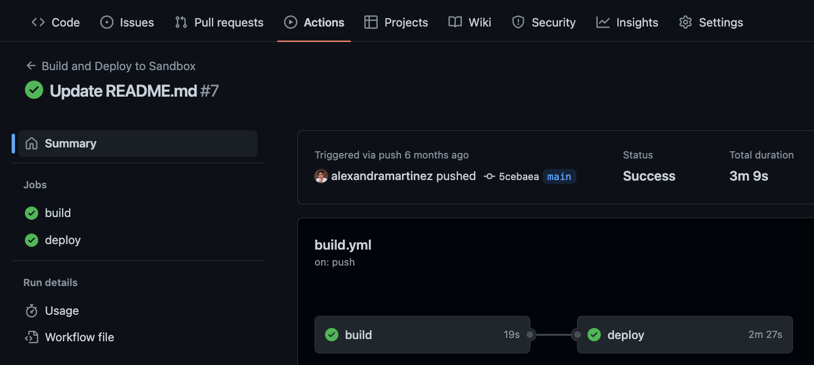

Creating CI/CD (Continuous Integration, Continuous Delivery) pipelines for your code has become a standard practice. Instead of worrying about deployments and keeping your environments up to date, you can set up this automated pipeline to do the deployments for you. You can focus on developing your code and let the pipeline take care of the rest.

In this post, we’ll learn how to create a simple CI/CD pipeline to deploy Mule applications from GitHub to CloudHub using GitHub Actions.

We’ll be using [this GitHub repo](https://github.com/alexandramartinez/github-actions) for this example.

## Set up your repo

We won’t go into the details of creating a GitHub repo with your Mule application. You can take a look at the [example repo](https://github.com/alexandramartinez/github-actions) we’ll be using throughout the post so we can focus on explaining the CI/CD setup.

Once you have your Mule application in a GitHub repo, create a folder called `.github`, and inside it, create another folder called `workflows`. Here, create a new `build.yml` file and paste the following contents into it.

```yaml
name: Build and Deploy to Sandbox

on:
  push:
    branches: [ main ]
  pull_request:
    branches: [ main ]
    
jobs:
  build:
    runs-on: ubuntu-latest
    steps:
    - name: Checkout this repo
      uses: actions/checkout@v3
    - name: Cache dependencies
      uses: actions/cache@v3
      with:
        path: ~/.m2/repository
        key: ${{ runner.os }}-maven-${{ hashFiles('**/pom.xml') }}
        restore-keys: |
          ${{ runner.os }}-maven-
    - name: Set up JDK 1.8
      uses: actions/setup-java@v3
      with:
        distribution: 'zulu'
        java-version: 8
    - name: Build with Maven
      run: mvn -B package --file pom.xml
    - name: Stamp artifact file name with commit hash
      run: |
        artifactName1=$(ls target/*.jar | head -1)
        commitHash=$(git rev-parse --short "$GITHUB_SHA")
        artifactName2=$(ls target/*.jar | head -1 | sed "s/.jar/-$commitHash.jar/g")
        mv $artifactName1 $artifactName2
    - name: Upload artifact 
      uses: actions/upload-artifact@v3
      with:
          name: artifacts
          path: target/*.jar
        
  deploy:
    needs: build
    runs-on: ubuntu-latest
    steps:    
    - name: Checkout this repo
      uses: actions/checkout@v3
    - name: Cache dependencies
      uses: actions/cache@v3
      with:
        path: ~/.m2/repository
        key: ${{ runner.os }}-maven-${{ hashFiles('**/pom.xml') }}
        restore-keys: |
          ${{ runner.os }}-maven-
    - uses: actions/download-artifact@v3
      with:
        name: artifacts
    - name: Deploy to Sandbox
      env:
        USERNAME: ${{ secrets.anypoint_platform_username }}
        PASSWORD: ${{ secrets.anypoint_platform_password }}
      run: |
        artifactName=$(ls *.jar | head -1)
        mvn deploy -DmuleDeploy \
         -Dmule.artifact=$artifactName \
         -Danypoint.username="$USERNAME" \
         -Danypoint.password="$PASSWORD" 
```

> [!NOTE]
> You can name this YAML file however you want. It doesn’t have to be `build`.



This file is where the CI/CD pipeline is set up. Before we get into the details of this file, let’s first set up the Actions secrets with your Anypoint Platform credentials.

## Set up your credentials

In your GitHub repository, go to the **Settings** tab (make sure you are signed in to see it). Now go to **Secrets and variables** **>** **Actions**. Here you will be able to set up your repository secrets.



Click on **New repository secret**.

In the **Name** field, write `ANYPOINT_PLATFORM_PASSWORD`.

In the **Secret** field, write the actual Anypoint Platform password you use to sign in to Anypoint Platform.

Click **Add secret**.



Repeat the same process for the `ANYPOINT_PLATFORM_USERNAME` secret. Add here the username you use to sign in to Anypoint Platform.



That’s it for the basic setup! Let’s take a closer look into the `build.yml` file to make sure everything is set up properly for your case.

## Inside the build.yml file

Let’s go through the contents of the `build.yml` file so you can personalize it for your own needs. If you want to skip this explanation, you can go straight to Run the pipeline.

### name

The first thing we see is a `name` field. This is the name of the Action that will appear in the UI under the **Actions** tab. You can name this anything you want.

```yaml
name: Build and Deploy to Sandbox
```



### on

Next, we have the `on` field. This tells you when the Action will run. In this case, we have it set up to run anytime there’s a push to the **main** branch, or when a Pull Request has been merged into the **main** branch.

You can also set it up to run with a schedule, but we won’t go through that for this example. You can see a schedule example [here](https://github.com/alexandramartinez/alexandramartinez/blob/main/.github/workflows/blog-post-workflow.yml).

```yaml
on:
  push:
    branches: [ main ]
  pull_request:
    branches: [ main ]
```

### jobs

Next, we have the `jobs` field. Technically, you can just create a huge job and run all the steps inside it, but it will be overwhelming for you if you need to troubleshoot a step. It is best to split it up into different jobs when possible.

It’s worth noting that jobs run async to each other. We’ll learn how to create async jobs when we see the `deploy` job in a moment.

In our case, we have two jobs: `build` and `deploy`.

```yaml
jobs:
  build:
    [...]
  deploy:
    [...]
```



### jobs: build

Inside the `build` job, we start by stating the operating system in which it will run. In this case, ubuntu.

```yaml
runs-on: ubuntu-latest
```

Then, we start listing the `steps` for the job. The first two steps are repeated in both jobs.

First, we have to check out the current repository in the ubuntu machine where the pipeline is running.

```yaml
- name: Checkout this repo
  uses: actions/checkout@v3
```

After that, we set up a cache for the Maven dependencies in the ubuntu machine’s `.m2` folder.

```yaml
- name: Cache dependencies
  uses: actions/cache@v3
  with:
    path: ~/.m2/repository
    key: ${{ runner.os }}-maven-${{ hashFiles('**/pom.xml') }}
    restore-keys: |
      ${{ runner.os }}-maven-
```

Now, for this `build` job, we need to set up Java 8 in order to run the Maven command to build the application into a jar file.

```yaml
- name: Set up JDK 1.8
  uses: actions/setup-java@v3
  with:
    distribution: 'zulu'
    java-version: 8
```

After setting up Java 8, we can now build this Mule application with Maven.

```yaml
- name: Build with Maven
  run: mvn -B package --file pom.xml
```

Next, for troubleshooting purposes, we’ll change the name of the generated jar file to include the last commit’s hash. This file name will be visible in CloudHub so you can make sure the application deployed is the correct version.

```yaml
- name: Stamp artifact file name with commit hash
  run: |
    artifactName1=$(ls target/*.jar | head -1)
    commitHash=$(git rev-parse --short "$GITHUB_SHA")
    artifactName2=$(ls target/*.jar | head -1 | sed "s/.jar/-$commitHash.jar/g")
    mv $artifactName1 $artifactName2
```

Finally, we will upload this artifact (the jar file) so it becomes available for the next job.

```yaml
- name: Upload artifact 
  uses: actions/upload-artifact@v3
  with:
      name: artifacts
      path: target/*.jar
```

### jobs: deploy

We had mentioned earlier that jobs run asynchronously to each other but there’s a way to configure them to run synchronously. In this case, we need to run the `build` job before the `deploy` job. Otherwise, we won’t have any jar file to deploy to CloudHub. To do this, we use the `needs` field inside the `deploy` job to make sure the `build` job runs before this one.

```yaml
needs: build
```

After that, the `runs-on` and the first two steps are the same as the previous job. The third step, however, is not to set up Java 8 because we no longer need to build the Mule application. Now, we need to download the artifact (jar file) we uploaded in the last step of the previous job.

```yaml
- uses: actions/download-artifact@v3
  with:
    name: artifacts
```

After we download it, we can now deploy it to CloudHub using Maven. This next step will take the two Action secrets we had previously set up in the Set up your credentials section: `ANYPOINT_PLATFORM_PASSWORD` and `ANYPOINT_PLATFORM_USERNAME`.

```yaml
- name: Deploy to Sandbox
  env:
    USERNAME: ${{ secrets.anypoint_platform_username }}
    PASSWORD: ${{ secrets.anypoint_platform_password }}
    #DECRYPTION_KEY: ${{ secrets.decryption_key }}
  run: |
    artifactName=$(ls *.jar | head -1)
    mvn deploy -DmuleDeploy \
     -Dmule.artifact=$artifactName \
     -Danypoint.username="$USERNAME" \
     -Danypoint.password="$PASSWORD"
  #  -Ddecryption.key="$DECRYPTION_KEY"
```

You will notice that there are two commented-out lines here. If your Mule application uses any sort of key to decrypt secured properties, this is where you can add it. Just make sure you create a `DECRYPTION_KEY` secret too.

## Run the pipeline

Since we set up our pipeline to run every time there’s a new commit into the **main** branch, we can simply make a change to the current Mule application and commit it into the branch. Once this is done, the pipeline will be triggered.

You can go into the **Actions** tab to see the workflows.


If you want to see a specific run, you can click on the title of the commit (for example, **Update `README.md`**). This will show the specifics of the pipeline run, like the jobs it ran and whether they were successful or not.


You can also click on each specific job to get a closer look at the steps and the full logs of each step. This is helpful to troubleshoot when something goes wrong in the run.

## More resources

You can check out my [GitHub profile](https://github.com/alexandramartinez) for more CI/CD repos:

- [github-actions](https://github.com/alexandramartinez/github-actions) to deploy a Mule app to CloudHub
- [dataweave-utilities-library](https://github.com/alexandramartinez/dataweave-utilities-library) to publish a DataWeave library to Exchange
- [api-catalog-cli-example](https://github.com/alexandramartinez/api-catalog-cli-example) to update APIs in Exchange using the API Catalog CLI

If you want more details about CI/CD and how I got to create this repo with these settings, you can check out the [CI/CD collection](https://www.twitch.tv/collections/uMqro6u7JRcMWQ) from our Twitch channel.

> [!NOTE]
> The initial versions of the pipeline are based on the following repository created by Archana Patel: [arch-jn/github-actions-mule-cicd-demo](https://github.com/arch-jn/github-actions-mule-cicd-demo).

I hope this was helpful!

Don't forget to subscribe so you don't miss any future content.

-alex
