Did you know MuleSoft provides this neat Graphical User Interface (GUI) where you can configure your own API specification with just clicks? That's right, you don't have to learn RAML or OAS anymore. You can just follow this visual tool to create them and it gives you the code you need in whichever format you need it!

Let's create a To-Do API specification to see how this tool works.

## Prerequisites

Before starting, create a new free trial account on [Anypoint Platform](https://anypoint.mulesoft.com/login/signup). Once you are logged in, Navigate to **Design Center**. You can access it using the left-hand menu or by clicking **Start designing** from the welcome screen.

## 1. Create a new API specification

Inside Design Center, click on the **Create +** button and select **New API Specification**. Name your project however you prefer and make sure you select the **Guide me through it** option to use the visual tool. Click on **Create API**.

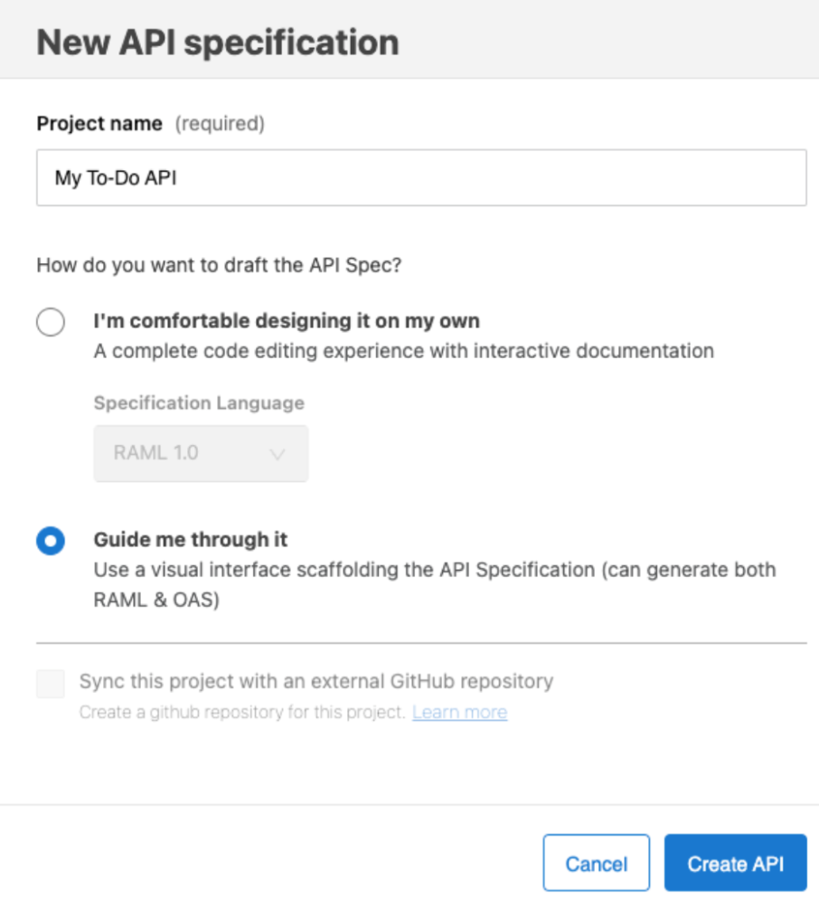

On the first screen, we'll see the API Summary. Add the following fields:

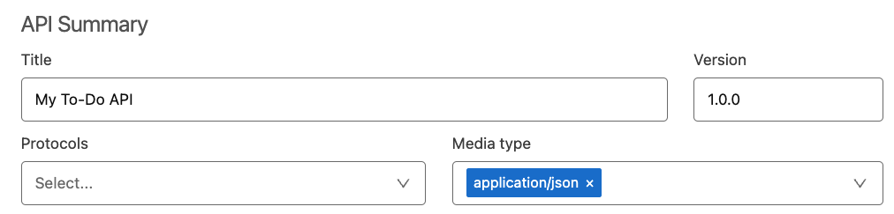

## 2. Create a data type

Click on the plus (**+**) button next to the **DATA TYPES** tab on the left. Change the name to **To-Do** and the Type to **Object**. Next, click on the **Add Property** button and create the following properties for this object:

> [!TIP]
> Click on the Details (**v**) button to see the additional configurations for each property.

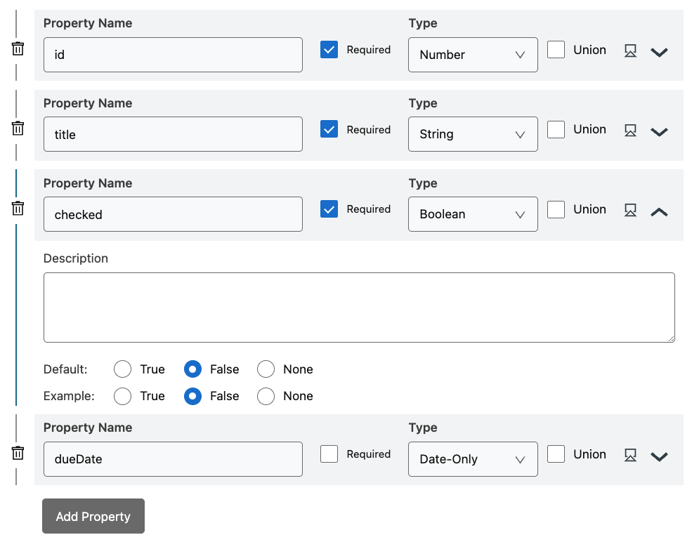

We are changing the default value for the *checked* property from *True* to *False* because normally when we create a new To-Do, it means that it hasn't been completed :-)

## 3. Create a /todos resource

Click on the plus (**+**) button next to the **RESOURCES** tab on the left. Name the resource path **/todos**.

### 3.1. Read all To-Dos

Under **GET > Responses** click **Add New Response** and leave the **200 - OK** option selected. Click on **Add Body** and change the type to **Array**. Open the details of the array and select Items Type **To-Do**.

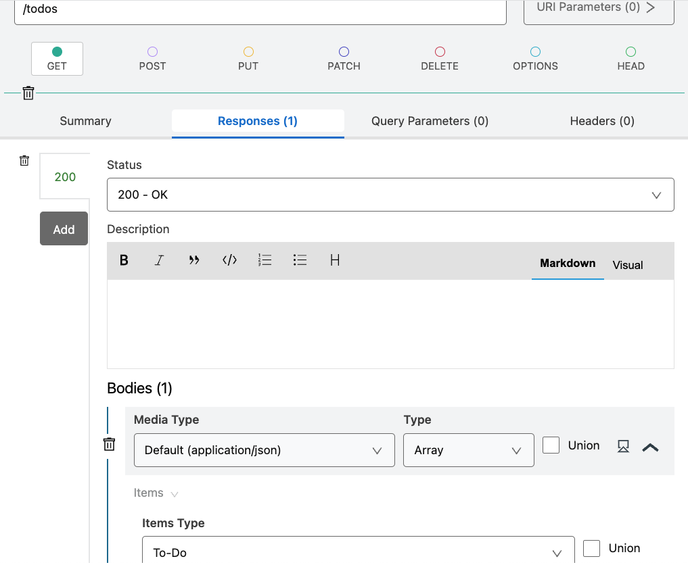

In other words, this means that whenever we send a GET request to the /todos resource (or path), we'll receive a 200-OK response with a list of our existing To-Dos.

### 3.2. Add Query Parameters

Since we will be receiving a list of all the To-Dos, perhaps we could make things easier for the user by providing some filters for this array. We can do this by adding some Query Parameters to the GET method we just created. For this, go to **GET > Query Parameters** and click on **Add Query Parameter**. Add the following parameters:

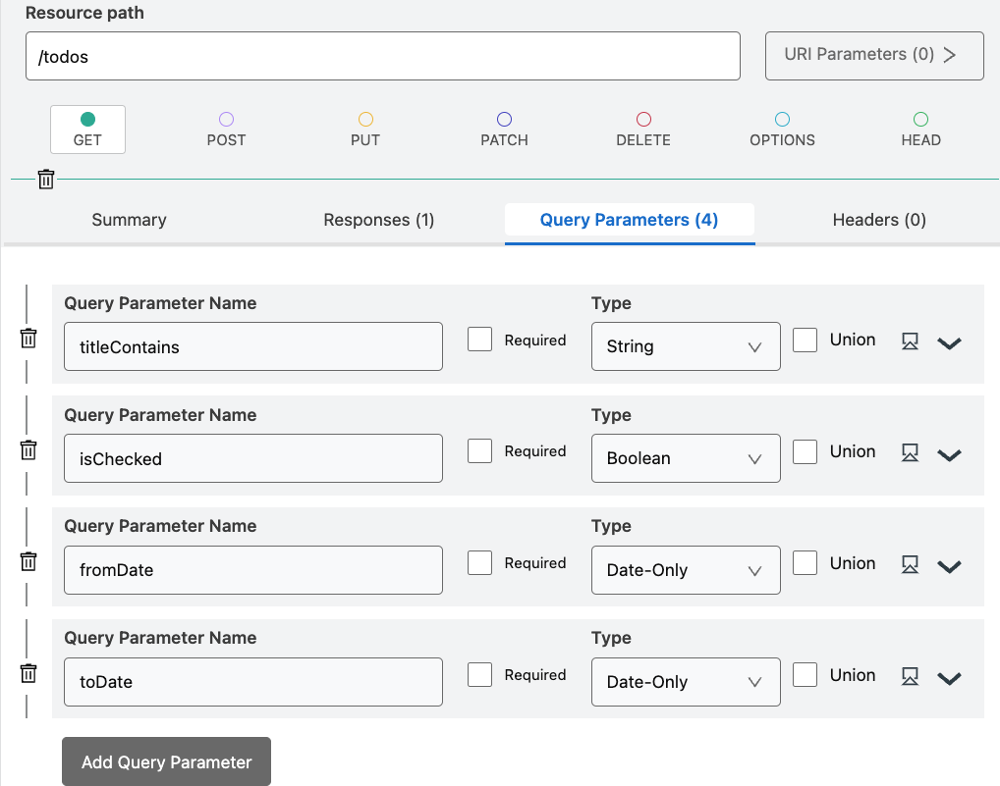

As you can see, these are all optional parameters. We do this by unchecking the Required option. Now the user can choose to either use these filters or not to retrieve a list of To-Dos.

### 3.3. Create a new To-Do

To create a new To-Do in our design, we have decided to use the POST method under the /todos resource. For this, navigate to **POST > Responses** and click on **Add New Response**. You could leave this as 200 if you wanted to, but let's spice things up a bit by selecting **201 - Created** instead. You know, just for fun. Now click on **Add Body** and change the type to **To-Do**.

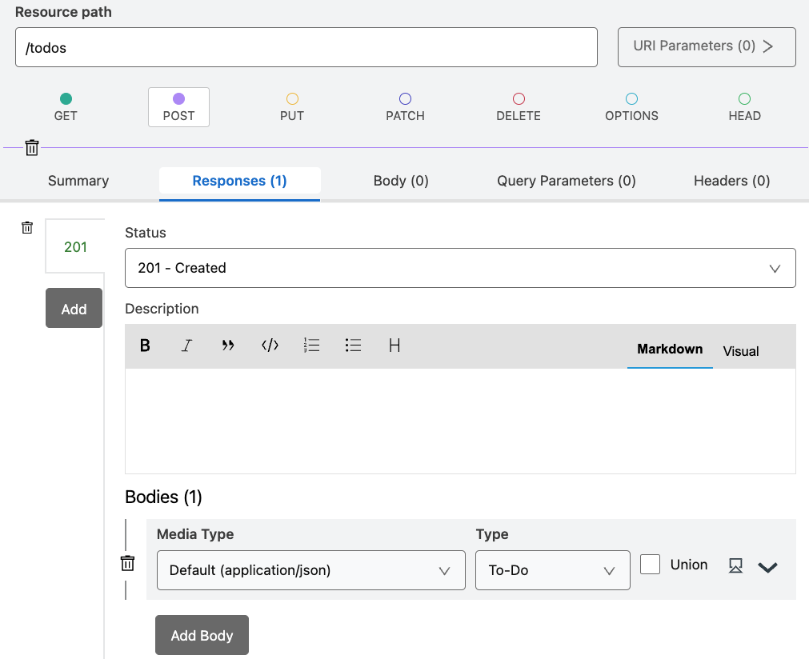

This is not all! Now head to the **Body** tab right next to the Responses tab that we're in right now and click on **Add Body**. Change this type to **To-Do** as well.

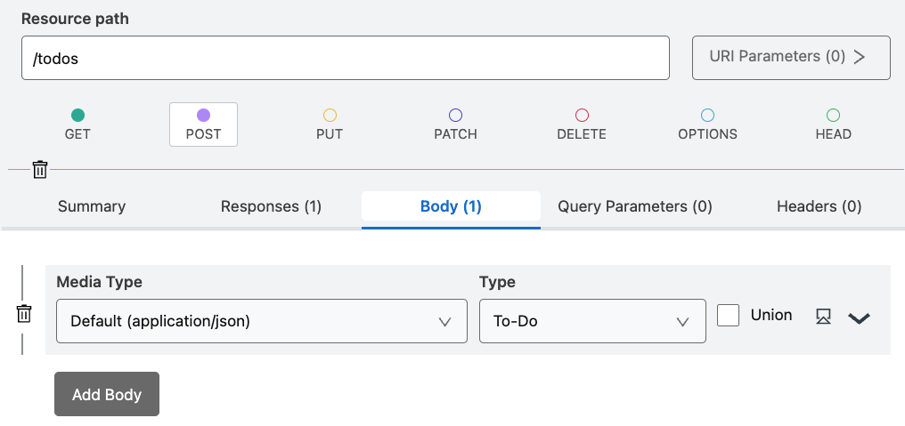

This means that when the user wants to create a new To-Do, they'll have to send in a To-Do in the body of the request and they will receive a 201-Created with the details of the To-Do that was just created.

> [!NOTE]
> **❓ Question**: Can you see a potential problem for us to be using the To-Do data type in the creation of a To-Do? We'll discuss this at the end of the post :)

## 4. Create a /todos/&#123;id&#125; resource

Click on the plus (**+**) button next to the **RESOURCES** tab on the left. Name the resource path **/todos/&#123;id&#125;**.

> [!TIP]
> You can also click on the plus button next to the /todos resource to automatically create a nested resource.

### 4.1. Add a URI Parameter

Click on the **URI Parameters** button next to the resource path and select **Add URI Parameter**. Add the following values:

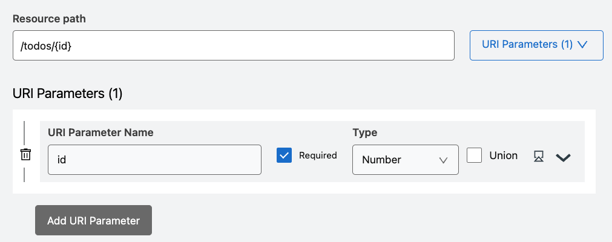

This *id* will act as a sort of variable for the real value that will be passed in the URI. For example, to refer to the To-Do with id 1, you can call /todos/1.

### 4.2. Read a To-Do

Under **GET > Responses** click **Add New Response** and leave the **200 - OK** option selected. Click on **Add Body** and change the type to **To-Do**.

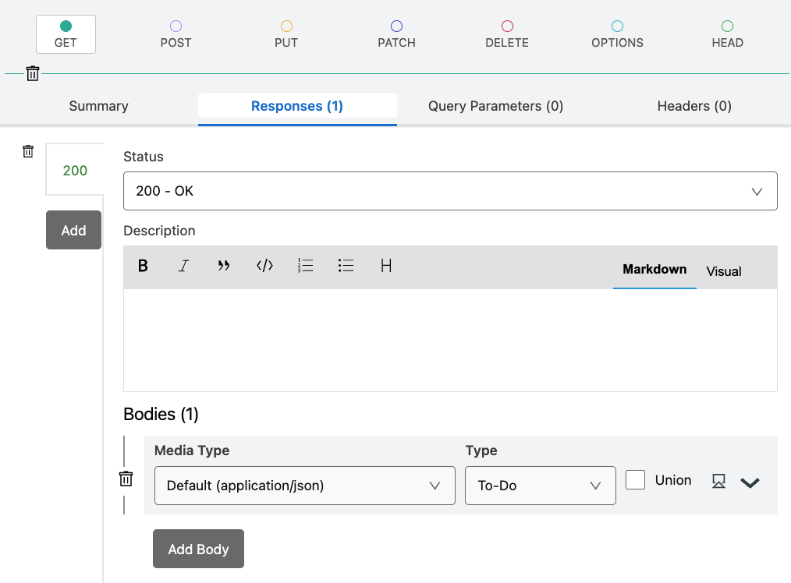

In this case, we are not creating any Query Parameters since we are solely returning one To-Do. The one that matches the id from the URI Parameter in the path.

### 4.3. Update a To-Do

Under **PUT > Responses** click **Add New Response** and leave the **200 - OK** option selected. Click on **Add Body** and change the type to **To-Do**.

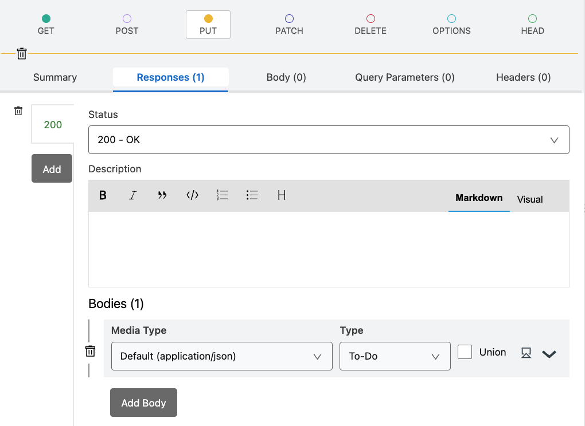

Now head to the **Body** tab right next to the Responses tab that we're in right now and click on **Add Body**. Change this type to **To-Do** as well.

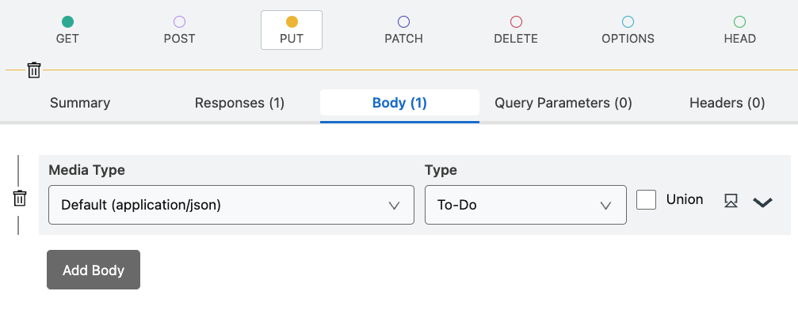

This is awfully similar to the configurations we did for the POST method in the /todos resource, right? Honestly, we could've chosen to use POST here as well instead of PUT. It really depends on how you prefer to design your API specification. It's all very subjective sometimes! But I have an article for you on why I prefer to use PUT here instead of POST. Check it out 👇

> [!DOCS]
> **Article**: [Understanding APIs (Part 3): What are HTTP Methods?](https://www.prostdev.com/post/understanding-apis-part-3-what-are-http-methods)

### 4.4. Delete a To-Do

Under **DELETE > Responses** click **Add New Response** and select the **204 - No content** option. We won't add a body here in either the response or the request body. This is because we are already retrieving the id of the To-Do we want to delete (from the URI Parameter) and once we remove it, we won't have to return this information back in the response's body.

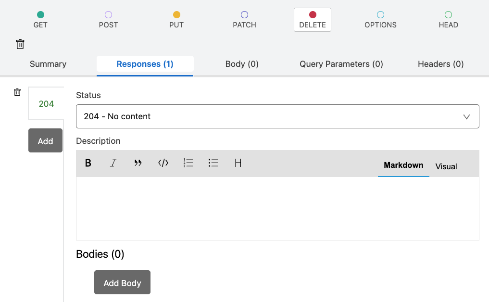

If you're curious about why I'm not just choosing 200-OK for all the status responses, you can check out this post I wrote about HTTP Status Codes 👇

> [!DOCS]
> **Article**: [Understanding APIs (Part 6): What are HTTP Status Codes?](https://www.prostdev.com/post/understanding-apis-part-6-what-are-http-status-codes)

## Conclusion

And that's all!! That's how you create an API specification for a To-Do app.

I don't know if you've been noticing that there's some code being updated on the right-hand side of the screen. If you look at the bottom of that section, you'll notice there are two tabs: one that says RAML and one that says OAS. You can totally use this tool to generate a base of your RAML/OAS code so you don't have to start from scratch!

Please note that there's an option to edit the code directly from the API Designer, however, if you do that, you'll lose the capability to come back to the GUI. If you intend to use this tool only to generate the code, I would recommend you download it and open it in a new API spec project instead of modifying it from here. Just in case you need this GUI in the future for reference :-)

## Answer to the question

There was a question I dropped somewhere in the middle:

- Can you see a potential problem for us to be using the To-Do data type in the creation of a To-Do?

The answer is that because we created the To-Do data type to have a required property called *id,* and since we are using this data type to create a new To-Do, the id property will be required in the body of the request.

For example, if we were to create a new To-Do, our request body would have to look like this:

```json
{
  "id": 1,
  "title": "Example",
  "checked": false,
  "dueDate": "2023-09-25"
}
```

When in reality, we wouldn't know what the appropriate id would be for this new To-Do. One should have to be assigned from the backend, the user shouldn't have to provide it.

A solution. to this would be to go back to the POST method in the /todos resource and change the request body's data type from To-Do to Object. Then, we would have to manually add the rest of the properties here (title, checked, dueDate), which is not ideal.

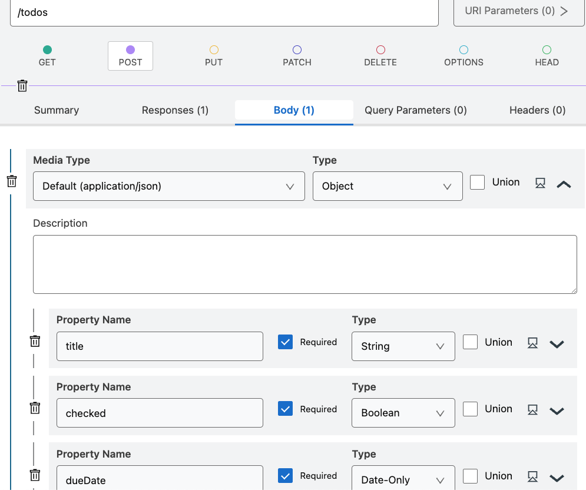

If our initial To-Do data type changes, we would have to change the structure from both places. This will eventually lead to human error and there is no reusing in place for this.

This is why the GUI is very helpful in generating an initial base of our API specification, but it currently doesn't hold all the answers to create the best RAML/OAS code.

I still use it pretty much all the time to get started, though. Tools are exactly that: tools. They are meant to help you in your work. But they don't hold all the answers. We do :-)

Prost!
