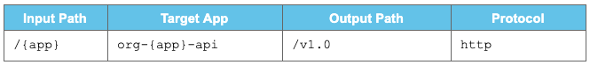
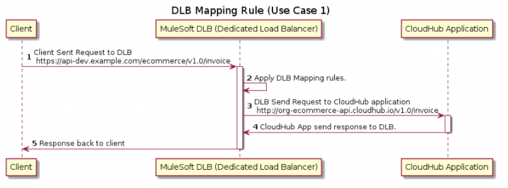
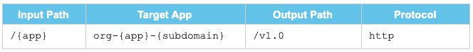
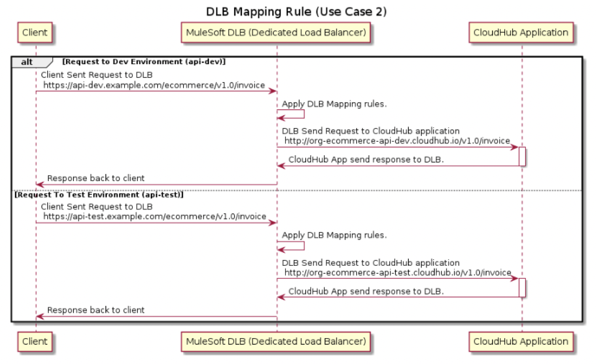
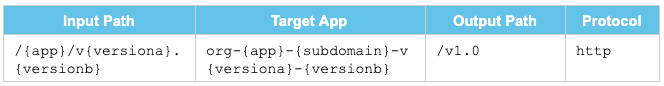
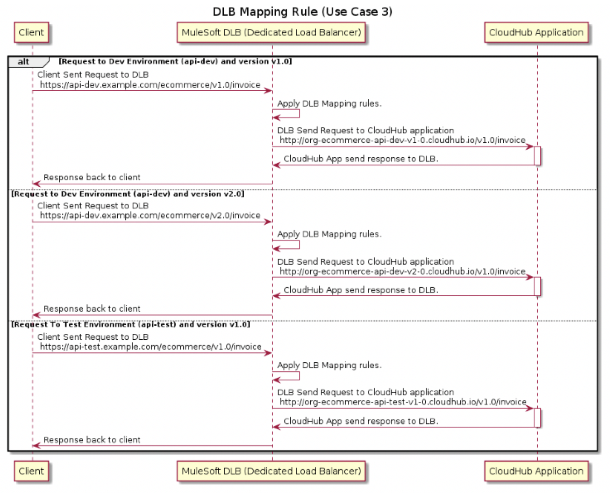

## Introduction

Dedicated Load Balancer is an optional component within the Anypoint Platform and it is used to route the HTTP and HTTPS traffic to multiple applications deployed to CloudHub workers in the VPC.

To create a Dedicated Load Balancer, you must first create the Anypoint VPC which can be mapped to multiple environments and the same Dedicated Load Balancer can be used for different environments. You can use multiple DNSs for the same Dedicated Load Balancer (i.e. `api-dev.example.com` and `api-test.example.com`)

## Applying Mapping Rules on a Dedicated Load Balancer (DLB)

Mapping rules are used on dedicated load balancers to translate input URI to call applications deployed on CloudHub. A pattern is a string that defines a template for matching an input text.

Whatever value is placed within curly brackets (&#123; &#125;) is treated as a variable. Variable names can contain only lowercase letters (a-z) and no other characters, including slashes.

Let's consider that we have 2 DNS (i.e. `api-dev.example.com` and `api-test.example.com`) setup on a dedicated load balancer: `api-dev.example.com` is for the Dev environment whereas `api-test.example.com` is for the Test environment.

## Use Case 1

We are receiving requests on the DLB `https://api-dev.example.com/ecommerce/v1.0/invoice` and need to redirect them to `http://org-ecommerce-api.cloudhub.io/v1.0/invoice` (the CloudHub application name will be `org-ecommerce-api`)

We can use this mapping rule to achieve this:



This previous rule will be applied when requests come on DLB and route to the CloudHub application in the VPC.

```
https://api-dev.example.com/ecommerce/v1.0/invoice (DLB)
```

is redirected to:

```
http://org-ecommerce-api.cloudhub.io/v1.0/invoice (CloudHub)
```



But here we have some problems that on our DLB, we have set up 2 DNSs, one for Dev and another for Test. Now, how will the DLB know this is a request that needs to route to either the Dev or Test application because the same rule will be applied for both?

To avoid this, we will be using a subdomain in the next use case.

## Use Case 2

In this case, we will be using a subdomain for routing the request to the correct environment from DLB.

Our application name format must be org-app-subdomain (e.g. org-ecommerce-api-dev for dev environment and org-ecommerce-api-test for test environment) when deploying to CloudHub workers in VPC.

So, our mapping rule will look like this:



subdomain is a variable to map any subdomain.

**1) dev environment**

```
https://api-dev.example.com/ecommerce/v1.0/invoice (DLB)
```

is redirected to:

```
http://org-ecommerce-api-dev.cloudhub.io/v1.0/invoice (CloudHub Dev Environment)
```

**2) test environment**

```
https://api-test.example.com/ecommerce/v1.0/invoice (DLB)
```

is redirected to:

```
http://org-ecommerce-api-test.cloudhub.io/v1.0/invoice (CloudHub Test Environment)
```



In this use case, we solve the issue of routing the request from DLB to the correct environment.

Let's consider another scenario where you want to route the request to CloudHub on the basis of the application version. We will see this in the next use case.

## Use Case 3

In this case, we will deploy an application to CloudHub and it will be in format org-app-subdomain-version (e.g. org-ecommerce-api-dev-v1-0 for Dev environment and org-ecommerce-api-test-v1-0 for Test environment).

Whenever we get a request on the DLB, then the version in the URL will be v1.0 and v2.0 but when you deploy an application on CloudHub it doesn't allow you to use "." in the application name. That is the reason we are using "-" in the version of the application deploying to CloudHub.

So, our mapping rule will look like this:



**1) dev environment**

```
https://api-dev.example.com/ecommerce/v1.0/invoice (DLB)
```

is redirected to:

```
http://org-ecommerce-api-dev-v1-0.cloudhub.io/v1.0/invoice (CloudHub Dev Environment)
```

**2) test environment**

```
https://api-test.example.com/ecommerce/v1.0/invoice (DLB)
```

is redirected to:

```
http://org-ecommerce-api-test-v1-0.cloudhub.io/v1.0/invoice (CloudHub Test Environment)
```



## DLB Mapping Rules Priority

DLB will apply the first matching rule regardless of more exact matching rules available. A rule defined first, at index 0 has higher priority against other rules defined after it. The higher the index assigned, the less priority the mapping rule has.

This is how you can apply mapping rules on MuleSoft's Dedicated Load Balancer.
