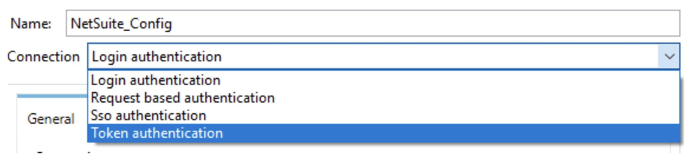
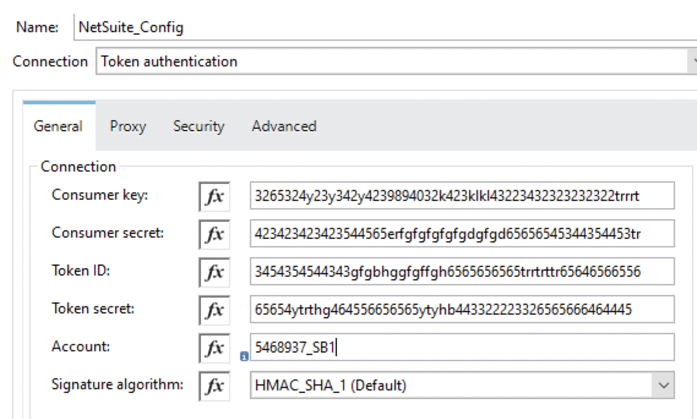
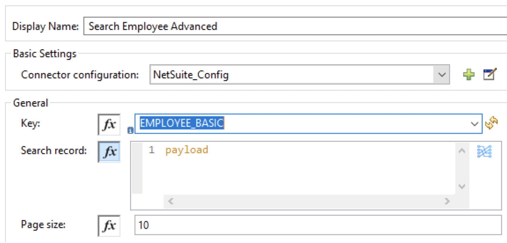
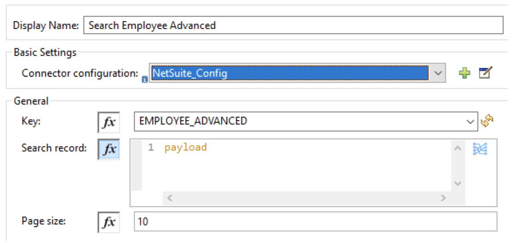

## Introduction

NetSuite is a SaaS-based ERP which allows companies to manage important business using a single tool. NetSuite provides a suite of cloud-based financials / Enterprise Resource Planning (ERP) and omnichannel commerce software. NetSuite has capabilities of ERP, CRM, Manufacturing, e-commerce, retail.

MuleSoft provides a NetSuite connector, which enables to automate the business process and synchronize the data between NetSuite and third-party tools. NetSuite Connector uses SuiteTalk WSDL to provide SOAP-based integration to generate NetSuite business objects, make use of different authentication levels, and support error handling.

NetSuite connector provides various features and capabilities:

- SOAP-Based integration.
- Connecting NetSuite using REST calls to RESTlets that expose APIs created with SuiteScript.
- Multiple types of Authentication.
- Error Handling support.

## How to Connect NetSuite with MuleSoft

MuleSoft NetSuite connector provides various ways of Authentication to connect NetSuite.

- Login authentication.
- Request based authentication.
- SSO authentication.
- Token authentication.



One of the most common ways of connecting NetSuite is using Token authentication. For this, we will need Consumer key, Consumer secret, Token ID, and Token secret.



Now, we are going to see a few operations related to NetSuite.

## Saved Search

Saved Search allows us to search the data in NetSuite and it can be performed on any record type in NetSuite. MuleSoft provides the operation Search which can be used to perform the search on the record type.

## Use Case 1 - Basic Employee Search (lastName starts with J)

Let's consider, we want to retrieve all the Employee details from NetSuite whose lastName starts with "J". MuleSoft’s search operation in the NetSuite connector can be used to retrieve all employee details whose lastName starts with "J".

We will be adding the following script in MuleSoft Transform Message to pass as Payload to NetSuite connector for the search operation and record type as `EMPLOYEE_BASIC`.

```dataweave

%dw 2.0
output application/java
---
{
    lastName: {
        operator: "STARTS_WITH",
        searchValue: "J"
    }
} as Object {
    class: "org.mule.module.netsuite.extension.api.EmployeeSearchBasic"
}
```

**NetSuite Connector Configuration**



## Use Case 2 - Advanced Employee Search

Let's consider, we want to retrieve all the employee details from NetSuite. NetSuite has created Saved Search which can be utilized in the MuleSoft application to fetch all employee details.

NetSuite provided us savedSearchId as "8656" and savedSearchScriptId as "EmployeeSearch8656".

We will be adding the following script in MuleSoft Transform Message to pass as Payload to NetSuite connector for the search operation and record type as `EMPLOYEE_ADVANCED`.

```dataweave

%dw 2.0
output application/java
---
{
    savedSearchId: "8656",
    savedSearchScriptId: "EmployeeSearch8656"
} as Object {
    class: "org.mule.module.netsuite.extension.api.EmployeeSearch"
} as Object {
    class: "org.mule.module.netsuite.extension.api.EmployeeSearchAdvanced"
}
```

**NetSuite Connector Configuration**



## Use Case 3 - Advanced Employee Search (lastModifiedDate is after 1st August 2020)

Let's consider, we want to retrieve all the Employees details from NetSuite whose lastModifiedDate is after 1st August 2020. NetSuite has created Saved Search which can be utilized in the MuleSoft application to fetch all employee details whose lastModifiedDate is after 1st August 2020.

NetSuite provided us savedSearchId as "8657" and savedSearchScriptId as "EmployeeSearch8657".

We will be adding the following script in MuleSoft Transform Message to pass as Payload to NetSuite connector for the search operation and record type as `EMPLOYEE_ADVANCED`.

```dataweave

%dw 2.0
output application/java
---
{
    savedSearchId: "EmployeeSearch8657",  
    savedSearchScriptId: "EmployeeSearch8657",
    criteria: {
        basic: {
            lastModifiedDate: {
                operator: "AFTER",
                searchValue: "2020-08-01T12:00:00" as LocalDateTime {format: "yyyy-MM-dd'T'HH:mm:ss"}
            } as Object {  
                class: "org.mule.module.netsuite.extension.api.SearchDateField"  
            }
        } as Object {  
            class: "org.mule.module.netsuite.extension.api.EmployeeSearchBasic" 
        }
    } as Object {  
        class: "org.mule.module.netsuite.extension.api.EmployeeSearch" 
    }
} as Object {  
    class: "org.mule.module.netsuite.extension.api.EmployeeSearchAdvanced" 
}
```

## Use Case 4 - Advanced Employee Search (isInactive is false and retrieve firstName, middleName and lastName)

Let's consider, we want to retrieve all the Employees details from NetSuite who are active and retrieve only firstName, middleName, and lastName.

We will be adding the following script in MuleSoft Transform Message to pass as Payload to NetSuite connector for the search operation and record type as `EMPLOYEE_ADVANCED`.

```dataweave

%dw 2.0
output application/java
---
{
    columns: {
        basic: {
            firstName: [{
                customLabel: "First Name"
            }],
            middleName: [{
                customLabel: "Middle Name"
            }],
            lastName: [{
                customLabel: "Last Name"
            }]
        }
    },
    criteria: {
        basic: {
            isInactive: {
                searchValue: false
            }
        }
    }
} as Object {
    class: "org.mule.module.netsuite.extension.api.CustomerSearchAdvanced"
}
```

## Use Case 5 - Basic employee search (lastModifiedDate is after 1st August 2020 and isInactive is false)

Let's consider, we want to retrieve all the Employees details from the NetSuite who are active and lastModifiedDate is after 1st August 2020.

We will be adding the following script in MuleSoft Transform Message to pass as Payload to NetSuite connector for the search operation and record type as `EMPLOYEE_BASIC`.

```dataweave

%dw 2.0
output application/java
---
{
    lastModifiedDate: {
        operator: "AFTER",
        searchValue: "2020-08-01T12:00:00" as LocalDateTime {format: "yyyy-MM-dd'T'HH:mm:ss"}
    },
    isInactive{
        searchValue: false
    },
} as Object {
   class: "org.mule.module.netsuite.extension.api.EmployeeSearchBasic"
}
```

Now, you know how to perform search operations with the MuleSoft NetSuite connector.
