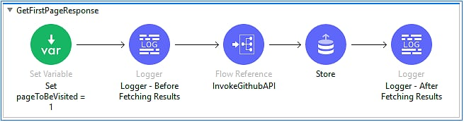
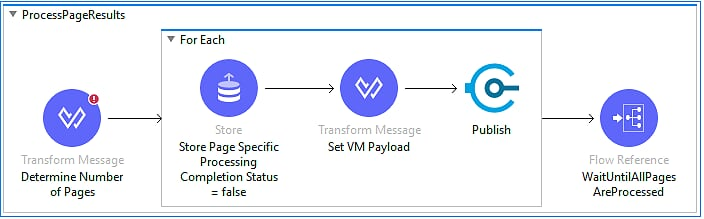
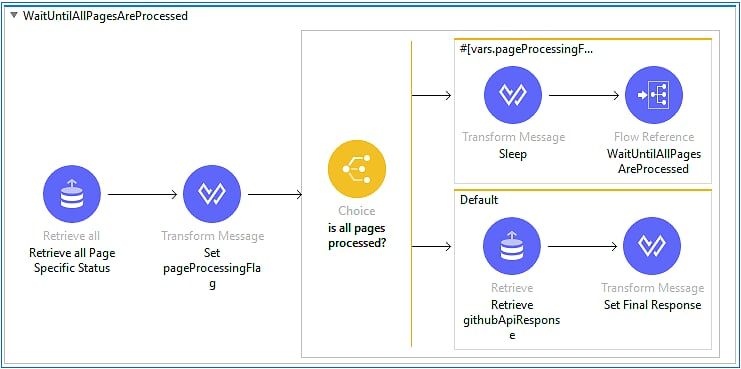
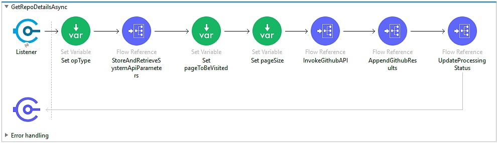
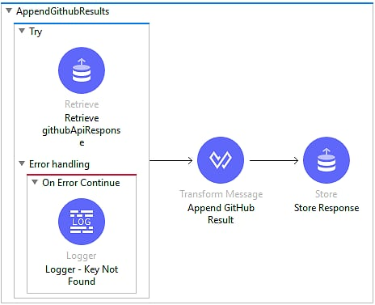
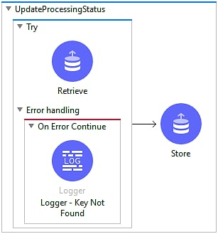
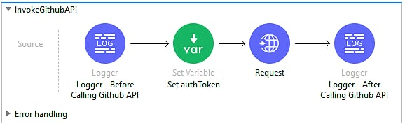

## Summary

There could be a situation, in which we are consuming an API and the result is returned in multiple pages. Your business case needs the Mule Application to have a capability to process all results from all pages and return the response as per specification. Therefore, we are presented with a business problem to resolve – how to process n number of pages and return the combined response back to the calling client.

As per design your backend API only returns x number of records per page and depending on the total number of records it could be n number of pages. So, as a consumer of that backend system and gateway to the client, you are responsible to maintain pagination.

## Solution Approach

Let’s talk about how we resolve this problem effectively using MuleSoft. One simple solution to this problem is implementing a recursive flow that calls the backend system API n number of times until all records are fetched and no new pages exist.

Pros: Main advantage of this approach is the simplicity and also that it’s easier to implement.

Cons:

- Synchronous approach. Hence, the next page cannot be fetched until the processing of prior pages are completed.
- Response would be slow.
- Main disadvantage is, if we have many records and if you need to iterate too many times, Mule Runtime might crash with “Too many child contexts” error.

An alternative solution to this problem is to implement this in a more complex way and asynchronous processing could be a saviour here.

To demonstrate this approach, we will be calling the GitHub API to return all the repositories under a specific user/organization. There are a few steps of authentication before we can call the GitHub API to get all the results.

## Authentication for GitHub API

There are two ways to authenticate through the GitHub REST API.

1) Basic authentication

```bash
$ curl -u "username" https://api.github.com
```

2) OAuth2 token (sent in a header)

```bash
$ curl -H "Authorization: token OAUTH-TOKEN" https://api.github.com
```

The recommended way of authentication is OAuth tokens using Authorization Header.

As a part of this implementation, we will be doing authorization as OAuth using a Personal Access Token. Personal Access Tokens can be generated for each user and can be sent as Authorization header.

If you want to know more details about how to create a Personal Access Token for your GitHub account, you can follow [this link](https://docs.github.com/en/free-pro-team@latest/github/authenticating-to-github/creating-a-personal-access-token).

## Implementation

Main implementation involves two steps:

Step 1: Initial step is to get the results for the first page. This is handled by the GetFirstPageResponse sub-flow which essentially calls the GitHub API with page number as 1.

Step 2: Once we have page 1 result, we will call ProcessPageResults sub-flow to fetch subsequent pages and appending the results of all pages.

## Step 1: Getting First Page from GitHub API

Getting the first page is straight forward. We set up essential variables like pageNumber which will facilitate calling the GitHub API. Then, we invoke the GitHub API to get the results of the first page. For more details about how to call the GitHub API, you can follow the section “Invoking GitHub API.” Next step is storing this result in an Object Store. We store the results of first page in Object Store to smoothly append the results of all pages at the end of the process which we will be seeing in a moment.



## Step 2: Processing Subsequent Pages

From the previous section, we have fetched the first page of GitHub API, now it’s our turn to process the results from other pages. In this section, we will be discussing about processing of subsequent pages asynchronously.



Once we have the first page, we will examine the response headers. Usually, in the response header, GitHub indicates the information about pagination.

GitHub indicates the following information in the header called **link**.

- **Prev**: contains the link to the previous page.
- **Next**: contains the link to the next page.
- **First**: contains the link to the first page.
- **Last**: contains the link to the last page.

Our concern is all about the last page link information. We will be extracting page numbers from this link type. That would indicate how many more pages we still need to process. For example: If the page number of the last link says 35, then we have 35 - 1 = 34 pages to be processed (since the first page has already been processed).

After getting the information about how many more pages we still have to process, we can make up an array of page numbers which are still required to process.

```dataweave
%dw 2.0
output application/json
var linkHeader = attributes.headers.link
var linkHeaderArr = (linkHeader splitBy ",")

fun createLinkHeaderDetails() = {
	linkHeaderDetails: linkHeaderArr map (
		createLinkHeaderObject($)
	)
}

fun createLinkHeaderObject(linkHeaderObj) = {
	"pageNumber": (((((((linkHeaderObj splitBy ";") map (trim($)))[0]) splitBy "&")[1]) splitBy "=")[1])[0],
	"linkType": readString(((((linkHeaderObj splitBy ";") map (trim($)))[1]) splitBy "=")[1])
}

fun readString(readString) = 
read(readString,"application/json")

fun getLastPageNumber() =
createLinkHeaderDetails().linkHeaderDetails filter ($.linkType == "last")
---
(1 to (getLastPageNumber().pageNumber[0] - 1)) map {
	pageNumber: ($ + 1)
}
```

Next step is: for each page number in a page number array, we are setting up the following:

- We will store a flag in Object Store for each specific page number that indicates the processing status. Initially it will be false.
- We will be setting up a payload that contains the page number we want to fetch. This is done using a simple DataWeave script to set up the payload for the VM endpoint flow.

```dataweave
%dw 2.0
output application/java
---
{
	pageNumber: payload.pageNumber
}
```

Then, we will be publishing this payload to a VM endpoint which is exposed by another flow that essentially fetches the results from the GitHub API. This will be discussed in the section “Retrieve Details from GitHub API.”

This approach makes this process asynchronous since it won’t wait for the VM endpoint to come back with a response. The VM Publish endpoint works like Fire and Forget, so, the Mule thread won’t wait for this process to be completed. That’s why we call another sub flow named WaitUntilAllPagesAreProcessed outside of the For Each scope which is responsible for checking whether all pages are completely processed or not. This flow is not going to end until all pages are processed.



The process to know if all pages have been processed is determined by checking the entry in Object Store for each page number that we set before publishing to the VM endpoint. If the page results are processed, this entry is supposed to be updated to true in Object Store which is part of discussion in the “Retrieve Details from GitHub API” section.

We can check for the Object Store entries for all the pages with a simple DataWeave script.

```dataweave
%dw 2.0
output application/json

fun checkForCompletion(payload) =
not sizeOf ((payload pluck $) default [] filter ($ == false)) >0
---
checkForCompletion(payload)
```

If the processing flag of any page is still false, we will impose a small delay with a DataWeave script and then call WaitUntilAllPagesAreProcessed recursively until all pages processing is completed. This delay is imposed to avoid having Mule to crash because of too many recursive calls to the flow. This delay can be configured from configuration parameters and we will keep it to a minimum number (i.e., 1000 ms) which will allow the processing of the pages to be completed and avoid too many calls to the same flow.

If the processing of all pages is complete, we fetch the final response from Object Store entry and transform it as per our requirements to form a final response to client.

## Retrieve Details from GitHub API

In this section we will be talking more about the flow which is responsible for fetching details from GitHub API and processing the results. We will be building this flow in a way so that it can be called asynchronously. One way to achieve this is to implement a VM Listener endpoint so that we can call this flow asynchronously from other flows. For this flow to work, we only need the page number (which needs to be fetched) to be passed as a payload.



Let’s discuss this flow in couple of steps:

Step 1: We will be retrieving details from the Object Store regarding the GitHub API call, like page size, which is required to tell the GitHub API how many records it’s going to send as a response for the page.

Step 2: We will be setting up two variables named pageToBeVisited and pageSize. First variable will get the value from the payload that was passed to the VM endpoint which indicates the specific page number that we are going to fetch while later suggests the number of records for that page to be returned which we can get from Step 1.

Step 3: We will call the InvokeGitHubAPI flow that essentially handles the complexity of calling the GitHub API and returning the results. This will be discussed in the following section, “Invoking GitHub API.”

Step 4: Next step is appending the result of the current page with previous pages. That can be done by retrieving the result from the Object Store key entry (which is initially created when we fetched the result of Page 1, appending the current page result and storing it back to the same Object Store key.



Step 5: Finally, we need to update the processing status to true in the Object Store key created for that specific page (discussed in “Step 2: Processing Subsequent Pages"). This indicates that the processing for this specific page is completed.



## Invoking GitHub API

GitHub REST API offers many functionalities - from getting details of repositories to push/pull the commits. You can read more about the GitHub API here to know what it has to offer. At the time of the writing this article, GitHub offered v3 of its implementation. By default, all requests to [https://api.github.com](https://api.github.com/) receive the v3 [version](https://docs.github.com/en/free-pro-team@latest/developers/overview/about-githubs-apis) of the REST API. However, you can also request a previous version if you need. For our implementation, we will be using the latest version. All API access is over HTTPS and accessed from [https://api.github.com](https://api.github.com/). All data is sent and received as JSON.

There are many resource endpoints available but for this implementation, we will only be focusing on GET /user/repos resource to get repositories that the authenticated user has explicit permission (:read, :write, or :admin) to access. The authenticated user can get information on repositories they own, repositories where they are a collaborator, and repositories that they can access through an organization membership. Since this endpoint accepts GET HTTP method, it does not need request payload rather it accepts few query parameters and response comes in application/json format. You will find more details about this endpoint [here](https://docs.github.com/en/free-pro-team@latest/rest/reference/repos#list-repositories-for-the-authenticated-user).

To implement this in Mule, we will be building a flow in the following steps:



Step 1: We setup a variable named authToken that gets the encrypted token from configuration file appended by string “token”. For more details about how to obtain this token, please see section “Authentication for GitHub API.”

Step 2: Next step is making a HTTP request to the GitHub API endpoint we discussed earlier. There are a couple of headers and query parameters which are required.

**Headers**:

Authorization: This header will be used to authenticate the user with the GitHub API. We will be using the value from variable authToken that we created in Step 1.

There are number of ways to authorize any user via GitHub API to access protected resources. For this implementation, we have used OAuth with Personal Access Token. The details to implement this in GitHub can be found in section “Authentication for GitHub API.”

**Query Parameters**:

per_page: This query parameter indicates how many records we want to fetch per page. Default is 30 records per page. However, for some endpoints, we can go up to 100 records per page. If you have more items than the ones you have requested using this query parameter, your results will be paginated. For more information about how pagination works with GitHub API, you can click [here](https://docs.github.com/en/free-pro-team@latest/rest/overview/resources-in-the-rest-api#pagination).

page: Page number that needs to fetch.

## Conclusion

Thank you for taking the time to read this article. We have learnt how to effectively and efficiently retrieve large datasets by iterating over a number of pages returned from the backend API. This implementation solely focuses on the GitHub REST API for demonstration, but I believe it can be tailored to your technical needs. Here are few references that may help you to get started-

[https://docs.github.com/en/free-pro-team@latest/rest/reference](https://docs.github.com/en/free-pro-team@latest/rest/reference)

[https://docs.mulesoft.com/vm-connector/2.0/](https://docs.mulesoft.com/vm-connector/2.0/)

[https://docs.mulesoft.com/vm-connector/2.0/vm-examples](https://docs.mulesoft.com/vm-connector/2.0/vm-examples)
