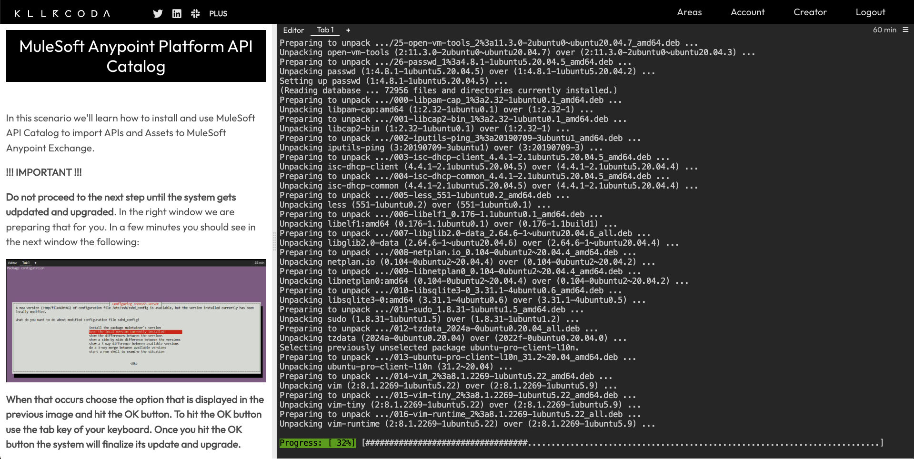
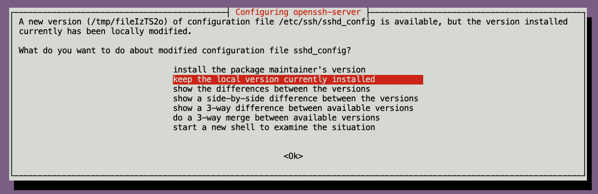
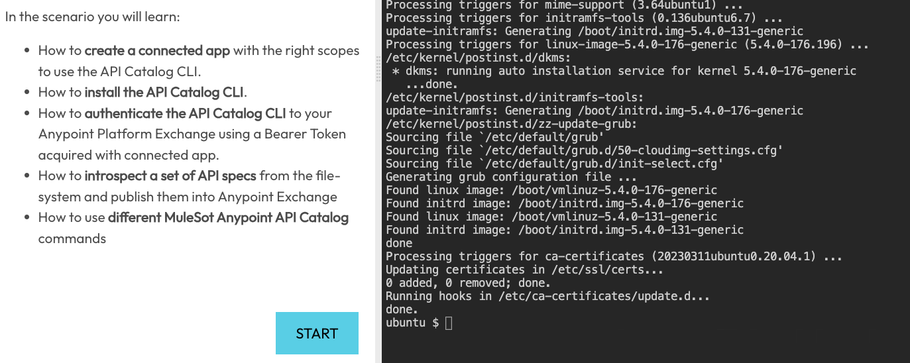
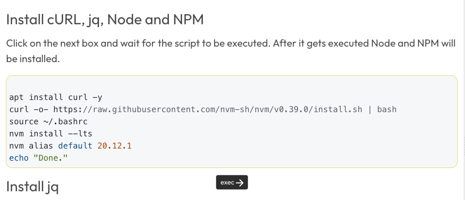
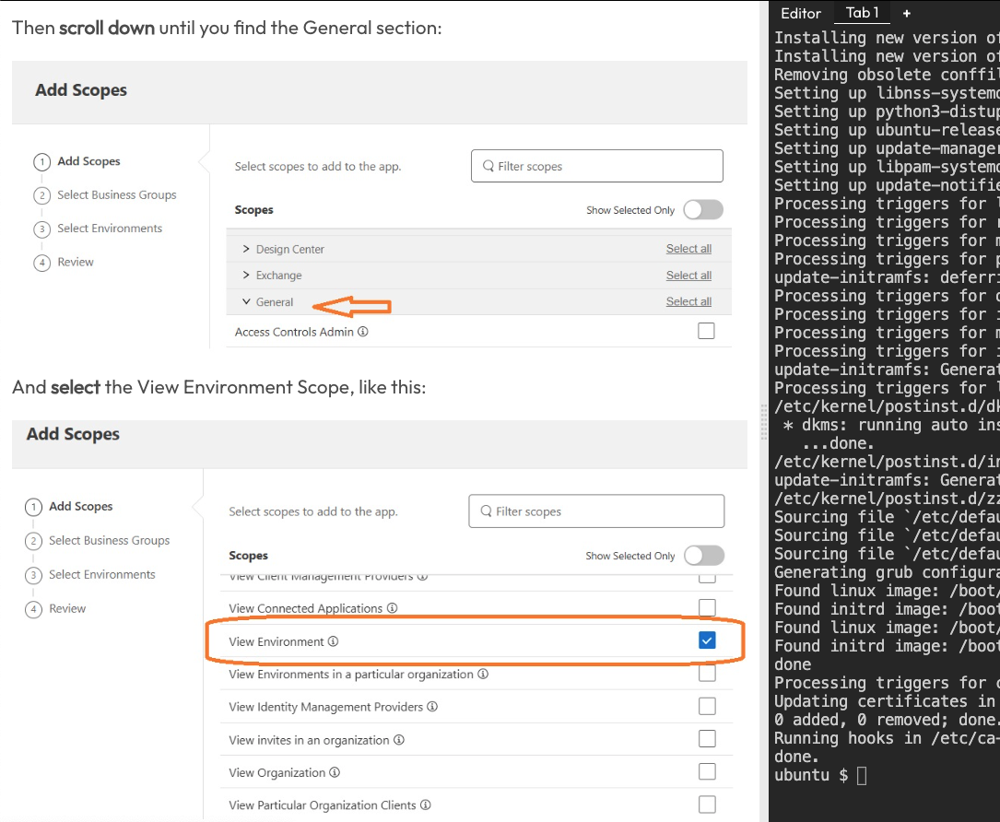
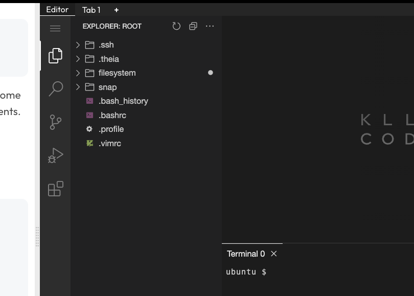

Have you ever wanted to do some interactive tutorials while learning MuleSoft? There are not a lot of options out there for this purpose. However, MuleSoft Ambassador [Rolando Carrasco](https://www.linkedin.com/in/rolandocarrasco/) took the time to create one for us!

Watch the video or follow through the article to learn how to use this awesome platform called [Killercoda](https://killercoda.com/) to learn more about API Catalog.

## Getting started

To get started with the interactive tutorial, first go to [this link](https://killercoda.com/borlandc/scenario/mule-tester). This will open the Killercoda platform with the scenario that Rolando created for us.

A bunch of stuff is going to be running in the terminal. Let that finish. It'll take a few minutes to get started.

Once the progress is finished, you will see a new prompt asking you about the sshd_config. Make sure you select "Keep the local version currently installed" and press Enter.

It will now continue installing stuff. Once it's 100% finished, you will be able to see the Ubuntu $ prompt on the right screen. At this point, you can click on START (scroll down on the left screen) and get started with the tutorial.

## Follow the instructions

The tutorial's instructions are located to the left side of the screen while the actual terminal is located to the right.

Once you start the tutorial, you will see some commands that you need to run in the terminal. Killercoda lets you click on those commands on the left to automatically execute them on the right (on the terminal). You do not need to copy and paste the commands.

There will also be some instructions for you to follow outside of Killercoda. For example, creating a Connected App in Anypoint Platform or gathering your Organization ID. However, the screenshots in the interactive tutorial are very useful.

There is also an Editor tab located at the top of the terminal window.

This Editor is based on Visual Studio Code and is useful to use the File Explorer to verify certain files have been downloaded to the remote system. You will be using this Editor in the tutorial at some point to modify the Catalog files.

## Other considerations

Killercoda lets you use the platform for free but it asks you to finish the tutorial in less than 60 minutes. This is ok. The total time of this tutorial is around 20 minutes. You will have plenty of time to finish.

If you have any feedback about this interactive tutorial, make sure to comment on this article or message [Rolando Carrasco](https://www.linkedin.com/in/rolandocarrasco/) directly.

We hope to see more interactive tutorials like these from the community!

Thanks again Rolando for taking the time and create this amazing tutorial!!

Subscribe to receive notifications as soon as new content is published ✨

💬 Prost! 🍻
